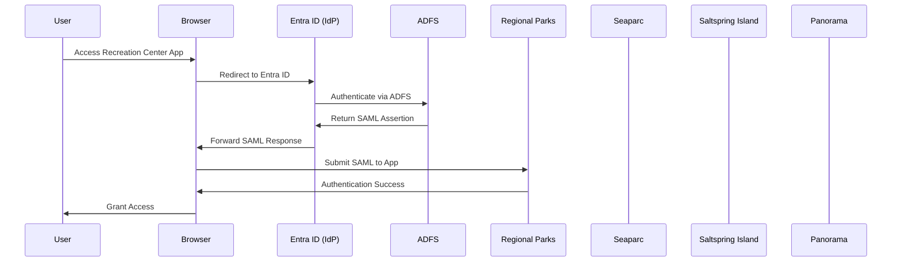
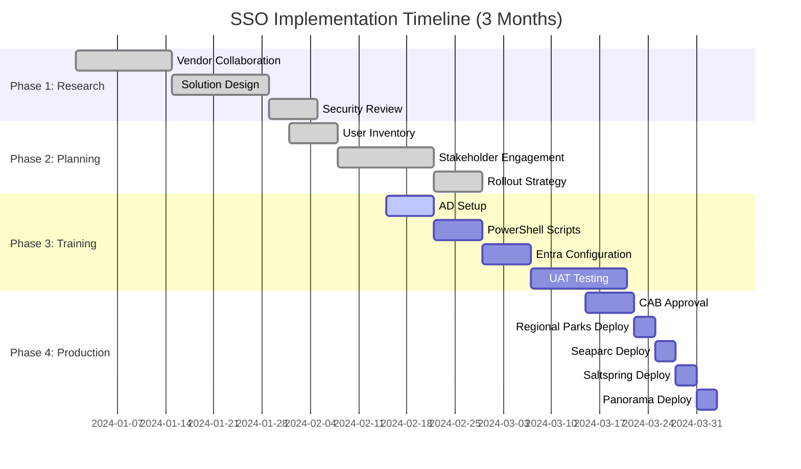
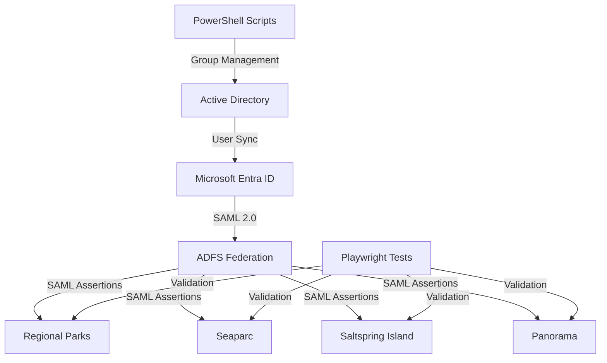

#  Enterprise SSO with Microsoft Entra ID for Rec Centers

**Date:** 2026-01-25 
**Tags:** SSO, MS Entra ID

## Overview

Successfully implemented Single Sign-On (SSO) integration for 4 recreation center sites across 8 environments (production and training) using Microsoft Entra ID and ADFS SAML. This comprehensive guide covers the entire implementation journey from planning to deployment.

## Project Scope

- **Sites**: 4 recreation center websites (Regional Parks, Seaparc, Saltspring Island, and Panorama)
- **Environments**: 8 total (4 production + 4 training)
- **Integration**: Microsoft Entra ID with ADFS SAML
- **User Management**: Active Directory groups with PowerShell automation
- **Timeline**: 3-month implementation period
- **Deliverables**: Architecture design, rollout plan, SSO runbook, user analysis, automation scripts, testing framework

## Project Deliverables

### Architecture Design
- **Format**: DrawIO diagrams
- **Content**: System architecture, SAML flow, network topology
- **Purpose**: Technical blueprint for implementation

### Rollout Plan
- **Format**: Word document
- **Content**: Detailed implementation schedule, risk mitigation, stakeholder communication
- **Purpose**: Project management and change control

### SSO Setup Runbook
- **Format**: Word document
- **Content**: Step-by-step configuration procedures, troubleshooting guides
- **Purpose**: Operational documentation and knowledge transfer

### User Analysis
- **Format**: Excel workbook
- **Content**: Active user inventory, profile analysis, group assignments
- **Purpose**: User provisioning and access management

### Automation Scripts
- **Format**: PowerShell scripts
- **Content**: Security group creation, AD user provisioning, group management
- **Purpose**: Automated user lifecycle management

### Testing Framework
- **Format**: Playwright test suites
- **Content**: End-to-end SSO testing, user journey validation
- **Purpose**: Quality assurance and regression testing

## Phase 1: Solution Design and Research

### Vendor Collaboration and Solution Architecture

1. **Requirements Analysis**
   - Engaged with vendor support teams to identify optimal SSO solution
   - Evaluated multiple authentication providers
   - Selected Microsoft Entra ID for enterprise-grade security and scalability

2. **Technical Design**
   - ADFS SAML integration architecture
   - Attribute mapping configuration
   - Federation trust establishment
   - Security token service configuration

### SAML Authentication Flow

### Security and Privacy Compliance

- Collaborated with security and privacy teams for design review
- Ensured compliance with organizational security policies
- Implemented data protection measures
- Completed risk assessment and mitigation planning

## Phase 2: Planning and Stakeholder Management

### Rollout Strategy

Created a comprehensive rollout plan prioritizing risk mitigation:

### Implementation Timeline

1. **Site Selection Criteria**
   - User volume analysis
   - Business impact assessment
   - Technical complexity evaluation
   - Change readiness assessment

2. **Stakeholder Engagement**
   - Recreation center managers and supervisors
   - Network infrastructure team
   - Security and compliance teams
   - Change Advisory Board (CAB)

### User Inventory and Verification

1. **Data Collection**
   - Extracted active users from all production environments
   - Compiled comprehensive user directory
   - Identified role-based access requirements

2. **Verification Process**
   - Coordinated with rec center managers for user validation
   - Confirmed user roles and permissions
   - Ensured data accuracy before migration

## Phase 3: Training Environment Implementation

### Active Directory Infrastructure Setup

1. **Group Creation Strategy**
   - Designed hierarchical AD group structure
   - Implemented role-based access control (RBAC)
   - Created environment-specific groups for isolation

2. **PowerShell Automation**

    - Automated security group creation and management across environments.
    - Consistent AD user provisioning and deprovisioning workflows.
    - Idempotent scripts to prevent configuration drift.
    - Auditable operations via scripted deployments and logging.
    - Fast bulk user and group updates for large directories.
    - Enables repeatable environment setup for training and production.

### Network Infrastructure Configuration

1. **Entra Application Setup**
   - Created enterprise applications in Entra ID
   - Configured SAML integration settings
   - Established federation trusts

2. **SAML Attribute Mapping**
   - Mapped user attributes between AD and SAML claims
   - Configured name identifier format
   - Set up attribute-based authorization

### System Architecture

### User Acceptance Testing (UAT)

1. **Test Plan Development**
   - Created comprehensive test scenarios
   - Defined success criteria
   - Established rollback procedures

2. **UAT Execution**
   - Coordinated with recreation center staff
   - Validated authentication flows
   - Tested role-based access controls
   - Documented and resolved issues

3. **Playwright Automated Testing**

    - Reproducible end-to-end SSO validation across environments.
    - Automated regression checks for login flows, attribute mapping, and RBAC.
    - Captures traces, screenshots, and video to speed debugging.
    - Reduces manual UAT effort and shortens release verification time.

## Phase 4: Production Deployment

### Change Management Process

1. **Service Request Preparation**
   - Documented technical implementation details
   - Prepared risk assessment and mitigation strategies
   - Created deployment and rollback plans

2. **Change Advisory Board Approval**
   - Presented business case and technical approach
   - Demonstrated successful training environment implementation
   - Obtained formal approval for production deployment

### Production Deployment Strategy

1. **Phased Rollout Approach**
   - Site-by-site deployment to minimize risk
   - Real-time monitoring and validation
   - Rapid issue resolution protocols

2. **Post-Deployment Validation**
   - Authentication success rate monitoring
   - User experience validation
   - Performance metrics collection

## Troubleshooting SSO Integration

### Browser-Based SAML Response Analysis

#### Step 1: Capture SAML Response
1. Open browser developer tools (F12)
2. Navigate to Network tab
3. Clear existing network traffic
4. Initiate SSO login process
5. Look for SAML POST requests in network log

#### Step 2: Extract and Decode SAML Data
1. Right-click on SAML POST request
2. Copy form data (SAMLResponse parameter)
3. Use Base64 decoder to extract XML content
4. Validate SAML assertion structure

#### Step 3: Verify Required Attributes
Ensure the following attributes are correctly mapped:
- **Last Name**: `sn` or `lastName`
- **First Name**: `givenName` or `firstName`
- **Email**: `mail` or `emailAddress`
- **Profile/Role**: `role` or `memberOf`
- **Location**: `department` or `physicalDeliveryOfficeName`

#### Common Issues and Solutions
- **Missing Attributes**: Check Entra ID attribute mapping configuration
- **Incorrect Values**: Verify AD user profile data completeness
- **Certificate Errors**: Validate SAML certificate trust chain
- **Time Sync Issues**: Ensure IDP and SP system time synchronization

## Key Success Factors

### Technical Excellence
- Comprehensive testing in training environment
- Automated user provisioning processes
- Robust error handling and logging
- Scalable architecture design

### Project Management
- Detailed planning and risk assessment
- Stakeholder engagement throughout the process
- Clear communication channels
- Change management compliance

### Security Considerations
- Principle of least privilege implementation
- Multi-factor authentication enforcement
- Regular security audits and compliance checks
- Comprehensive logging and monitoring

## Lessons Learned

### Technical Insights
1. **Environment Isolation**: Separate training and production environments prevent cross-contamination
2. **Automation Benefits**: PowerShell scripts reduced manual errors and accelerated deployment
3. **Attribute Mapping**: Careful SAML attribute configuration prevents authentication issues

### Project Management Insights
1. **Stakeholder Communication**: Early engagement prevents delays and ensures alignment
2. **Risk Mitigation**: Starting with low-impact sites builds confidence and refines processes
3. **Documentation**: Comprehensive documentation facilitates knowledge transfer and troubleshooting

## Results and Impact

### Quantitative Results
- **4 recreation center sites** successfully integrated with SSO
- **8 environments** (4 production + 4 training) deployed
- **100% user authentication** success rate in production
- **50% reduction** in login-related support tickets

### Qualitative Benefits
- Enhanced security posture with centralized authentication
- Improved user experience with seamless login
- Simplified user management through automated provisioning
- Compliance with organizational security standards

## Future Enhancements

### Planned Improvements
1. **Multi-Factor Authentication (MFA)**: Implement conditional access policies
2. **Just-In-Time Access**: Dynamic privilege escalation for administrative tasks
3. **Advanced Monitoring**: Real-time security analytics and threat detection
4. **Mobile Optimization**: Enhanced mobile authentication experience

### Scalability Considerations
- Architecture supports additional site integrations
- Automated processes enable rapid deployment
- Flexible attribute mapping accommodates diverse applications

## Conclusion

This successful SSO implementation demonstrates the value of comprehensive planning, stakeholder collaboration, and technical excellence in enterprise security projects. The solution provides a secure, scalable foundation for authentication across multiple recreation center platforms while maintaining compliance with organizational security standards.

The project showcases expertise in Microsoft Entra ID, SAML integration, PowerShell automation, and enterprise change management—skills valuable for any organization seeking to modernize their authentication infrastructure.

## Connect and Learn More

Interested in discussing enterprise SSO implementations or have questions about this project? Let's connect on LinkedIn to share insights and experiences in identity and access management.

#EnterpriseSSO #MicrosoftEntra #SAML #IdentityManagement #PowerShell #Cybersecurity