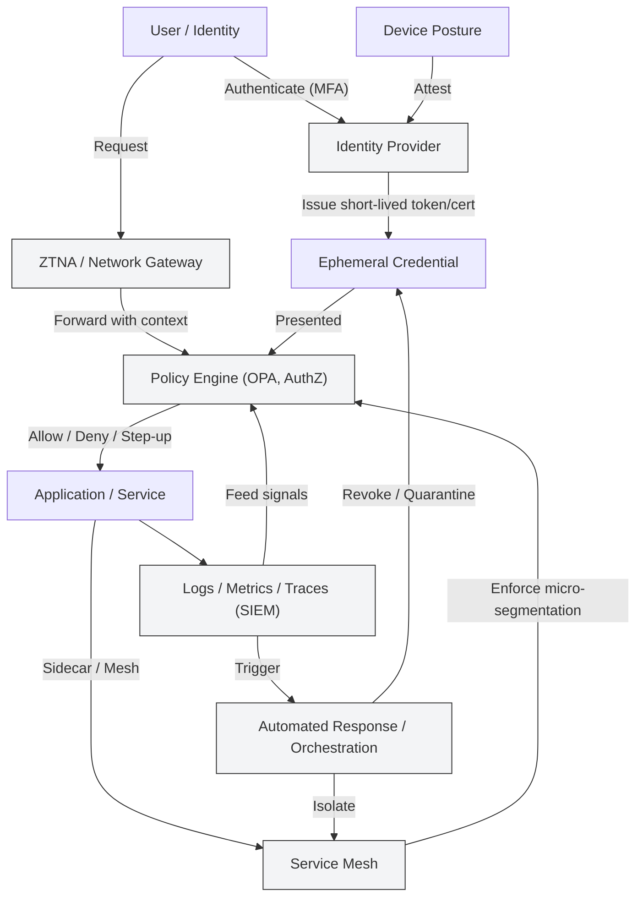

# Zero Trust Is Not a Product

Most organizations talk about Zero Trust as a tool.  
That’s the first mistake.

## What Zero Trust Actually Means

Zero Trust is a design principle, not a SKU. It reframes security from "trust by location or network" to "verify every request, continuously." The goal is to minimize blast radius, reduce implicit trust, and make security decisions based on context and risk rather than binary network boundaries.

### Common misconception
- ❌ Buy a firewall  
- ❌ Deploy ZTNA  
- ❌ Call it Zero Trust

### Reality
- Identity is the new perimeter  
- Authorization is continuous  
- Assume breach

## Core Principles 

- Least privilege: grant the minimum access needed for the minimum time. Apply to users, services, and workloads.
- Continuous verification: authenticate and authorize per request, re-evaluate on change (device state, location, session risk).
- Micro-segmentation: break networks and workloads into smaller trust zones to constrain lateral movement.
- Strong identity and telemetry: rely on identity (human or machine), device posture, behavior analytics, and real-time signals.
- Default deny: deny first, allow with explicit, context-aware policy.

## Practical Architecture Patterns

1. Identity-first access
   - Use a central identity provider (IdP) for SSO and strong auth (MFA, phishing-resistant methods).
   - Treat machine identities (service accounts, workloads, k8s service accounts) with the same rigor as human identities.

2. Policy as code
   - Express access decisions in code (e.g., OPA/Rego, authorization middleware) so policies are reviewable, testable, and auditable.
   - Keep policies close to the resources they govern.

3. Short-lived credentials and automated rotation
   - Replace long-lived secrets with ephemeral tokens, certificate rotation, workload identity, or short TTL credentials.

4. Network and workload segmentation
   - Apply segmentation using enforced policies at the workload or service mesh layer rather than relying solely on perimeter devices.

5. Telemetry and detection
   - Centralize logs, metrics, and traces. Use telemetry to detect anomalies and trigger policy re-evaluation or automated containment.

## Implementation Roadmap (practical steps)

1. Inventory & classification
   - List users, services, data stores, and their current access patterns. Classify data by sensitivity.

2. Identity consolidation
   - Consolidate identity sources; adopt MFA and device posture checks. Enforce unique identities and avoid shared accounts.

3. Pilot: high-value micro-segmentation
   - Start with a single application or environment. Implement least privilege, short-lived creds, and continuous authorization.

4. Policy automation
   - Move ACLs into policy-as-code and CI pipelines. Automate testing and canary rollout of policy changes.

5. Expand and harden
   - Roll out to additional apps, add behavioral detection, refine policies with feedback loops.

6. Measure and iterate
   - Use key metrics (see below) to validate the program and address gaps.

## Example: Access Decision Flow

1. Request arrives (user or service).
2. Authenticate identity with IdP (MFA + device posture).
3. Gather contextual signals (time, location, device health, behavior baseline).
4. Evaluate policy (policy engine + resource rules).
5. Issue short-lived allowance or deny; log decision and telemetry.
6. Continuously monitor session; revoke if risk increases.

## Checklist for Teams

- [ ] Unique identities for humans and services
- [ ] MFA and device posture checks enabled
- [ ] Policies expressed as code and in CI
- [ ] Short-lived credentials in use
- [ ] Micro-segmentation applied to critical workloads
- [ ] Centralized telemetry and retention policy
- [ ] Automated response playbooks for compromise
- [ ] Regular access reviews and audit logs

## Metrics to Track

- Mean time to detect (MTTD) anomalous access
- Mean time to revoke (MTTR) compromised sessions/keys
- Percentage of access controlled by policy-as-code
- Number of resources using short-lived credentials
- Reduction in blast radius measured by lateral movement attempts blocked

## Common Pitfalls

- Treating Zero Trust as a single product or bolt-on service.
- Ignoring service-to-service (machine) identity and focusing only on humans.
- Overloading policies without telemetry—policy decisions must be observable and testable.
- Skipping phased rollouts: disruptive, high-risk changes without pilots lead to outages and pushback.

## Short Example Policy (pseudo)

- Allow read access to payroll service only if:
  - identity in payroll-admin group
  - device compliant AND
  - request originates from approved application instance
  - session token age < 15 minutes

## Security architecture

The diagram below illustrates core Zero Trust components and the continuous verification flow.

## Conclusion

Zero Trust is an organizational change: people, processes, and architecture must align. The technical components (IdP, ZTNA, service mesh, CASBs, etc.) are enablers, not a substitute for design. Success comes from measurable, iterative improvements: start with identity, codify policy, instrument everything, and assume you'll need to respond rapidly when breaches occur.

## Further reading & references
- Recommend reading materials and standards: NIST SP 800-207, vendor-neutral blogs on identity and policy-as-code, research on micro-segmentation best practices and telemetry-driven response.

