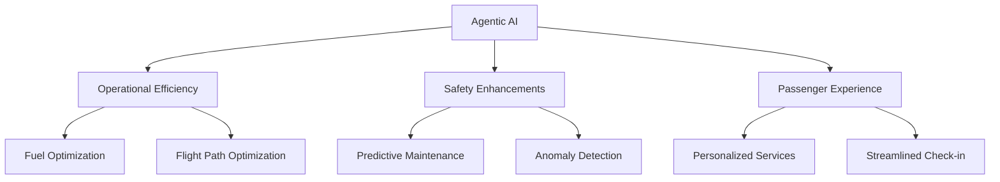

# Chapter 1: Introduction

## Transforming Aviation with Agentic AI

The aviation industry has always been at the forefront of technological innovation. From the advent of jet engines to the implementation of advanced navigation systems, the sector has continuously evolved to meet the demands of safety, efficiency, and passenger experience. Today, a new frontier is emerging: the integration of Agentic AI technology.

Agentic AI refers to artificial intelligence systems that possess a degree of autonomy, enabling them to make decisions, learn from data, and adapt to changing environments. This chapter introduces the concept of Agentic AI and its transformative potential in the aviation industry.

## Why Agentic AI?

The aviation industry faces numerous challenges, including:

- **Operational Efficiency**: Reducing fuel consumption, optimizing flight paths, and minimizing delays.
- **Safety**: Enhancing predictive maintenance, monitoring pilot performance, and detecting anomalies in real-time.
- **Passenger Experience**: Personalizing services, streamlining check-in processes, and improving in-flight entertainment.

Agentic AI offers solutions to these challenges by leveraging advanced machine learning algorithms, real-time data processing, and autonomous decision-making capabilities.

## What is Agentic AI?

Agentic AI refers to artificial intelligence systems that possess a degree of autonomy, enabling them to make decisions, learn from data, and adapt to changing environments. These systems are designed to act as "agents" that can perform tasks independently, interact with other systems, and achieve specific goals.

### What is an AI Agent?

An AI agent is a software entity that operates autonomously to perform tasks on behalf of a user or system. It perceives its environment through sensors, processes information, and takes actions to achieve predefined objectives. Key characteristics of AI agents include:

- **Autonomy**: Operates without constant human intervention.
- **Adaptability**: Learns and improves over time.
- **Goal-Oriented**: Focuses on achieving specific outcomes.

### Frameworks for AI Agents

Several frameworks and platforms are available for building AI agents, including:

#### Frameworks

- **LangChain**: A framework for building applications powered by language models, enabling chaining of LLMs with other tools.
- **LangGraph**: A graph-based framework for managing complex workflows involving AI agents.
- **LlamaIndex**: A data framework for connecting LLMs with external data sources.
- **Crew AI**: A collaborative framework for deploying multi-agent systems.
- **Microsoft AutoGen**: A framework for generating and managing autonomous AI agents.
- **OpenAI Swarm**: A framework for orchestrating multiple AI agents to work collaboratively.

#### Platforms

- **LangFlow**: A visual programming platform for designing and deploying AI workflows.
- **AWS Bedrock**: A platform for building and scaling AI applications using foundation models.
- **Microsoft AI Foundry**: A suite of tools for creating and managing AI solutions.
- **Google AI Studio**: A platform for developing, training, and deploying AI models.

### Comparison: AI Agent vs. LLM Workflow

| Feature                | AI Agent                          | LLM Workflow                     |
|------------------------|------------------------------------|-----------------------------------|
| **Autonomy**           | High                              | Limited to predefined prompts    |
| **Learning**           | Continuous learning and adaptation| Static unless retrained          |
| **Interaction**        | Multi-modal (sensors, APIs, etc.) | Text-based input and output      |
| **Goal-Oriented**      | Yes                               | Task-specific                    |
| **Environment**        | Operates in dynamic environments  | Operates within static contexts  |

### Vendor Analysis: AI Agents

#### Proprietary Solutions

- **IBM Watson**: Offers AI agents for customer service and business automation.
- **Amazon Lex**: Provides conversational AI for building chatbots and voice interfaces.
- **Microsoft Azure AI**: Includes tools for creating intelligent agents with cognitive services.

#### Open Source Solutions

- **Rasa**: A robust framework for building AI agents with full control over data and workflows.
- **Hugging Face Transformers**: Open-source models that can be integrated into AI agent workflows.

### Open Source vs. Proprietary Software

| Aspect                 | Open Source                       | Proprietary Software             |
|------------------------|------------------------------------|-----------------------------------|
| **Cost**               | Free or low-cost                  | Licensing fees                   |
| **Customization**      | High                              | Limited                          |
| **Support**            | Community-driven                  | Vendor-provided                  |
| **Security**           | Transparent codebase              | Closed-source                    |
| **Scalability**        | Depends on community contributions| Vendor-optimized                 |

## Structure of the Book

This book is structured to guide you through the journey of understanding and implementing Agentic AI in the aviation industry. The chapters are as follows:

1. **Introduction**: Overview of Agentic AI and its relevance to aviation.
2. **Technological Foundations**: Key technologies enabling Agentic AI.
3. **Applications in Aviation**: Real-world use cases and benefits.
4. **Implementation Strategies**: Steps to integrate Agentic AI into aviation operations.
5. **Challenges and Ethical Considerations**: Addressing potential risks and ethical dilemmas.
6. **Future Trends**: The evolving role of AI in aviation.

## Diagram: The Role of Agentic AI in Aviation

This diagram illustrates the key areas where Agentic AI can make a significant impact in aviation.