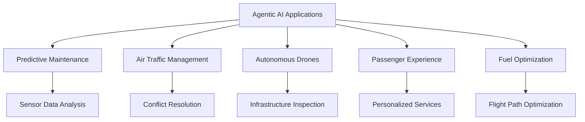

# Chapter 3: Applications in Aviation

## Real-World Use Cases of Agentic AI

Agentic AI is revolutionizing the aviation industry by addressing critical challenges and unlocking new opportunities. This chapter explores real-world applications of Agentic AI across various domains in aviation.

### 1. Predictive Maintenance

Predictive maintenance leverages AI to analyze sensor data and predict potential equipment failures before they occur. Benefits include:

- Reducing unplanned downtime.
- Extending the lifespan of aircraft components.
- Enhancing safety and reliability.

### 2. Air Traffic Management

Agentic AI optimizes air traffic management by:

- Predicting and resolving potential conflicts in flight paths.
- Enhancing communication between pilots and air traffic controllers.
- Reducing delays and improving overall efficiency.

### 3. Autonomous Drones

Autonomous drones powered by Agentic AI are used for:

- Inspecting aircraft and infrastructure.
- Delivering cargo and medical supplies.
- Conducting surveillance and monitoring operations.

### 4. Passenger Experience

Agentic AI enhances the passenger experience by:

- Personalizing in-flight entertainment and services.
- Streamlining check-in and boarding processes.
- Providing real-time updates and assistance through virtual agents.

### 5. Fuel Optimization

AI-driven fuel optimization systems analyze flight data to:

- Recommend optimal flight paths.
- Minimize fuel consumption.
- Reduce carbon emissions.

## Diagram: Applications of Agentic AI in Aviation

This diagram highlights the diverse applications of Agentic AI in the aviation industry.