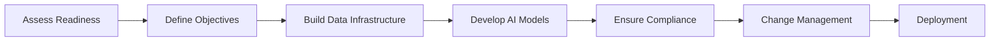

# Chapter 4: Implementation Strategies

## Integrating Agentic AI into Aviation Operations

Implementing Agentic AI in the aviation industry requires a strategic approach to ensure successful integration and adoption. This chapter outlines the key steps and best practices for deploying Agentic AI solutions.

### 1. Assessing Organizational Readiness

Before implementing Agentic AI, organizations must evaluate their readiness by:

- Conducting a technology audit to identify existing capabilities.
- Assessing data quality and availability.
- Building a cross-functional team with AI expertise.

### 2. Defining Objectives and Use Cases

Clear objectives and use cases are essential for a focused implementation. Examples include:

- Reducing maintenance costs through predictive analytics.
- Enhancing passenger satisfaction with personalized services.
- Improving safety with real-time anomaly detection.

### 3. Building a Scalable Data Infrastructure

A robust data infrastructure is critical for supporting Agentic AI. Key components include:

- Data lakes and warehouses for centralized storage.
- Real-time data pipelines for continuous updates.
- Scalable cloud platforms for computational power.

### 4. Developing and Testing AI Models

The development process involves:

- Collecting and preprocessing data.
- Training machine learning models using historical data.
- Validating models with real-world scenarios.

### 5. Ensuring Regulatory Compliance

The aviation industry is highly regulated, and AI implementations must adhere to:

- Safety standards set by aviation authorities.
- Data privacy regulations such as GDPR.
- Ethical guidelines for AI usage.

### 6. Change Management and Training

Successful adoption requires:

- Training employees to work with AI systems.
- Communicating the benefits of AI to stakeholders.
- Addressing resistance to change through workshops and support.

## Diagram: Implementation Roadmap for Agentic AI

This diagram provides a high-level roadmap for implementing Agentic AI in aviation.