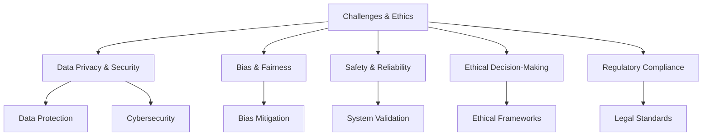

# Chapter 5: Challenges and Ethical Considerations

## Addressing Risks and Ethical Dilemmas

While Agentic AI offers transformative potential, its implementation in the aviation industry is not without challenges. This chapter explores the key risks, challenges, and ethical considerations associated with Agentic AI.

### 1. Data Privacy and Security

The use of AI in aviation involves processing vast amounts of sensitive data, including passenger information and operational metrics. Key concerns include:

- Ensuring compliance with data protection regulations such as GDPR.
- Protecting data from cyberattacks and breaches.
- Maintaining transparency in data usage.

### 2. Bias and Fairness

AI systems can inadvertently perpetuate biases present in training data. In aviation, this could lead to:

- Discrimination in passenger services.
- Inequities in hiring and workforce management.
- Unintended consequences in decision-making algorithms.

### 3. Safety and Reliability

The aviation industry demands the highest levels of safety and reliability. Challenges include:

- Ensuring AI systems perform consistently under diverse conditions.
- Mitigating risks of system failures or incorrect predictions.
- Establishing robust testing and validation protocols.

### 4. Ethical Decision-Making

Agentic AI systems may face scenarios requiring ethical judgments, such as:

- Prioritizing safety in emergency situations.
- Balancing operational efficiency with environmental impact.
- Addressing conflicts between stakeholders' interests.

### 5. Regulatory and Legal Compliance

Navigating the complex regulatory landscape is critical for AI adoption. Key considerations include:

- Adhering to aviation safety standards.
- Addressing liability issues in case of AI-related incidents.
- Collaborating with regulators to establish AI-specific guidelines.

## Diagram: Challenges and Ethical Considerations

This diagram highlights the challenges and ethical considerations in implementing Agentic AI in aviation.