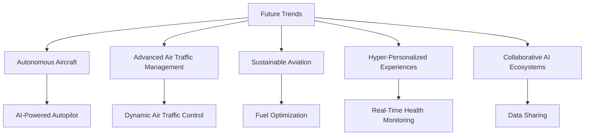

# Chapter 6: Future Trends

## The Evolving Role of Agentic AI in Aviation

As technology continues to advance, the role of Agentic AI in the aviation industry is expected to grow significantly. This chapter explores future trends and innovations that will shape the integration of AI in aviation.

### 1. Autonomous Aircraft

The development of fully autonomous aircraft is a key area of research. Future advancements may include:

- AI-powered autopilot systems capable of handling complex scenarios.
- Autonomous cargo planes for logistics and supply chain optimization.
- Enhanced safety features through real-time decision-making.

### 2. Advanced Air Traffic Management

AI will play a critical role in managing increasingly crowded airspace. Innovations may include:

- Dynamic air traffic control systems that adapt to real-time conditions.
- AI-driven conflict resolution and route optimization.
- Integration of unmanned aerial vehicles (UAVs) into commercial airspace.

### 3. Sustainable Aviation

Agentic AI can contribute to sustainability efforts by:

- Optimizing fuel consumption and reducing emissions.
- Supporting the development of electric and hybrid aircraft.
- Enhancing environmental monitoring and compliance.

### 4. Hyper-Personalized Passenger Experiences

Future AI systems will offer unprecedented levels of personalization, including:

- Tailored in-flight entertainment and services.
- Real-time health monitoring and assistance.
- Seamless travel experiences through AI-driven automation.

### 5. Collaborative AI Ecosystems

The aviation industry will benefit from collaborative AI ecosystems that:

- Enable data sharing across airlines, airports, and regulators.
- Foster innovation through open AI platforms and partnerships.
- Enhance global connectivity and operational efficiency.

## Diagram: Future Trends in Agentic AI for Aviation

This diagram highlights the future trends and innovations in Agentic AI for aviation.