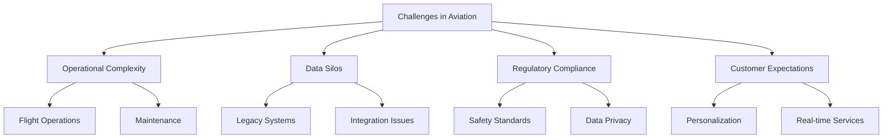

# Chapter 1: Introduction to Agentic AI in Aviation

## 1.1 Overview of Agentic AI
Agentic AI refers to the use of autonomous AI agents and digital workforce solutions to transform business operations. These AI agents are designed to operate independently, making decisions and performing tasks without constant human intervention. In the aviation industry, Agentic AI can revolutionize IT departments by automating processes, enhancing decision-making, and enabling seamless collaboration between human and AI agents. This transformation not only improves operational efficiency but also allows organizations to adapt to rapidly changing industry demands.

### Key Features of Agentic AI
- **Autonomy**: AI agents operate independently to perform tasks, reducing the need for manual intervention and enabling faster decision-making.
- **Collaboration**: Seamless interaction between human employees and AI agents fosters a hybrid workforce, where humans focus on strategic tasks while AI handles repetitive operations.
- **Adaptability**: AI agents learn and adapt to changing environments, ensuring they remain effective even as business needs evolve.
- **Scalability**: Easily scale operations with digital workforce solutions, allowing organizations to handle increased workloads without proportional increases in resources.

## 1.2 The Role of IT in Aviation
The IT department in aviation plays a critical role in ensuring operational efficiency, customer satisfaction, and regulatory compliance. With the integration of Agentic AI, IT departments can:
- **Automate routine tasks**: By automating repetitive processes such as data entry and report generation, IT teams can focus on more strategic initiatives.
- **Enhance data-driven decision-making**: AI-powered analytics provide actionable insights, enabling IT leaders to make informed decisions quickly.
- **Improve system reliability and performance**: Proactive monitoring and predictive maintenance powered by AI ensure that IT systems remain operational and efficient.
- **Enable real-time monitoring and response**: AI agents can monitor systems continuously and respond to issues in real-time, minimizing downtime and enhancing service quality.

## 1.3 Challenges in the Aviation Industry

### Key Challenges
1. **Operational Complexity**: Managing flight operations, maintenance, and crew scheduling involves coordinating multiple interdependent processes. Delays or inefficiencies in one area can have a cascading effect on the entire operation.
2. **Data Silos**: Fragmented data across legacy systems and departments hinders the ability to gain a unified view of operations, making it difficult to derive actionable insights.
3. **Regulatory Compliance**: Adhering to safety standards and data privacy regulations is critical in the aviation industry. Non-compliance can result in severe penalties and reputational damage.
4. **Customer Expectations**: Modern travelers demand personalized and real-time services, such as tailored travel recommendations and instant updates on flight status. Meeting these expectations requires advanced technology and seamless integration.

## 1.4 The Need for Transformation
The aviation industry is at a crossroads where traditional methods are no longer sufficient to meet modern demands. Agentic AI offers a pathway to:
- **Enhance Efficiency**: Automate repetitive tasks and optimize workflows, freeing up human resources for more strategic activities.
- **Improve Decision-Making**: Leverage AI-driven insights for strategic planning, enabling organizations to respond proactively to market changes.
- **Boost Customer Experience**: Provide personalized and seamless services, such as AI-powered chatbots for customer support and real-time notifications.
- **Ensure Compliance**: Automate regulatory checks and reporting, reducing the risk of human error and ensuring adherence to industry standards.

## 1.5 Book Overview
This book explores the transformative potential of Agentic AI in the aviation industry, focusing on its impact on IT departments. The chapters are structured as follows:

1. **Introduction to Agentic AI in Aviation**: Overview and challenges.
2. **Understanding Autonomous AI Agents**: Core concepts and capabilities.
3. **Digital Workforce in Aviation**: Role and implementation.
4. **IT Strategy for Agentic AI**: Planning and execution.
5. **Technology Foundation**: Infrastructure and tools.
6. **Implementation Roadmap**: Step-by-step guide.
7. **Governance and Compliance**: Ensuring ethical and legal adherence.
8. **Case Studies**: Real-world applications.
9. **Future Trends**: The evolving landscape of Agentic AI.

### Key Takeaways
- Agentic AI is a game-changer for the aviation industry, offering solutions to longstanding challenges.
- IT departments are pivotal in driving this transformation, leveraging AI to enhance efficiency and innovation.
- Overcoming challenges requires a strategic approach, including robust planning, execution, and continuous improvement.
- This book provides a comprehensive guide to implementing Agentic AI, equipping readers with the knowledge to navigate this transformative journey.