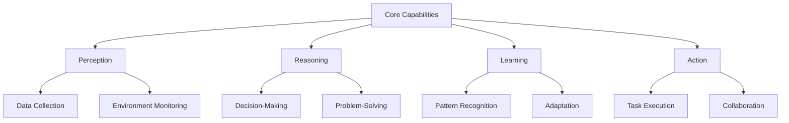
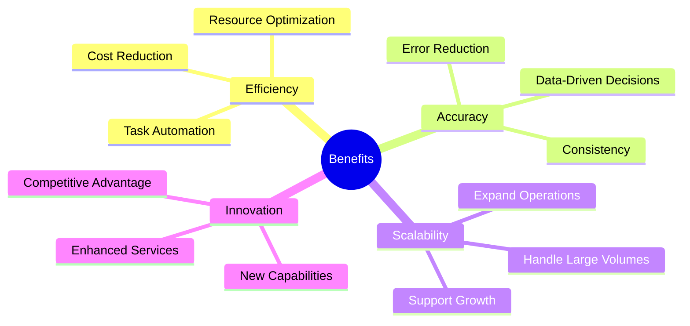

# Chapter 2: Understanding Autonomous AI Agents

## 2.1 What are Autonomous AI Agents?
Autonomous AI agents are software entities capable of performing tasks independently, making decisions, and interacting with their environment. These agents are designed to mimic human-like decision-making processes and can operate without constant human intervention. By leveraging advanced algorithms and machine learning techniques, these agents can analyze data, adapt to new situations, and execute tasks with minimal oversight. In the aviation industry, autonomous AI agents play a pivotal role in streamlining operations, enhancing efficiency, and reducing human workload.

### Key Characteristics
- **Autonomy**: Operate independently to achieve predefined goals, enabling organizations to automate complex workflows and reduce reliance on manual processes.
- **Proactivity**: Anticipate needs and take initiative, such as identifying potential issues before they escalate or optimizing resource allocation in real-time.
- **Reactivity**: Respond to changes in the environment, ensuring that operations remain adaptive and resilient to disruptions.
- **Social Ability**: Interact with other agents and humans, facilitating seamless collaboration and integration within hybrid work environments.

## 2.2 Core Capabilities of AI Agents

### Detailed Capabilities
1. **Perception**: Collect and interpret data from various sources, such as sensors, databases, and user inputs. This capability allows AI agents to understand their environment and make informed decisions.
2. **Reasoning**: Analyze data to make informed decisions, such as determining the most efficient flight routes or identifying maintenance needs based on historical trends.
3. **Learning**: Improve performance over time through experience, enabling AI agents to adapt to new challenges and optimize their operations continuously.
4. **Action**: Execute tasks and interact with systems or users, such as automating ticketing processes or providing real-time updates to passengers.

## 2.3 Types of AI Agents in Aviation

### 2.3.1 Task-Based Agents
Task-based agents are designed to focus on specific tasks, such as flight scheduling or baggage handling. These agents operate within predefined parameters, ensuring consistency and efficiency in their operations. For example, a task-based agent can automate the allocation of gates for incoming flights, reducing delays and improving airport efficiency.

### 2.3.2 Collaborative Agents
Collaborative agents work alongside human employees to enhance productivity. By handling routine tasks, these agents free up human workers to focus on more strategic activities. Examples include virtual assistants that help IT teams troubleshoot issues or chatbots that provide customer support.

### 2.3.3 Predictive Agents
Predictive agents use historical data to forecast future events, enabling proactive decision-making. For instance, predictive maintenance agents analyze sensor data to predict when an aircraft component is likely to fail, allowing for timely repairs and minimizing downtime.

### 2.3.4 Adaptive Agents
Adaptive agents learn and adapt to changing environments, ensuring they remain effective even as conditions evolve. Examples include dynamic pricing systems that adjust ticket prices based on demand and personalized recommendation engines that tailor travel suggestions to individual preferences.

## 2.4 Benefits of Autonomous AI Agents

### Key Benefits
1. **Efficiency**: Automate repetitive tasks and optimize resource utilization, enabling organizations to achieve more with fewer resources.
2. **Accuracy**: Reduce errors and ensure consistent performance, particularly in critical areas such as flight operations and safety compliance.
3. **Scalability**: Handle increasing workloads without additional resources, making it easier to expand operations and meet growing demand.
4. **Innovation**: Enable new capabilities and improve customer experiences, such as offering personalized travel recommendations or real-time updates.

## 2.5 Challenges in Implementing AI Agents

### 2.5.1 Technical Challenges
Implementing AI agents often requires integration with legacy systems, which can be complex and time-consuming. Ensuring data quality and availability is another critical challenge, as AI agents rely on accurate and comprehensive data to function effectively. Additionally, managing computational requirements, such as processing power and storage, is essential to support AI operations.

### 2.5.2 Organizational Challenges
Resistance to change is a common barrier to adopting AI technologies. Employees may fear job displacement or struggle to adapt to new workflows. Addressing skill gaps in the workforce is also crucial, as implementing and managing AI systems require specialized expertise. Aligning AI initiatives with business goals ensures that investments in AI deliver tangible value.

### 2.5.3 Ethical Challenges
Ethical considerations include ensuring transparency and accountability in AI decision-making processes. Avoiding bias in AI algorithms is critical to maintaining fairness and trust. Protecting user privacy and data security is another priority, particularly in industries like aviation, where sensitive information is frequently handled.

## 2.6 Framework for Deploying AI Agents

### Steps for Deployment
1. **Define Objectives**: Identify goals and success metrics, such as reducing operational costs or improving customer satisfaction.
2. **Select Use Cases**: Prioritize tasks that benefit most from automation, focusing on areas with high impact and feasibility.
3. **Develop Models**: Build and train AI models tailored to use cases, ensuring they meet performance and reliability standards.
4. **Integrate Systems**: Ensure seamless interaction with existing infrastructure, minimizing disruptions during implementation.
5. **Monitor and Optimize**: Continuously evaluate performance and make improvements, leveraging feedback to enhance AI capabilities.

### Key Takeaways
- Autonomous AI agents are essential for modernizing aviation operations, offering solutions to complex challenges.
- They provide significant benefits in efficiency, accuracy, scalability, and innovation, driving value across the organization.
- Successful deployment requires addressing technical, organizational, and ethical challenges, supported by a clear framework for implementation.