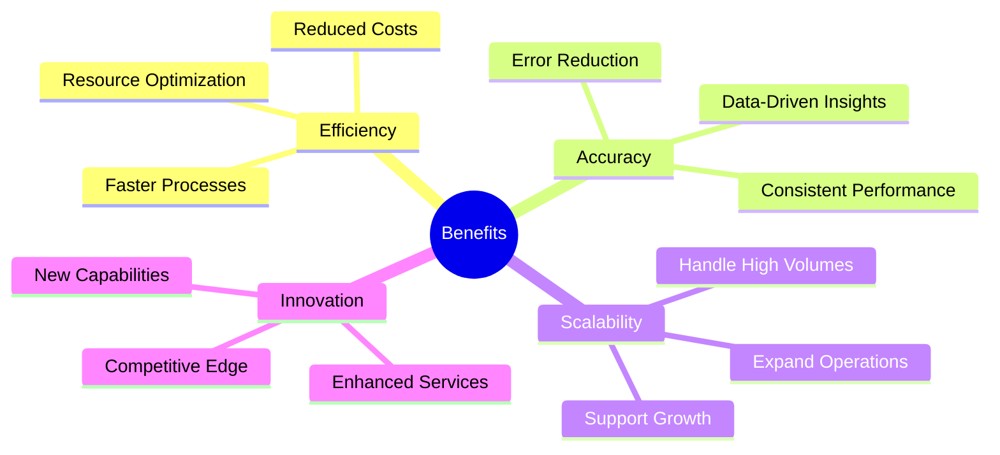

# Chapter 3: Digital Workforce in Aviation

## 3.1 What is a Digital Workforce?
A digital workforce consists of AI-driven software agents and tools that perform tasks traditionally handled by human employees. These tools are designed to complement human efforts by automating repetitive tasks, enhancing decision-making, and enabling real-time operations. In the aviation industry, the digital workforce plays a crucial role in addressing operational challenges, improving efficiency, and delivering superior customer experiences. By integrating AI agents, robotic process automation (RPA), and analytics tools, organizations can create a hybrid workforce that leverages the strengths of both humans and machines.

### Key Components
- **AI Agents**: Autonomous systems that perform specific tasks, such as flight scheduling or baggage handling, with minimal human intervention.
- **Robotic Process Automation (RPA)**: Automates rule-based processes, such as data entry and invoice processing, freeing up human employees for more strategic activities.
- **Virtual Assistants**: Provide customer support and operational assistance, such as answering passenger queries or assisting IT teams with troubleshooting.
- **Analytics Tools**: Deliver insights for data-driven decisions, enabling organizations to optimize operations and improve performance.

## 3.2 Role of Digital Workforce in Aviation

### 3.2.1 Enhancing Operational Efficiency
The digital workforce enhances operational efficiency by automating complex and time-consuming tasks. For example, AI agents can automate flight scheduling and crew management, ensuring optimal resource allocation and reducing delays. Similarly, RPA can streamline baggage handling and ground operations, minimizing errors and improving turnaround times. By optimizing maintenance schedules and resource allocation, the digital workforce ensures that aircraft are always ready for operation, reducing downtime and enhancing reliability.

### 3.2.2 Improving Customer Experience
A digital workforce significantly improves customer experience by providing personalized and seamless services. AI-powered virtual assistants can offer tailored travel recommendations based on passenger preferences, while real-time updates and notifications keep customers informed about flight status and gate changes. Chatbots provide 24/7 customer support, addressing common queries and resolving issues quickly, thereby enhancing customer satisfaction and loyalty.

### 3.2.3 Supporting Decision-Making
The digital workforce supports decision-making by delivering predictive insights and analyzing operational data. For instance, predictive analytics tools can forecast demand, enabling airlines to adjust capacity and pricing strategies accordingly. By analyzing data on flight performance and passenger behavior, AI agents can identify areas for improvement and assist in strategic planning. This data-driven approach ensures that decisions are informed, timely, and aligned with organizational goals.

## 3.3 Benefits of a Digital Workforce

### Key Benefits
1. **Efficiency**: Accelerate processes and reduce operational costs by automating repetitive tasks and optimizing workflows. This allows organizations to achieve more with fewer resources.
2. **Accuracy**: Minimize errors and ensure consistent performance, particularly in critical areas such as flight operations and safety compliance. Data-driven insights further enhance decision-making accuracy.
3. **Scalability**: Handle increasing workloads without additional resources, enabling organizations to expand operations and meet growing demand effectively.
4. **Innovation**: Enable new capabilities and improve customer experiences, such as offering personalized travel recommendations or real-time updates. This fosters a competitive edge in the market.

## 3.4 Challenges in Implementing a Digital Workforce

### 3.4.1 Technical Challenges
Implementing a digital workforce often involves integrating new technologies with legacy systems, which can be complex and resource-intensive. Ensuring data quality and availability is another critical challenge, as AI agents and RPA tools rely on accurate and comprehensive data to function effectively. Additionally, managing computational requirements, such as processing power and storage, is essential to support the digital workforce.

### 3.4.2 Organizational Challenges
Resistance to change is a common barrier to adopting a digital workforce. Employees may fear job displacement or struggle to adapt to new workflows. Addressing skill gaps in the workforce is also crucial, as implementing and managing digital tools require specialized expertise. Aligning digital initiatives with business goals ensures that investments in technology deliver tangible value.

### 3.4.3 Ethical Challenges
Ethical considerations include ensuring transparency and accountability in decision-making processes. Avoiding bias in AI algorithms is critical to maintaining fairness and trust. Protecting user privacy and data security is another priority, particularly in industries like aviation, where sensitive information is frequently handled.

## 3.5 Framework for Building a Digital Workforce

### Steps for Deployment
1. **Define Objectives**: Identify goals and success metrics, such as reducing operational costs or improving customer satisfaction.
2. **Identify Use Cases**: Prioritize tasks that benefit most from automation, focusing on areas with high impact and feasibility.
3. **Develop Tools**: Build and deploy AI agents and RPA solutions tailored to specific use cases, ensuring they meet performance and reliability standards.
4. **Integrate Systems**: Ensure seamless interaction with existing infrastructure, minimizing disruptions during implementation.
5. **Monitor and Optimize**: Continuously evaluate performance and make improvements, leveraging feedback to enhance the digital workforce's capabilities.

## 3.6 Case Studies

### 3.6.1 Automated Baggage Handling
- **Challenge**: Delays and errors in baggage handling often lead to customer dissatisfaction and operational inefficiencies.
- **Solution**: Implemented AI agents to track and manage baggage in real-time, ensuring accurate routing and timely delivery.
- **Outcome**: Reduced delays by 30% and improved customer satisfaction, demonstrating the value of automation in enhancing operational efficiency.

### 3.6.2 Predictive Maintenance
- **Challenge**: Unplanned maintenance causing flight disruptions and increased costs.
- **Solution**: Deployed predictive analytics tools to forecast maintenance needs, allowing for proactive repairs and minimizing downtime.
- **Outcome**: Reduced maintenance costs by 20% and improved aircraft availability, highlighting the benefits of predictive insights in optimizing operations.

### Key Takeaways
- A digital workforce is essential for modernizing aviation operations, offering solutions to complex challenges.
- It provides significant benefits in efficiency, accuracy, scalability, and innovation, driving value across the organization.
- Successful implementation requires addressing technical, organizational, and ethical challenges, supported by a clear framework for deployment.