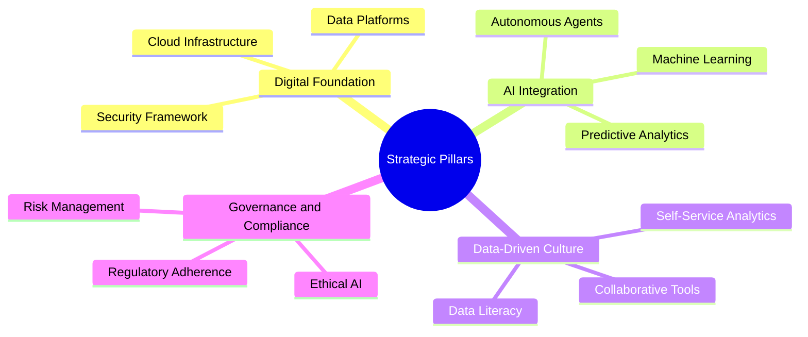
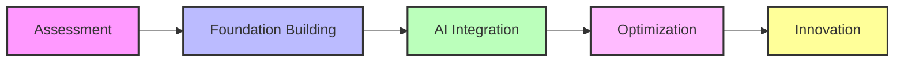
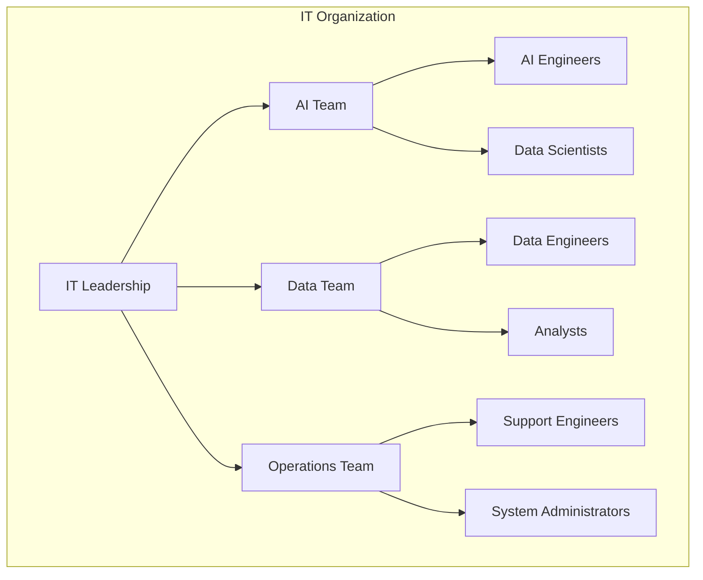
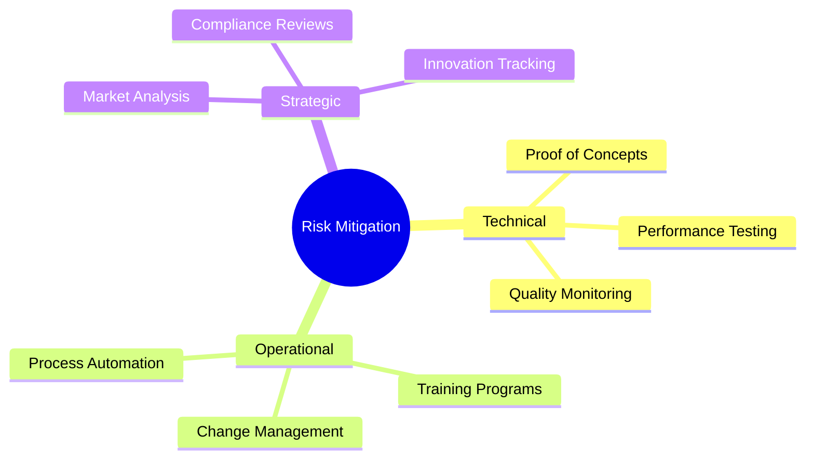
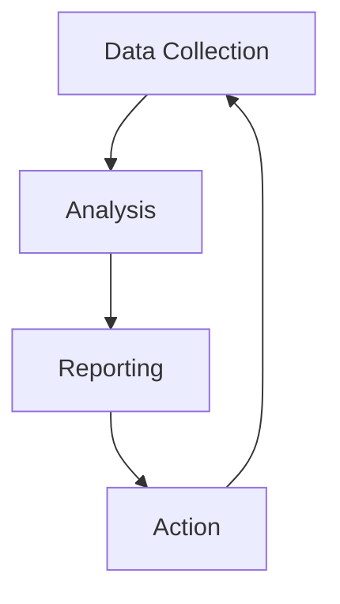

# Chapter 4: IT Strategy for Agentic AI

## 4.1 Strategic Vision
The integration of Agentic AI into aviation IT departments requires a clear strategic vision. This vision should align with organizational goals and focus on leveraging AI to enhance efficiency, innovation, and customer satisfaction. A well-defined vision ensures that all stakeholders are aligned and that resources are allocated effectively to achieve desired outcomes. By embracing Agentic AI, IT departments can transition from being operational support units to strategic enablers of business transformation.

### Key Elements of the Vision
- **Digital Transformation**: Transitioning from legacy systems to modern, AI-driven solutions enables organizations to streamline operations, reduce costs, and improve agility. This transformation is essential for staying competitive in a rapidly evolving industry.
- **Customer-Centric Approach**: Enhancing customer experiences through personalized services, such as tailored travel recommendations and real-time updates, fosters loyalty and drives revenue growth.
- **Operational Excellence**: Streamlining processes and reducing costs through automation and optimization ensures that resources are utilized efficiently and effectively.
- **Innovation Leadership**: Staying ahead of industry trends with cutting-edge technology positions organizations as leaders in the aviation sector, attracting customers and partners.

## 4.2 Strategic Pillars

### Pillar Details
1. **Digital Foundation**: Establishing robust infrastructure and platforms to support AI initiatives is critical. This includes cloud infrastructure for scalability, data platforms for centralized data management, and security frameworks to protect sensitive information.
2. **AI Integration**: Deploying AI agents and tools to automate tasks and enhance decision-making enables organizations to achieve greater efficiency and accuracy. Examples include predictive maintenance and dynamic pricing systems.
3. **Data-Driven Culture**: Promoting data literacy and enabling self-service analytics empower employees to make informed decisions. Collaborative tools facilitate teamwork and knowledge sharing across departments.
4. **Governance and Compliance**: Ensuring ethical AI practices and adherence to regulations builds trust with stakeholders and minimizes risks. This includes implementing frameworks for accountability, transparency, and risk management.

## 4.3 IT Roadmap for Agentic AI

### 4.3.1 Phased Approach

### 4.3.2 Key Milestones
1. **Assessment**: Evaluate current systems and identify gaps to understand the organization's readiness for AI integration. This phase involves conducting audits, gathering stakeholder input, and defining objectives.
2. **Foundation Building**: Establish infrastructure and data platforms to support AI initiatives. This includes setting up cloud environments, integrating data sources, and implementing security measures.
3. **AI Integration**: Deploy AI agents and tools for key use cases, such as automating routine tasks and enhancing decision-making. Pilot projects can validate the effectiveness of AI solutions before scaling.
4. **Optimization**: Refine processes and improve performance by analyzing outcomes and making adjustments. Continuous monitoring ensures that AI systems remain effective and aligned with business goals.
5. **Innovation**: Explore new capabilities and expand AI applications to drive growth and maintain a competitive edge. This phase focuses on leveraging AI for strategic initiatives and long-term value creation.

## 4.4 Organizational Alignment

### 4.4.1 Team Structure

A well-structured IT organization is essential for the successful implementation of Agentic AI. IT leadership provides strategic direction, while specialized teams focus on specific areas:
- **AI Team**: Responsible for developing and deploying AI solutions, including AI engineers and data scientists.
- **Data Team**: Manages data infrastructure and analytics, ensuring data quality and accessibility.
- **Operations Team**: Supports IT systems and ensures their reliability, including support engineers and system administrators.

### 4.4.2 Skills Development
To support the adoption of Agentic AI, organizations must invest in skills development:
- **Technical Skills**: AI development, data engineering, and cloud computing are critical for building and managing AI systems.
- **Business Skills**: Domain knowledge, process optimization, and strategic planning ensure that AI initiatives align with organizational goals.
- **Soft Skills**: Collaboration, adaptability, and problem-solving enable teams to work effectively in dynamic environments.

## 4.5 Risk Management

### 4.5.1 Risk Categories
- **Technical Risks**: Integration challenges, system failures, and data quality issues can hinder the effectiveness of AI systems.
- **Operational Risks**: Resistance to change, skill gaps, and process disruptions can impact the adoption and success of AI initiatives.
- **Strategic Risks**: Misalignment with business goals, regulatory changes, and market competition can affect the long-term viability of AI investments.

### 4.5.2 Mitigation Strategies

Mitigation strategies include conducting proof of concepts to validate AI solutions, implementing training programs to address skill gaps, and conducting market analysis to stay ahead of industry trends.

## 4.6 Success Metrics

### 4.6.1 Key Performance Indicators
1. **Operational Metrics**: System uptime, task automation rate, and process efficiency measure the effectiveness of AI systems in improving operations.
2. **Customer Metrics**: Satisfaction scores, personalization effectiveness, and service response time assess the impact of AI on customer experiences.
3. **Financial Metrics**: Cost savings, ROI on AI investments, and revenue growth demonstrate the financial benefits of AI initiatives.

### 4.6.2 Measurement Framework

A robust measurement framework ensures continuous improvement by collecting data, analyzing outcomes, and taking corrective actions as needed.

### Key Takeaways
- A clear IT strategy is essential for successful Agentic AI integration, providing a roadmap for transformation.
- Strategic pillars, such as a digital foundation and AI integration, form the backbone of this strategy.
- Organizational alignment and risk management are critical for overcoming challenges and ensuring success.
- Success metrics enable organizations to measure progress and demonstrate the value of AI initiatives.