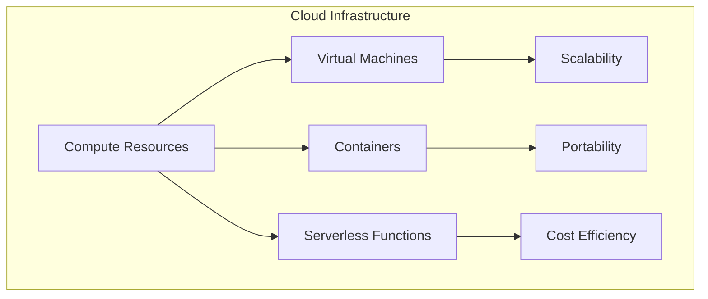
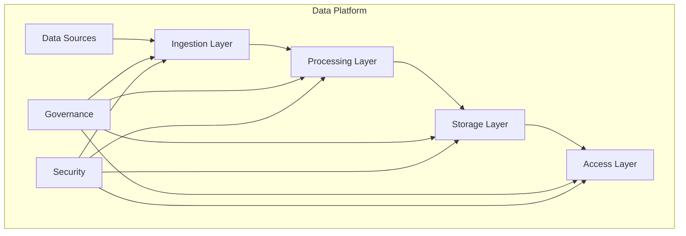
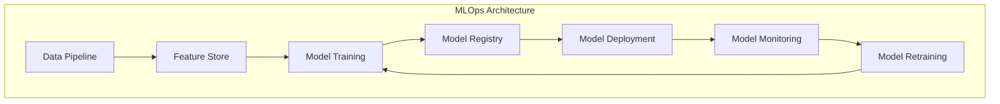
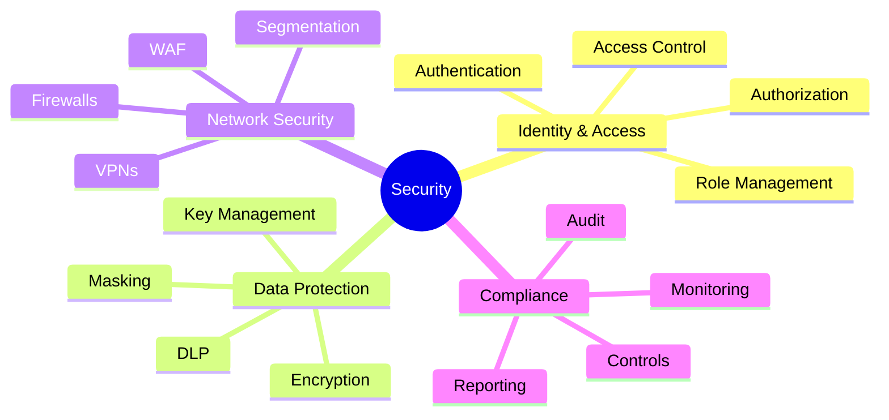
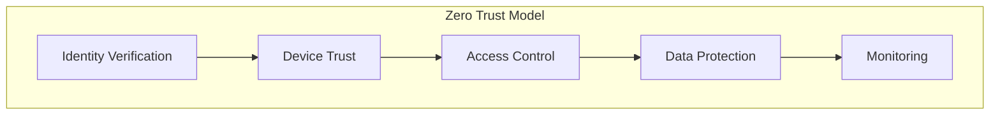
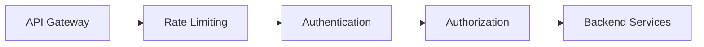
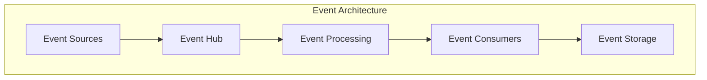
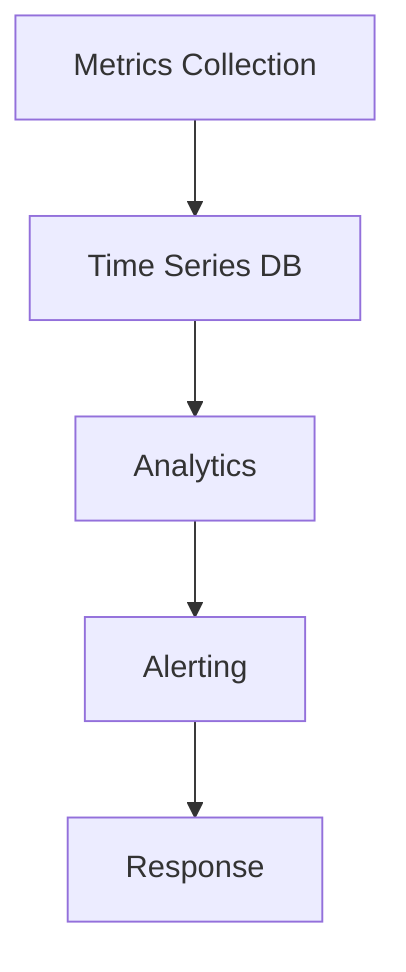

# Chapter 5: Technology Foundation for Agentic AI

## 5.1 Infrastructure Requirements

### 5.1.1 Cloud Infrastructure

#### Key Components
1. **Compute Resources**: Virtual machines, containers, and serverless functions provide the computational power needed to run AI models and process large datasets. Virtual machines offer flexibility, containers ensure portability, and serverless functions enable cost-efficient execution of specific tasks.
2. **Storage Solutions**: Object storage, block storage, and file systems are essential for managing structured and unstructured data. These solutions ensure that data is readily accessible for analysis and decision-making.
3. **Networking**: Virtual private clouds, load balancers, and firewalls create a secure and scalable network environment. These components enable seamless communication between systems and protect against cyber threats.

### 5.1.2 Edge Computing
Edge computing reduces latency by processing data closer to the source, such as IoT devices and sensors in aviation. This approach enhances real-time decision-making for critical operations, such as monitoring aircraft performance during flights. By minimizing the need to transmit data to centralized servers, edge computing also reduces bandwidth usage and improves system reliability.

## 5.2 Data Platform Architecture

### 5.2.1 Core Components

#### Key Layers
1. **Ingestion Layer**: Collects data from various sources, such as sensors, operational systems, and customer interactions. This layer ensures that data is captured in real-time and prepared for processing.
2. **Processing Layer**: Transforms and analyzes data to extract actionable insights. This layer includes tools for data cleaning, aggregation, and advanced analytics.
3. **Storage Layer**: Stores data in structured and unstructured formats, enabling organizations to manage large volumes of information efficiently. This layer supports both historical and real-time data storage.
4. **Access Layer**: Provides APIs and tools for data consumption, allowing stakeholders to access insights through dashboards, reports, and applications.

## 5.3 AI and ML Infrastructure

### 5.3.1 MLOps Platform

#### Components
1. **Development Environment**: Jupyter notebooks, IDEs, and version control systems provide a collaborative space for data scientists and engineers to develop AI models.
2. **Training Infrastructure**: GPU clusters and distributed training platforms enable the efficient training of complex AI models. Experiment tracking tools help monitor and compare model performance.
3. **Deployment Platform**: Model serving frameworks, A/B testing tools, and performance monitoring systems ensure that AI models are deployed effectively and deliver consistent results.

## 5.4 Security Architecture

### 5.4.1 Security Framework

A robust security framework is essential for protecting sensitive data and ensuring compliance with regulations. Key components include:
- **Identity & Access**: Authentication, authorization, and role management ensure that only authorized users can access systems and data.
- **Data Protection**: Encryption, masking, and key management safeguard data at rest and in transit.
- **Network Security**: Firewalls, VPNs, and segmentation protect the network from unauthorized access and cyber threats.
- **Compliance**: Regular audits, reporting, and monitoring ensure adherence to industry standards and legal requirements.

### 5.4.2 Zero Trust Architecture

Zero Trust Architecture enhances security by verifying every access request, regardless of its origin. This approach minimizes the risk of data breaches and ensures that systems remain secure even in dynamic environments.

## 5.5 Integration Architecture

### 5.5.1 API Management

API management ensures seamless integration between systems by providing a centralized platform for managing APIs. Key features include rate limiting to prevent overuse, authentication and authorization for secure access, and backend services for data processing.

### 5.5.2 Event Architecture

Event architecture enables real-time data processing and communication between systems. This approach is particularly useful for handling high-frequency events, such as flight status updates and sensor readings.

## 5.6 Monitoring and Observability

### 5.6.1 Monitoring Framework

A monitoring framework ensures the reliability and performance of IT systems by collecting metrics, analyzing trends, and generating alerts for anomalies. This proactive approach minimizes downtime and enhances system availability.

### 5.6.2 Observability Stack
1. **Logs**: Centralized logging, log analytics, and search capabilities provide visibility into system operations and help diagnose issues.
2. **Metrics**: System metrics, business metrics, and custom metrics enable organizations to track performance and identify areas for improvement.
3. **Traces**: Distributed tracing, performance analysis, and dependency mapping help identify bottlenecks and optimize workflows.

### Key Takeaways
- A robust technology foundation is essential for Agentic AI, providing the infrastructure and tools needed to support AI initiatives.
- Security and integration are critical for seamless operations, ensuring that systems remain secure and interoperable.
- Monitoring and observability ensure reliability and continuous improvement, enabling organizations to maintain high levels of performance and availability.