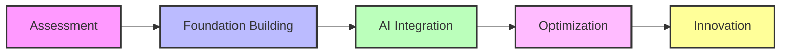
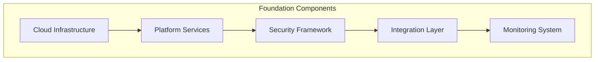
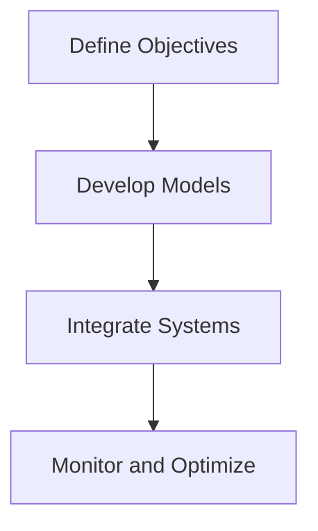
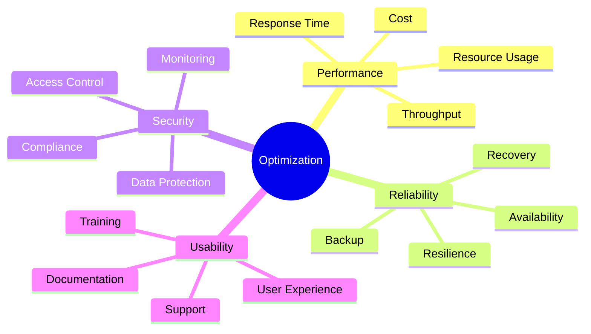
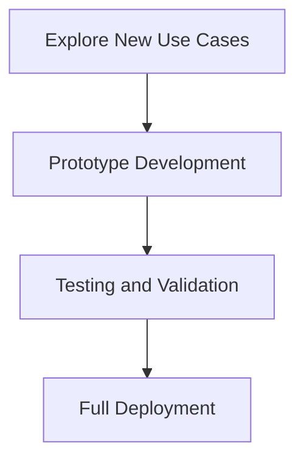

# Chapter 6: Implementation Roadmap for Agentic AI

## 6.1 Transformation Framework

### 6.1.1 Phased Approach

The transformation framework for implementing Agentic AI follows a phased approach to ensure a structured and controlled rollout. Each phase builds on the achievements of the previous one, enabling organizations to address challenges incrementally and achieve sustainable results.

### 6.1.2 Key Phases
1. **Assessment**: Evaluate current systems and identify gaps to understand the organization's readiness for AI integration. This phase involves gathering input from stakeholders, analyzing existing processes, and defining objectives.
2. **Foundation Building**: Establish the necessary infrastructure and data platforms to support AI initiatives. This includes setting up cloud environments, integrating data sources, and implementing security measures.
3. **AI Integration**: Deploy AI agents and tools for key use cases, such as automating routine tasks and enhancing decision-making. Pilot projects can validate the effectiveness of AI solutions before scaling.
4. **Optimization**: Refine processes and improve performance by analyzing outcomes and making adjustments. Continuous monitoring ensures that AI systems remain effective and aligned with business goals.
5. **Innovation**: Explore new capabilities and expand AI applications to drive growth and maintain a competitive edge. This phase focuses on leveraging AI for strategic initiatives and long-term value creation.

## 6.2 Phase 1: Assessment

### 6.2.1 Activities
The assessment phase involves conducting a comprehensive audit of existing systems to identify pain points and opportunities for improvement. This includes evaluating the organization's current technology stack, data quality, and operational workflows. Defining clear objectives and success metrics ensures that the implementation roadmap aligns with business goals.

### 6.2.2 Deliverables
- **Current State Analysis Report**: A detailed overview of the organization's existing systems, processes, and capabilities.
- **Gap Analysis Document**: Identification of gaps between current capabilities and desired outcomes.
- **Strategic Roadmap**: A high-level plan outlining the steps required to achieve the organization's AI objectives.

## 6.3 Phase 2: Foundation Building

### 6.3.1 Technical Foundation

Building a strong technical foundation is critical for the success of Agentic AI. This phase focuses on setting up the infrastructure and platforms needed to support AI initiatives. Key components include cloud infrastructure for scalability, platform services for data management, and security frameworks to protect sensitive information.

### 6.3.2 Implementation Steps
1. **Infrastructure Setup**: Configure cloud environments, establish network connectivity, and implement security measures to ensure a robust and secure foundation.
2. **Platform Development**: Develop core services, such as data ingestion and processing pipelines, and deploy management tools to monitor and maintain the system.

## 6.4 Phase 3: AI Integration

### 6.4.1 Use Case Selection
Prioritize high-impact use cases, such as predictive maintenance and customer service automation, to maximize the value of AI initiatives. Selecting use cases with clear benefits and measurable outcomes ensures a strong return on investment.

### 6.4.2 Deployment Framework

### 6.4.3 Key Activities
1. **Model Development**: Build and train AI models tailored to specific use cases, ensuring they meet performance and reliability standards.
2. **System Integration**: Ensure seamless interaction between AI systems and existing infrastructure, minimizing disruptions during deployment.
3. **Performance Monitoring**: Continuously evaluate AI performance and make improvements based on feedback and analytics.

## 6.5 Phase 4: Optimization

### 6.5.1 Optimization Areas

Optimization focuses on enhancing the performance, reliability, security, and usability of AI systems. This phase ensures that AI solutions deliver consistent value and remain aligned with organizational goals.

### 6.5.2 Implementation Steps
1. **Performance Optimization**: Monitor system performance, identify bottlenecks, and implement solutions to improve response times and resource utilization.
2. **Scale Out**: Plan and execute infrastructure scaling to accommodate increased workloads and ensure system reliability.
3. **Security Enhancements**: Strengthen access controls, data protection measures, and compliance frameworks to mitigate risks.

## 6.6 Phase 5: Innovation

### 6.6.1 Innovation Framework

Innovation is a continuous process that involves exploring new use cases, developing prototypes, and validating their effectiveness. This phase enables organizations to stay ahead of industry trends and maintain a competitive edge.

### 6.6.2 Key Activities
1. **Prototype Development**: Experiment with new AI capabilities to address emerging challenges and opportunities.
2. **Testing and Validation**: Conduct rigorous testing to ensure that prototypes meet performance, reliability, and usability standards.
3. **Full Deployment**: Roll out innovative solutions across the organization, scaling them to maximize impact.

### Key Takeaways
- A phased approach ensures controlled implementation, reducing risks and enabling incremental improvements.
- Each phase builds on previous achievements, creating a strong foundation for long-term success.
- Regular assessment and optimization drive continuous improvement, ensuring that AI systems remain effective and aligned with business goals.
- Innovation is a continuous process that enables organizations to adapt to changing market conditions and maintain a competitive edge.