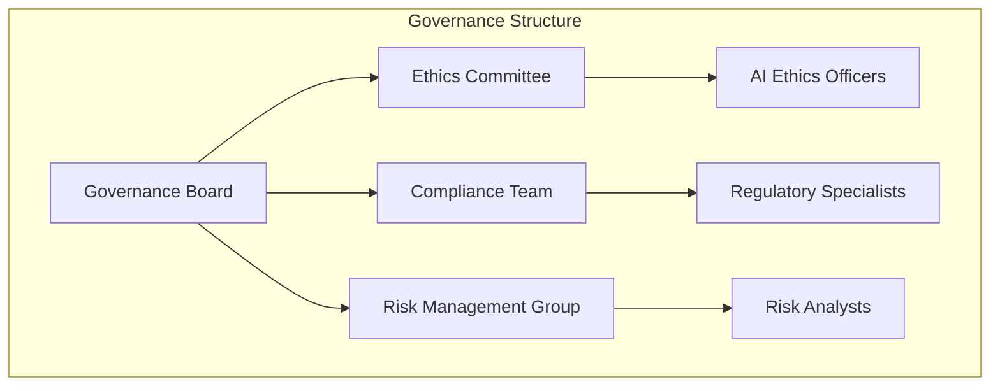
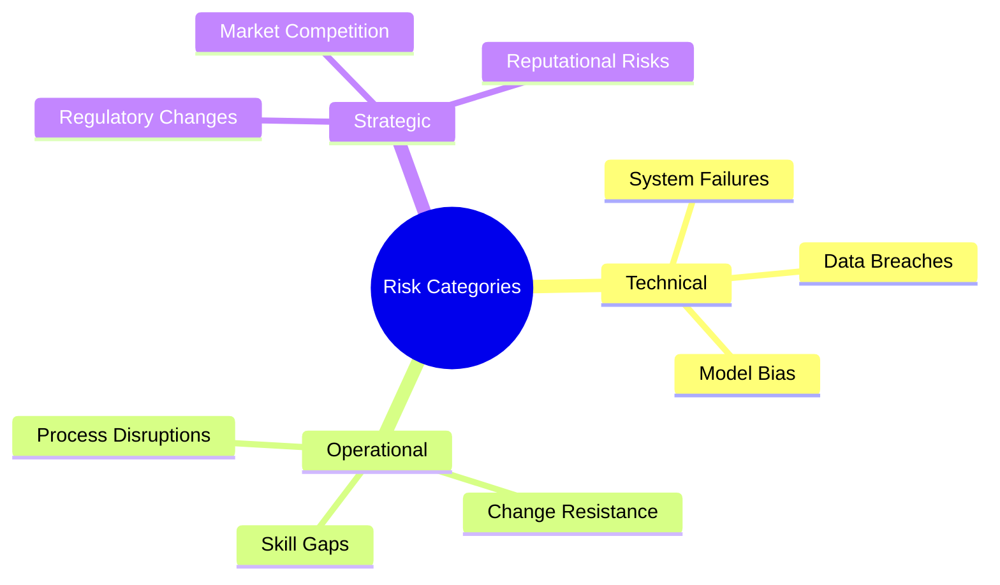
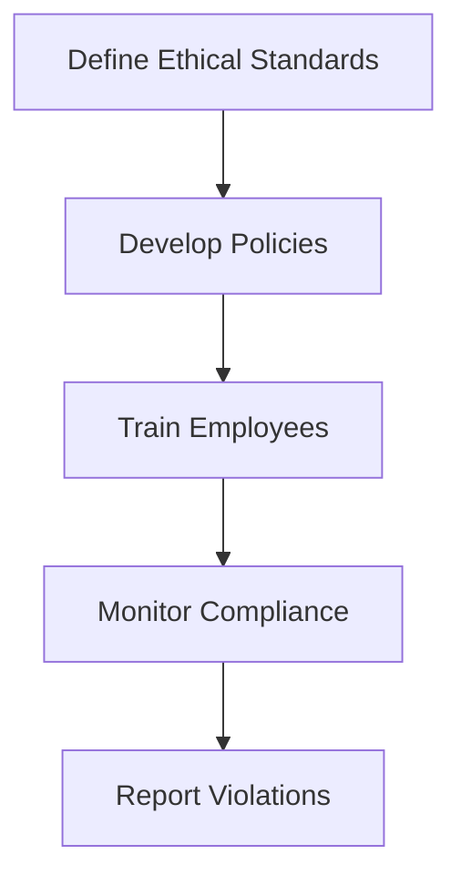
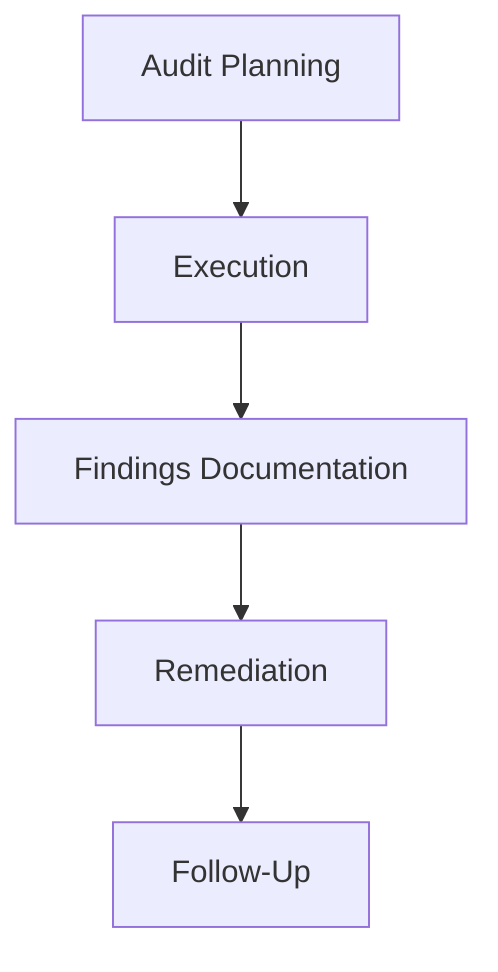

# Chapter 7: Governance and Compliance for Agentic AI

## 7.1 Importance of Governance and Compliance
Governance and compliance are critical for ensuring that Agentic AI systems operate ethically, securely, and in alignment with regulatory requirements. These practices not only minimize risks but also build trust among stakeholders, including customers, employees, and regulatory bodies. By establishing a robust governance framework, organizations can ensure that their AI initiatives deliver value while adhering to ethical and legal standards.

### Key Objectives
- **Ethical AI**: Ensure fairness, transparency, and accountability in AI decision-making processes. Ethical AI fosters trust and prevents unintended consequences, such as bias or discrimination.
- **Regulatory Compliance**: Adhere to industry standards and legal requirements, such as data privacy laws and safety regulations. Compliance reduces the risk of penalties and reputational damage.
- **Risk Management**: Identify and mitigate potential risks associated with AI systems, including technical, operational, and strategic risks.
- **Operational Integrity**: Maintain system reliability and performance to ensure that AI solutions consistently meet organizational goals and user expectations.

## 7.2 Governance Framework

### 7.2.1 Organizational Structure

A well-defined governance structure is essential for overseeing the implementation and operation of Agentic AI systems. This structure ensures that all aspects of governance, from ethics to compliance and risk management, are addressed effectively.

### 7.2.2 Key Roles and Responsibilities
1. **Governance Board**: Define policies, set strategic direction, and oversee the implementation of governance practices.
2. **Ethics Committee**: Ensure that AI systems align with ethical principles, such as fairness, transparency, and accountability.
3. **Compliance Team**: Monitor adherence to regulations and standards, ensuring that the organization meets its legal obligations.
4. **Risk Management Group**: Identify potential risks, develop mitigation strategies, and monitor their effectiveness.

## 7.3 Compliance Requirements

### 7.3.1 Regulatory Standards
- **GDPR**: Ensures data privacy and protection, requiring organizations to handle personal data responsibly.
- **FAA Regulations**: Focus on safety and operational compliance in the aviation industry, ensuring that AI systems meet stringent safety standards.
- **ISO Standards**: Provide guidelines for quality management and information security, helping organizations maintain high standards of operation.

### 7.3.2 Industry Guidelines
- **IATA Standards**: Offer aviation-specific best practices for implementing AI solutions.
- **AI Ethics Frameworks**: Provide guidelines for responsible AI development, ensuring that systems are designed and deployed ethically.

## 7.4 Risk Management

### 7.4.1 Risk Categories

Effective risk management involves identifying and addressing risks across technical, operational, and strategic domains. This ensures that AI systems remain reliable, secure, and aligned with organizational goals.

### 7.4.2 Mitigation Strategies
1. **Technical Risks**: Conduct regular audits, implement robust security measures, and monitor system performance to prevent failures and breaches.
2. **Operational Risks**: Provide training programs to address skill gaps, automate processes to reduce human error, and establish clear workflows to minimize disruptions.
3. **Strategic Risks**: Stay updated on regulatory changes, conduct market analysis to remain competitive, and maintain transparency to build trust with stakeholders.

## 7.5 Ethical Considerations

### 7.5.1 Principles of Ethical AI
- **Fairness**: Avoid bias in decision-making to ensure equitable outcomes for all users.
- **Transparency**: Ensure that AI systems are explainable, allowing stakeholders to understand how decisions are made.
- **Accountability**: Assign responsibility for AI outcomes, ensuring that there is a clear chain of accountability.
- **Privacy**: Protect user data and ensure confidentiality, adhering to data protection laws and ethical standards.

### 7.5.2 Implementation Guidelines

Implementing ethical AI requires defining clear standards, developing policies to enforce them, training employees to understand their responsibilities, and monitoring compliance to ensure adherence.

## 7.6 Audit and Monitoring

### 7.6.1 Audit Framework

Regular audits are essential for evaluating the effectiveness of governance and compliance practices. An audit framework ensures that issues are identified, documented, and addressed promptly.

### 7.6.2 Monitoring Tools
- **Performance Dashboards**: Track system metrics and KPIs to ensure that AI systems operate as intended.
- **Compliance Checklists**: Verify adherence to regulatory standards and organizational policies.
- **Incident Reporting Systems**: Log and address issues promptly, ensuring that risks are mitigated effectively.

## 7.7 Key Takeaways
- Governance and compliance are essential for the success of Agentic AI, ensuring that systems operate ethically, securely, and reliably.
- A robust governance framework provides the structure needed to address ethical, regulatory, and risk management challenges.
- Regular audits and monitoring drive continuous improvement, ensuring that AI systems remain effective and aligned with organizational goals.
- Aligning with regulations builds trust among stakeholders and mitigates risks, enabling organizations to achieve their strategic objectives.