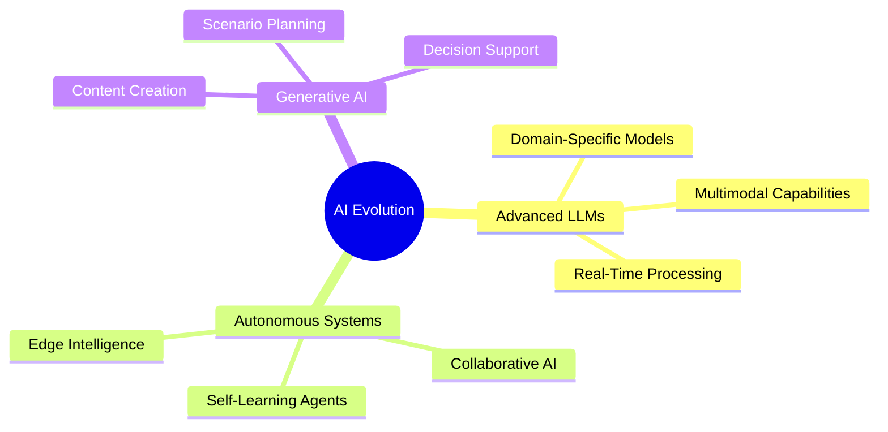
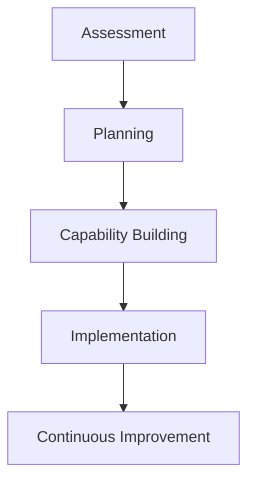

# Chapter 9: Future Trends and Considerations in Agentic AI

## 9.1 Emerging Technologies

### 9.1.1 AI Evolution

### 9.1.2 Impact on Aviation
- **Enhanced Decision-Making**: AI-driven insights for strategic planning.
- **Operational Efficiency**: Automation of complex workflows.
- **Customer Experience**: Personalized and seamless services.

## 9.2 Industry Trends

### 9.2.1 Digital Transformation
- Adoption of cloud-native architectures.
- Integration of IoT devices for real-time data collection.
- Expansion of digital twins for operational simulations.

### 9.2.2 Sustainability Initiatives
- Leveraging AI for fuel optimization and route planning.
- Implementing green computing practices in data centers.
- Enhancing resource utilization through predictive analytics.

## 9.3 Challenges and Risks

### 9.3.1 Technical Challenges
- Integration with legacy systems.
- Ensuring data quality and availability.
- Managing computational requirements.

### 9.3.2 Ethical and Regulatory Risks
- Addressing bias in AI decision-making.
- Ensuring transparency and accountability.
- Adhering to evolving regulatory standards.

### 9.3.3 Organizational Challenges
- Resistance to change.
- Skill gaps in the workforce.
- Aligning AI initiatives with business goals.

## 9.4 Preparedness Strategies

### 9.4.1 Strategic Framework

### 9.4.2 Key Actions
1. **Assessment**: Evaluate current capabilities and identify gaps.
2. **Planning**: Develop a roadmap for AI integration.
3. **Capability Building**: Invest in training and infrastructure.
4. **Implementation**: Deploy AI solutions in a phased manner.
5. **Continuous Improvement**: Monitor performance and refine strategies.

## 9.5 Future Opportunities

### 9.5.1 Expanding AI Applications
- **Crew Management**: Optimize scheduling and resource allocation.
- **Route Optimization**: Enhance efficiency and reduce fuel consumption.
- **Safety Monitoring**: Predict and prevent potential risks.

### 9.5.2 Human-AI Collaboration
- **Augmented Decision-Making**: Combine human expertise with AI insights.
- **Digital Assistants**: Support employees with real-time information.
- **Collaborative Workflows**: Enable seamless interaction between humans and AI agents.

### Key Takeaways
- Emerging technologies will shape the future of Agentic AI.
- Addressing challenges requires strategic planning and continuous improvement.
- Future opportunities lie in expanding AI applications and fostering human-AI collaboration.