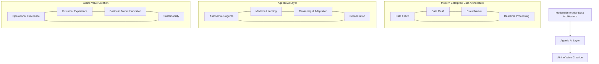

# Chapter 1: Introduction to Agentic AI in Aviation

## The Dawn of Autonomous Intelligence in the Airline Industry

The airline industry stands at a pivotal crossroads in 2025. After weathering unprecedented challenges in the first half of the 2020s, airlines worldwide are now embracing technological innovation as the cornerstone of resilience, efficiency, and competitive advantage. Among these innovations, none holds more transformative potential than agentic artificial intelligence—autonomous AI systems capable of perceiving their environment, making decisions, and taking actions to achieve specific objectives with minimal human oversight.

Unlike traditional AI systems that merely process and analyze data, agentic AI represents a paradigm shift toward truly autonomous digital workers that can navigate complex operational environments, adapt to changing conditions, and continuously optimize their performance. For airline companies managing vast networks of flights, personnel, equipment, customers, and regulatory requirements, this evolution from passive to active AI promises to revolutionize every facet of the business.

## Why Agentic AI Matters for Airlines

Airlines operate in one of the most data-intensive and operationally complex industries in the world. Every day, a single international airline must coordinate:

- Thousands of flights across multiple time zones
- Tens of thousands of crew members with diverse qualifications and constraints
- Millions of passengers with unique itineraries and service needs
- Complex aircraft maintenance schedules and regulatory compliance requirements
- Real-time responses to weather, air traffic, and operational disruptions
- Optimization of fuel consumption, route planning, and resource allocation

Traditional approaches to data management and analytics have helped airlines make incremental improvements in efficiency and service quality. However, the sheer complexity of airline operations creates an environment where even minor disruptions can cascade into major system-wide challenges. This complexity exceeds the capacity of both human operators and conventional AI systems to manage optimally.

Agentic AI offers a solution by combining advanced machine learning with autonomous decision-making capabilities. These systems can:

1. **Continuously monitor** operational data streams across the entire airline ecosystem
2. **Proactively identify** emerging issues before they impact operations
3. **Autonomously respond** to routine challenges without human intervention
4. **Collaborate** with human operators on complex decisions requiring judgment
5. **Learn and improve** from each experience, building institutional knowledge

## The Convergence of Agentic AI and Modern Data Architecture

The potential of agentic AI cannot be realized without a modern enterprise data architecture designed to support autonomous intelligence. Traditional data systems in the airline industry have evolved piecemeal over decades, resulting in siloed data stores, inconsistent data quality, and architectural complexity that hinders innovation.

Modern enterprise data architecture reimagines how airlines organize, manage, and leverage their data assets. By adopting principles like data mesh, data fabric, and cloud-native infrastructure, airlines can create the foundation necessary for agentic AI to thrive.

This synergy between modern data architecture and agentic AI creates a powerful platform for innovation, efficiency, and competitive differentiation in the airline industry. Airlines that successfully implement this combination can expect to realize benefits across multiple dimensions:

- **Operational resilience**: Rapid adaptation to disruptions with minimal impact
- **Resource optimization**: Improved utilization of aircraft, crew, and facilities
- **Customer experience**: Personalized, contextual interactions across the journey
- **Revenue management**: Dynamic pricing and offer optimization
- **Sustainability**: Reduced fuel consumption and environmental impact
- **Cost efficiency**: Streamlined processes and reduced manual intervention

## Book Overview and Objectives

This book provides airline executives, data architects, and technology leaders with a comprehensive guide to implementing agentic AI within a modern enterprise data architecture. Our objectives are to:

1. Establish a clear understanding of agentic AI principles and potential applications in the airline industry
2. Define the foundational elements of a modern enterprise data architecture optimized for airline operations
3. Present practical frameworks for integrating agentic AI capabilities into airline systems and processes
4. Outline implementation strategies, governance models, and change management approaches
5. Explore future trends and innovation opportunities at the intersection of AI, data, and aviation

Each chapter builds upon the concepts of previous ones while offering practical insights that can be applied independently. By the end of this book, readers will have a comprehensive understanding of both the strategic vision and tactical execution required to transform their organizations through the power of agentic AI and modern data architecture.

## The Urgency of Transformation

As we progress through 2025, the adoption of agentic AI and modern data architecture is no longer optional for airlines seeking to remain competitive. Industry leaders have already begun their transformation journeys, with early deployments showing promising results in operational efficiency, customer satisfaction, and financial performance.

The COVID-19 pandemic taught the industry that resilience requires both operational flexibility and technological adaptability. Airlines that invested in digital transformation prior to the pandemic recovered faster and emerged stronger than their peers. Similarly, the airlines that embrace agentic AI and modern data architecture today will be better positioned to navigate future disruptions and capture emerging opportunities.

In the chapters that follow, we will explore each element of this transformation in detail, providing airline leaders with the knowledge and frameworks needed to embark on their own journeys toward an intelligent, autonomous future.
