# Chapter 2: Modern Enterprise Data Architecture Fundamentals

## Evolution of Data Architecture in the Airline Industry

The history of data management in the airline industry mirrors the broader evolution of enterprise computing. From the earliest days of computerized reservation systems in the 1950s to today's complex digital ecosystems, airlines have consistently been at the forefront of technology adoption. This evolution can be understood through several distinct phases:

### First Wave: Centralized Mainframes (1960s-1980s)
The airline industry pioneered some of the first large-scale transaction processing systems, with mainframe-based reservation platforms like SABRE (American Airlines) and Apollo (United Airlines). These systems were revolutionary but highly centralized, with rigid data models optimized for specific operational functions.

### Second Wave: Distributed Systems (1990s-2000s)
As airline operations grew more complex, so did their technology landscapes. The industry embraced client-server architectures and specialized systems for different functions: flight operations, crew management, maintenance planning, loyalty programs, and more. This proliferation solved immediate business needs but created significant data silos.

### Third Wave: Enterprise Integration (2000s-2010s)
To address the challenges of siloed systems, airlines invested heavily in enterprise application integration, data warehousing, and business intelligence solutions. These efforts improved data visibility but often resulted in complex point-to-point integrations, batch-oriented analytics, and growing technical debt.

### Fourth Wave: Digital Transformation (2010s-2020s)
The rise of mobile, cloud, and API-driven architectures drove airlines to reimagine their customer-facing systems. Digital transformation initiatives focused on creating seamless customer experiences across channels, but often addressed only the surface layer while legacy systems continued to operate underneath.

### Fifth Wave: Intelligent Enterprise (2020s-Present)
Today, we're witnessing the emergence of the truly intelligent enterprise in aviation—one where data flows freely across the organization, advanced analytics and AI are embedded throughout operations, and systems can increasingly operate autonomously to deliver business outcomes.

## Core Principles of Modern Enterprise Data Architecture

Modern enterprise data architecture for airlines is guided by several fundamental principles that address the limitations of previous approaches:

### 1. Data as a Product
Rather than treating data as a byproduct of operational systems, modern architectures position data as a first-class product with clear ownership, quality standards, and measurable value. This shift in mindset transforms how data is produced, consumed, and governed across the organization.

### 2. Domain-Driven Design
Instead of centralizing all data management functions, modern architectures align data ownership with business domains. Each domain team (e.g., flight operations, customer experience, maintenance) takes responsibility for the data within their domain, ensuring that those closest to the business context maintain the data.

### 3. Self-Service Capabilities
Modern architectures emphasize democratizing data access through self-service tools and platforms that allow business users to explore, analyze, and derive insights without constant IT intervention. This accelerates time-to-insight while reducing bottlenecks.

### 4. Polyglot Persistence
Rather than forcing all data into a single storage technology, modern architectures embrace fit-for-purpose data stores based on access patterns, performance requirements, and data characteristics. This might include relational databases, document stores, graph databases, time-series databases, and more.

### 5. Real-Time Processing
Moving beyond batch-oriented data processing, modern architectures incorporate streaming and real-time capabilities to enable immediate insights and actions based on current conditions rather than historical snapshots.

### 6. Cloud-Native Design
Modern architectures leverage cloud capabilities for scalability, elasticity, global distribution, and resilience, embracing managed services where appropriate to reduce operational overhead.

### 7. Embedded Intelligence
Rather than separating analytics from operational systems, modern architectures embed intelligence directly into business processes, enabling automated decisions and actions at the point of impact.

## Key Components of Modern Airline Data Architecture

Implementing these principles requires several key architectural components working in harmony:

```mermaid
flowchart TB
    subgraph "Data Sources"
        OPS["Operational Systems"]
        IOT["IoT & Sensors"]
        EXT["External Data"]
        CUS["Customer Touchpoints"]
    end
    
    subgraph "Integration Layer"
        ETL["ETL/ELT Processes"]
        API["API Gateway"]
        ESB["Event Streaming"]
        CDC["Change Data Capture"]
    end
    
    subgraph "Storage Layer"
        DL["Data Lake"]
        DW["Data Warehouse"]
        TS["Time Series DB"]
        DOC["Document Store"]
        GRAPH["Graph Database"]
    end
    
    subgraph "Processing Layer"
        BATCH["Batch Processing"]
        STREAM["Stream Processing"]
        OLAP["OLAP Engine"]
        ML["ML Pipeline"]
    end
    
    subgraph "Consumption Layer"
        BI["BI & Reporting"]
        APPS["Data Applications"]
        API_CONS["API Consumers"]
        AI_AGENTS["AI Agents"]
    end
    
    subgraph "Governance Layer"
        MDM["Master Data"]
        META["Metadata"]
        QUAL["Data Quality"]
        SEC["Security & Privacy"]
        LIN["Data Lineage"]
    end
    
    OPS & IOT & EXT & CUS --> ETL & API & ESB & CDC
    ETL & API & ESB & CDC --> DL & DW & TS & DOC & GRAPH
    DL & DW & TS & DOC & GRAPH --> BATCH & STREAM & OLAP & ML
    BATCH & STREAM & OLAP & ML --> BI & APPS & API_CONS & AI_AGENTS
    
    MDM & META & QUAL & SEC & LIN -.-> OPS & IOT & EXT & CUS & ETL & API & ESB & CDC & DL & DW & TS & DOC & GRAPH & BATCH & STREAM & OLAP & ML & BI & APPS & API_CONS & AI_AGENTS
```

### Data Sources
Airlines generate and consume data from diverse sources:
- **Operational Systems**: Reservation systems, departure control, crew management, flight planning
- **IoT & Sensors**: Aircraft telemetry, airport facilities, baggage handling systems
- **External Data**: Weather, air traffic control, social media, competitor information
- **Customer Touchpoints**: Website, mobile app, kiosks, call centers, in-flight systems

### Integration Layer
The integration layer orchestrates data movement across the enterprise:
- **ETL/ELT Processes**: For batch-oriented data integration
- **API Gateway**: For service-oriented integration patterns
- **Event Streaming**: For real-time data flows and event-driven architectures
- **Change Data Capture**: For efficient replication of operational data changes

### Storage Layer
The storage layer provides fit-for-purpose repositories:
- **Data Lake**: For raw, unstructured, and semi-structured data
- **Data Warehouse**: For structured analytical data
- **Time Series Database**: For temporal operational data like aircraft performance metrics
- **Document Store**: For semi-structured data like customer profiles and itineraries
- **Graph Database**: For relationship-rich data like network analysis and crew relationships

### Processing Layer
The processing layer transforms raw data into actionable insights:
- **Batch Processing**: For high-volume historical analysis
- **Stream Processing**: For real-time data analysis
- **OLAP Engine**: For dimensional analysis and reporting
- **ML Pipeline**: For model training, validation, and deployment

### Consumption Layer
The consumption layer delivers insights to users and systems:
- **BI & Reporting**: For human-oriented analysis and visualization
- **Data Applications**: For operational data products and tools
- **API Consumers**: For programmatic data access
- **AI Agents**: For autonomous systems that can act on insights

### Governance Layer
The governance layer ensures data quality, compliance, and security:
- **Master Data**: For consistent reference data across systems
- **Metadata**: For understanding data context and meaning
- **Data Quality**: For measuring and ensuring data accuracy
- **Security & Privacy**: For protecting sensitive information
- **Data Lineage**: For tracking data origins and transformations

## Architectural Patterns for Airline Data

Several architectural patterns have emerged as particularly valuable for airline data environments:

### Data Mesh
Data mesh addresses the organizational challenges of scaling data management by decentralizing ownership to domain teams. In an airline context, this might mean:

- Flight Operations domain owns all data related to aircraft movements
- Customer Experience domain owns all passenger-related data
- Maintenance domain owns all aircraft health and maintenance data

Each domain team publishes their data as "products" with clearly defined interfaces, quality guarantees, and documentation. Cross-domain data consumers access these products through standardized interfaces rather than direct access to source systems.

### Data Fabric
While data mesh addresses organizational aspects, data fabric provides the technical infrastructure to connect distributed data across the enterprise. A data fabric implementation for airlines typically includes:

- Enterprise knowledge graph to understand relationships between data assets
- Metadata-driven automation for data integration and transformation
- Unified governance and security policies applied consistently across environments
- AI-powered data discovery and recommendations

### Lakehouse Architecture
The lakehouse pattern combines the flexibility of data lakes with the structure and performance of data warehouses. For airlines, this enables:

- Cost-effective storage of massive operational datasets like flight telemetry
- Schema enforcement and performance optimization for critical analytical workloads
- Support for diverse workloads from SQL analytics to machine learning
- Simplified architecture with fewer data copies and movements

## Technology Enablers for Modern Airline Data Architecture

Several technology trends are enabling the implementation of these modern architectural patterns:

### Cloud-Native Infrastructure
Cloud platforms provide the foundation for scalable, elastic data architectures with capabilities like:
- Global distribution to support worldwide operations
- Elastic scaling to handle seasonal demand patterns
- Managed services that reduce operational overhead
- Cost models that align expenses with business value

### API Economy
APIs have evolved from simple integration mechanisms to strategic business assets:
- Well-designed API portfolios enable rapid innovation and partnership
- Internal APIs streamline cross-functional data sharing
- External APIs enable new business models and revenue streams
- API management platforms ensure security, performance, and developer experience

### Containerization and Orchestration
Container technologies like Docker and Kubernetes enable:
- Consistent deployment environments from development to production
- Microservice architectures for data processing components
- Efficient resource utilization through dynamic scaling
- Portable workloads that can run across cloud providers

### DataOps and MLOps
DevOps principles applied to data and ML workflows accelerate time-to-value:
- Automated testing and validation of data pipelines
- Continuous integration and deployment for data products
- Version control for data assets and models
- Observability and monitoring throughout the data lifecycle

## Challenges in Implementing Modern Data Architecture for Airlines

Despite the compelling benefits, airlines face significant challenges in modernizing their data architectures:

### Legacy System Integration
Airlines operate some of the longest-running critical systems in any industry. Integrating these systems into a modern architecture requires careful planning to:
- Minimize disruption to daily operations
- Maintain data consistency across old and new systems
- Gradually refactor and replace components rather than "big bang" migrations
- Create appropriate abstractions to shield new services from legacy complexity

### Data Quality and Standardization
Inconsistent data definitions and quality issues plague many airline data environments:
- Different systems may use different codes for the same airport or aircraft
- Passenger information may be fragmented across multiple systems
- Historical data may lack the granularity needed for advanced analytics
- Real-time and batch data may show inconsistencies in reporting

### Regulatory Compliance
Airlines operate under strict regulatory frameworks that impact data architecture:
- Privacy regulations like GDPR and CCPA create requirements for data governance
- Aviation authorities may mandate specific record-keeping and reporting
- Cross-border data transfer restrictions may limit architectural options
- Security requirements for sensitive operational data add complexity

### Organizational Alignment
Modern data architecture requires new ways of working:
- Traditional IT organization structures may not support domain-oriented data ownership
- New roles like Data Product Owners may need to be established
- Governance models must balance centralized standards with domain autonomy
- Cultural resistance to data sharing must be addressed through incentives and education

## Implementation Approach for Airlines

Given these challenges, airlines should consider a pragmatic, incremental approach to modernizing their data architecture:

### 1. Define a Clear North Star
Establish a clear architectural vision aligned with business priorities, focusing on specific business outcomes rather than technology for its own sake.

### 2. Assess Current State
Conduct a comprehensive assessment of existing data assets, systems, capabilities, and pain points to identify priority areas for improvement.

### 3. Start with High-Value Use Cases
Select initial implementation domains based on business value, technical feasibility, and organizational readiness, creating quick wins that demonstrate value.

### 4. Build Foundational Capabilities
Invest in core capabilities that will support multiple use cases, such as:
- Cloud data platform implementation
- Data catalog and metadata management
- Master data management for key entities
- Data quality monitoring and remediation

### 5. Embrace Incremental Evolution
Rather than attempting a comprehensive transformation, evolve the architecture incrementally through well-defined projects with clear business outcomes.

### 6. Develop New Skills and Ways of Working
Invest in training, hiring, and organizational change to build the human capabilities needed to succeed with modern data architecture.

## Conclusion

Modern enterprise data architecture provides the essential foundation for airlines seeking to leverage agentic AI and other advanced technologies. By embracing principles like data as a product, domain-driven design, and cloud-native infrastructure, airlines can overcome the limitations of legacy approaches and create the conditions for innovation, efficiency, and resilience.

In the next chapter, we'll explore agentic AI systems in detail, examining how these autonomous intelligent agents operate and the specific ways they can transform airline operations when deployed on a modern data architecture foundation.
