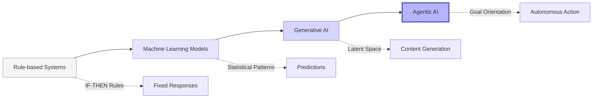
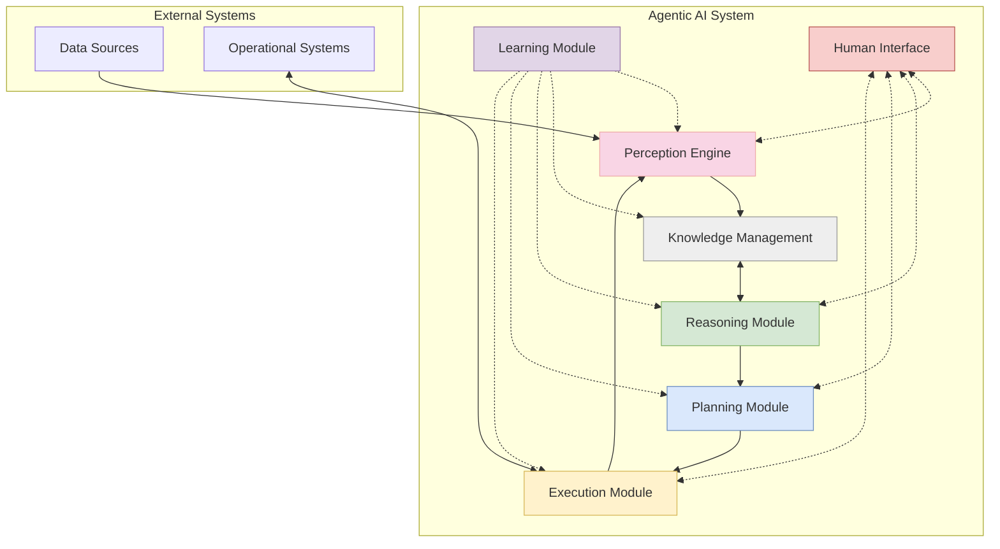
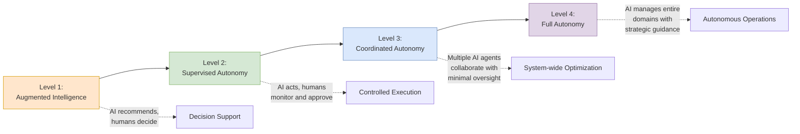

# Chapter 3: Agentic AI Systems: Principles and Applications

## Understanding Agentic AI

Agentic AI represents a fundamental evolution in artificial intelligence, moving beyond traditional systems that merely analyze data or respond to specific queries. At its core, an agentic AI system is characterized by its ability to:

1. **Perceive** its environment through data inputs and sensors
2. **Reason** about complex situations using multiple AI models
3. **Plan** sequences of actions to achieve defined objectives
4. **Act** autonomously to execute those plans
5. **Learn** from experiences to continuously improve performance

Unlike conventional AI applications that operate within narrow, predefined parameters, agentic systems demonstrate a higher degree of autonomy, adaptability, and goal-directed behavior. They can coordinate multiple specialized capabilities—such as natural language processing, computer vision, predictive analytics, and optimization algorithms—to solve complex problems that transcend any single AI domain.

### From Passive to Active Intelligence

The evolution of AI systems can be understood as a progression from passive to increasingly active forms of intelligence:

- **Rule-based Systems**: Early AI used explicitly programmed decision trees and business rules, offering reliability but limited flexibility.
- **Machine Learning Models**: ML systems learn patterns from data but typically address specific, well-defined tasks in isolation.
- **Generative AI**: Systems like large language models can create content and engage in conversations but lack persistent goals or the ability to take actions beyond generating text.
- **Agentic AI**: These systems integrate perception, reasoning, planning, and execution capabilities to actively pursue objectives over time with minimal human supervision.

### Core Capabilities of Agentic AI

Modern agentic AI systems integrate multiple capabilities that together enable autonomous operation:

#### 1. Multi-modal Perception
Agentic systems can process diverse data types—text, numbers, images, audio, video, and structured data—to form comprehensive situational awareness. In the airline context, this might include:
- Flight status data from operational systems
- Customer sentiment from social media and service interactions
- Weather patterns from meteorological services
- Equipment telemetry from aircraft sensors
- Video feeds from airport facilities

#### 2. Contextual Memory and Knowledge
Unlike stateless AI models that process each input independently, agentic systems maintain:
- Long-term memory of past experiences and outcomes
- Domain knowledge about airline operations and constraints
- Contextual understanding of ongoing situations
- Awareness of their own capabilities and limitations

#### 3. Reasoning Across Domains
Agentic systems employ various reasoning mechanisms to make sense of complex situations:
- Causal reasoning to understand potential impacts of actions
- Temporal reasoning to consider time-based constraints
- Spatial reasoning for physical contexts like aircraft loading
- Probabilistic reasoning to handle uncertainty
- Multi-step reasoning for complex problem-solving

#### 4. Goal-Directed Planning
Rather than responding reactively, agentic systems can develop strategies to achieve objectives:
- Break down complex goals into actionable sub-goals
- Evaluate alternative approaches based on predicted outcomes
- Adapt plans when circumstances change
- Balance competing priorities and constraints
- Consider both immediate actions and future consequences

#### 5. Execution and Monitoring
Agentic systems can carry out plans through:
- Direct integration with operational systems
- Delegation to specialized tools or other AI systems
- Collaboration with human operators
- Continuous monitoring of execution progress
- Real-time adjustment based on feedback

#### 6. Learning and Adaptation
Agentic systems improve over time through:
- Learning from successful and unsuccessful outcomes
- Incorporating feedback from human experts
- Adapting to changing operational patterns
- Refining internal models of the environment
- Developing more effective strategies for common scenarios

## Architectural Components of Agentic AI Systems

An agentic AI system for airlines typically consists of several integrated components:

### Perception Engine
The perception engine processes inputs from various data sources:
- Structured data from airline systems (flight schedules, passenger manifests)
- Unstructured data like customer communications
- Real-time streams from operational systems
- External data sources like weather services
- Historical data for context and pattern recognition

### Knowledge Management
The knowledge management component organizes and makes accessible:
- Domain knowledge about airline operations
- Regulatory requirements and constraints
- Historical patterns and precedents
- Current state of all relevant entities (flights, crews, customers)
- Causal relationships between actions and outcomes

### Reasoning Module
The reasoning module evaluates situations and options:
- Applies multiple reasoning approaches (deductive, inductive, abductive)
- Performs simulation and scenario analysis
- Identifies anomalies and potential issues
- Evaluates potential causes of problems
- Assesses possible interventions and their likely impacts

### Planning Module
The planning module develops strategies and action sequences:
- Formulates goals based on business objectives and current needs
- Generates candidate plans to address situations
- Evaluates plans against constraints and objectives
- Prioritizes actions based on urgency and impact
- Creates contingency plans for likely scenarios

### Execution Module
The execution module carries out planned actions:
- Interfaces with operational systems through APIs
- Manages workflows across multiple systems
- Coordinates with human operators when needed
- Monitors execution progress and results
- Triggers replanning when conditions change

### Learning Module
The learning module improves system performance over time:
- Captures outcomes of actions and decisions
- Refines predictive models based on actual results
- Identifies patterns in successful and unsuccessful operations
- Updates knowledge base with new insights
- Optimizes reasoning and planning strategies

### Human Interface
The human interface enables collaboration between AI and human operators:
- Provides explanations for AI recommendations and actions
- Accepts guidance and constraints from human experts
- Enables human override when necessary
- Surfaces key insights and decision points
- Builds trust through transparency and explainability

## Applications of Agentic AI in Airline Operations

Agentic AI can transform multiple domains within airline operations:

### Disruption Management
One of the most promising applications of agentic AI is in managing operational disruptions:

**Current State**: Airlines typically handle disruptions through specialized operations control centers where human controllers make decisions based on experience, standard operating procedures, and limited decision support tools. This approach often results in sub-optimal recovery plans, inconsistent passenger treatment, and significant manual effort.

**Agentic AI Approach**: An agentic disruption management system would:
1. Continuously monitor operations for potential disruptions
2. Proactively identify impact before disruption occurs
3. Generate optimal recovery scenarios considering multiple constraints:
   - Aircraft availability and positioning
   - Crew duty time limitations and qualifications
   - Passenger connections and service priorities
   - Airport curfews and slot restrictions
   - Maintenance requirements
4. Autonomously implement routine recovery actions
5. Collaborate with human controllers on complex decisions
6. Learn from past disruptions to improve future response

**Benefits**:
- Faster recovery from disruptions
- Reduced passenger impact
- Lower operational costs
- More consistent decision-making
- Improved resource utilization
- Enhanced institutional knowledge capture

### Revenue Management
Revenue management represents another high-value application for agentic AI:

**Current State**: Traditional revenue management systems optimize pricing and inventory based on historical patterns, forecasting models, and competitive positioning. While sophisticated, these systems often operate in isolation from other business functions and struggle to incorporate real-time market dynamics.

**Agentic AI Approach**: An agentic revenue management system would:
1. Continuously analyze market conditions across all routes and segments
2. Integrate data from multiple sources:
   - Competitor pricing and capacity
   - Search and booking patterns
   - Economic indicators and events
   - Customer value and segmentation
   - Operational constraints and costs
3. Dynamically adjust pricing and availability strategies
4. Generate personalized offers based on customer context
5. Simulate the impact of different strategies before implementation
6. Coordinate with other systems (marketing, operations) to ensure alignment

**Benefits**:
- Increased revenue through more precise pricing
- Improved load factors and yield management
- Enhanced market responsiveness
- Better alignment between capacity and demand
- More effective personalization
- Holistic optimization across network

### Customer Experience Orchestration
Agentic AI can revolutionize how airlines manage the end-to-end customer experience:

**Current State**: Airlines typically manage customer experience through disconnected systems and teams focused on specific touchpoints (booking, check-in, in-flight service). This fragmentation leads to inconsistent experiences, missed service opportunities, and failure to capture the full customer relationship value.

**Agentic AI Approach**: An agentic customer experience system would:
1. Maintain a comprehensive view of each customer's journey
2. Anticipate needs based on journey context and history
3. Coordinate service delivery across all touchpoints:
   - Digital channels (website, app, email)
   - Airport touchpoints (check-in, lounges, boarding)
   - In-flight service and amenities
   - Post-flight engagement
4. Personalize interactions based on preferences and value
5. Proactively address service issues before they impact the customer
6. Continuously optimize the allocation of service resources

**Benefits**:
- Enhanced customer satisfaction and loyalty
- Increased ancillary revenue through relevant offers
- More efficient service delivery
- Consistent experience across touchpoints
- Improved recovery from service failures
- Better utilization of customer insights

### Crew and Fleet Optimization
Agentic AI can transform how airlines manage their two most critical resources:

**Current State**: Airlines typically plan crew assignments and aircraft rotations weeks or months in advance using specialized optimization systems. While these systems produce legally compliant schedules, they often fail to adapt to changing conditions, resulting in inefficiencies, crew dissatisfaction, and reduced operational resilience.

**Agentic AI Approach**: An agentic crew and fleet system would:
1. Continuously evaluate planned rotations against current conditions
2. Identify opportunities for optimization considering:
   - Crew preferences and quality of life
   - Operational reliability and performance
   - Maintenance requirements and deferrals
   - Network performance and connectivity
3. Implement minor adjustments autonomously
4. Propose major changes for human approval
5. Learn from operational outcomes to improve future planning
6. Balance short-term efficiency with long-term reliability

**Benefits**:
- Improved crew satisfaction and retention
- Enhanced operational reliability
- Reduced fuel consumption and maintenance costs
- Better utilization of aircraft assets
- Increased schedule resilience
- More effective management of irregular operations

### Maintenance Optimization
Agentic AI can revolutionize aircraft maintenance strategies:

**Current State**: Aircraft maintenance typically follows predetermined schedules based on flight hours, cycles, and calendar time. While effective for safety, this approach often results in unnecessary maintenance, suboptimal resource allocation, and missed opportunities for predictive intervention.

**Agentic AI Approach**: An agentic maintenance system would:
1. Monitor aircraft health through sensor data and performance metrics
2. Predict component failures before they occur
3. Optimize maintenance timing based on:
   - Operational schedule and utilization
   - Parts and technician availability
   - Regulatory compliance requirements
   - Impact on network performance
4. Coordinate with flight planning and crew scheduling
5. Continuously improve predictive models based on outcomes
6. Manage technical records and compliance documentation

**Benefits**:
- Reduced maintenance costs
- Improved aircraft availability
- Enhanced safety through predictive maintenance
- Optimized spare parts inventory
- Better technician utilization
- Streamlined compliance management

## Implementation Considerations for Agentic AI

While the potential benefits of agentic AI are substantial, successful implementation requires careful consideration of several factors:

### 1. Data Foundation
Agentic AI systems require access to high-quality, comprehensive data:
- **Data Integration**: Connect disparate sources across the airline
- **Data Quality**: Ensure accuracy, completeness, and timeliness
- **Real-time Capabilities**: Enable processing of streaming data
- **Historical Context**: Provide access to relevant historical patterns
- **External Data**: Incorporate weather, competitive, and market data

### 2. Human-AI Collaboration Model
Defining the right balance between AI autonomy and human oversight is critical:
- **Graduated Autonomy**: Start with human oversight and gradually increase AI autonomy as confidence builds
- **Clear Handoffs**: Define when and how control passes between AI and humans
- **Explainability**: Ensure AI decisions can be understood by human operators
- **Override Mechanisms**: Create clear processes for human intervention
- **Feedback Loops**: Capture operator insights to improve AI performance

### 3. Ethical and Regulatory Compliance
Agentic AI must operate within appropriate ethical and regulatory frameworks:
- **Transparency**: Make AI decision criteria visible to stakeholders
- **Fairness**: Ensure AI doesn't discriminate against passengers or employees
- **Privacy**: Protect sensitive customer and operational data
- **Safety**: Validate that AI actions won't compromise operational safety
- **Compliance**: Ensure alignment with aviation regulations and standards

### 4. Technical Architecture
The technical implementation requires careful consideration:
- **Modularity**: Build components that can evolve independently
- **Scalability**: Ensure the system can handle peak operational demands
- **Resilience**: Design for continued operation during technical failures
- **Integration**: Connect with existing airline systems
- **Security**: Protect against manipulation or unauthorized access

### 5. Change Management
Successful implementation requires effective organizational change:
- **Skills Development**: Train staff to work effectively with AI systems
- **Process Redesign**: Update operational processes to leverage AI capabilities
- **Culture Shift**: Foster a data-driven, experimental culture
- **Governance**: Establish clear ownership and accountability
- **Metrics**: Define success criteria and performance indicators

## The Path to Agentic AI Maturity

The journey to fully realized agentic AI is evolutionary rather than revolutionary. Airlines can approach this journey through progressive levels of capability:

### Level 1: Augmented Intelligence
At this level, AI systems provide recommendations and insights to human operators who make final decisions:
- Predictive analytics for disruption forecasting
- Revenue optimization recommendations
- Customer service prioritization suggestions
- Maintenance planning support

### Level 2: Supervised Autonomy
AI systems take direct action in defined scenarios with human oversight:
- Automated rebooking for minor schedule changes
- Dynamic pricing within approved parameters
- Proactive customer communications
- Routine resource allocation adjustments

### Level 3: Coordinated Autonomy
Multiple AI systems work together to manage complex situations with minimal human intervention:
- Integrated disruption recovery across fleet, crew, and customers
- Network-wide revenue optimization
- End-to-end customer journey management
- Coordinated maintenance and flight planning

### Level 4: Full Autonomy
AI systems manage entire operational domains with humans providing strategic guidance:
- Autonomous daily operations management
- Self-optimizing network planning
- Comprehensive customer relationship orchestration
- Integrated resource management across all functions

## Conclusion

Agentic AI represents a paradigm shift in how airlines can leverage artificial intelligence—moving from isolated, task-specific applications to integrated, autonomous systems that can perceive, reason, plan, and act across the enterprise. By combining multiple AI capabilities within a goal-oriented framework, these systems can address the complexity and dynamics of airline operations in ways that were previously impossible.

The implementation of agentic AI is not merely a technical challenge but a transformational journey that requires rethinking processes, roles, and organizational structures. Airlines that successfully navigate this transformation will gain significant advantages in operational efficiency, customer experience, and competitive agility.

In the next chapter, we'll explore the specific challenges and opportunities of the aviation data landscape, examining how airlines can build the data foundation necessary to support agentic AI initiatives.
