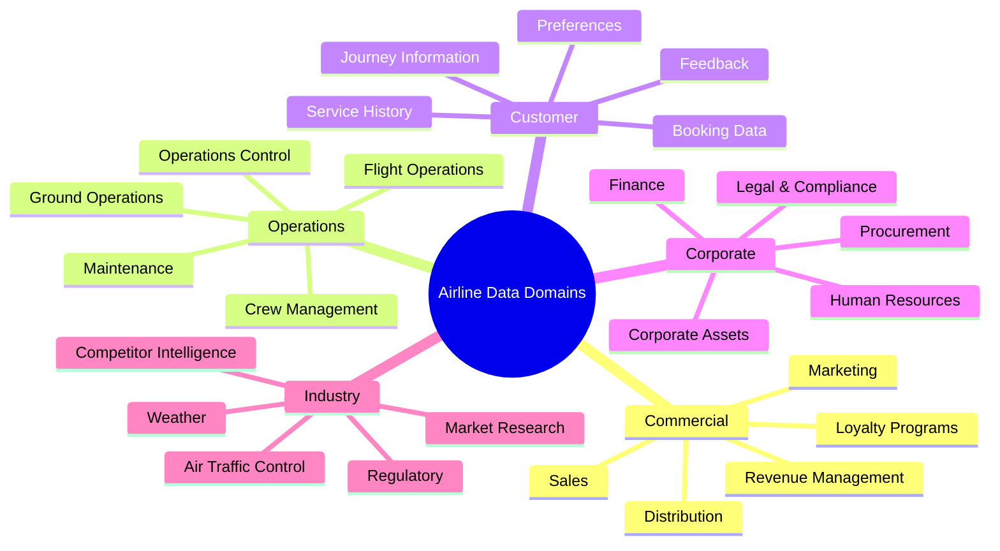
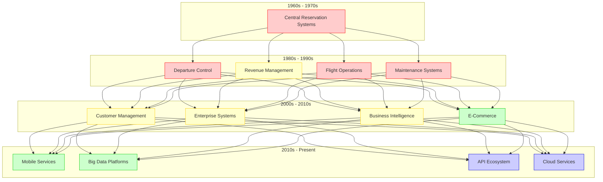
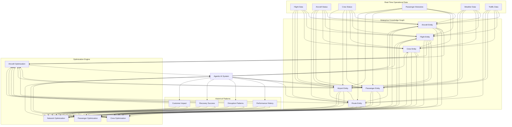

# Chapter 4: Aviation Data Landscape and Challenges

## The Complex Data Ecosystem of Modern Airlines

Airlines operate one of the most data-intensive businesses in the global economy. Every flight generates millions of data points across hundreds of systems, while every passenger interaction creates a digital trail that spans booking, travel, service, and post-journey engagement. Understanding this complex ecosystem is essential for organizations seeking to leverage agentic AI and modern data architecture.

### Data Volume, Velocity, and Variety

The aviation industry exemplifies the classic "three Vs" of big data:

**Volume**: A single international airline can generate petabytes of data annually:
- Flight operational data from thousands of daily flights
- Customer data from millions of passengers
- Equipment telemetry from hundreds of aircraft
- Transactional data from billions of interactions

**Velocity**: Much of this data is time-sensitive and generated in real-time:
- Aircraft position updates every few seconds
- Continuous equipment performance telemetry
- Real-time booking and inventory changes
- Immediate customer service interactions

**Variety**: Aviation data spans numerous formats and structures:
- Structured transactional data in reservation systems
- Semi-structured operational messages in industry formats
- Unstructured text in customer communications
- Image and video data from airports and aircraft
- Time-series data from equipment sensors

### Data Domains in Aviation

The airline data landscape can be organized into several key domains, each with distinct characteristics and requirements:

#### Commercial Domain
The commercial domain encompasses all data related to revenue generation and distribution:
- Pricing and inventory management
- Distribution through direct and indirect channels
- Sales data across markets and segments
- Customer loyalty program information
- Marketing campaigns and performance metrics

#### Operations Domain
The operations domain includes all data related to the physical movement of aircraft and resources:
- Flight plans, routes, and actual trajectories
- Crew schedules, qualifications, and performance
- Ground handling activities and turnaround processes
- Maintenance records and technical logs
- Real-time operational control data

#### Customer Domain
The customer domain focuses on passenger information:
- Passenger name records (PNRs) and booking data
- Customer profiles and preferences
- Journey details and travel history
- Service delivery records and special requests
- Customer feedback and satisfaction metrics

#### Corporate Domain
The corporate domain encompasses enterprise-wide business data:
- Financial transactions and performance metrics
- Employee records and workforce management
- Supply chain and procurement information
- Compliance documentation and certifications
- Corporate asset management data

#### Industry Domain
The industry domain includes external data that impacts airline operations:
- Weather forecasts and actual conditions
- Air traffic control information and restrictions
- Regulatory notices and requirements
- Competitor activities and market conditions
- Industry trends and research findings

## Legacy Systems and Data Silos

The evolution of airline IT systems over decades has created a complex landscape characterized by specialized systems, data silos, and technical debt. Understanding this historical context is crucial for any data transformation initiative.

### The Layered Technology Landscape

Airline systems typically reflect a layered evolution of technology:

#### Legacy Core Systems
The oldest layer consists of mission-critical systems designed in the mainframe era:
- Passenger Service Systems (PSS) handling reservations and inventory
- Departure Control Systems (DCS) managing check-in and boarding
- Flight Operations Systems controlling aircraft movement
- Crew Management Systems handling pilot and cabin crew schedules

These systems were built for reliability and transaction processing rather than data sharing or analytics. Many use proprietary technologies, legacy programming languages, and closed architectures that make data extraction challenging.

#### Specialized Operational Systems
The middle layer consists of specialized systems that address specific operational needs:
- Revenue Management Systems optimizing pricing and inventory
- Maintenance Planning and Control managing aircraft technical status
- Ground Operations Systems coordinating airport activities
- Catering and Logistics managing in-flight service supply chain

These systems often operate as isolated applications with their own databases and data models, communicating with other systems through point-to-point interfaces or manual processes.

#### Modern Digital Systems
The newest layer consists of customer-facing digital systems and modern analytics platforms:
- E-commerce platforms for direct sales
- Mobile applications for customer self-service
- Social media engagement systems
- Customer data platforms and marketing automation
- Analytics and business intelligence platforms

While these systems are built on modern technology stacks, they typically must integrate with older systems to access core operational data, creating complex dependencies.

### Common Data Challenges

This complex landscape creates several data challenges that must be addressed for successful implementation of agentic AI and modern data architecture:

#### Data Fragmentation and Silos
Airline data is typically fragmented across numerous systems, making it difficult to develop a comprehensive view of operations or customers:
- Passenger information split across reservation, departure control, and loyalty systems
- Aircraft status distributed across flight operations, maintenance, and crew systems
- Revenue data divided between sales, accounting, and revenue management systems

#### Data Quality and Consistency
Inconsistent data definitions and quality issues are common:
- Different systems may use different codes or identifiers for the same entity
- Data entry errors and inconsistent processes affect data quality
- Timing differences between systems create reconciliation challenges
- Multiple sources of truth exist for key data elements

#### Limited Real-Time Capabilities
Many legacy systems were designed for batch processing rather than real-time data access:
- Flight operational data may be updated only at specific intervals
- Customer information may not be synchronized across touchpoints
- Inventory and availability may have latency across distribution channels
- Analytics typically work with historical snapshots rather than current state

#### Integration Complexity
The point-to-point integration architecture common in airlines creates challenges:
- Hundreds or thousands of individual interfaces between systems
- Multiple data transformation and translation points
- Brittle dependencies that break with system changes
- High maintenance cost for integration infrastructure

#### Historical Data Limitations
Historical data often lacks the detail needed for advanced analytics:
- Aggregated rather than granular data
- Missing contextual information
- Inconsistent historical record-keeping
- Limited retention of operational detail

## Regulatory and Industry Standards

The aviation industry operates under extensive regulatory frameworks that influence data management practices:

### Data Privacy Regulations
Airlines must comply with increasingly stringent data privacy regulations:
- General Data Protection Regulation (GDPR) in Europe
- California Consumer Privacy Act (CCPA) and similar state laws in the US
- Personal Information Protection Law (PIPL) in China
- Cross-border data transfer restrictions
- Industry-specific requirements like API/PNR data for security

These regulations create requirements for:
- Data minimization and purpose limitation
- Consent management for customer data
- Data subject access rights and portability
- Data retention policies and deletion requirements
- Security and breach notification procedures

### Aviation-Specific Regulations
Beyond privacy, airlines must comply with aviation-specific data requirements:
- Flight data recording and retention for safety investigation
- Maintenance records for airworthiness compliance
- Crew training and qualification documentation
- Security-related passenger data collection and sharing
- Environmental reporting for emissions and noise

### Industry Standards and Protocols
The airline industry has developed numerous standards for data exchange:
- IATA standards for messages (Type B, XML, NDC, ONE Order)
- ARINC standards for aircraft data
- AIDX for airport operational data exchange
- EDIFACT for commercial transactions
- SSR codes for passenger service requests

While these standards facilitate interoperability, they also reflect historical limitations and may not support modern data architecture needs without extension or transformation.

## The Data Foundation for Agentic AI

Building a solid data foundation is essential for enabling agentic AI in airline operations. This foundation must address the challenges outlined above while creating the conditions for AI autonomy, reliability, and performance.

### Key Requirements

The data foundation for agentic AI must meet several requirements:

#### Unified Entity Models
A consistent representation of key entities across the enterprise:
- Aircraft represented consistently across operational and maintenance systems
- Customer identity resolution across touchpoints and systems
- Flight information standardized across planning, operations, and commercial
- Employee data unified across HR, operations, and security

#### Real-Time Integration
The ability to access and process data in real-time:
- Event streaming for operational status changes
- API-based access to transactional systems
- Change data capture from legacy databases
- In-memory processing for time-sensitive analytics

#### Historical Context
Access to historical patterns and outcomes:
- Longitudinal view of customer relationships
- Operational performance trends and patterns
- Historical disruption scenarios and resolutions
- Seasonal and cyclical business patterns

#### External Data Integration
Seamless incorporation of external data sources:
- Weather data with spatial and temporal alignment to operations
- Air traffic constraints and airport conditions
- Competitive pricing and capacity information
- Social media and customer sentiment data

#### Data Quality Management
Proactive monitoring and remediation of data quality:
- Automated validation rules and checks
- Data lineage tracking from source to consumption
- Quality metrics and observability
- Exception handling and remediation workflows

### Transitioning to Modern Data Architecture

Airlines can take several approaches to transition from legacy data environments to modern architecture that supports agentic AI:

#### 1. Data Virtualization Layer
Creating a logical data layer that unifies access to disparate sources:
- Benefits: Minimal disruption to source systems, faster time-to-value
- Challenges: Performance limitations, dependency on source system availability
- Best for: Initial phases of transformation, specific use cases with moderate data volume

#### 2. Enterprise Data Platform
Building a comprehensive data platform that integrates, transforms, and serves data:
- Benefits: Scalability, performance, advanced analytics capabilities
- Challenges: Higher implementation complexity, significant investment
- Best for: Long-term strategic transformation, organization-wide analytics needs

#### 3. Domain-Specific Data Products
Developing focused data products for high-value domains:
- Benefits: Targeted value delivery, clear ownership, faster implementation
- Challenges: Potential for new silos if not well-coordinated
- Best for: Balancing immediate business needs with strategic direction

#### 4. Hybrid Evolution
Combining multiple approaches based on use case priority and technical constraints:
- Benefits: Pragmatic, value-driven progression
- Challenges: Requires strong architectural governance
- Best for: Most airlines with complex existing landscapes and competing priorities

## Case Study: Data Foundation for Disruption Management

To illustrate the principles discussed, let's examine how a modern data foundation enables agentic AI for disruption management—one of the most complex and high-value use cases in airline operations.

### The Disruption Management Challenge

Effective disruption management requires coordinating multiple factors:
- Aircraft positioning and availability
- Crew availability and duty time limitations
- Passenger connections and service priorities
- Airport and airspace constraints
- Maintenance requirements and deferrals
- Commercial impact of cancellations and delays

Traditional approaches typically involve:
- Siloed recovery planning for aircraft, crew, and passengers
- Manual coordination between operational departments
- Limited optimization due to time pressure and system constraints
- Inconsistent customer handling based on available information
- Reactive rather than proactive management

### The Data Foundation for Agentic Disruption Management

An agentic AI system for disruption management requires a comprehensive data foundation:

#### Real-Time Operational Data
The foundation starts with real-time access to operational data:
- Flight status updates with actual timestamps and positions
- Aircraft technical status including maintenance requirements
- Crew positioning, duty times, and qualifications
- Passenger bookings, connections, and status
- Weather forecasts and actual conditions
- Air traffic constraints and airport status

#### Enterprise Knowledge Graph
An enterprise knowledge graph connects entities across domains:
- Aircraft with their capabilities, status, and assignments
- Flights with their scheduled and actual parameters
- Crew with their qualifications, duty times, and assignments
- Passengers with their itineraries and service needs
- Airports with their operational constraints and services
- Routes with their operational characteristics

This knowledge graph enables the agentic AI system to understand the relationships between entities and reason about the impact of changes.

#### Historical Patterns
Historical data provides context and learning opportunities:
- Typical performance on specific routes and time periods
- Common disruption patterns and their causes
- Successful recovery strategies in similar situations
- Customer impact of different recovery approaches

#### Optimization Engine
Specialized optimization components leverage the unified data:
- Aircraft recovery optimization considering maintenance and positioning
- Crew recovery optimization addressing duty limits and qualifications
- Passenger recovery optimization minimizing disruption impact
- Network optimization balancing local and system-wide considerations

### Implementation Approach

Building this data foundation requires a phased approach:

1. **Establish real-time data access**: Implement streaming architecture for operational data.
2. **Develop unified data model**: Create consistent representation of key entities.
3. **Build knowledge graph**: Connect entities and relationships across domains.
4. **Integrate historical data**: Incorporate patterns and learnings from past operations.
5. **Implement optimization components**: Develop specialized components for different aspects of recovery.
6. **Deploy agentic system**: Integrate components into autonomous decision system.

## Conclusion

The aviation data landscape presents both significant challenges and extraordinary opportunities. Airlines operate in an environment of tremendous data complexity, with legacy systems, regulatory requirements, and operational intricacy creating obstacles to data-driven innovation. However, these same characteristics make the industry an ideal candidate for transformation through modern data architecture and agentic AI.

By addressing the fundamental data challenges—fragmentation, quality, real-time access, and integration complexity—airlines can build the foundation necessary for agentic AI systems to deliver transformative value. This foundation must include unified entity models, real-time integration capabilities, historical context, external data integration, and robust data quality management.

The transition from legacy data environments to modern architecture will be a journey rather than a destination. Most airlines will benefit from hybrid approaches that balance immediate business needs with long-term strategic direction, incrementally building capabilities while delivering tangible value at each step.

In the next chapter, we'll explore how data fabric and data mesh approaches can be specifically applied to airline data challenges, providing architectural patterns that enable both business agility and technical scalability.
