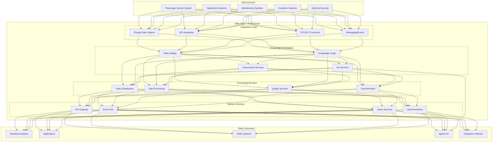

# Chapter 5: Data Fabric and Data Mesh for Airlines

## The Need for New Architectural Paradigms

Traditional approaches to enterprise data architecture have proven insufficient for the scale, complexity, and dynamism of modern airline operations. Centralized data warehouses and monolithic data lakes often become bottlenecks to innovation, struggling with:

- **Scale**: The sheer volume of airline data exceeds what centralized teams can effectively manage
- **Agility**: Business needs evolve faster than centralized data teams can respond
- **Complexity**: Domain-specific knowledge is difficult to centralize effectively
- **Integration**: Point-to-point integrations become unmanageable at enterprise scale
- **Governance**: Balancing control with innovation becomes increasingly difficult

Two architectural paradigms have emerged as particularly promising for addressing these challenges: Data Mesh and Data Fabric. While often discussed as competing approaches, they are best understood as complementary patterns that address different aspects of the modern data challenge—organizational and technical, respectively.

## Data Mesh: Domain-Oriented Data Ownership

Data Mesh, a concept introduced by Zhamak Dehghani, represents a sociotechnical approach to data architecture. It shifts from centralized data ownership to a distributed model where domain teams take responsibility for their data as products.

### Core Principles of Data Mesh

The Data Mesh approach is built on four fundamental principles:

#### 1. Domain-Oriented Ownership
Data ownership and processing are aligned with business domains rather than centralized in a single team. In the airline context, this means:

- The Flight Operations domain owns all data related to aircraft movements
- The Customer Experience domain owns passenger journey data
- The Maintenance domain owns aircraft health and maintenance data
- The Revenue Management domain owns pricing and inventory data

Each domain is responsible for:
- Data quality and integrity
- Data transformations and processing
- Access controls and policies
- Service level agreements

#### 2. Data as a Product
Each domain treats its data as a product designed to serve consumers across the organization:

- Clear documentation and semantic definitions
- Consistent interfaces and access patterns
- Quality guarantees and monitoring
- Versioning and change management
- Performance and availability SLAs

#### 3. Self-Service Data Infrastructure
Domain teams need standardized infrastructure that enables autonomy without reinventing the wheel:

- Reusable templates and patterns
- Automated provisioning and deployment
- Monitoring and observability tools
- Security and compliance guardrails
- Development and test environments

#### 4. Federated Computational Governance
Governance shifts from centralized control to federated standards:

- Shared principles and policies
- Common metadata and discovery mechanisms
- Interoperability standards
- Cross-domain data contracts
- Organizational incentives for sharing

### Data Mesh in the Airline Context

Applying Data Mesh principles to an airline organization might look like this:

```mermaid
graph TB
    subgraph "Flight Operations Domain"
        FO_RAW[Raw Operational Data]
        FO_CLEAN[Cleansed Flight Data]
        FO_AGG[Aggregated Performance]
        FO_PRED[Predictive Models]
    end
    
    subgraph "Customer Domain"
        CX_RAW[Raw Customer Data]
        CX_PROFILE[Unified Customer Profiles]
        CX_JOURNEY[Journey Analytics]
        CX_SEGMENT[Segmentation Models]
    end
    
    subgraph "Revenue Management Domain"
        RM_RAW[Raw Revenue Data]
        RM_FCST[Demand Forecasts]
        RM_PRICE[Price Elasticity Models]
        RM_OPT[Optimization Models]
    end
    
    subgraph "Maintenance Domain"
        MX_RAW[Raw Maintenance Data]
        MX_HEALTH[Aircraft Health Scores]
        MX_PREDICT[Predictive Maintenance]
        MX_PLAN[Maintenance Planning]
    end
    
    subgraph "Self-Service Data Platform"
        DP_STORAGE[Storage Services]
        DP_COMPUTE[Compute Services]
        DP_PIPELINES[Pipeline Services]
        DP_CATALOG[Data Catalog]
        DP_GOVERN[Governance Tools]
    end
    
    FO_RAW & CX_RAW & RM_RAW & MX_RAW -.- DP_STORAGE
    FO_CLEAN & CX_PROFILE & RM_FCST & MX_HEALTH -.- DP_COMPUTE
    FO_AGG & CX_JOURNEY & RM_PRICE & MX_PREDICT -.- DP_PIPELINES
    FO_PRED & CX_SEGMENT & RM_OPT & MX_PLAN -.- DP_CATALOG
    
    DP_GOVERN -.- FO_RAW & CX_RAW & RM_RAW & MX_RAW & FO_CLEAN & CX_PROFILE & RM_FCST & MX_HEALTH & FO_AGG & CX_JOURNEY & RM_PRICE & MX_PREDICT & FO_PRED & CX_SEGMENT & RM_OPT & MX_PLAN
    
    FO_CLEAN --> CX_JOURNEY
    CX_PROFILE --> RM_FCST
    FO_PRED --> MX_PLAN
    RM_OPT --> FO_RAW
```

#### Domain Data Products in Airlines

Each domain creates data products that serve both internal needs and cross-domain consumers:

**Flight Operations Domain Products:**
- Real-time flight status with position and timing
- Historical flight performance by route, aircraft, and time period
- Weather impact analysis and prediction
- Flight efficiency metrics and optimization opportunities

**Customer Domain Products:**
- Unified customer profiles with preferences and history
- Journey analytics across touchpoints
- Customer value and loyalty metrics
- Personalization models and next-best-action recommendations

**Revenue Management Domain Products:**
- Demand forecasts by market and segment
- Pricing elasticity and competitive positioning
- Revenue opportunity analysis
- Inventory optimization recommendations

**Maintenance Domain Products:**
- Aircraft health indicators and alerts
- Component reliability predictions
- Maintenance plan optimization
- Technical delay risk analysis

Each of these products is designed with clear interfaces, documentation, and quality guarantees. They're discoverable through a central catalog but owned and maintained by the domain teams.

### Organizational Implications of Data Mesh

Implementing Data Mesh requires significant organizational changes:

#### Role Evolution
- **Domain Data Product Owners**: Responsible for defining and managing domain data products
- **Domain Data Engineers**: Implement and maintain data processing within domains
- **Data Platform Engineers**: Build and maintain the self-service infrastructure
- **Data Governance Facilitators**: Enable cross-domain standards and practices

#### Team Structures
- **Domain Teams**: Cross-functional teams with both domain and data expertise
- **Platform Team**: Provides self-service data infrastructure capabilities
- **Governance Team**: Facilitates standards and interoperability

#### Cultural Shifts
- From data as a byproduct to data as a strategic product
- From project-based delivery to continuous product evolution
- From centralized control to distributed accountability
- From data silos to collaborative data ecosystems

## Data Fabric: Intelligent Integration Infrastructure

While Data Mesh addresses organizational aspects of data management, Data Fabric focuses on the technical infrastructure needed for seamless data access, integration, and governance across the enterprise.

### Core Capabilities of Data Fabric

A comprehensive Data Fabric implementation provides several key capabilities:

#### 1. Unified Metadata Layer
Data Fabric creates a comprehensive catalog of all data assets:
- Technical metadata (schemas, formats, locations)
- Business metadata (definitions, domains, owners)
- Operational metadata (lineage, quality, usage)
- Relationship metadata (connections between entities)

This metadata layer enables discovery, understanding, and proper use of data across organizational boundaries.

#### 2. Intelligent Data Integration
Data Fabric automates and optimizes data movement:
- Metadata-driven integration patterns
- Smart data virtualization and materialization
- Optimized data pipelines and transformations
- Real-time and batch processing options
- Adaptive integration based on usage patterns

#### 3. Active Knowledge Graph
Data Fabric maintains a dynamic representation of relationships:
- Entity resolution across systems
- Relationship inference and discovery
- Context-aware data navigation
- Semantic enrichment of raw data
- Machine learning-enhanced knowledge capture

#### 4. Automated Governance
Data Fabric implements governance through automation:
- Policy enforcement at access points
- Automated data quality monitoring
- Compliance verification and documentation
- Privacy protection through data controls
- Usage analytics and optimization

#### 5. Hybrid Infrastructure Support
Data Fabric operates across diverse environments:
- Multi-cloud deployment
- On-premise systems integration
- Legacy system connectivity
- Edge computing support
- Third-party data incorporation

### Data Fabric Architecture for Airlines

A Data Fabric implementation for an airline might be structured as follows:

#### Key Components in Airline Data Fabric

**Integration Layer:**
- **Change Data Capture**: Capturing real-time changes from operational systems
- **API Integration**: Service-based access to modern systems
- **ETL/ELT Processes**: Batch data processing and transformation
- **Messaging/Events**: Event-driven architecture for real-time processing

**Knowledge & Metadata:**
- **Data Catalog**: Comprehensive inventory of all data assets
- **Knowledge Graph**: Entity relationships and semantic context
- **ML Services**: Intelligent metadata enrichment and discovery
- **Governance Services**: Policy management and enforcement

**Processing Services:**
- **Data Virtualization**: On-demand access across sources
- **Data Processing**: Transformation and enrichment capabilities
- **Quality Services**: Monitoring and remediation of data quality
- **Transformation**: Converting data between formats and structures

**Delivery Services:**
- **API Gateway**: Secure, managed API access
- **Event Hub**: Real-time event publishing and subscription
- **Query Services**: Ad-hoc and predefined query capabilities
- **Synchronization**: Keeping data consistent across environments

### Use Case: Customer 360 View in Airline Data Fabric

Let's examine how Data Fabric enables a comprehensive customer view:

1. **Challenge**: Customer data is fragmented across multiple systems:
   - Booking data in the PSS
   - Service history in the CRM
   - Web behavior in digital analytics
   - Loyalty status in the loyalty program
   - Communication history in marketing systems

2. **Traditional Approach**: Build a customer data warehouse with batch ETL from each source, resulting in:
   - Stale data that's updated daily or weekly
   - Complex reconciliation processes
   - Difficulty handling real-time updates
   - Limited ability to incorporate new data sources

3. **Data Fabric Approach**:
   - The knowledge graph maintains customer entity relationships across systems
   - Change data capture provides real-time updates from source systems
   - Entity resolution services match customer records across touchpoints
   - Virtualization provides unified views without full replication
   - API services expose consistent customer information to applications
   - Governance ensures appropriate privacy controls and consent management

4. **Outcome**:
   - Real-time, unified customer profiles
   - Consistent customer experience across channels
   - Rapid incorporation of new customer data sources
   - Reduced data duplication and inconsistency
   - Enhanced personalization capabilities

## Combining Data Mesh and Data Fabric for Airlines

Rather than choosing between Data Mesh and Data Fabric, leading airlines are finding value in combining these complementary approaches:

- **Data Mesh** provides the organizational model, clarifying ownership and accountability
- **Data Fabric** provides the technical infrastructure for seamless integration and governance

### Complementary Patterns

Here's how these patterns complement each other:

| Aspect | Data Mesh Contribution | Data Fabric Contribution |
|--------|------------------------|--------------------------|
| Data Ownership | Domain-oriented ownership model | Technical enablement of distributed ownership |
| Integration | Data product interfaces | Metadata-driven integration infrastructure |
| Governance | Federated governance model | Automated governance implementation |
| Metadata | Domain-specific semantic definitions | Enterprise-wide metadata management |
| Data Quality | Domain accountable for quality | Automated quality monitoring and enforcement |
| Self-service | Product-oriented self-service | Technical self-service capabilities |

### Implementation Approach for Airlines

Airlines can implement these patterns through a phased approach:

#### Phase 1: Foundation Building
- Establish the core Data Fabric infrastructure
- Identify initial high-value domains for Data Mesh implementation
- Develop data product templates and standards
- Build the central data catalog and discovery capabilities

#### Phase 2: Domain Enablement
- Implement Data Mesh in priority domains
- Connect domain data products through the Data Fabric
- Develop federated governance practices
- Build self-service capabilities for domain teams

#### Phase 3: Enterprise Scale
- Expand Data Mesh across all domains
- Enhance Data Fabric with AI-driven capabilities
- Implement cross-domain data products
- Measure and optimize data product adoption

### Case Study: Operational Disruption Management

Let's examine how Data Mesh and Data Fabric together enable agentic AI for disruption management:

#### Data Mesh Elements:
- **Flight Operations Domain**: Provides real-time flight status and operational constraints
- **Crew Management Domain**: Provides crew availability and duty limitations
- **Customer Domain**: Provides passenger itineraries and service priorities
- **Maintenance Domain**: Provides aircraft maintenance requirements
- **Airport Operations Domain**: Provides ground handling capabilities and constraints

Each domain provides well-defined data products with clear interfaces, quality guarantees, and documentation.

#### Data Fabric Elements:
- **Knowledge Graph**: Connects flights, aircraft, crew, passengers, and airports
- **Real-time Integration**: Captures operational changes as they occur
- **Semantic Layer**: Provides consistent meaning across domain terminologies
- **Governance Automation**: Ensures appropriate data access and usage
- **API Services**: Enables consistent access patterns across domains

#### Agentic AI Integration:
The agentic AI system for disruption management:
- Discovers relevant data products through the catalog
- Accesses real-time data through consistent APIs
- Understands relationships through the knowledge graph
- Coordinates across domains through event notifications
- Implements solutions through domain-specific interfaces

This combination enables an agentic AI system that can:
1. Detect potential disruptions early
2. Understand the full context across operational areas
3. Evaluate alternative recovery options
4. Implement coordinated recovery actions
5. Learn from outcomes to improve future responses

## Data Quality Management in the Combined Approach

Data quality is particularly critical for agentic AI, which relies on accurate information for autonomous decision-making. The combined Data Mesh and Data Fabric approach addresses data quality through:

### Domain Accountability in Data Mesh
- Each domain is accountable for the quality of its data products
- Quality metrics are part of data product specifications
- Domain teams implement quality controls at source
- Cross-domain data contracts include quality requirements

### Automated Quality Management in Data Fabric
- Continuous monitoring of data quality metrics
- Anomaly detection for quality issues
- Lineage tracking to identify quality problem sources
- Quality dashboards and alerts
- Remediation workflows for quality problems

### Quality Dimensions for Airline Data
Particularly important quality dimensions include:
- **Accuracy**: Correctness of data values
- **Completeness**: Presence of all required data elements
- **Timeliness**: Data freshness relative to real-world events
- **Consistency**: Agreement across related data elements
- **Validity**: Conformance to business rules and constraints

## Metadata Management for Airline Data

Comprehensive metadata management is essential for both Data Mesh and Data Fabric:

### Business Metadata
- Definitions of key business terms
- Domain-specific glossaries
- Business rules and policies
- Ownership and stewardship information
- Business classifications and categories

### Technical Metadata
- Data structures and formats
- System information and locations
- Processing rules and transformations
- Technical dependencies
- Performance characteristics

### Operational Metadata
- Data lineage and provenance
- Quality metrics and measurements
- Usage statistics and patterns
- Access history and audits
- Processing logs and status

### Relationship Metadata
- Entity relationships and hierarchies
- Cross-domain connections
- Semantic mappings
- Dependency graphs
- Context information

## Conclusion

The combination of Data Mesh and Data Fabric represents a powerful approach for airlines seeking to leverage their data assets for agentic AI and other advanced capabilities. By addressing both organizational and technical aspects of data management, this combined approach enables:

- Clear accountability through domain ownership
- Seamless integration through intelligent infrastructure
- Consistent governance through federated standards and automation
- High data quality through accountability and monitoring
- Rapid innovation through self-service capabilities

For airlines navigating the complexity of modern data landscapes, these patterns provide a practical path forward—one that balances central coordination with domain autonomy, technical sophistication with business alignment, and governance requirements with innovation needs.

In the next chapter, we'll explore how these architectural patterns enable specific applications of autonomous AI agents in airline operations, examining use cases that deliver tangible business value.
