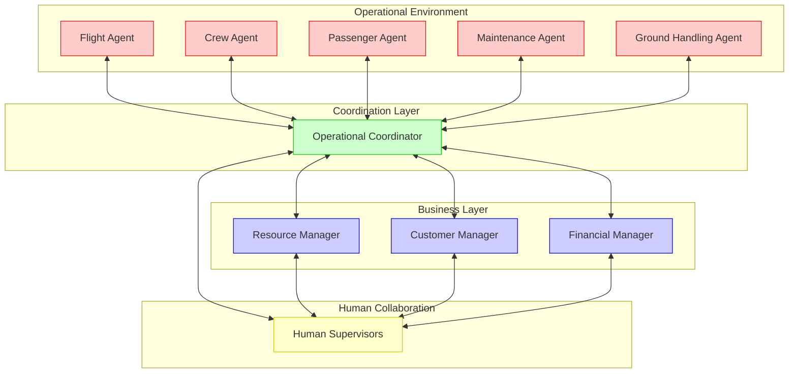
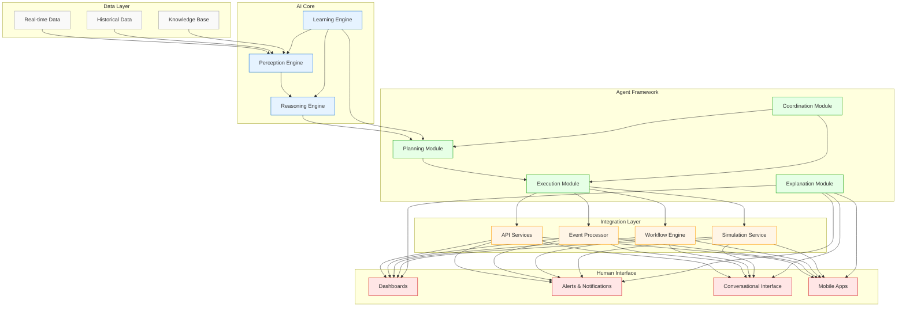

# Chapter 6: Autonomous AI Agents in Airline Operations

## The Evolution of Operational Intelligence

Airline operations represent one of the most complex coordination challenges in modern business. Every day, airlines must synchronize thousands of flights, tens of thousands of employees, millions of passengers, and hundreds of aircraft across a global network influenced by weather, air traffic, maintenance issues, and countless other variables. The traditional approach to managing this complexity has evolved through several stages:

### Manual Coordination (1950s-1970s)
In the early days of commercial aviation, operations were coordinated through manual processes:
- Paper flight plans and weather briefings
- Radio communication for position updates
- Manual crew scheduling and tracking
- Physical boards for operational visualization

### Centralized Operations Control (1980s-1990s)
The advent of computerization enabled more sophisticated coordination:
- Centralized operations control centers (OCCs)
- Basic decision support systems
- Electronic flight planning
- Computer-assisted resource allocation

### Integrated Operations Management (2000s-2010s)
Integration of previously siloed operational systems:
- Hub control centers managing multiple operational aspects
- Cross-functional disruption management
- Enhanced decision support with optimization
- Real-time operational dashboards and alerts

### Intelligent Operations (2010s-2020s)
Introduction of advanced analytics and early AI:
- Predictive maintenance and operational analytics
- Machine learning for disruption prediction
- Enhanced optimization algorithms
- Digital twins for operational simulation

### Autonomous Operations (Emerging)
The next frontier in operational intelligence:
- Autonomous AI agents managing routine operations
- Human-AI collaboration for complex scenarios
- Continuous learning and adaptation
- Network-wide optimization and resilience

## The Autonomous Operations Ecosystem

The transition to autonomous operations involves not a single system but an ecosystem of specialized AI agents working together:

### Operational Agents

Specialized agents focus on specific operational domains:

#### Flight Agent
The Flight Agent monitors and manages all aspects of flight operations:
- Flight planning and route optimization
- Weather impact assessment and rerouting
- Air traffic management coordination
- Fuel optimization and monitoring
- Regulatory compliance validation

#### Crew Agent
The Crew Agent handles all crew-related operations:
- Crew rostering and assignment
- Duty time monitoring and compliance
- Disruption recovery for crew positioning
- Qualification and training tracking
- Crew preferences and quality of life optimization

#### Passenger Agent
The Passenger Agent focuses on customer journey management:
- Connection protection and optimization
- Disruption recovery and rebooking
- Service delivery coordination
- Special needs and assistance management
- Customer value-based prioritization

#### Maintenance Agent
The Maintenance Agent oversees aircraft technical status:
- Maintenance planning and scheduling
- Technical issue monitoring and assessment
- Parts and tooling logistics
- Deferral and MEL (Minimum Equipment List) management
- Maintenance regulatory compliance

#### Ground Handling Agent
The Ground Handling Agent coordinates airport operations:
- Gate and stand allocation
- Turnaround management
- Loading and weight balance optimization
- Ground support equipment coordination
- Airport constraint management

### Coordination Layer

The Operational Coordinator serves as the central orchestration agent:
- Balancing competing priorities across domains
- Managing resource conflicts and allocation
- Coordinating responses to disruptions
- Optimizing network-wide performance
- Facilitating human-AI collaboration

### Business Layer

Business-focused agents align operations with strategic objectives:

#### Resource Manager
The Resource Manager optimizes allocation of key resources:
- Aircraft utilization and positioning
- Crew efficiency and productivity
- Airport facilities and slots
- Capacity allocation across markets

#### Customer Manager
The Customer Manager ensures customer-centric operations:
- Customer experience impact assessment
- Service recovery prioritization
- Customer lifetime value consideration
- Brand promise alignment

#### Financial Manager
The Financial Manager evaluates financial implications:
- Cost impact analysis of operational decisions
- Revenue protection strategies
- Budget alignment and tracking
- Performance metrics monitoring

### Human Collaboration

Human Supervisors maintain oversight and strategic direction:
- Setting operational priorities and policies
- Handling exceptional situations
- Providing domain expertise
- Making judgment calls requiring human values
- Continuous improvement of agent capabilities

## Agent Capabilities and AI Technologies

Autonomous agents in airline operations leverage multiple AI technologies:

### Core Capabilities

#### Perception
Agents must sense and interpret the operational environment:
- Real-time data processing from multiple sources
- Anomaly detection in operational patterns
- Natural language processing for communications
- Computer vision for visual operational data
- Signal processing for equipment telemetry

#### Reasoning
Agents employ multiple reasoning approaches:
- Causal reasoning for understanding operational impacts
- Temporal reasoning for scheduling and sequencing
- Constraint-based reasoning for resource allocation
- Probabilistic reasoning for uncertainty management
- Case-based reasoning for applying past solutions

#### Planning
Agents develop action plans at multiple time horizons:
- Strategic planning for resource positioning
- Tactical planning for immediate operations
- Contingency planning for potential disruptions
- Multi-objective planning balancing competing goals
- Collaborative planning with other agents and humans

#### Execution
Agents implement plans through various mechanisms:
- Direct system integration with operational platforms
- API-based actions and commands
- Workflow orchestration across systems
- Human notification and approval workflows
- Monitoring and adjustment of execution

#### Learning
Agents continuously improve through multiple learning modes:
- Supervised learning from historical outcomes
- Reinforcement learning from operational feedback
- Transfer learning from similar situations
- Imitation learning from human experts
- Collaborative learning across agent ecosystem

### Enabling AI Technologies

Several AI technologies are particularly important for operational agents:

#### Large Language Models (LLMs)
LLMs enable agents to:
- Process and generate natural language communications
- Interface with human operators through conversation
- Extract insights from unstructured operational notes
- Generate explanations for recommendations
- Translate between technical and business contexts

#### Reinforcement Learning
Reinforcement learning enables agents to:
- Learn optimal policies for resource allocation
- Adapt to changing operational conditions
- Balance competing objectives
- Optimize long-term outcomes, not just immediate gains
- Learn from trial and error without explicit programming

#### Graph Neural Networks
Graph neural networks enable agents to:
- Reason about the complex network of operational relationships
- Identify cascading impacts across the network
- Discover non-obvious patterns and dependencies
- Learn structural patterns in operational data
- Optimize network-wide performance

#### Digital Twins
Digital twins enable agents to:
- Simulate operational scenarios before implementation
- Test recovery strategies in a safe environment
- Predict outcomes of potential decisions
- Conduct what-if analysis of operational changes
- Optimize complex multi-variable scenarios

#### Multi-Agent Systems
Multi-agent system technologies enable:
- Coordination between specialized agents
- Negotiation for resource allocation
- Distributed problem solving
- Resilience through agent redundancy
- Scalable handling of complex problems

## Implementation Case Studies

Let's examine how autonomous AI agents transform key operational scenarios:

### Case Study 1: Disruption Management

#### Traditional Approach
The traditional approach to disruption management:
1. Operations controllers detect a disruption (e.g., weather delay)
2. Separate teams work on aircraft, crew, and passenger solutions
3. Manual coordination between teams to align solutions
4. Sequential recovery focusing first on aircraft, then crew, then passengers
5. Limited optimization due to time pressure and complexity
6. Inconsistent customer treatment based on available information

#### Autonomous Agent Approach
With autonomous agents, the process transforms:
1. **Continuous Monitoring**: Flight Agents continuously monitor operations and detect potential disruptions before they occur
2. **Proactive Planning**: Before actual disruption, agents begin contingency planning
3. **Integrated Recovery**: The Operational Coordinator orchestrates integrated recovery across aircraft, crew, and passengers
4. **Optimized Solutions**: Agents evaluate thousands of recovery scenarios to find optimal solutions
5. **Automated Implementation**: Routine recovery actions are implemented automatically
6. **Customer-Centric Recovery**: Passenger Agent ensures customer impact is minimized based on value and needs
7. **Continuous Learning**: Agents learn from each disruption to improve future responses

#### Implementation Example: Weather Disruption
A severe weather front is approaching a major hub:
1. **Weather Detection**: External data feeds alert the Flight Agent of approaching weather
2. **Impact Prediction**: Flight Agent predicts specific flights at risk using historical patterns
3. **Proactive Planning**: Before ATC announces restrictions, agents begin developing recovery options
4. **Resource Optimization**: Crew Agent identifies crew swaps to minimize cascading delays
5. **Customer Protection**: Passenger Agent begins proactive rebooking for high-risk connections
6. **Communication**: Human supervisors receive automated briefing on situation and proposed plan
7. **Execution**: Upon human approval, agents implement recovery plan across all systems
8. **Adaptation**: As weather situation evolves, agents continuously refine the recovery strategy

### Case Study 2: Maintenance Optimization

#### Traditional Approach
Traditional maintenance planning:
1. Scheduled maintenance based on fixed intervals
2. Reactive addressing of unscheduled maintenance
3. Limited optimization of maintenance timing with operations
4. Manual coordination of parts, tooling, and technicians
5. Separate processes for technical records and compliance

#### Autonomous Agent Approach
With autonomous agents:
1. **Predictive Maintenance**: Maintenance Agent analyzes sensor data to predict component failures before they occur
2. **Optimized Scheduling**: Agent identifies optimal maintenance timing that minimizes operational impact
3. **Resource Coordination**: Agent ensures parts, tools, and qualified technicians are available when needed
4. **Operational Integration**: Maintenance Agent coordinates with Flight and Crew Agents to optimize the overall schedule
5. **Compliance Automation**: Agent maintains technical records and ensures regulatory compliance
6. **Continuous Improvement**: Agent learns from maintenance outcomes to refine predictive models

#### Implementation Example: Engine Performance Anomaly
An aircraft engine shows subtle performance changes:
1. **Anomaly Detection**: Maintenance Agent detects performance deviation in engine data
2. **Risk Assessment**: Agent evaluates severity and operational risk
3. **Maintenance Planning**: Agent identifies optimal maintenance opportunity in schedule
4. **Resource Coordination**: Agent confirms parts availability and technician skills
5. **Schedule Integration**: Agent coordinates with Flight Agent for minimum network impact
6. **Documentation**: Agent prepares technical documentation and compliance records
7. **Execution Tracking**: Agent monitors maintenance execution and updates aircraft status
8. **Model Refinement**: Findings feed back into predictive models for future scenarios

### Case Study 3: Network Optimization

#### Traditional Approach
Traditional network management:
1. Schedule planning conducted months in advance
2. Limited day-of-operation adjustments to published schedule
3. Reactive approach to demand fluctuations
4. Separate optimization of aircraft rotations and crew pairings
5. Manual decisions for irregular operations recovery

#### Autonomous Agent Approach
With autonomous agents:
1. **Dynamic Network Management**: Flight Agent continuously evaluates network performance
2. **Proactive Adjustments**: Agent identifies opportunities for schedule tweaks to improve efficiency
3. **Demand Responsive**: Agent integrates real-time demand data to optimize capacity allocation
4. **Integrated Optimization**: Operational Coordinator ensures synchronized optimization of aircraft, crew, and customer flows
5. **Scenario Evaluation**: Agents use digital twins to simulate impact of potential changes
6. **Automated Implementation**: Minor adjustments implemented automatically, major changes proposed for approval

#### Implementation Example: Demand Shift
A major event causes unexpected demand changes in a market:
1. **Demand Detection**: Business layer agents detect unusual booking patterns
2. **Opportunity Assessment**: Resource Manager evaluates potential revenue opportunity
3. **Capacity Optimization**: Flight Agent assesses aircraft gauge changes or frequency adjustments
4. **Feasibility Analysis**: Coordination across Flight, Crew, and Ground Handling Agents
5. **Impact Simulation**: Digital twin evaluates network-wide impact of proposed changes
6. **Implementation Plan**: Orchestrated change plan developed across all operational systems
7. **Execution**: Changes implemented with automated system updates and notifications
8. **Performance Tracking**: Agents monitor outcomes and adjust future responses

## Technical Implementation Considerations

Implementing autonomous AI agents for airline operations requires attention to several technical aspects:

### System Architecture

A robust architecture for autonomous agents includes:

#### Data Layer
- **Real-time Data**: Streaming operational data from all sources
- **Historical Data**: Archive of past operations and outcomes
- **Knowledge Base**: Structured representation of operational knowledge

#### AI Core
- **Perception Engine**: Processing and interpreting data inputs
- **Reasoning Engine**: Analyzing situations and options
- **Learning Engine**: Improving performance over time

#### Agent Framework
- **Planning Module**: Developing action strategies
- **Execution Module**: Implementing decisions
- **Coordination Module**: Synchronizing across agents
- **Explanation Module**: Generating human-understandable rationales

#### Integration Layer
- **API Services**: Interfaces to operational systems
- **Event Processor**: Handling operational events
- **Workflow Engine**: Managing complex processes
- **Simulation Service**: Testing scenarios safely

#### Human Interface
- **Dashboards**: Visualizing operational status
- **Alerts & Notifications**: Communicating critical information
- **Conversational Interface**: Natural language interaction
- **Mobile Apps**: Remote access and approval

### Performance and Scalability

Airline operations require high performance and scalability:
- **Real-time Processing**: Agents must process thousands of events per second
- **Low Latency**: Critical decisions require sub-second response times
- **Horizontal Scaling**: Architecture must scale with operational volume
- **Elasticity**: Capacity should adapt to operational demand
- **Load Distribution**: Workload should balance across resources

### Resilience and Reliability

Operational agents must maintain high availability:
- **Redundancy**: Multiple instances of critical components
- **Failover**: Automatic transition to backup systems
- **Degraded Operation**: Continued function with reduced capabilities
- **Data Consistency**: Maintaining consistent state during failures
- **Recovery Procedures**: Automated restoration of normal operation

### Security and Compliance

Operational agents handle sensitive data and critical functions:
- **Authentication**: Strict identity verification for all components
- **Authorization**: Fine-grained access control to functions
- **Audit Trails**: Comprehensive logging of all agent actions
- **Data Protection**: Encryption and privacy safeguards
- **Compliance Verification**: Automated checking of regulatory requirements

## Human-AI Collaboration Model

The successful implementation of autonomous agents depends on effective collaboration with human operators:

### Collaboration Patterns

Several patterns of human-AI collaboration are relevant:

#### Advisory Mode
AI provides recommendations, humans make decisions:
- **Best For**: High-stakes decisions with significant judgment
- **Example**: Major flight cancellations during severe disruptions
- **Human Role**: Decision maker
- **AI Role**: Advisor and scenario modeler

#### Supervisory Mode
AI makes routine decisions, humans monitor and intervene as needed:
- **Best For**: Frequent decisions with established patterns
- **Example**: Flight re-routing for minor weather deviations
- **Human Role**: Supervisor
- **AI Role**: Primary decision maker

#### Augmentation Mode
AI and humans work together on complex problems:
- **Best For**: Novel situations requiring creativity
- **Example**: Responding to unprecedented disruptions
- **Human Role**: Partner
- **AI Role**: Partner

#### Autonomous Mode
AI handles routine operations independently:
- **Best For**: High-volume, well-defined tasks
- **Example**: Passenger rebooking for minor delays
- **Human Role**: Exception handler
- **AI Role**: Independent operator

### Building Trust in AI Systems

Trust is essential for effective human-AI collaboration:

#### Explainability
AI systems must explain their reasoning:
- Natural language explanations of recommendations
- Visualization of decision factors
- Confidence levels for predictions
- Alternative options considered
- Key constraints and trade-offs

#### Transparency
Humans need visibility into AI operations:
- Clear documentation of AI capabilities and limitations
- Accessible logs of AI actions and decisions
- Understandable metrics for AI performance
- Visibility into data sources and quality
- Disclosure of uncertainty and ambiguity

#### Control Mechanisms
Humans must maintain appropriate control:
- Approval requirements for high-impact decisions
- Override capabilities at multiple levels
- Adjustable autonomy based on context
- Clear escalation paths for issues
- Emergency stop procedures

#### Performance Monitoring
Trust depends on demonstrated reliability:
- Clear performance metrics and targets
- Regular evaluation against human benchmarks
- Continuous monitoring for drift or degradation
- Detection of edge cases and failures
- Feedback mechanisms for improvement

## Organizational Implications

Implementing autonomous AI agents requires significant organizational changes:

### Role Evolution

Traditional operational roles evolve with AI implementation:

#### Operations Controllers
From tactical execution to strategic supervision:
- Setting operational priorities and policies
- Handling exceptional situations
- Training and improving AI systems
- Managing operational performance
- Strategic planning and scenario development

#### Operational Analysts
From reactive analysis to proactive optimization:
- Developing and refining optimization strategies
- Analyzing patterns in operational performance
- Identifying opportunities for AI enhancement
- Designing new operational processes
- Evaluating impact of process changes

#### Technical Specialists
From system operation to AI enablement:
- Maintaining AI infrastructure and integrations
- Troubleshooting complex AI behaviors
- Developing specialized domain knowledge
- Managing data quality and availability
- Implementing new AI capabilities

### New Roles Emerge

New roles are needed to support autonomous operations:

#### AI Operations Engineers
Specialized in maintaining AI operational systems:
- Monitoring AI behavior and performance
- Diagnosing and fixing AI issues
- Managing model updates and deployments
- Optimizing AI resource utilization
- Ensuring AI security and compliance

#### Human-AI Collaboration Specialists
Focused on optimizing the human-AI partnership:
- Designing effective human-AI interfaces
- Developing collaboration workflows
- Training humans to work with AI systems
- Gathering feedback on collaboration effectiveness
- Evolving collaboration models over time

#### Operational Ethics Specialists
Ensuring ethical operation of autonomous systems:
- Developing ethical guidelines for AI operation
- Auditing AI decisions for bias or issues
- Addressing ethical dilemmas in operational contexts
- Ensuring alignment with corporate values
- Managing ethical aspects of AI training data

### Skills Development

Organizations must invest in developing new skills:

#### For Operational Staff
- AI literacy and fundamentals
- Data interpretation and quality assessment
- Strategic thinking and oversight
- Exception management
- AI collaboration techniques

#### For Technical Staff
- Machine learning operations (MLOps)
- AI explainability methods
- Human-centered AI design
- AI safety and reliability
- Domain-specific AI applications

#### For Management
- AI strategy and governance
- Change management for AI transformation
- Performance management in human-AI organizations
- Ethical oversight of autonomous systems
- Risk management for AI operations

## Implementation Roadmap

Airlines should adopt a phased approach to implementing autonomous AI agents:

### Phase 1: Foundation Building (6-12 months)
- Establish the data infrastructure for agent operation
- Develop initial agent prototypes in limited domains
- Build simulation environments for agent testing
- Begin human-AI collaboration design
- Define governance framework for autonomous systems

### Phase 2: Supervised Deployment (12-18 months)
- Deploy agents in advisory mode for key operational areas
- Implement comprehensive monitoring and evaluation
- Develop feedback mechanisms for continuous improvement
- Train operational staff in AI collaboration
- Refine governance processes based on experience

### Phase 3: Expanded Autonomy (18-24 months)
- Transition suitable domains to supervisory mode
- Implement agent coordination mechanisms
- Extend agent capabilities to more complex scenarios
- Develop advanced human-AI interfaces
- Measure and optimize operational benefits

### Phase 4: Network-wide Intelligence (24-36 months)
- Deploy fully integrated agent ecosystem
- Implement autonomous end-to-end processes
- Establish continuous learning mechanisms
- Optimize human-AI division of responsibilities
- Scale benefits across the entire operation

## Key Success Factors

Several factors are critical for successful implementation:

### Executive Sponsorship
Strong leadership support ensures:
- Sufficient resources and investment
- Organizational alignment and focus
- Resolution of cross-functional barriers
- Consistent vision and direction
- Patience for long-term transformation

### Cross-Functional Integration
Breaking down functional silos enables:
- Consistent data across operational domains
- Aligned objectives and metrics
- Coordinated implementation
- Comprehensive process redesign
- Holistic benefit realization

### Change Management
Effective change management addresses:
- Fear and resistance to AI automation
- Skill gaps and training needs
- Process changes and role evolution
- Cultural adaptation to new ways of working
- Measuring and communicating progress

### Incremental Value Delivery
Focusing on incremental value creates:
- Early wins to build momentum
- Funding for continued investment
- Learning opportunities for refinement
- Stakeholder buy-in and support
- Progressive capability building

## Conclusion

Autonomous AI agents represent the next frontier in airline operational excellence. By combining advanced AI technologies with domain-specific operational knowledge, these systems can transform how airlines manage their complex networks. The transition from traditional operations to autonomous systems is not merely a technological change but a fundamental transformation of how airlines function.

The most successful implementations will recognize that autonomous agents are not replacements for human expertise but powerful partners that handle routine complexity while enabling humans to focus on strategic decisions, exceptional situations, and continuous improvement. This human-AI partnership creates operations that are more efficient, resilient, and customer-centric than either humans or AI could achieve independently.

In the next chapter, we'll explore how these autonomous operational agents can be leveraged specifically for customer experience transformation, creating seamless, personalized journeys that differentiate leading airlines in an increasingly competitive marketplace.
