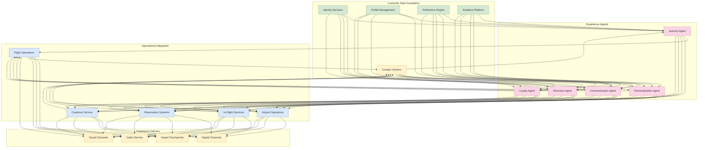

# Chapter 7: Customer Experience Transformation with Agentic AI

## The Evolution of Airline Customer Experience

The airline customer experience has undergone significant transformation throughout aviation history, each era marked by distinct innovations and approaches:

### The Golden Age (1950s-1960s)
In aviation's early commercial era, airlines focused on:
- High-touch personal service
- Luxurious amenities and gourmet dining
- Extensive human staffing at every touchpoint
- Limited technology beyond basic reservations

### Mass Market Era (1970s-1990s)
As air travel became more accessible:
- Standardized service models emerged
- Segmentation into classes of service
- Introduction of loyalty programs
- Computer-based reservations and check-in

### Digital Transformation Era (2000s-2010s)
Technology began reshaping the experience:
- Self-service kiosks and online check-in
- Mobile applications and digital boarding passes
- Personalization based on loyalty status
- Social media engagement and service recovery

### Omnichannel Experience Era (2010s-2020s)
Focus shifted to cross-channel consistency:
- Integrated digital and physical touchpoints
- Data-driven personalization
- Proactive service notifications
- Experience measurement and management

### Intelligent Experience Era (Emerging)
We now enter an era of truly intelligent experiences:
- Predictive and anticipatory service
- Hyper-personalization across journey
- Autonomous service delivery and recovery
- Seamless experiences across ecosystem partners

## The Connected Customer Journey

Modern airline customers experience a complex journey spanning multiple touchpoints, channels, and timeframes:

### Journey Challenges in Traditional Approaches

Despite decades of investment in customer experience, airlines face persistent challenges:

#### Fragmentation
The journey spans multiple systems, departments, and partners:
- Reservations managed by commercial systems
- Airport experience controlled by airport authorities and ground handlers
- In-flight experience delivered by cabin crew with limited customer context
- Post-travel engagement managed by marketing teams
- Service recovery handled by customer relations departments

This fragmentation creates inconsistent experiences, with passengers frequently needing to repeat information or experiencing disconnected service across touchpoints.

#### Limited Personalization
Traditional approaches to personalization suffer from:
- Rigid tier-based treatment based primarily on loyalty status
- Limited use of preference and history data across touchpoints
- Generic service recovery protocols regardless of customer value
- Personalization data trapped in channel-specific silos
- Inability to adapt in real-time to changing circumstances

#### Reactive Service Model
Airlines typically operate in a reactive rather than proactive mode:
- Waiting for customers to report problems rather than anticipating needs
- Addressing disruptions after they impact customers
- Responding to service failures rather than preventing them
- Communicating after decisions are made rather than during deliberation
- Offering standard compensation rather than personalized recovery

#### Resource Constraints
Human resource limitations create service challenges:
- Staffing fluctuations impact service consistency
- High-volume touchpoints limit personalized attention
- Complex situations overwhelm front-line staff capabilities
- Training limitations affect service quality and consistency
- Information overload hinders effective decision-making

## Agentic AI: A New Customer Experience Paradigm

Agentic AI offers a fundamentally different approach to customer experience:

### From Reactive to Proactive Service

Agentic AI transforms service from reactive to proactive:
- **Anticipatory**: Predicting customer needs before they arise
- **Preventative**: Addressing potential issues before they impact customers
- **Context-Aware**: Understanding the full customer journey context
- **Continuous**: Providing seamless service across all touchpoints
- **Learning**: Improving from each interaction and outcome

### From Transactions to Relationships

Agentic AI enables a shift from transactional to relationship-focused service:
- **Longitudinal Memory**: Remembering past interactions and preferences
- **Holistic View**: Seeing the customer across all touchpoints
- **Value-Based**: Differentiating service based on customer lifetime value
- **Evolving Understanding**: Building richer customer profiles over time
- **Emotional Intelligence**: Responding appropriately to customer sentiment

### From Standardized to Personalized

Agentic AI delivers truly personalized experiences:
- **Individual-Level**: Treating each customer as unique
- **Preference-Driven**: Acting on stated and observed preferences
- **Contextual**: Adapting to current journey circumstances
- **Dynamic**: Adjusting in real-time to changing conditions
- **Multi-Dimensional**: Personalizing across all service dimensions

### From Siloed to Integrated

Agentic AI bridges organizational and system silos:
- **Cross-Functional**: Coordinating across airline departments
- **Partner Integration**: Extending to ecosystem partners
- **Channel Consistency**: Ensuring coherent experience across touchpoints
- **Information Sharing**: Making relevant data available when needed
- **Unified Voice**: Communicating consistently throughout the journey

## The Customer Experience Agent Ecosystem

An effective customer experience transformation requires multiple specialized agents working in concert:

### Journey Agent
The Journey Agent orchestrates the end-to-end customer experience:
- Tracking individual customer journeys in real-time
- Identifying journey friction points and opportunities
- Coordinating service delivery across touchpoints
- Predicting journey disruptions and proactively responding
- Optimizing the overall journey experience

### Personalization Agent
The Personalization Agent tailors each interaction to the individual:
- Building comprehensive customer preference profiles
- Predicting likely preferences from behaviors and context
- Delivering personalized recommendations and offers
- Customizing service approaches based on customer characteristics
- Balancing personalization with privacy considerations

### Communication Agent
The Communication Agent manages customer dialogue across channels:
- Delivering contextually relevant information
- Adapting communication style to customer preferences
- Managing timing and channel selection for messages
- Ensuring consistency across all communication touchpoints
- Generating personalized content for each interaction

### Recovery Agent
The Recovery Agent handles service disruptions and failures:
- Detecting service failures in real-time
- Assessing impact on specific customers
- Generating personalized recovery plans
- Coordinating recovery execution across touchpoints
- Learning from recovery outcomes to improve future responses

### Loyalty Agent
The Loyalty Agent optimizes customer lifetime value:
- Analyzing customer engagement and satisfaction
- Identifying retention risks and opportunities
- Personalizing loyalty program engagement
- Recommending targeted loyalty initiatives
- Measuring and optimizing loyalty program ROI

## Implementation Use Cases

Let's explore how agentic AI transforms specific customer experience scenarios:

### Use Case 1: Disruption Experience Management

#### Traditional Approach
During operational disruptions like weather delays:
1. Operations team makes decisions based primarily on operational factors
2. Communication to customers is delayed until decisions are finalized
3. Same standard message sent to all affected customers
4. Service recovery is reactive and standardized
5. Limited coordination between airport, contact centers, and digital channels
6. Customer context and value not considered in recovery prioritization

#### Agentic AI Approach
With agentic AI, the experience transforms:

**Before Disruption**
1. **Journey Agent** identifies potentially affected customers
2. **Personalization Agent** evaluates impact on individual customers
3. **Communication Agent** prepares personalized messaging options
4. **Recovery Agent** develops preliminary recovery strategies
5. **Loyalty Agent** identifies high-value customers requiring special attention

**During Disruption**
1. **Journey Agent** continuously tracks disruption impact on each journey
2. **Communication Agent** proactively informs customers with personalized updates
3. **Recovery Agent** implements automated rebooking for eligible customers
4. **Personalization Agent** customizes alternative options based on preferences
5. **Loyalty Agent** ensures appropriate recognition of customer value

**After Disruption**
1. **Recovery Agent** follows up with affected customers
2. **Communication Agent** delivers personalized apologies and compensation
3. **Loyalty Agent** assesses impact on customer loyalty and recommends remediation
4. **Journey Agent** captures feedback for future improvement
5. **All Agents** learn from the experience to enhance future responses

**Benefits**
- Reduced customer stress through proactive information
- Higher rebooking satisfaction through preference-based solutions
- Improved high-value customer retention
- More efficient recovery resource allocation
- Enhanced operational learning from customer experience data

### Use Case 2: Seamless Connected Journey

#### Traditional Approach
For complex itineraries involving connections:
1. Each flight segment treated as separate experience
2. Limited coordination between arrival and departure operations
3. Customers navigate connections with minimal assistance
4. Service inconsistencies between segments and carriers
5. Recovery handled separately for each segment

#### Agentic AI Approach
With agentic AI, connected journeys become seamless:

**Before Travel**
1. **Journey Agent** analyzes the full itinerary for connection risks
2. **Personalization Agent** identifies special needs or preferences for connections
3. **Communication Agent** provides personalized pre-trip information about connections
4. **Loyalty Agent** ensures consistent status recognition across segments

**During Travel**
1. **Journey Agent** monitors connections in real-time
2. **Personalization Agent** adjusts connection support based on passenger ability and airport familiarity
3. **Recovery Agent** proactively intervenes when connections are at risk
4. **Communication Agent** delivers contextual wayfinding and timing information

**Connection Coordination**
1. **Journey Agent** coordinates between arriving and departing flights
2. **Personalization Agent** arranges personalized assistance where needed
3. **Communication Agent** keeps all parties informed of status
4. **Recovery Agent** implements real-time adjustments when issues arise

**Benefits**
- Reduced connection anxiety through proactive guidance
- Fewer missed connections through coordinated operations
- More personalized assistance for those who need it
- Consistent experience across multiple flight segments
- Higher satisfaction for complex itineraries

### Use Case 3: Personalized In-Flight Experience

#### Traditional Approach
Traditional in-flight personalization:
1. Basic recognition limited to loyalty tier
2. Crew has minimal insight into customer preferences or history
3. Service delivery follows standardized procedures
4. Limited ability to tailor content or offers to individuals
5. One-size-fits-all approach to in-flight service recovery

#### Agentic AI Approach
With agentic AI, the in-flight experience becomes truly personal:

**Pre-Flight Preparation**
1. **Personalization Agent** prepares individual passenger profiles for crew
2. **Journey Agent** identifies special circumstances affecting specific passengers
3. **Loyalty Agent** highlights high-value customers and preferences
4. **Communication Agent** briefs crew on sensitive customer situations

**During Flight**
1. **Personalization Agent** recommends individualized service approaches
2. **Communication Agent** suggests personalized conversation points for crew
3. **Recovery Agent** identifies early signs of service dissatisfaction
4. **Journey Agent** updates ground teams about in-flight developments

**Entertainment and Dining**
1. **Personalization Agent** customizes content and dining recommendations
2. **Journey Agent** adjusts recommendations based on destination context
3. **Communication Agent** personalizes the way offers are presented
4. **Loyalty Agent** ensures appropriate recognition throughout service

**Benefits**
- More meaningful crew-passenger interactions
- Higher satisfaction through preference-based service
- Increased ancillary revenue from relevant offers
- Improved recovery from in-flight service issues
- Enhanced crew efficiency through priority guidance

## Technical Architecture for Customer Experience Agents

Implementing agentic AI for customer experience requires a robust technical architecture:

```mermaid
flowchart TD
    subgraph "Customer Data Platform"
        CDP1[Identity Resolution]
        CDP2[Profile Management]
        CDP3[Preference Engine]
        CDP4[Interaction History]
        CDP5[Segment Management]
    end
    
    subgraph "Experience Intelligence"
        EI1[Journey Analytics]
        EI2[Next Best Action]
        EI3[Personalization Engine]
        EI4[Testing Framework]
        EI5[Outcome Measurement]
    end
    
    subgraph "Agentic AI Layer"
        AA1[Agent Orchestration]
        AA2[Decision Engine]
        AA3[Communication Engine]
        AA4[Recovery Engine]
        AA5[Learning Framework]
    end
    
    subgraph "Delivery Layer"
        DL1[Digital Experience API]
        DL2[Staff Experience API]
        DL3[Partner Integration API]
        DL4[Content Management]
        DL5[Notification Services]
    end
    
    subgraph "Experience Channels"
        CH1[Website & Mobile]
        CH2[Airport Systems]
        CH3[Contact Center]
        CH4[Inflight Systems]
        CH5[Partner Touchpoints]
    end
    
    CDP1 & CDP2 & CDP3 & CDP4 & CDP5 --> EI1 & EI2 & EI3 & EI4 & EI5
    EI1 & EI2 & EI3 & EI4 & EI5 --> AA1 & AA2 & AA3 & AA4 & AA5
    AA1 & AA2 & AA3 & AA4 & AA5 --> DL1 & DL2 & DL3 & DL4 & DL5
    DL1 & DL2 & DL3 & DL4 & DL5 --> CH1 & CH2 & CH3 & CH4 & CH5
    
    classDef cdp fill:#f9f9f9,stroke:#666666
    classDef ei fill:#d5e8d4,stroke:#82b366
    classDef aa fill:#dae8fc,stroke:#6c8ebf
    classDef dl fill:#fff2cc,stroke:#d6b656
    classDef ch fill:#f8cecc,stroke:#b85450
    
    class CDP1,CDP2,CDP3,CDP4,CDP5 cdp
    class EI1,EI2,EI3,EI4,EI5 ei
    class AA1,AA2,AA3,AA4,AA5 aa
    class DL1,DL2,DL3,DL4,DL5 dl
    class CH1,CH2,CH3,CH4,CH5 ch
```

### Customer Data Platform
The foundation for experience agents:
- **Identity Resolution**: Connecting customer identities across systems
- **Profile Management**: Maintaining comprehensive customer profiles
- **Preference Engine**: Capturing explicit and implicit preferences
- **Interaction History**: Recording all customer touchpoints
- **Segment Management**: Grouping customers by characteristics

### Experience Intelligence
The analytical brain that turns data into insight:
- **Journey Analytics**: Understanding patterns across customer journeys
- **Next Best Action**: Determining optimal actions for each customer
- **Personalization Engine**: Matching experiences to customer needs
- **Testing Framework**: Continuously optimizing experience elements
- **Outcome Measurement**: Assessing impact of experience interventions

### Agentic AI Layer
The autonomous system that drives experiences:
- **Agent Orchestration**: Coordinating specialized agents
- **Decision Engine**: Making complex experience decisions
- **Communication Engine**: Generating personalized communications
- **Recovery Engine**: Creating tailored service recovery plans
- **Learning Framework**: Improving from outcomes and feedback

### Delivery Layer
The interface between intelligence and execution:
- **Digital Experience API**: Powering personalized digital interfaces
- **Staff Experience API**: Enabling staff to deliver personalized service
- **Partner Integration API**: Extending experience to ecosystem partners
- **Content Management**: Organizing and delivering personalized content
- **Notification Services**: Managing communications across channels

### Experience Channels
The touchpoints where experiences are delivered:
- **Website & Mobile**: Digital self-service channels
- **Airport Systems**: Kiosks, signage, and staff devices
- **Contact Center**: Voice and chat support channels
- **Inflight Systems**: Seatback and crew devices
- **Partner Touchpoints**: Hotels, ground transportation, airports

## Data Requirements for Experience Agents

Customer experience agents require rich, diverse data to function effectively:

### Customer Profile Data
- Demographic information
- Contact preferences and permissions
- Special needs and accessibility requirements
- Language preferences
- Travel companions and relationships

### Journey Context
- Current itinerary details
- Historical travel patterns
- Connection information
- Special circumstances (business/leisure, occasion)
- Travel purpose and flexibility

### Preference Data
- Explicitly stated preferences
- Inferred preferences from behavior
- Cabin and seat preferences
- Dining and service preferences
- Entertainment preferences

### Operational Context
- Flight status and disruptions
- Airport conditions
- Aircraft type and configuration
- Crew information
- Service availability

### Interaction History
- Previous service issues and resolution
- Communication history across channels
- Purchase history and ancillary selection
- Feedback and survey responses
- Service recovery history

### Value and Loyalty
- Loyalty program status and metrics
- Customer lifetime value
- Share of wallet estimates
- Future travel potential
- Influence and advocacy metrics

## Implementation Challenges

Several challenges must be addressed for successful implementation:

### Data Privacy and Ethics
Experience agents must operate within strict ethical boundaries:
- Transparent customer data usage policies
- Clear opt-in/opt-out mechanisms
- Appropriate data minimization practices
- Ethical personalization guidelines
- Avoidance of manipulative practices

### Cross-Channel Consistency
Delivering consistent experiences requires:
- Unified customer view across channels
- Synchronized agent actions across touchpoints
- Common decisioning frameworks
- Consistent voice and tone
- Shared context between digital and human channels

### Human-Agent Collaboration
Staff and agents must work seamlessly together:
- Clear role delineation between humans and agents
- Intuitive agent interfaces for staff
- Appropriate level of agent autonomy by context
- Seamless handoffs between agents and humans
- Staff training on agent capabilities and limitations

### Experience Measurement
New measurement approaches are needed:
- Real-time experience monitoring
- Multi-touchpoint journey metrics
- Personalization effectiveness measurement
- Agent performance evaluation
- Financial impact assessment

## Organizational Transformation

Implementing agentic AI for customer experience requires organizational change:

### New Roles and Capabilities
Organizations must develop new roles:
- **Experience Architects**: Designing agent-enabled experiences
- **AI Trainers**: Teaching agents about brand voice and values
- **Experience Data Scientists**: Developing and improving agent models
- **Agent Performance Managers**: Monitoring and optimizing agent behavior
- **Customer Experience Ethicists**: Ensuring responsible agent operation

### Process Redesign
Existing processes must evolve:
- From channel-centric to journey-centric processes
- From standardized to adaptive service protocols
- From reactive to proactive service models
- From script-based to principle-based staff guidance
- From periodic to continuous experience improvement

### Governance Model
New governance frameworks are needed:
- Experience design principles and guidelines
- Agent behavior standards and boundaries
- Cross-functional experience governance
- Experience metrics and objectives
- Continuous learning and adaptation mechanisms

## Implementation Roadmap

Organizations can follow a phased approach to implementation:

### Phase 1: Foundation Building (0-6 months)
- Establish unified customer data platform
- Develop journey analytics capabilities
- Create basic personalization capabilities
- Design agent architecture and frameworks
- Establish experience governance structure

### Phase 2: Initial Agent Deployment (6-12 months)
- Deploy communication agent for digital channels
- Implement basic journey monitoring capabilities
- Develop initial personalization models
- Build staff interfaces for agent insights
- Establish experience measurement framework

### Phase 3: Enhanced Capabilities (12-18 months)
- Deploy recovery agent for disruption management
- Enhance personalization with predictive capabilities
- Expand agent touchpoints to include staff channels
- Implement journey orchestration capabilities
- Develop cross-channel coordination

### Phase 4: Full Ecosystem Deployment (18-24 months)
- Deploy comprehensive agent ecosystem
- Implement partner integration capabilities
- Develop advanced learning frameworks
- Enable autonomous experience orchestration
- Integrate with operational systems for closed-loop optimization

## Measuring Success

The impact of agentic AI on customer experience should be measured across multiple dimensions:

### Customer Metrics
- Net Promoter Score and satisfaction measures
- Customer effort scores across journey
- Emotional engagement metrics
- Loyalty behavior and retention
- Customer lifetime value growth

### Operational Metrics
- Service recovery costs and effectiveness
- Staff productivity and efficiency
- Resource allocation optimization
- Channel shift and digital adoption
- Process automation rates

### Financial Metrics
- Ancillary revenue per passenger
- Customer acquisition cost reduction
- Customer retention improvement
- Premium service adoption
- Share of wallet expansion

### Competitive Differentiation
- Experience-based market share gains
- Premium pricing capability
- Positive social media sentiment
- Industry recognition and awards
- Brand perception improvements

## Conclusion

Agentic AI represents a paradigm shift in airline customer experience—moving from fragmented, reactive, and standardized service to integrated, proactive, and personalized experiences. By deploying specialized, autonomous agents that work in concert across the customer journey, airlines can overcome the limitations of traditional approaches and deliver experiences that build lasting emotional connections with customers.

The transformation requires not just technological implementation but a reimagining of how the airline organizes around customer experience. New roles, processes, and governance models are needed to support the agentic approach, along with a commitment to ethical, transparent use of customer data.

Airlines that successfully implement experience agents will see benefits beyond improved customer satisfaction—including operational efficiency, increased revenue, and powerful competitive differentiation in an industry where the core product is increasingly commoditized.

In the next chapter, we'll explore the implementation strategy and roadmap for building agentic AI systems in airline operations, providing a comprehensive guide for organizations embarking on this transformational journey.
