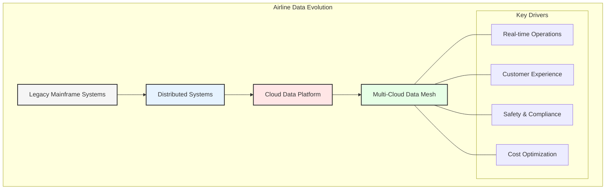
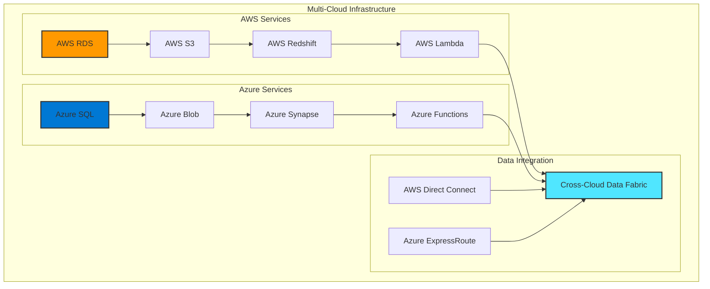
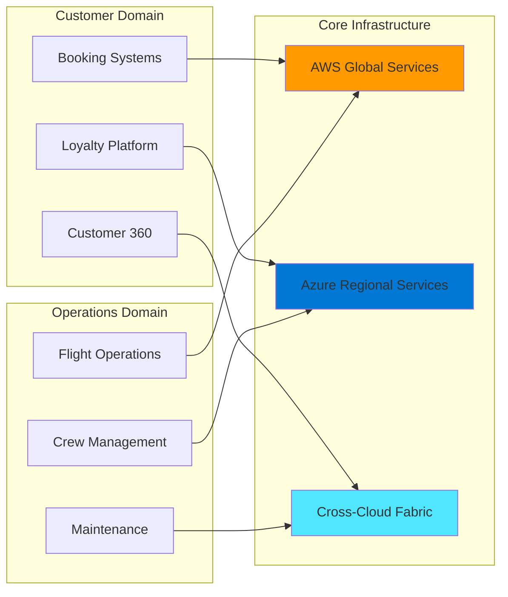

# Chapter 1: The Evolution of Enterprise Data Architecture

## Business Overview
The modern enterprise operates across multiple business lines, each with unique data requirements and operational challenges. In today's rapidly evolving digital landscape, organizations must handle unprecedented volumes of data while maintaining agility and efficiency. This chapter explores how enterprise data architecture has evolved to meet these challenges and sets the foundation for understanding modern architectural approaches.

### Core Business Operations
- **Passenger Operations**: Encompasses the entire passenger journey, from booking to arrival, including:
  - Reservation systems integration ensures that passengers can book flights seamlessly across multiple channels, including online platforms, mobile apps, and travel agencies. This integration also supports real-time updates on seat availability and pricing.
  - Check-in and boarding processes are streamlined through digital kiosks, mobile check-ins, and automated boarding gates, reducing wait times and enhancing the passenger experience.
  - Real-time flight status updates provide passengers with accurate information about delays, gate changes, and cancellations, improving communication and reducing frustration.
  - Baggage tracking and management systems use RFID and IoT technologies to ensure that luggage is accurately tracked from check-in to arrival, minimizing lost baggage incidents.
  - Passenger service systems (PSS) integrate various operational aspects, such as ticketing, loyalty programs, and customer support, to deliver a cohesive travel experience.

- **Cargo Services**: Managing end-to-end cargo operations through:
  - Capacity planning and optimization tools help airlines maximize cargo space utilization while adhering to weight and balance regulations.
  - Shipment tracking and monitoring systems provide real-time visibility into cargo location and condition, ensuring timely deliveries and reducing losses.
  - Revenue optimization strategies leverage dynamic pricing models to maximize profitability based on demand and market conditions.
  - Customs and compliance management systems automate documentation and ensure adherence to international trade regulations, reducing delays and penalties.
  - Integration with global cargo networks enables seamless coordination with logistics partners, expanding reach and improving service levels.

- **Maintenance, Repair, and Overhaul (MRO)**: Ensuring aircraft reliability through:
  - Predictive maintenance scheduling uses data analytics and machine learning to identify potential issues before they occur, reducing downtime and costs.
  - Parts inventory management systems ensure that critical components are available when needed, minimizing delays in maintenance activities.
  - Technical documentation control provides maintenance teams with up-to-date manuals and guidelines, ensuring compliance and safety.
  - Compliance tracking systems monitor adherence to regulatory requirements, avoiding fines and operational disruptions.
  - Service life monitoring tracks the usage and wear of aircraft components, enabling timely replacements and extending asset life.

- **Ground Handling Services**: Coordinating airport operations including:
  - Aircraft turnaround management systems optimize the sequence of activities required to prepare an aircraft for its next flight, reducing delays.
  - Resource allocation tools ensure that ground staff and equipment are efficiently deployed, improving operational efficiency.
  - Equipment maintenance systems track the condition of ground support equipment, ensuring reliability and safety.
  - Service level monitoring provides real-time insights into performance metrics, enabling proactive issue resolution.
  - Third-party service coordination ensures seamless collaboration with external vendors, such as catering and cleaning services.

- **Ancillary Services**: Maximizing additional revenue streams through:
  - In-flight retail management systems enable airlines to offer personalized shopping experiences, increasing passenger satisfaction and revenue.
  - Partner program integration allows airlines to collaborate with hotels, car rental companies, and other travel services, enhancing the overall travel experience.
  - Loyalty program administration systems track and reward customer loyalty, fostering long-term relationships and repeat business.
  - Premium service delivery focuses on providing high-value offerings, such as priority boarding and lounge access, to enhance the travel experience for premium customers.
  - Customer preference management systems use data analytics to tailor services and offers to individual passenger preferences, improving satisfaction and engagement.

### Supporting Business Functions
- **Revenue Management**: Optimizing financial performance through:
  - Dynamic pricing strategies adjust ticket prices in real-time based on demand, competition, and other market factors, maximizing revenue.
  - Demand forecasting models use historical data and predictive analytics to anticipate future trends, enabling better planning and resource allocation.
  - Competitive analysis tools monitor market conditions and competitor actions, informing strategic decisions.
  - Yield optimization techniques balance load factors and pricing to achieve the highest possible revenue per available seat mile (RASM).
  - Market segment analysis identifies and targets specific customer groups, tailoring offerings to meet their needs and preferences.

- **Customer Experience**: Enhancing service delivery via:
  - Personalization engines use AI to deliver tailored recommendations and services, such as seat upgrades and meal preferences, enhancing the passenger experience.
  - Customer feedback analysis tools aggregate and analyze reviews and surveys, providing actionable insights to improve services.
  - Service recovery management systems enable airlines to address issues promptly, turning negative experiences into positive outcomes.
  - Multi-channel engagement platforms ensure consistent communication across email, social media, chat, and phone, improving accessibility and responsiveness.
  - Journey mapping and optimization tools visualize the end-to-end customer journey, identifying pain points and opportunities for improvement.

- **Safety and Compliance**: Maintaining operational excellence through:
  - Real-time safety monitoring systems track critical parameters, such as engine performance and weather conditions, ensuring safe operations.
  - Regulatory compliance tracking tools automate the documentation and reporting required to meet industry standards and government regulations.
  - Risk assessment and mitigation frameworks identify potential hazards and implement measures to reduce their impact.
  - Incident management systems streamline the reporting and resolution of safety incidents, minimizing disruptions.
  - Training and certification tracking ensures that staff meet the necessary qualifications and are up-to-date on the latest safety protocols.

- **Supply Chain Management**: Streamlining operations through:
  - Vendor relationship management systems facilitate collaboration with suppliers, ensuring timely delivery of goods and services.
  - Inventory optimization tools balance stock levels to meet demand while minimizing carrying costs.
  - Procurement automation systems streamline the purchasing process, reducing administrative overhead and errors.
  - Cost analysis and control tools provide insights into spending patterns, identifying opportunities for savings.
  - Performance monitoring dashboards track supplier performance, ensuring quality and reliability.

- **Human Resources**: Supporting workforce management via:
  - Crew scheduling optimization tools ensure that flight and ground staff are assigned efficiently, adhering to regulations and minimizing fatigue.
  - Training management systems track employee development and ensure compliance with industry standards.
  - Performance tracking tools provide insights into individual and team productivity, enabling targeted improvements.
  - Compliance monitoring systems ensure adherence to labor laws and contractual obligations.
  - Employee engagement analysis tools measure satisfaction and identify areas for improvement, fostering a positive work environment.

## Enterprise Data Architecture's Role in Business Success
Enterprise data architecture serves as the foundation that enables and empowers these business lines through:

1. **Operational Integration**
   - Real-time data synchronization across business units, enabling immediate response to operational changes. For example, integrating flight schedules with crew availability ensures that staffing adjustments can be made promptly.
   - Unified view of operations for decision-making, incorporating data from multiple sources. This allows managers to identify bottlenecks and optimize processes.
   - Seamless information flow between departments, reducing silos and improving collaboration. For instance, sharing maintenance data with operations teams ensures that aircraft are ready for service on time.
   - Automated data quality checks and validation ensure that decisions are based on accurate and reliable information.
   - Cross-functional process optimization leverages data insights to streamline workflows, such as coordinating ground handling and boarding processes.

2. **Business Intelligence & Analytics**
   - Cross-functional data analytics providing comprehensive business insights. For example, analyzing passenger data alongside operational metrics can reveal trends that inform marketing strategies.
   - Predictive modeling for business optimization using machine learning. Airlines can forecast demand and adjust capacity to maximize revenue.
   - Performance monitoring and KPI tracking across all business units. Dashboards provide real-time visibility into key metrics, enabling proactive management.
   - Real-time dashboards and reporting capabilities ensure that stakeholders have access to up-to-date information for decision-making.
   - Advanced analytics for strategic decision making, such as identifying new market opportunities or optimizing route networks.

3. **Digital Transformation Support**
   - API-first architecture enabling digital services and partner integration. This allows airlines to offer seamless booking experiences through third-party platforms.
   - Scalable platforms supporting new business initiatives and growth. For instance, launching a new loyalty program can be achieved without overhauling existing systems.
   - Innovation enablement through data accessibility and sharing. Open data platforms encourage collaboration and the development of new applications.
   - Cloud-native capabilities for flexibility and scalability. Airlines can quickly adapt to changing demands by scaling resources up or down.
   - Microservices architecture for agile development. This approach enables faster deployment of new features and services.

### Integrated Operations Center (IOC) Example
The IOC serves as a prime example of how enterprise data architecture enables real-time decision making by:

1. **Centralized Control**
   - Real-time monitoring of all operations ensures that potential issues are identified and addressed promptly. For example, tracking flight delays allows for proactive rebooking of affected passengers.
   - Immediate incident response capability minimizes disruptions and ensures passenger safety.
   - Integrated communication channels facilitate coordination between teams, such as operations, maintenance, and customer service.
   - Resource optimization tools ensure that assets, such as aircraft and crew, are utilized efficiently.
   - Performance tracking dashboards provide insights into key metrics, enabling continuous improvement.

2. **Data Integration**
   - Real-time data feeds from multiple systems provide a comprehensive view of operations. For instance, integrating weather data with flight schedules helps optimize routing decisions.
   - Predictive analytics for proactive management identify potential issues before they escalate. For example, analyzing engine performance data can predict maintenance needs.
   - Historical data analysis for pattern recognition helps identify trends and inform long-term planning.
   - External data source integration, such as air traffic control updates, ensures that decisions are based on the latest information.
   - Automated alerting systems notify stakeholders of critical events, enabling swift action.

3. **Decision Support**
   - AI-powered recommendation systems provide actionable insights, such as suggesting alternative routes to avoid delays.
   - Scenario planning capabilities allow airlines to evaluate the impact of different decisions, such as adding new routes or adjusting pricing strategies.
   - Risk assessment tools identify potential hazards and recommend mitigation strategies.
   - Resource allocation optimization ensures that assets are deployed where they are needed most, maximizing efficiency.
   - Performance forecasting tools predict future trends, enabling proactive planning.

## Historical Context and Evolution in the Airline Industry

The journey of enterprise data architecture has been marked by continuous evolution, particularly in the airline industry where data complexity, real-time requirements, and global operations demand sophisticated solutions. This chapter explores this transformation through the lens of GlobalAir, a major international airline operating across 150+ destinations.

## Modern Airline Data Challenges

### 1. Operational Complexity
- Real-time flight tracking
- Crew management
- Maintenance scheduling
- Ground operations
- Weather integration

### 2. Customer Experience Demands
- Personalized booking experience
- Real-time updates
- Loyalty program integration
- Multi-channel engagement
- Baggage tracking

### 3. Regulatory Requirements
- Safety compliance
- Data privacy (GDPR, CCPA)
- Cross-border regulations
- Financial reporting
- Security standards

## Multi-Cloud Architecture Overview

## Technology Stack Evolution

### 1. Legacy Systems (Pre-2000s)
- Mainframe-based reservation systems
- Monolithic applications
- Proprietary databases
- Limited integration capabilities

### 2. Distributed Era (2000s-2010s)
- Service-oriented architecture
- Multiple data centers
- Enterprise service bus
- Regional data stores

### 3. Cloud Adoption (2010s-2020s)
- AWS and Azure adoption
- Hybrid cloud solutions
- Containerized applications
- Global data replication

### 4. Data Mesh Era (2020s-Present)
- Domain-oriented architecture
- Multi-cloud orchestration
- Real-time data products
- AI/ML integration

## Current Technology Architecture

## Key Business Drivers

### 1. Operational Excellence
- Real-time decision making
- Predictive maintenance
- Route optimization
- Resource allocation
- Cost management

### 2. Customer Experience
- Seamless booking
- Personalized services
- Digital transformation
- Self-service capabilities
- Connected journey

### 3. Revenue Optimization
- Dynamic pricing
- Ancillary services
- Network planning
- Partner integration
- Market analysis

## Cloud Provider Selection Strategy

### AWS Primary Use Cases
- Global route management
- Reservation systems
- Analytics platform
- Customer data platform
- Machine learning

### Azure Primary Use Cases
- Regional operations
- Crew management
- Maintenance systems
- Enterprise integration
- Business intelligence

## Looking Ahead

As we progress through this book, we'll explore how GlobalAir's transformation from traditional architecture to a modern data mesh enables:

1. Improved operational efficiency
2. Enhanced customer experience
3. Better regulatory compliance
4. Increased innovation speed
5. Optimized cost structure

The subsequent chapters will dive deeper into each architectural paradigm, their implementation considerations, and their impact on airline operations.

## Key Takeaways

1. Airline industry demands sophisticated data architecture
2. Multi-cloud strategy provides global scale and resilience
3. Data mesh enables domain-oriented solutions
4. Technology evolution supports business transformation
5. Real-time capabilities are crucial for success