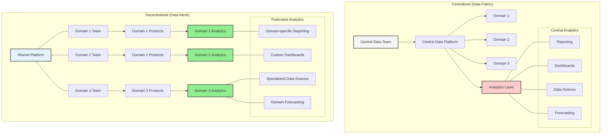
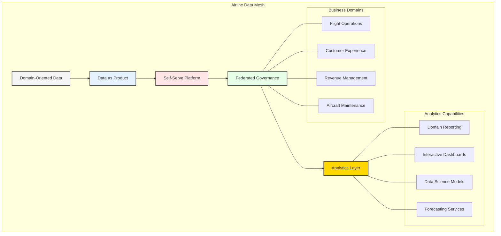
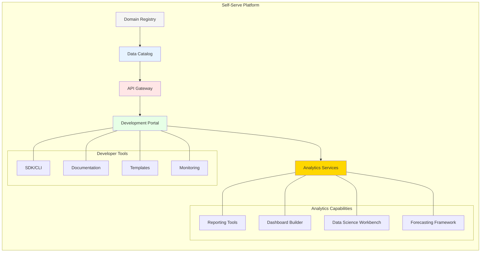
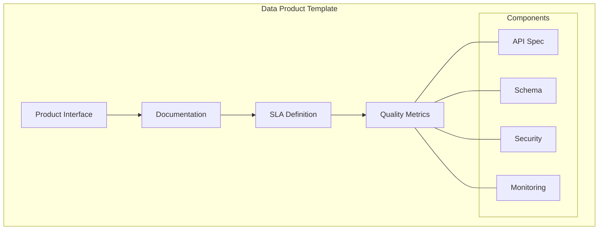
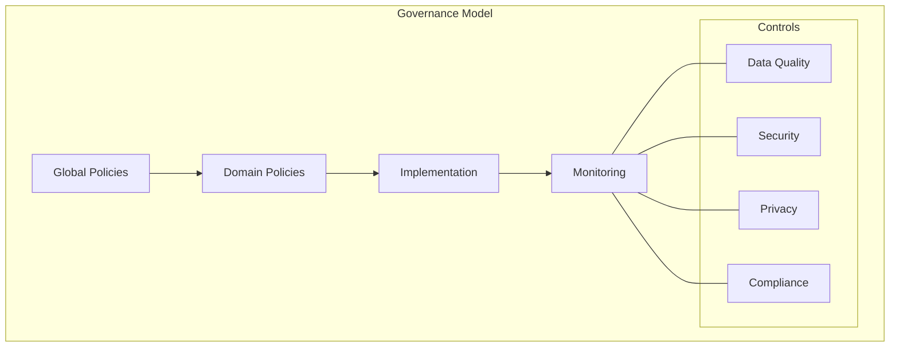
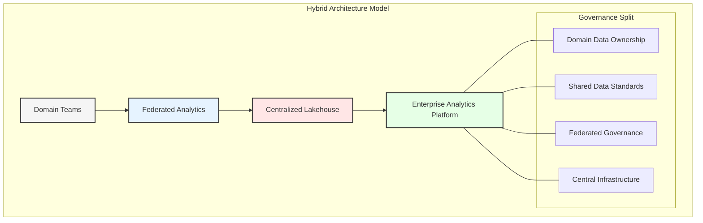
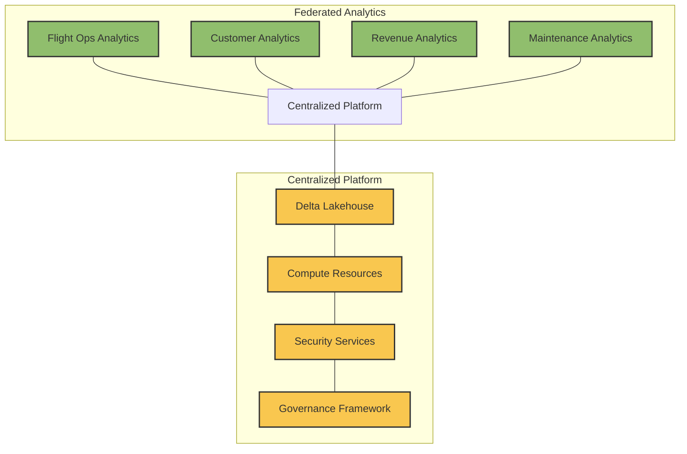
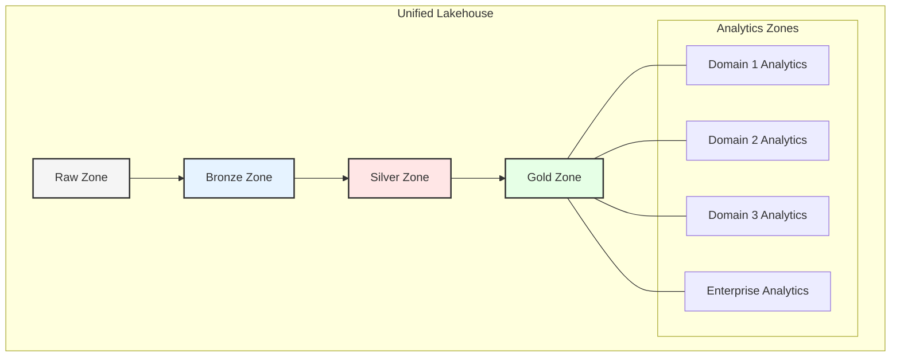

# Chapter 3: Data Mesh Architecture

## Understanding Data Mesh
Data Mesh is a paradigm shift in how enterprises manage and approach data. Unlike traditional centralized architectures, it adopts a domain-oriented, distributed approach to data ownership and architecture.


# Chapter 3: Data Mesh - A Modern Paradigm for Airlines

## The Decentralized Data Architecture

Data Mesh represents a fundamental paradigm shift from traditional centralized data architectures toward a **decentralized, domain-oriented** approach. While Data Fabric focuses on connecting distributed data through centralized governance, Data Mesh emphasizes distributed ownership and autonomy.

### Core Principles of Decentralization in Data Mesh

- **Domain Ownership**: Business domains take full responsibility for their data products, including design, implementation, quality, and maintenance, rather than relying on a central team.

- **Distributed Decision-Making**: Authority over data architecture decisions is pushed to domain teams who have the most context about their specific business needs.

- **Autonomous Implementation**: Each domain has the freedom to choose technologies and implementation details that best serve their specific use cases, as long as they adhere to shared principles.

- **Local Governance with Global Oversight**: Domains establish their own governance processes while adhering to organization-wide principles and standards.

- **Federated Computational Governance**: Instead of centralized governance enforcement, governance becomes a distributed responsibility with automated, code-based policies.



## Data Mesh in Aviation Context

GlobalAir's transformation to Data Mesh architecture represents a fundamental shift in how airline data is managed, owned, and utilized. This chapter explores how Data Mesh principles are implemented across various airline domains while leveraging multi-cloud capabilities.



## Domain-Oriented Architecture

### 1. Flight Operations Domain
- **Data Products:**
  - Real-time flight status provides up-to-the-minute updates on aircraft locations, delays, and operational changes, enabling better coordination and passenger communication.
  - Crew assignments ensure that the right personnel are allocated to flights, adhering to regulatory requirements and optimizing resource utilization.
  - Route optimization leverages data analytics to identify the most efficient flight paths, reducing fuel consumption and operational costs.
  - Weather integration incorporates real-time meteorological data into flight planning, enhancing safety and minimizing disruptions.
  - Ground operations data products streamline airport activities, such as gate assignments and baggage handling, improving turnaround times.

- **Technology Stack:**
  ```mermaid
  graph TB
      subgraph "Flight Ops Domain"
          A[Event Sources] --> B[AWS Kinesis]
          B --> C[Lambda Processing]
          C --> D[DynamoDB]
          D --> E[API Gateway]
          
          %% Add Analytics Layer
          E --> I[Analytics Layer]
          
          subgraph "Data Products"
              F[Flight Tracker]
              G[Crew Portal]
              H[Weather Service]
          end
          
          subgraph "Analytics Capabilities"
              J[Operational Reporting]
              K[Real-time Dashboards]
              L[Predictive Models]
              M[Operational Forecasts]
          end
          
          E --- F
          E --- G
          E --- H
          
          I --- J
          I --- K
          I --- L
          I --- M
      end
      
      style A fill:#f5f5f5
      style B fill:#ff9900
      style C fill:#ff9900
      style D fill:#ff9900
      style E fill:#ff9900
      style I fill:#90ee90
  ```

  - Event sources like IoT sensors and operational systems feed real-time data into AWS Kinesis for processing.
  - Lambda functions execute business logic, such as detecting delays or rerouting flights, in response to events.
  - DynamoDB stores structured data, such as crew schedules and flight manifests, for quick retrieval.
  - API Gateway provides secure access to data products, enabling integration with other systems and applications.

### 2. Customer Experience Domain
- **Data Products:**
  - Booking platform integrates with multiple channels, offering seamless reservation experiences and real-time availability updates.
  - Loyalty management tracks customer rewards and provides personalized offers, fostering long-term relationships.
  - Personalization engine uses AI to recommend services, such as seat upgrades or in-flight purchases, based on customer preferences.
  - Customer 360 aggregates data from various touchpoints, providing a comprehensive view of each passenger's journey.
  - Journey tracking monitors the end-to-end travel experience, identifying pain points and opportunities for improvement.

- **Technology Stack:**
  ```mermaid
  graph TB
      subgraph "Customer Domain"
          A[Customer Events] --> B[Event Hubs]
          B --> C[Azure Functions]
          C --> D[Cosmos DB]
          D --> E[API Management]
          
          %% Add Analytics Layer
          E --> I[Analytics Layer]
          
          subgraph "Data Products"
              F[Booking Engine]
              G[Loyalty Platform]
              H[Customer Profile]
          end
          
          subgraph "Analytics Capabilities"
              J[Customer Reporting]
              K[Experience Dashboards]
              L[Segmentation Models]
              M[Behavior Forecasting]
          end
          
          E --- F
          E --- G
          E --- H
          
          I --- J
          I --- K
          I --- L
          I --- M
      end
      
      style A fill:#f5f5f5
      style B fill:#0078d4
      style C fill:#0078d4
      style D fill:#0078d4
      style E fill:#0078d4
      style I fill:#90ee90
  ```

  - Customer events, such as bookings and feedback, are ingested through Azure Event Hubs for processing.
  - Azure Functions handle event-driven workflows, such as sending confirmation emails or updating loyalty points.
  - Cosmos DB stores customer profiles and transaction histories, enabling fast and scalable access.
  - API Management ensures secure and consistent access to customer data products, supporting integration with third-party services.

### 3. Revenue Management Domain
- **Data Products:**
  - Dynamic pricing adjusts ticket prices in real-time based on demand, competition, and other market factors, maximizing revenue.
  - Inventory management ensures optimal seat allocation across flights, balancing load factors and profitability.
  - Revenue forecasting uses historical data and predictive analytics to anticipate future trends, guiding strategic decisions.
  - Competitive analysis monitors market conditions and competitor actions, informing pricing and marketing strategies.
  - Ancillary services data products track and optimize additional revenue streams, such as baggage fees and in-flight sales.

### 4. Aircraft Maintenance Domain
- **Data Products:**
  - Maintenance scheduling ensures that aircraft are serviced on time, minimizing downtime and ensuring safety compliance.
  - Parts inventory tracks the availability of critical components, reducing delays caused by shortages.
  - Predictive maintenance uses sensor data and machine learning to identify potential issues before they occur, reducing costs and disruptions.
  - Compliance reporting automates the generation of documentation required for regulatory audits, saving time and effort.
  - Technical documentation provides maintenance teams with up-to-date manuals and guidelines, ensuring accuracy and safety.

## Self-Serve Data Platform

### 1. Technical Infrastructure


- **Domain Registry:** Centralizes metadata about data products, making it easier for teams to discover and use them.
- **Data Catalog:** Provides a searchable interface for finding datasets, understanding their structure, and assessing their quality.
- **API Gateway:** Facilitates secure and scalable access to data products, enabling integration with external systems.
- **Development Portal:** Offers tools and resources for developers, such as SDKs, documentation, and templates, accelerating data product creation.

### 2. Development Experience
- **Domain Templates:** Predefined configurations and best practices simplify the creation of new data products, ensuring consistency and quality.
- **CI/CD Pipelines:** Automate the deployment and testing of data products, reducing time-to-market and minimizing errors.
- **Testing Frameworks:** Provide tools for validating data quality, performance, and compliance, ensuring reliability.
- **Documentation Tools:** Generate and maintain up-to-date documentation, improving usability and governance.
- **Monitoring Solutions:** Track the performance and usage of data products, identifying opportunities for optimization.

### 3. Cloud Services Integration
- **AWS Services:**
  - API Gateway provides secure access to data products.
  - CloudFormation automates infrastructure provisioning, ensuring consistency.
  - CodePipeline streamlines the deployment of data products.
  - CloudWatch monitors system performance and logs, supporting troubleshooting.
  - Service Catalog centralizes reusable components, accelerating development.

- **Azure Services:**
  - API Management ensures secure and consistent access to data products.
  - ARM Templates automate resource provisioning, reducing manual effort.
  - DevOps tools support collaboration and continuous delivery.
  - Monitor tracks system health and performance, enabling proactive management.
  - Service Catalog provides reusable templates and components, improving efficiency.

## Data Product Standards

### 1. Product Structure


- **Product Interface:** Defines how users interact with the data product, including APIs, schemas, and documentation.
- **Documentation:** Provides detailed information about the data product, such as its purpose, structure, and usage guidelines.
- **SLA Definition:** Specifies performance and availability guarantees, ensuring reliability.
- **Quality Metrics:** Tracks key indicators, such as data accuracy, freshness, and completeness, guiding improvement efforts.

### 2. Quality Requirements
- **Data Freshness:** Ensures that data is up-to-date, supporting timely decision-making.
- **Accuracy Metrics:** Measure the correctness of data, identifying and addressing errors.
- **Availability SLA:** Guarantees that data products are accessible when needed, minimizing disruptions.
- **Performance KPIs:** Track response times and throughput, ensuring efficiency.
- **Security Compliance:** Ensures adherence to regulations and best practices, protecting sensitive information.

### 3. Implementation Standards
- **API Design:** Follows best practices for consistency, usability, and security.
- **Schema Definition:** Standardizes data structures, improving interoperability.
- **Security Controls:** Protect data from unauthorized access and breaches.
- **Monitoring Setup:** Tracks performance and usage, identifying issues and opportunities for optimization.
- **Documentation Requirements:** Ensures that data products are well-documented, improving usability and governance.

## Federated Governance Model

### 1. Global Standards
- **Data Classification:** Categorizes data based on sensitivity and usage, guiding access and protection.
- **Security Policies:** Define protocols for protecting data, ensuring compliance and trust.
- **Privacy Requirements:** Ensure adherence to regulations, such as GDPR and CCPA, safeguarding customer trust.
- **Compliance Rules:** Mandate adherence to industry standards, avoiding penalties and reputational damage.
- **Quality Standards:** Establish benchmarks for data accuracy, completeness, and reliability, guiding improvement efforts.

### 2. Domain Autonomy
- **Implementation Freedom:** Allows teams to choose the tools and technologies that best meet their needs.
- **Technology Choice:** Supports innovation by enabling the use of diverse platforms and frameworks.
- **Release Management:** Empowers teams to deploy updates independently, reducing bottlenecks.
- **Resource Allocation:** Ensures that teams have the resources they need to succeed.
- **Team Organization:** Encourages cross-functional collaboration, improving efficiency and outcomes.

### 3. Compliance Framework


- **Global Policies:** Provide overarching guidelines for data management, ensuring consistency and compliance.
- **Domain Policies:** Tailor global standards to the specific needs of each domain, balancing control and flexibility.
- **Implementation:** Ensures that policies are applied consistently across domains, maintaining integrity.
- **Monitoring:** Tracks adherence to policies, identifying and addressing issues proactively.

## Cross-Domain Integration

### 1. Event-Driven Architecture
- **Flight Events:** Capture real-time updates on flight status, enabling proactive management.
- **Booking Events:** Track reservations and changes, ensuring accurate and timely updates.
- **Maintenance Alerts:** Notify teams of potential issues, supporting proactive maintenance.
- **Weather Updates:** Provide real-time meteorological data, enhancing safety and efficiency.
- **System Notifications:** Alert stakeholders to critical events, enabling swift action.

### 2. API Management
- **API Gateway:** Provides secure and scalable access to data products.
- **Rate Limiting:** Prevents overuse of resources, ensuring reliability.
- **Authentication:** Verifies user identities, protecting sensitive data.
- **Authorization:** Controls access to data products, ensuring compliance.
- **Monitoring:** Tracks API usage and performance, identifying opportunities for optimization.

### 3. Data Sharing
- **Data Contracts:** Define the terms of data exchange, ensuring clarity and trust.
- **Schema Registry:** Standardizes data structures, improving interoperability.
- **Change Management:** Tracks and communicates updates, minimizing disruptions.
- **Version Control:** Manages changes to data products, ensuring consistency.
- **Access Control:** Protects data from unauthorized use, ensuring compliance.

## Implementation Strategy

### 1. Domain Migration
- **Domain Identification:** Identifies the scope and boundaries of each domain, guiding implementation.
- **Team Formation:** Assembles cross-functional teams with the skills needed to succeed.
- **Product Definition:** Defines the purpose, structure, and requirements of each data product.
- **Implementation:** Develops and deploys data products, ensuring quality and reliability.
- **Validation:** Tests data products to ensure they meet requirements and perform as expected.

### 2. Platform Development
- **Infrastructure Setup:** Establishes the technical foundation for the data platform, ensuring scalability and reliability.
- **Tool Selection:** Chooses the tools and technologies that best meet organizational needs.
- **Template Creation:** Develops reusable templates for data products, accelerating development.
- **Pipeline Setup:** Automates the deployment and testing of data products, reducing time-to-market.
- **Documentation:** Provides detailed information about the platform and its components, improving usability and governance.

### 3. Governance Evolution
- **Policy Development:** Establishes guidelines for data management, ensuring consistency and compliance.
- **Standard Creation:** Defines benchmarks for data quality, performance, and security, guiding improvement efforts.
- **Monitoring Setup:** Tracks adherence to policies and standards, identifying and addressing issues proactively.
- **Audit Process:** Ensures accountability and transparency, building trust.
- **Feedback Loop:** Incorporates stakeholder input into governance processes, driving continuous improvement.

## Key Success Metrics

### 1. Technical Metrics
- **API Response Times:** Measure the speed of data retrieval, ensuring efficiency.
- **Data Freshness:** Tracks how up-to-date information is, supporting timely decision-making.
- **System Availability:** Measures uptime, ensuring reliability.
- **Error Rates:** Track system issues, guiding troubleshooting efforts.
- **Resource Utilization:** Evaluates the efficiency of resource usage, identifying opportunities for optimization.

### 2. Business Metrics
- **Time to Market:** Measures the speed of data product development and deployment, supporting agility.
- **Development Velocity:** Tracks the pace of innovation, identifying opportunities for improvement.
- **Data Usage:** Evaluates how effectively data products are being leveraged, guiding optimization efforts.
- **Cost Efficiency:** Measures savings achieved through optimization and efficiency.
- **Customer Satisfaction:** Tracks the impact of data products on the user experience, guiding enhancements.

## Challenges and Solutions

### 1. Technical Challenges
- **Multi-Cloud Complexity:** Addressed through standardized tools and processes, ensuring consistency.
- **Data Consistency:** Ensured through robust validation and synchronization mechanisms.
- **Performance Optimization:** Achieved through monitoring and tuning, maximizing efficiency.
- **Tool Integration:** Simplified through APIs and middleware, reducing complexity.
- **Security Implementation:** Strengthened through encryption, access controls, and monitoring, protecting sensitive data.

### 2. Organizational Challenges
- **Culture Change:** Fostered through training and communication, building support for new approaches.
- **Skill Development:** Addressed through targeted training programs, ensuring staff have the necessary expertise.
- **Team Restructuring:** Guided by clear roles and responsibilities, improving collaboration and efficiency.
- **Process Adaptation:** Aligned with new technologies and workflows, maximizing benefits.
- **Knowledge Sharing:** Encouraged through documentation and collaboration tools, building institutional knowledge.

## Key Takeaways

1. Domain orientation enables business agility.
2. Self-serve platform accelerates development.
3. Standardization ensures quality.
4. Federated governance balances control.
5. Cross-domain integration drives value.

## Hybrid Architecture: Federated Analytics with Centralized Data Platform

While pure Data Mesh and Data Fabric architectures represent opposite ends of the spectrum, many airlines implement hybrid approaches that combine the business-oriented governance of Data Mesh with the technical advantages of centralized platforms. This section explores how GlobalAir implemented federated analytics within a centralized lakehouse architecture.



### 1. Federated Analytics with Central Infrastructure

#### Structural Framework
- **Domain Autonomy with Shared Platform**: Business domains maintain ownership of their data products while leveraging a common technical platform
- **Clear Responsibility Boundaries**: Infrastructure and platform services managed centrally, while data product development and quality remain domain responsibilities
- **Unified Technical Standards**: Common data formats, API specifications, and interoperability requirements enforced across domains
- **Decentralized Analytics Capabilities**: Domain-specific analytical tools and applications built on top of the shared foundation

#### Implementation Architecture


- **Centralized Platform Components**:
  - **Delta Lakehouse**: Single storage layer providing ACID transactions, schema enforcement, and time travel capabilities across the organization
  - **Shared Compute Resources**: Dynamically scalable processing capabilities allocated to domains based on workload demands
  - **Unified Security Services**: Centrally managed authentication, authorization, and data protection controls
  - **Common Governance Framework**: Organization-wide policies, compliance standards, and metadata management

- **Federated Analytics Layer**:
  - **Domain-Specific Analytics**: Custom analytical applications tailored to each business domain's unique needs
  - **Self-Service Tools**: Specialized visualization and exploration tools selected by each domain
  - **Domain Data Products**: APIs, datasets, and models created and maintained by domain teams
  - **Cross-Domain Collaboration**: Standardized interfaces for sharing insights between domains

### 2. Technical Implementation

#### Lakehouse Architecture


- **Multi-Layer Data Organization**:
  - **Raw Zone**: Landing area for all data before processing, centrally managed
  - **Bronze Zone**: Standardized, validated data with unified schema enforcement
  - **Silver Zone**: Quality-checked, transformed data ready for consumption
  - **Gold Zone**: Business-ready datasets optimized for analytics and reporting

- **Technology Stack Integration**:
  - **Storage Layer**: Delta Lake or Apache Iceberg providing ACID transactions and schema evolution
  - **Processing Framework**: Spark clusters for batch processing and Flink for streaming workloads
  - **SQL Interfaces**: Trino/Presto providing consistent SQL access across data sources
  - **Orchestration Layer**: Airflow or Dagster managing complex analytical pipelines
  
- **Self-Service Capabilities**:
  - **SQL Workbenches**: Domain analysts access data through familiar SQL interfaces
  - **Notebook Environments**: Data scientists leverage Python/R environments for advanced analytics
  - **Visualization Platforms**: Business users interact with domain-specific dashboards and reports
  - **API Layer**: Applications consume data products through standardized interfaces

#### Centralized Platform Benefits
- **Cost Efficiencies**: Shared infrastructure reduces duplication and optimizes resource utilization
- **Performance Optimization**: Centrally managed query optimization and caching
- **Reduced Data Movement**: Co-located processing eliminates extensive ETL requirements
- **Simplified Compliance**: Unified auditing, lineage tracking, and access controls
- **Enterprise-Wide Consistency**: Common formats, definitions, and quality standards

### 3. Federated Governance Model

#### Responsibility Matrix

| Aspect | Domain Teams | Central Platform Team |
|--------|-------------|----------------------|
| Data Ownership | ✓ | |
| Quality Standards | ✓ | |
| Business Definitions | ✓ | |
| Data Products | ✓ | |
| Security Controls | Implement | Define |
| Technical Standards | Adhere | Define |
| Platform Services | Consume | Provide |
| Infrastructure | | ✓ |
| Enterprise Policies | Implement | Define |

#### Federated Decision Making
- **Domain Councils**: Cross-functional teams within each domain that make data-related decisions
- **Architecture Review Board**: Cross-domain group that ensures technical alignment and compatibility
- **Data Product Guild**: Community of practice sharing implementation patterns and best practices
- **Executive Data Governance**: Senior leadership providing strategic direction and resource allocation

#### Collaborative Processes
- **Standards Development**: Domains contribute to central technical standards based on real-world requirements
- **Platform Roadmap**: Features prioritized based on domain needs and business impact
- **Shared Knowledge Base**: Documentation and training resources contributed by both central and domain teams
- **Center of Excellence**: Experts from domains and central teams collaborating on complex challenges

### 4. GlobalAir Case Study: Hybrid Implementation Journey

#### Starting Point
- **Legacy Situation**: Siloed data warehouses and departmental analytical applications
- **Business Challenges**: Slow time-to-insight, inconsistent metrics across departments, and high maintenance costs
- **Technical Constraints**: Inflexible infrastructure, limited scalability, and high operational overhead
- **Organizational Issues**: Conflicting priorities between central IT and business units

#### Transition Strategy
1. **Foundation Building**:
   - Implement core lakehouse infrastructure with Delta Lake on cloud storage
   - Establish unified security model and governance framework
   - Develop initial data quality standards and monitoring tools
   - Create self-service documentation and onboarding resources

2. **Domain Enablement**:
   - Identify pilot domains with clear business value
   - Form domain data teams with mixed IT and business skills
   - Define initial data products and ownership boundaries
   - Establish domain-specific quality metrics and success criteria

3. **Scaling Operations**:
   - Develop automated CI/CD pipelines for data products
   - Implement cross-domain data sharing protocols
   - Establish federated governance model with clear responsibilities
   - Create continuous improvement feedback loops

#### Implementation Outcomes
- **Accelerated Analytics Development**: 64% reduction in time to deploy new analytical applications
- **Improved Data Quality**: 78% decrease in data quality incidents through domain ownership
- **Enhanced Collaboration**: 3x increase in cross-domain data product usage
- **Cost Optimization**: 42% reduction in total cost of ownership compared to previous architecture
- **Business Agility**: 5x faster introduction of new data-driven capabilities

#### Key Success Factors
1. **Clear Ownership Boundaries**: Well-defined responsibilities between domain and central teams
2. **Executive Sponsorship**: Active leadership support for the transition and organizational changes
3. **Skills Development**: Comprehensive training program for both technical and business teams
4. **Incremental Approach**: Phased implementation allowing for learning and adjustment
5. **Measurable Outcomes**: Clear metrics tracking both technical and business benefits

### 5. Best Practices for Hybrid Implementation

#### Architectural Considerations
- **Right-Size Centralization**: Centralize only what provides clear economies of scale
- **Domain Boundaries**: Define domains based on business capabilities, not organizational structure
- **Technical Consistency**: Implement common standards for interoperability while allowing domain flexibility
- **Data Classifications**: Distinguish between domain-specific and shared enterprise data assets
- **API-First Approach**: Ensure all data products have well-defined interfaces regardless of implementation

#### Organizational Alignment
- **Operating Model Evolution**: Clearly define how central and domain teams interact and make decisions
- **Career Paths**: Create growth opportunities that span both domain expertise and platform knowledge
- **Budget Allocation**: Establish funding models that balance centralized platform and domain-specific investments
- **Metrics Framework**: Develop KPIs that measure both technical efficiency and business outcomes
- **Community Building**: Foster collaboration through communities of practice and knowledge sharing

#### Implementation Roadmap
1. **Assessment**: Evaluate current state and identify key business drivers for change
2. **Vision Development**: Define target architecture balancing centralization and federation
3. **Platform Foundation**: Establish core infrastructure and governance framework
4. **Domain Pilot**: Implement first domain data products on the shared platform
5. **Iterative Expansion**: Add domains and capabilities based on business priorities
6. **Continuous Evolution**: Regularly reassess the balance between centralization and federation

## Next Steps

The next chapter will explore how Domain-Driven Design principles guide the creation and evolution of data domains in the airline industry.