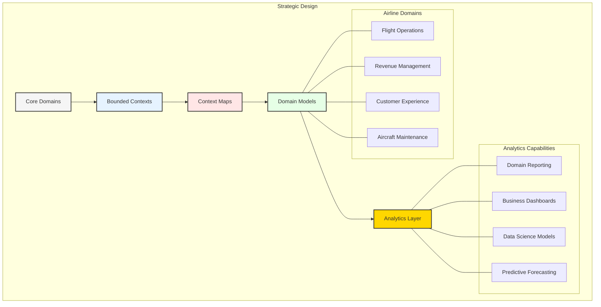
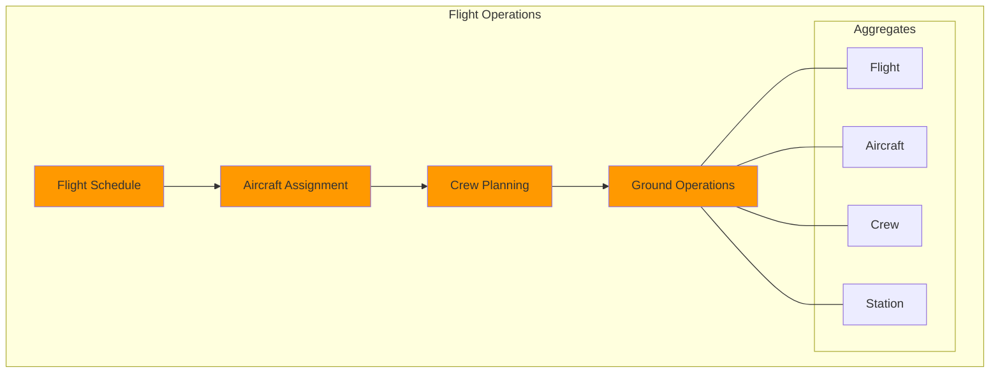
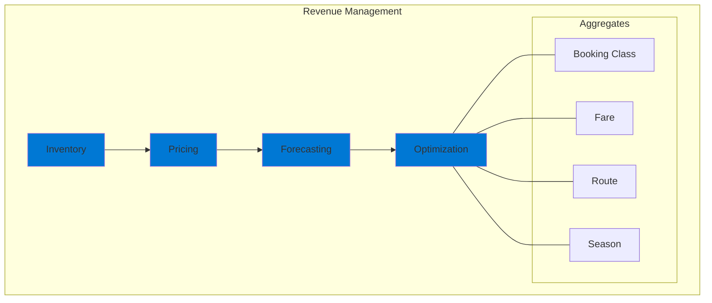
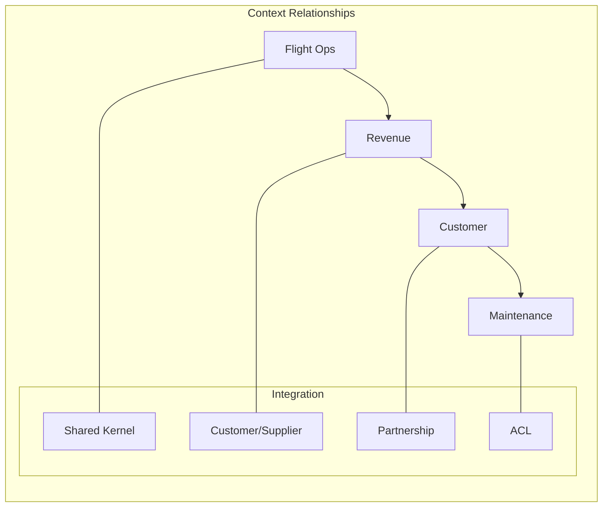
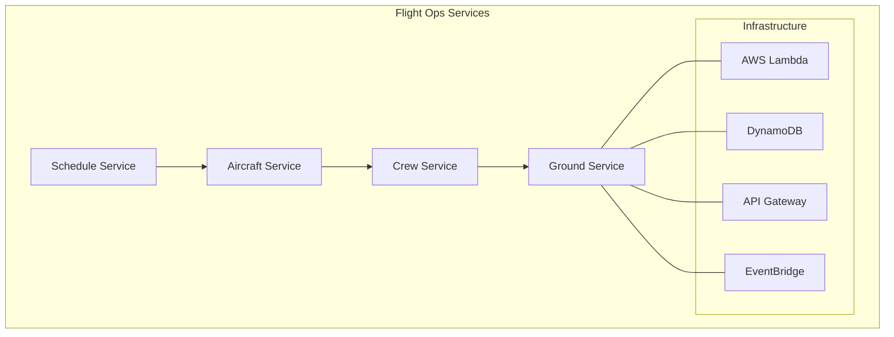
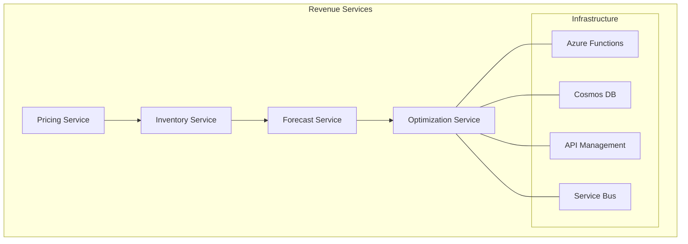
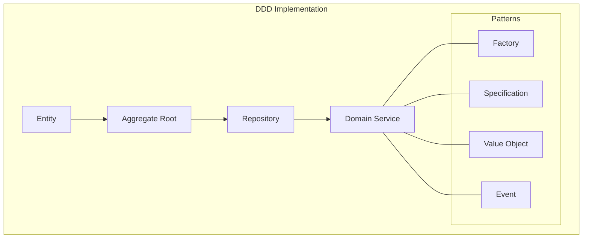

# Chapter 4: Domain-Driven Design for Data Architecture

## Introduction to Domain-Driven Design
Domain-Driven Design (DDD) provides a framework for modeling complex systems that aligns technical implementation with business domains. This chapter explores how DDD principles can be applied to enterprise data architectures.

## Domain-Driven Design in Aviation

GlobalAir's implementation of Domain-Driven Design (DDD) provides a strategic framework for organizing data architecture around core business domains. This approach ensures that technology solutions align closely with business objectives, enabling agility and scalability. By structuring data and services around bounded contexts, DDD minimizes dependencies and fosters innovation.

## Core Domain Analysis

### 1. Flight Operations Domain

#### Domain Model
- **Entities:**
  - Flight: Represents a scheduled journey between two locations, including details such as departure and arrival times, aircraft type, and route.
  - Aircraft: Captures information about the fleet, including registration numbers, capacity, and maintenance schedules.
  - Crew: Tracks personnel assignments, qualifications, and availability, ensuring compliance with regulatory requirements.
  - Route: Defines the path between origin and destination, including waypoints and alternate airports.
  - Station: Represents airport-specific operations, such as gate assignments and ground services.

- **Value Objects:**
  - FlightNumber: A unique identifier for each flight, ensuring traceability across systems.
  - ScheduleTime: Specifies planned departure and arrival times, supporting punctuality metrics.
  - AircraftType: Categorizes aircraft by model and configuration, aiding in capacity planning.
  - CrewPosition: Defines roles within the crew, such as pilot, co-pilot, and cabin staff.
  - RouteSegment: Breaks down routes into manageable sections, facilitating analysis and optimization.

- **Aggregates:**
  - FlightOperation: Encapsulates all aspects of a flight, from scheduling to execution, ensuring consistency.
  - CrewAssignment: Manages the allocation of personnel to flights, balancing workload and compliance.
  - AircraftSchedule: Coordinates aircraft availability with operational needs, minimizing downtime.
  - StationOperation: Oversees airport-specific activities, such as baggage handling and refueling.

### 2. Revenue Management Domain

#### Domain Model
- **Entities:**
  - Inventory: Tracks seat availability across flights, enabling dynamic adjustments based on demand.
  - Price: Represents fare structures, including base rates, taxes, and surcharges.
  - BookingClass: Categorizes seats by service level, such as economy, business, and first class.
  - Market: Defines geographic regions and customer segments, guiding marketing strategies.
  - Season: Captures temporal patterns, such as peak travel periods and off-season trends.

- **Value Objects:**
  - FareAmount: Specifies the cost of a ticket, including discounts and promotions.
  - LoadFactor: Measures seat occupancy, providing insights into operational efficiency.
  - YieldMetric: Evaluates revenue per available seat mile (RASM), guiding pricing decisions.
  - MarketDemand: Predicts customer interest based on historical data and external factors.
  - SeasonalPattern: Identifies recurring trends, such as holiday surges and weather impacts.

- **Aggregates:**
  - PricingStrategy: Balances competitiveness and profitability, leveraging real-time analytics.
  - InventoryControl: Ensures optimal seat allocation, reducing overbooking and underutilization.
  - MarketAnalysis: Provides insights into customer behavior, informing route planning and promotions.
  - RevenueOptimization: Maximizes financial performance through data-driven decision-making.

## Bounded Contexts

### 1. Context Mapping

- **Integration Patterns:**
  - Shared Kernel: Facilitates collaboration between closely related contexts, such as flight operations and crew management, by sharing common data models.
  - Customer/Supplier: Defines clear contracts between contexts, ensuring that changes in one do not disrupt the other.
  - Partnership: Encourages joint development of shared functionality, such as loyalty programs and ancillary services.
  - ACL (Anti-Corruption Layer): Translates data between contexts, preserving integrity and minimizing dependencies.

### 2. Integration Patterns

#### AWS Implementation
- **Event Bridge:**
  - Domain event publishing enables real-time updates across contexts, such as notifying revenue management of flight schedule changes.
  - Cross-context communication ensures that data flows seamlessly between systems, reducing silos.
  - Event routing directs messages to the appropriate consumers, improving efficiency.
  - Pattern matching filters events based on criteria, ensuring relevance.

- **Step Functions:**
  - Process orchestration coordinates complex workflows, such as rebooking passengers during disruptions.
  - Saga pattern ensures consistency across distributed transactions, handling failures gracefully.
  - Compensation handling reverses actions when errors occur, maintaining system integrity.
  - Error management provides visibility into issues, enabling rapid resolution.

#### Azure Implementation
- **Service Bus:**
  - Message queuing decouples producers and consumers, enhancing scalability.
  - Topic subscription allows multiple systems to receive relevant updates, such as inventory changes.
  - Order handling ensures that messages are processed in sequence, preserving consistency.
  - Dead letter queuing captures unprocessable messages, supporting troubleshooting.

- **Logic Apps:**
  - Workflow automation streamlines repetitive tasks, such as sending notifications.
  - Integration patterns connect disparate systems, enabling end-to-end processes.
  - Connector framework simplifies integration with third-party services, such as payment gateways.
  - Message transformation adapts data formats, ensuring compatibility.

## Domain Services

### 1. Flight Operations Services

- **Schedule Service:** Manages flight schedules, including creation, updates, and cancellations.
- **Aircraft Service:** Tracks aircraft availability, maintenance status, and assignments.
- **Crew Service:** Allocates personnel to flights, ensuring compliance with regulations and contracts.
- **Ground Service:** Coordinates airport operations, such as gate assignments and baggage handling.

### 2. Revenue Management Services

- **Pricing Service:** Adjusts fares dynamically based on demand, competition, and market conditions.
- **Inventory Service:** Monitors seat availability, enabling real-time adjustments.
- **Forecast Service:** Predicts future trends, such as demand surges and seasonal patterns.
- **Optimization Service:** Balances load factors and revenue, maximizing profitability.

## Event Storming Analysis

### 1. Flight Operations Events
- FlightScheduled
- AircraftAssigned
- CrewAssigned
- FlightDeparted
- FlightArrived
- DelayRecorded
- WeatherImpact

### 2. Revenue Management Events
- InventoryUpdated
- PriceChanged
- BookingCreated
- ForecastUpdated
- OptimizationRun
- MarketAnalyzed
- SeasonDefined

## Implementation Patterns

### 1. Domain Model Pattern

### 2. Technical Implementation

#### AWS Stack
- Lambda for domain services
- DynamoDB for aggregates
- EventBridge for events
- API Gateway for interfaces

#### Azure Stack
- Functions for domain services
- Cosmos DB for aggregates
- Service Bus for events
- API Management for interfaces

## Data Consistency Patterns

### 1. Eventual Consistency
- Event sourcing
- CQRS pattern
- Saga pattern
- Compensation logic

### 2. Strong Consistency
- Transactional boundaries
- Aggregate roots
- Optimistic locking
- Version control

## Testing Strategy

### 1. Domain Model Testing
- Unit tests
- Aggregate tests
- Event tests
- Service tests

### 2. Integration Testing
- Context integration
- Event flow
- Saga execution
- Compensation handling

## Deployment Strategy

### 1. AWS Deployment
- CloudFormation templates
- CodePipeline automation
- Multi-region deployment
- Blue-green updates

### 2. Azure Deployment
- ARM templates
- Azure DevOps
- Geo-replication
- Staged rollout

## Monitoring and Observability

### 1. Domain Metrics
- Bounded context health
- Event processing
- Service performance
- Data consistency

### 2. Business Metrics
- Domain KPIs
- Process efficiency
- System reliability
- Business impact

## Key Takeaways

1. DDD aligns technology with business, ensuring that solutions address real-world needs.
2. Bounded contexts ensure clean separation, reducing complexity and fostering innovation.
3. Event-driven integration enables flexibility, supporting real-time updates and scalability.
4. Multi-cloud implementation provides resilience, leveraging the strengths of different platforms.
5. Domain-specific deployment ensures control, tailoring solutions to unique requirements.

## Next Steps

The next chapter will explore how Agentic AI capabilities can be integrated into this domain-driven architecture to enhance decision-making and automation across airline operations.