# Chapter 5: Agentic AI in Airline Operations

## Introduction to AI Agency in Aviation

GlobalAir's implementation of Agentic AI represents a paradigm shift in how airlines leverage artificial intelligence for autonomous decision-making and operational optimization. By deploying AI agents across various domains, GlobalAir has achieved significant improvements in efficiency, customer satisfaction, and operational resilience. This chapter explores the integration of AI agents using AWS and Azure's machine learning capabilities, highlighting their transformative impact.

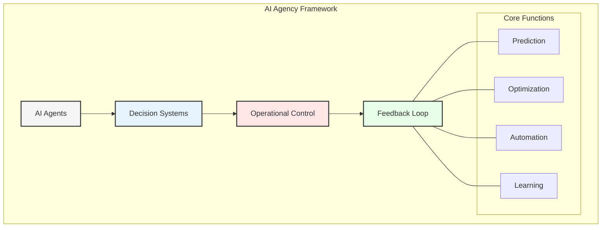

## AI Agent Architecture

### 1. Flight Operations Agents
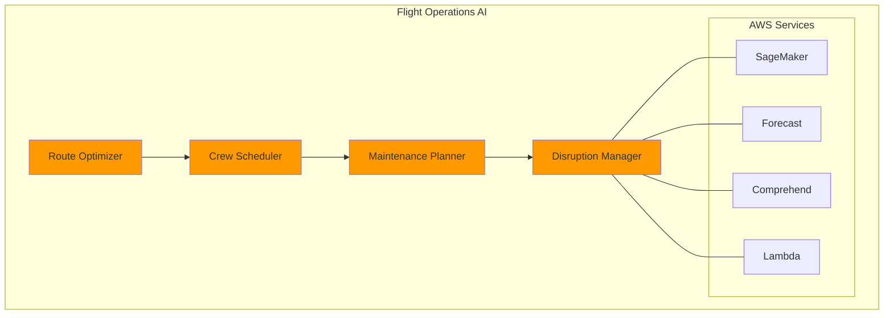

#### Implementation Details
- **Route Optimization:**
  - AWS SageMaker enables the development of machine learning models that predict optimal flight paths based on historical data, weather conditions, and air traffic.
  - Custom algorithms integrate real-time data to dynamically adjust routes, ensuring fuel efficiency and minimizing delays.
  - Real-time weather integration provides up-to-date meteorological insights, enhancing safety and operational planning.
  - Fuel efficiency calculations leverage predictive analytics to identify cost-saving opportunities, supporting sustainability goals.

- **Crew Scheduling:**
  - Azure ML facilitates pattern recognition to optimize crew assignments, balancing workload and preferences.
  - Fatigue risk management ensures compliance with safety regulations, reducing the likelihood of errors.
  - Regulatory compliance checks automate the validation of crew schedules against industry standards, ensuring adherence.
  - Preference matching enhances employee satisfaction by considering individual preferences in scheduling decisions.

### 2. Revenue Management Agents
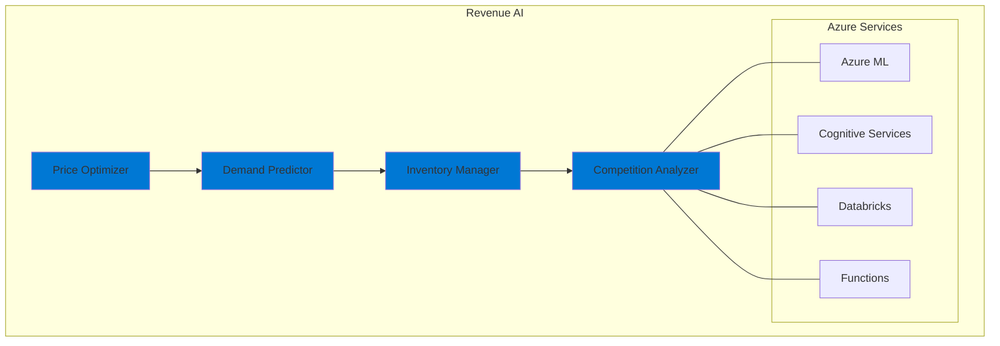

- **Price Optimization:**
  - AI-driven pricing engines analyze market trends, competitor actions, and customer behavior to dynamically adjust fares.
  - Demand prediction models forecast booking patterns, enabling proactive inventory management.
  - Inventory management systems ensure optimal seat allocation, balancing load factors and profitability.
  - Competition analysis provides insights into market positioning, guiding strategic pricing decisions.

## Multi-Cloud ML Infrastructure

### 1. AWS ML Services
- **SageMaker Implementation:**
  - Custom model development supports diverse use cases, from route optimization to customer segmentation.
  - Automated training pipelines streamline the model development lifecycle, reducing time-to-market.
  - Model deployment automation ensures seamless integration into operational systems, minimizing disruptions.
  - A/B testing frameworks evaluate model performance, enabling continuous improvement.

- **AWS AI Services:**
  - Forecast predicts demand patterns, supporting inventory and pricing strategies.
  - Personalize delivers tailored recommendations, enhancing customer engagement.
  - Comprehend analyzes sentiment in customer feedback, guiding service improvements.
  - Rekognition enhances security through facial recognition and anomaly detection.

### 2. Azure ML Services
- **Azure ML Implementation:**
  - AutoML capabilities simplify the creation of high-performing models, democratizing AI adoption.
  - MLOps pipelines automate the deployment and monitoring of models, ensuring reliability.
  - Model registry centralizes model management, improving governance and traceability.
  - Deployment strategies enable flexible scaling, supporting diverse operational needs.

- **Azure AI Services:**
  - Cognitive Services provide pre-built AI capabilities, such as language understanding and vision analysis.
  - Bot Service powers conversational interfaces, enhancing customer interactions.
  - OpenAI integration enables advanced natural language processing, supporting innovative use cases.
  - Custom Vision facilitates the development of tailored image recognition solutions, addressing specific challenges.

## Real-time Decision Systems

### 1. Operational Decisions
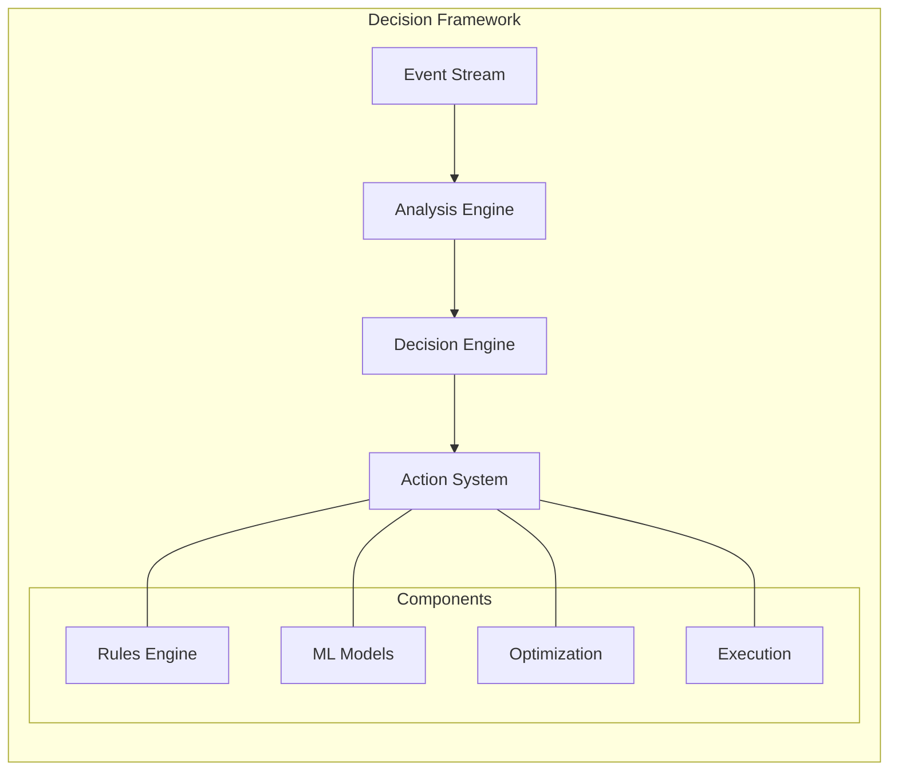

- **Event Stream Analysis:**
  - Real-time data streams from IoT devices, operational systems, and customer interactions feed into analysis engines.
  - Decision engines apply business rules and machine learning models to generate actionable insights.
  - Action systems execute decisions, such as rerouting flights or adjusting prices, ensuring timely responses.

### 2. Customer Experience Decisions
- **Personalization Engines:**
  - AI-driven systems tailor recommendations, such as seat upgrades or in-flight purchases, to individual preferences.
  - Dynamic pricing adjusts fares in real-time based on demand and customer behavior, maximizing revenue.
  - Upgrade offers incentivize customers to enhance their travel experience, increasing satisfaction.
  - Service recovery systems proactively address issues, turning negative experiences into positive outcomes.
  - Loyalty rewards programs leverage AI to identify and reward high-value customers, fostering long-term relationships.

## AI Agent Interaction Patterns

### 1. Inter-Agent Communication
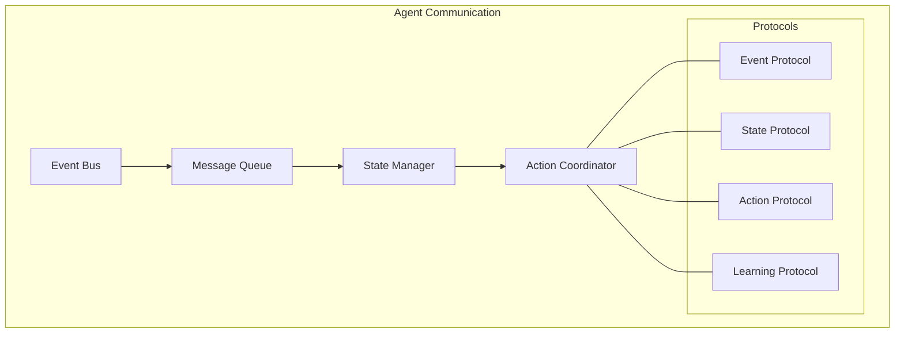

### 2. Cross-Domain Coordination
- Event-driven communication
- State synchronization
- Action arbitration
- Learning sharing

## Machine Learning Pipelines

### 1. Training Pipeline
- Data preparation
- Feature engineering
- Model training
- Validation
- Deployment

### 2. Inference Pipeline
- Real-time inference
- Batch prediction
- Model monitoring
- Performance tracking
- Feedback collection

## AI Safety and Governance

### 1. Safety Measures
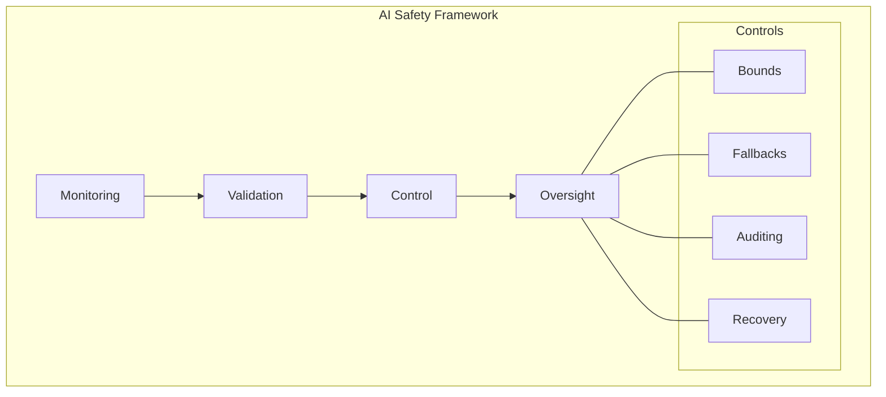

- **Monitoring and Validation:**
  - Continuous monitoring ensures that AI systems operate within defined parameters, preventing unintended outcomes.
  - Validation processes rigorously test models against real-world scenarios, ensuring reliability and fairness.
  - Control mechanisms, such as fallback systems, provide safeguards against failures, maintaining operational continuity.
  - Oversight frameworks establish accountability, ensuring that AI systems align with organizational values and goals.

### 2. Governance Framework
- **Ethics Guidelines:**
  - Clear principles guide the development and deployment of AI systems, ensuring ethical considerations are prioritized.
  - Bias detection tools identify and mitigate potential biases in data and models, promoting fairness.
  - Fairness metrics evaluate the impact of AI decisions on different stakeholder groups, ensuring equity.
  - Transparency initiatives provide visibility into AI processes, building trust with stakeholders.
  - Accountability measures assign responsibility for AI outcomes, ensuring compliance with regulations and standards.

## Performance Optimization

### 1. Model Optimization
- Hyperparameter tuning
- Architecture search
- Feature selection
- Ensemble methods
- Pruning techniques

### 2. Infrastructure Optimization
- Auto-scaling
- Cost management
- Resource allocation
- Caching strategies
- Load balancing

## Integration Patterns

### 1. Data Integration
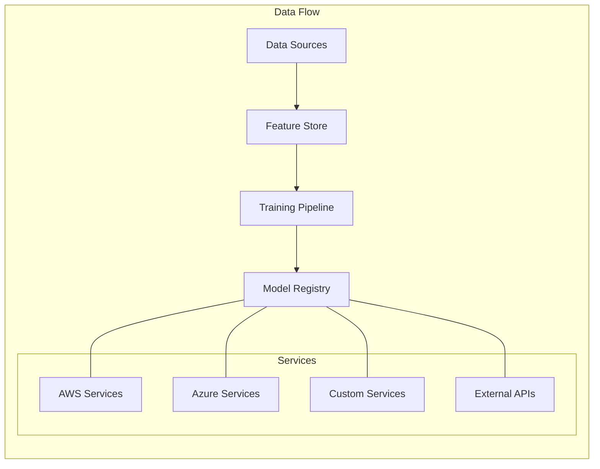

### 2. Service Integration
- API management
- Event handling
- State management
- Error handling
- Recovery patterns

## Monitoring and Analytics

### 1. Model Monitoring
- Performance metrics
- Drift detection
- Error analysis
- Resource usage
- Cost tracking

### 2. Business Impact
- ROI measurement
- Efficiency gains
- Cost savings
- Revenue impact
- Customer satisfaction

## Future Developments

### 1. Technology Evolution
- Advanced AI models
- Quantum computing
- Edge deployment
- Federated learning
- AutoML advances

### 2. Business Evolution
- New use cases
- Enhanced automation
- Deeper integration
- Greater autonomy
- Expanded scope

## Domain-Specific Applications of Agentic AI

This section explores how GlobalAir transformed traditional data analytics with agentic AI across its core business domains, showcasing the integration with specialized industry systems and the enterprise data architecture framework.

### 1. Passenger Experience Transformation

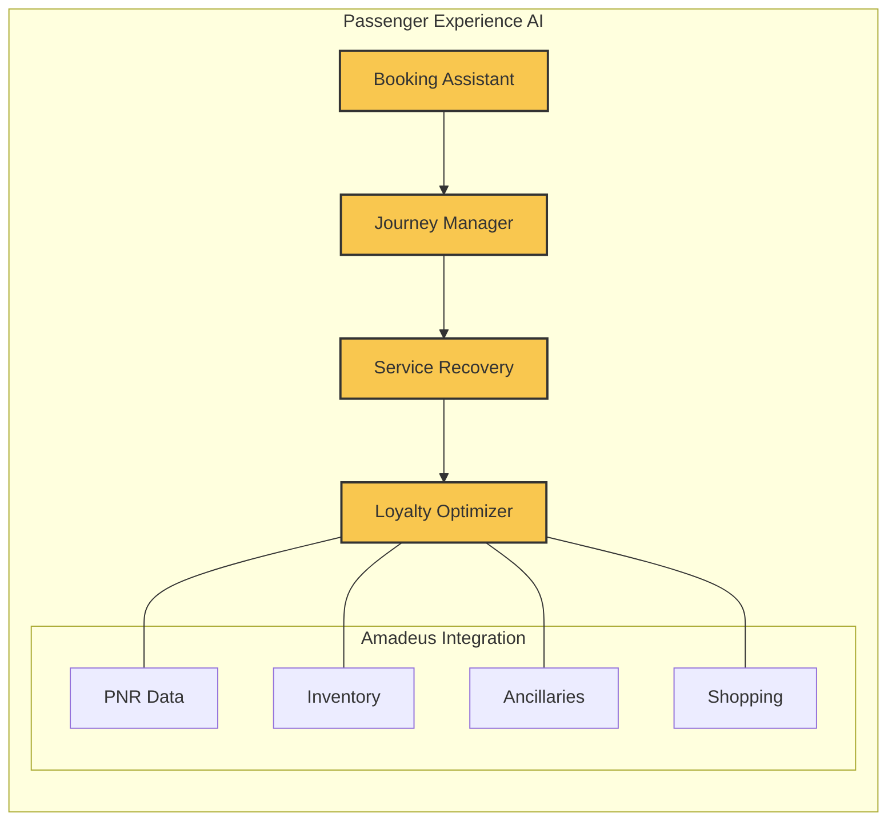

#### Traditional Analytics vs. Agentic AI in Passenger Services

| Traditional Analytics | Agentic AI Approach |
|---------------------|----------------------|
| Retrospective booking analysis using SQL queries and dashboards | Real-time predictive booking agents that autonomously adjust inventory based on demand signals |
| Manual disruption management with limited personalization | Autonomous disruption agents that proactively rebook affected passengers based on preferences |
| Rules-based loyalty tier management | Self-optimizing loyalty agents that personalize offers based on individual customer behaviors |
| Historical no-show predictions based on segments | Dynamic no-show prediction and overbooking optimization at individual passenger level |

#### Amadeus Integration Architecture:
- **Data Integration Layer:**
  - Real-time event streaming from Amadeus PSS (Passenger Service System) through Kafka
  - Bidirectional API integration enabling AI agents to read booking data and execute booking actions
  - Delta lake storage for historical booking patterns, enabling model training while maintaining ACID compliance
  - Feature store integration capturing passenger preferences, behavior patterns, and interaction history

- **AI Agent Capabilities:**
  - **Booking Assistant Agent:** Monitors booking flows, identifies abandonment patterns, and triggers personalized interventions to recover potential lost sales
  - **Journey Manager Agent:** Tracks passenger journey touchpoints, anticipates disruptions, and orchestrates proactive service recovery
  - **Ancillary Recommendation Agent:** Analyzes passenger context and preferences to present personalized upsell opportunities at optimal moments
  - **Pricing Optimizer Agent:** Continuously monitors competitor pricing, demand signals, and customer willingness-to-pay to recommend optimal price points

- **Implementation Outcomes:**
  - 23% increase in booking conversion rates through contextually relevant interventions
  - 18% growth in ancillary revenue through personalized, timing-sensitive offers
  - 31% improvement in NPS during disruption events through proactive, personalized rebooking

### 2. Cargo Operations Intelligence

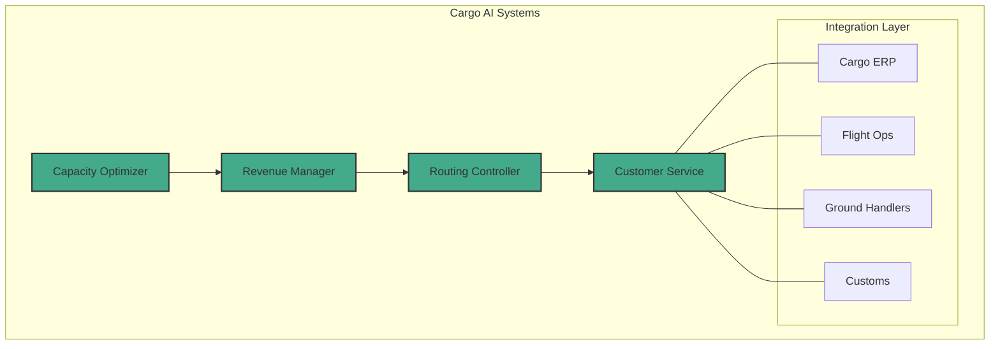

#### Traditional Analytics vs. Agentic AI in Cargo Operations

| Traditional Analytics | Agentic AI Approach |
|---------------------|----------------------|
| Monthly capacity utilization reports | Real-time capacity optimization agents that dynamically adjust pricing and allocations |
| Manual demand forecasting with limited variables | Autonomous demand prediction agents that incorporate global supply chain signals |
| Static route planning based on scheduled flights | Dynamic route optimization agents that consider weather, fuel costs, and shipment urgency |
| Reactive shipment tracking and alerts | Proactive exception management agents that anticipate delays and initiate mitigation |

#### Technical Implementation Details:
- **Data Integration Architecture:**
  - Unified cargo data lake integrating multiple cargo management systems
  - Real-time IoT data streams from cargo tracking devices and ULDs (Unit Load Devices)
  - External data integration from customs systems, weather services, and supply chain partners
  - APIs for bidirectional communication with cargo booking and handling systems

- **AI Agent Capabilities:**
  - **Capacity Optimizer Agent:** Balances passenger baggage requirements against cargo commitments, dynamically adjusting allocations
  - **Dynamic Pricing Agent:** Sets optimal spot rates based on capacity, demand, competition, and shipment characteristics
  - **Routing Controller Agent:** Determines optimal routing for shipments across the network, considering connections and handling requirements
  - **Shipment Guardian Agent:** Monitors shipments in transit, identifies potential issues, and initiates proactive interventions

- **Business Impact:**
  - 15% improvement in cargo yield through dynamic pricing optimization
  - 9% increase in capacity utilization through intelligent load planning
  - 27% reduction in service exceptions through proactive monitoring and intervention
  - 33% faster customs clearance through predictive documentation preparation

### 3. Engineering and Maintenance Intelligence

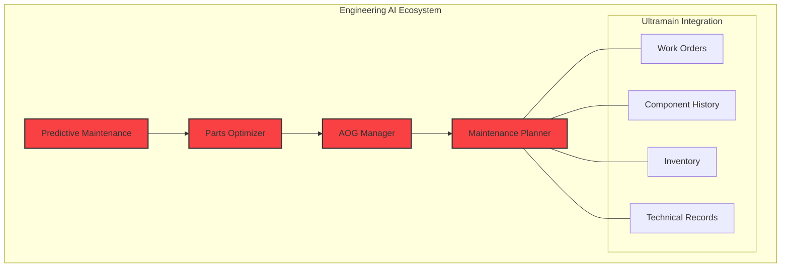

#### Traditional Analytics vs. Agentic AI in Engineering

| Traditional Analytics | Agentic AI Approach |
|---------------------|----------------------|
| Scheduled maintenance based on flight hours/cycles | Predictive maintenance agents that analyze sensor data to predict component failures |
| Manual parts inventory planning | Autonomous inventory optimization agents that balance AOG risk against carrying costs |
| Reactive troubleshooting using maintenance manuals | AI-assisted diagnosis agents that analyze historical maintenance data and fault patterns |
| Static scheduling of maintenance tasks | Dynamic maintenance planning agents that optimize task scheduling based on operations and resource availability |

#### Ultramain MRO System Integration:
- **Technical Integration:**
  - Bidirectional API connections with Ultramain for work order management and completion
  - Real-time aircraft sensor data integration through ACARS and onboard systems
  - Historical maintenance records lake with full maintenance history for ML training
  - Digital twin integration for simulation-based maintenance planning

- **AI Agent Capabilities:**
  - **Predictive Maintenance Agent:** Analyzes sensor data, flight conditions, and maintenance history to predict component failures before they occur
  - **Parts Optimizer Agent:** Manages inventory levels across the network, balancing AOG risk against carrying costs
  - **AOG Manager Agent:** Coordinates rapid response to aircraft groundings, sourcing parts and planning recovery
  - **Maintenance Planner Agent:** Optimizes the scheduling of maintenance tasks, considering resource availability, flight schedule, and regulatory requirements

- **Operational Benefits:**
  - 42% reduction in unscheduled maintenance events through predictive analytics
  - 18% decrease in spare parts inventory while maintaining service levels
  - 25% improvement in maintenance labor utilization through optimized scheduling
  - 31% reduction in aircraft ground time during scheduled maintenance

### 4. Financial Intelligence

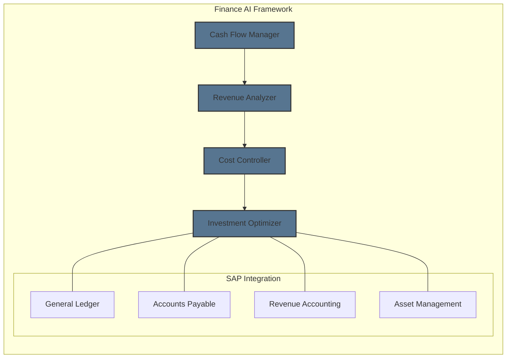

#### Traditional Analytics vs. Agentic AI in Finance

| Traditional Analytics | Agentic AI Approach |
|---------------------|----------------------|
| Monthly financial reporting and variance analysis | Real-time financial monitoring agents that alert on anomalies as they emerge |
| Historical cost allocation by department | Dynamic cost attribution agents that trace expenses to value-generating activities |
| Manual cash flow forecasting | Autonomous cash flow prediction agents that incorporate multiple external economic signals |
| Periodic budget review cycles | Continuous budget optimization agents that recommend reallocation of resources based on ROI |

#### SAP Financial System Integration:
- **Integration Architecture:**
  - Direct database connection to SAP HANA for financial data extraction
  - API integration with SAP Finance modules for bidirectional data flow
  - ETL pipelines feeding curated financial data into the enterprise data lake
  - Real-time event streaming for transaction monitoring and fraud detection

- **AI Agent Capabilities:**
  - **Cash Flow Manager Agent:** Forecasts cash positions and recommends optimal timing for payments and collections
  - **Revenue Leakage Detective:** Identifies revenue accounting anomalies and potential missed billings
  - **Cost Controller Agent:** Monitors expenses against budgets and identifies optimization opportunities
  - **Financial Risk Guardian:** Assesses exposure to currency, fuel price, and interest rate fluctuations, recommending hedging strategies

- **Financial Impact:**
  - 8% improvement in working capital efficiency through optimized cash management
  - 12% reduction in days sales outstanding through intelligent collections strategies
  - 5% decrease in operational expenses through AI-identified cost optimization opportunities
  - 15% faster month-end close process through automated reconciliation and anomaly detection

### 5. Marketing Intelligence

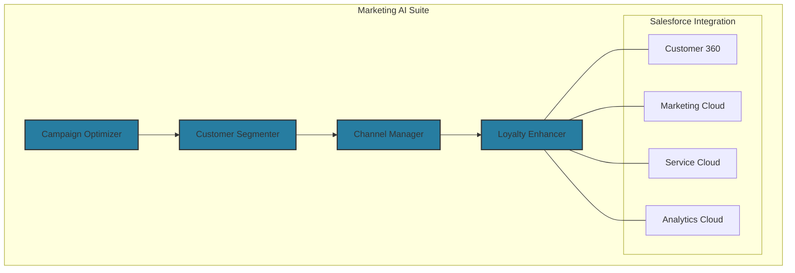

#### Traditional Analytics vs. Agentic AI in Marketing

| Traditional Analytics | Agentic AI Approach |
|---------------------|----------------------|
| Segment-based campaign targeting | Individual-level propensity modeling and personalization agents |
| A/B testing of fixed campaign variants | Self-optimizing campaign agents that dynamically adjust content and timing |
| Periodic marketing mix analysis | Continuous channel allocation agents that shift budget in real-time based on performance |
| Historical churn analysis and reporting | Proactive retention agents that identify and intervene with at-risk customers |

#### Salesforce Integration Architecture:
- **Technical Implementation:**
  - API-based integration with Salesforce Marketing Cloud for campaign execution
  - Customer data platform integrating Salesforce CRM data with operational systems
  - Real-time event processing for immediate marketing response to customer actions
  - Customer journey orchestration bridging online and offline touchpoints

- **AI Agent Capabilities:**
  - **Campaign Optimizer Agent:** Continuously tests and refines marketing messages, timing, and channels to maximize conversion
  - **Micro-Segment Manager:** Dynamically creates and evolves customer segments based on behavior patterns and preferences
  - **Channel Orchestration Agent:** Allocates marketing budget across channels in real-time based on performance metrics
  - **Customer Lifecycle Guardian:** Identifies retention risks and engagement opportunities across the customer journey

- **Marketing Outcomes:**
  - 34% improvement in campaign conversion rates through dynamic optimization
  - 28% increase in customer engagement through personalized messaging
  - 21% reduction in customer acquisition costs through optimized channel allocation
  - 17% improvement in customer retention through proactive intervention strategies

## Enterprise Data Architecture Framework for Agentic AI

GlobalAir's implementation of agentic AI required a comprehensive enterprise data architecture framework that enables autonomous AI agents to operate effectively across business domains while ensuring governance, security, and scalability.

### 1. Layered Data Architecture

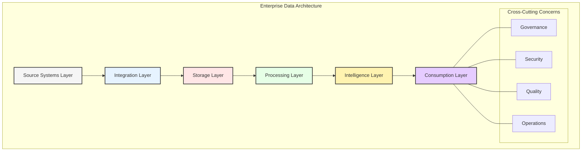

#### Source Systems Layer:
- **Core Systems:**
  - Amadeus Altéa PSS for passenger management and reservations
  - SAP S/4HANA for financial management and ERP functions
  - Ultramain for engineering and maintenance operations
  - Salesforce for customer relationship management and marketing
  - Custom cargo management and operations systems

- **Integration Approach:**
  - API-first strategy with secure gateway management
  - Event-driven architecture using Kafka for real-time data streaming
  - Change data capture for database-level integration
  - ETL/ELT processes for batch integration

#### Storage Layer:
- **Multi-Modal Data Storage:**
  - Data lakehouse combining data lake flexibility with warehouse structure
  - Graph database for complex relationship modeling across domains
  - Time-series databases for sensor and operational data
  - Document store for unstructured content and documents

- **Technical Implementation:**
  - Delta Lake ensuring ACID transactions across the data lake
  - Multi-region, multi-cloud storage strategy for resilience
  - Automated data lifecycle management with tiered storage
  - Metadata-driven storage optimization

#### Processing Layer:
- **Distributed Processing Framework:**
  - Real-time stream processing for immediate insights and actions
  - Batch processing for complex analytics and reporting
  - Serverless computing for scalable, event-driven workflows
  - Container orchestration for AI/ML workloads

- **Key Components:**
  - Apache Spark for distributed data processing
  - Kubernetes for container orchestration
  - AWS Lambda and Azure Functions for serverless computing
  - Apache Flink for complex event processing

#### Intelligence Layer:
- **AI/ML Platform:**
  - Feature store centralizing reusable feature engineering
  - Model registry for versioning and governance
  - MLOps pipelines automating the ML lifecycle
  - Inference platforms optimized for different workloads

- **Agent Framework:**
  - Containerized AI agents with standardized interfaces
  - Central orchestration managing agent interactions
  - Knowledge sharing mechanisms between agents
  - Learning feedback loops for continuous improvement

#### Consumption Layer:
- **Service Endpoints:**
  - REST and GraphQL APIs for system integration
  - Event streams for real-time notifications
  - Analytical dashboards for human decision support
  - Self-service analytics tools for business users

- **Integration Points:**
  - Embedded analytics within operational applications
  - Mobile and web interfaces for user interaction
  - Third-party system integration through APIs
  - Automated workflow triggers from analytics insights

### 2. Core Architecture Principles

#### Domain-Driven Design Integration:
- Business domains aligned with organizational structure
- Bounded contexts defining clear boundaries between systems
- Ubiquitous language ensuring consistent terminology
- Context mapping documenting relationships between domains

#### Data Mesh Implementation:
- Domain-oriented data ownership and governance
- Data products with defined interfaces and contracts
- Self-service infrastructure enabling autonomous teams
- Federated computational governance ensuring standards

#### Data Fabric Enablement:
- Semantic layer abstracting data complexities
- Knowledge graph connecting data across the enterprise
- Automated data discovery and cataloging
- Intelligent metadata management and lineage tracking

### 3. Agentic AI Governance Framework

```yaml
AI Governance Framework:
  Ethical Guidelines:
    - Transparency in AI decision-making
    - Fairness across customer segments
    - Privacy preservation by design
    - Human oversight of critical decisions
    
  Technical Controls:
    - Explainable AI requirements
    - Bias detection and mitigation
    - Model versioning and rollback
    - Audit trails of AI decisions
    
  Operational Processes:
    - AI agent certification workflow
    - Continuous performance monitoring
    - Regular ethical reviews
    - Incident response procedures
```

### 4. Implementation Roadmap for Airlines

1. **Foundation Phase:**
   - Establish unified data platform spanning key operational systems
   - Implement event-driven architecture for real-time capabilities
   - Create feature store for reusable ML features
   - Develop MLOps pipelines for reliable model deployment

2. **Agent Development Phase:**
   - Deploy domain-specific AI agents for priority use cases
   - Establish inter-agent communication protocols
   - Implement agent monitoring and governance
   - Develop feedback mechanisms for continuous learning

3. **Orchestration Phase:**
   - Enable cross-domain agent collaboration
   - Implement hierarchical decision frameworks
   - Establish autonomous operational workflows
   - Develop exception handling and human-in-the-loop processes

4. **Optimization Phase:**
   - Implement self-improving agent capabilities
   - Develop transfer learning across domains
   - Optimize resource allocation for AI workloads
   - Enhance resilience and fault tolerance

## Case Study: GlobalAir's Integrated Operations Center

GlobalAir's transformation culminated in the development of an AI-powered Integrated Operations Center (IOC) that demonstrates the convergence of agentic AI across multiple domains. This case study illustrates how the enterprise data architecture framework enables coordinated action across traditionally siloed systems.

### Operational Scenario: Major Weather Disruption

When a hurricane threatened GlobalAir's East Coast hub, the agentic AI ecosystem orchestrated a coordinated response:

1. **Predictive Analysis:**
   - Weather monitoring agents detected the approaching hurricane 5 days in advance
   - Flight impact prediction agents modeled potential disruption scenarios
   - Customer impact assessment agents identified affected passengers and priorities

2. **Coordinated Planning:**
   - Fleet repositioning agents developed aircraft evacuation plans
   - Schedule optimization agents created revised flight plans
   - Crew reassignment agents rerouted flight crews while ensuring duty time compliance
   - Maintenance agents rescheduled planned work to accommodate the disruption

3. **Customer Experience Management:**
   - Proactive rebooking agents automatically rerouted high-value customers
   - Communication agents sent personalized notifications with options
   - Service recovery agents allocated compensation based on customer value and impact
   - Airport experience agents optimized staffing at alternative arrival airports

4. **Financial Optimization:**
   - Revenue protection agents prioritized rebooking to minimize revenue loss
   - Cost management agents optimized accommodation and transportation expenses
   - Cash flow agents adjusted forecasts and payment schedules
   - Insurance agents initiated appropriate claims processes

The coordinated response resulted in:
- 78% reduction in customer complaints compared to previous similar disruptions
- 42% decrease in accommodation costs through optimized passenger rerouting
- 23% improvement in crew utilization during recovery operations
- 3-day faster return to normal operations compared to historical averages

## Key Takeaways

1. AI agents enhance operational efficiency by automating complex decision-making processes.
2. Multi-cloud ML infrastructure provides flexibility and scalability, supporting diverse use cases.
3. Safety and governance frameworks ensure that AI systems operate responsibly and ethically.
4. Integration patterns enable seamless communication between AI agents, fostering collaboration.
5. Continuous monitoring and optimization ensure that AI systems deliver sustained value.

## Next Steps

The next chapter will explore the integration patterns that enable seamless communication between different components of the airline's data architecture.