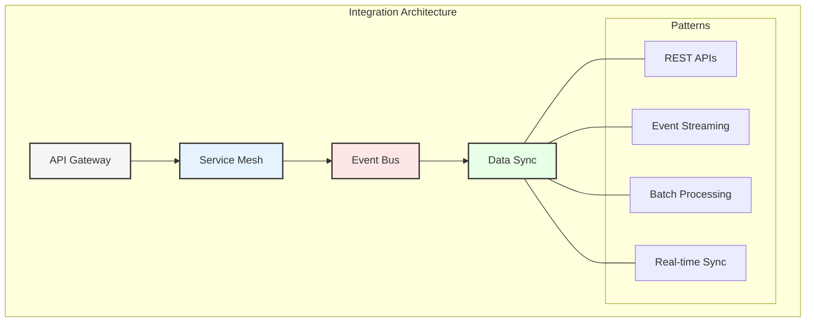
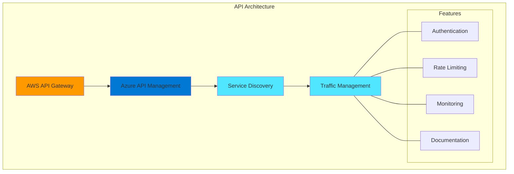
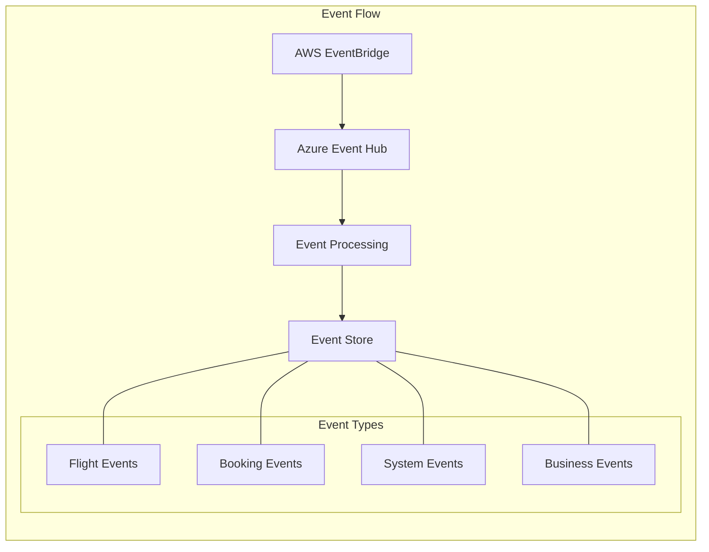
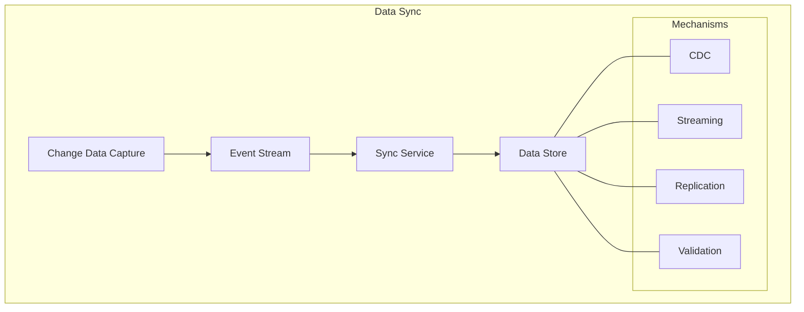
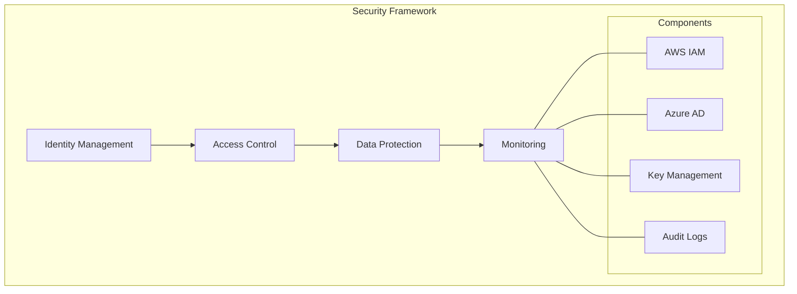
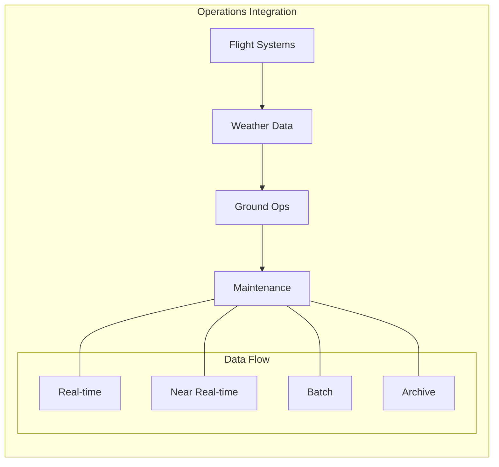
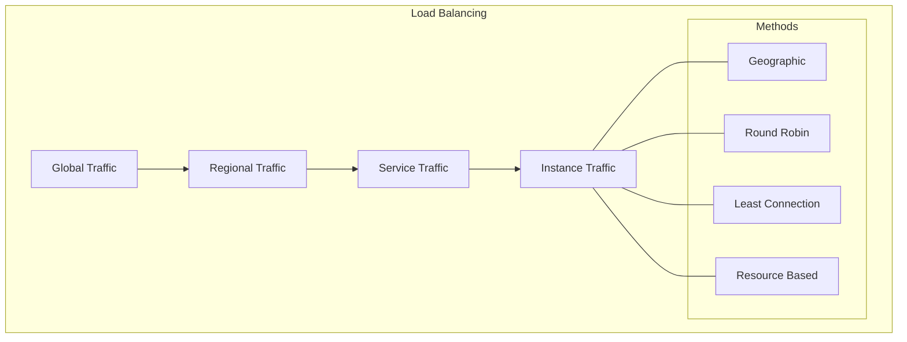
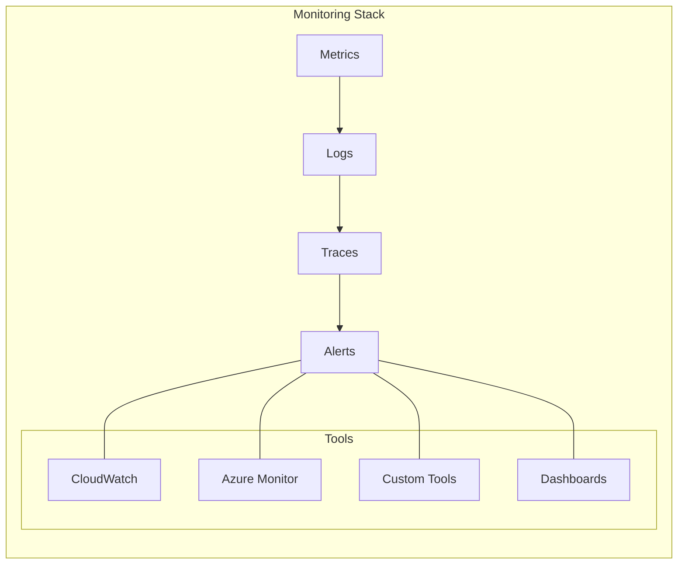
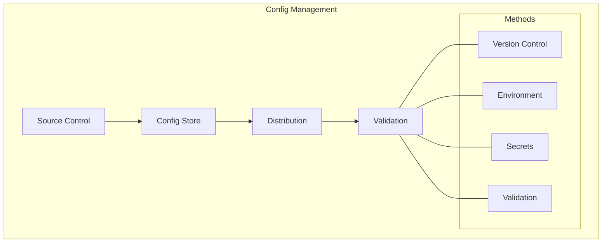

# Chapter 6: Data Integration Patterns

## Introduction to Enterprise Data Integration
Effective data integration is a cornerstone of successful enterprise data architecture. This chapter explores advanced patterns and strategies for connecting disparate data systems across cloud and on-premises environments.

## Multi-Cloud Integration Architecture

GlobalAir's integration architecture enables seamless operation across AWS and Azure clouds while maintaining high availability and real-time data synchronization. By adopting a multi-cloud strategy, the airline ensures resilience, scalability, and flexibility in its operations. This chapter explores the patterns and practices that make this possible, highlighting the role of modern integration technologies.

## Cross-Cloud Communication

### 1. API Management
- **AWS API Gateway and Azure API Management:**
  - These platforms provide secure and scalable access to services, enabling seamless communication between systems.
  - Service discovery mechanisms ensure that APIs are easily discoverable and accessible, reducing integration complexity.
  - Traffic management features, such as rate limiting and throttling, protect backend systems from overload.
  - Authentication and authorization frameworks, including OAuth and JWT, ensure secure access to APIs.

### 2. Service Mesh Implementation
- **AWS App Mesh:**
  - Facilitates service discovery, enabling dynamic routing of requests based on real-time conditions.
  - Traffic routing capabilities optimize the flow of data between services, improving performance.
  - Circuit breaking and retry logic enhance resilience by handling failures gracefully.

- **Azure Service Mesh:**
  - Provides service identity and access control, ensuring secure communication between services.
  - Traffic splitting enables gradual rollouts of new features, reducing deployment risks.
  - Fault injection tools simulate failures, helping teams test and improve system resilience.
  - Observability features, such as tracing and metrics, provide insights into service performance.

## Event-Driven Integration

### 1. Event Architecture
- **Event Flow:**
  - AWS EventBridge and Azure Event Hub serve as central hubs for event ingestion and routing, enabling real-time data processing.
  - Event processing systems analyze incoming events, triggering appropriate actions based on predefined rules.
  - Event stores, such as DynamoDB and Cosmos DB, provide durable storage for event data, supporting analytics and auditing.

### 2. Implementation Details

#### AWS Components
- EventBridge routes events to appropriate consumers, ensuring timely processing.
- SNS and SQS provide pub/sub and queuing capabilities, decoupling producers and consumers.
- Kinesis enables real-time streaming analytics, supporting use cases like anomaly detection and trend analysis.

#### Azure Components
- Event Hub ingests high-throughput event streams, supporting scalable data processing.
- Service Bus handles message queuing and topic subscriptions, ensuring reliable delivery.
- Event Grid routes events to subscribers, enabling reactive workflows.
- Stream Analytics processes data in real-time, providing actionable insights.

## Data Synchronization

### 1. Real-time Sync
- **Change Data Capture (CDC):**
  - Captures changes in source systems and propagates them to downstream systems in real-time, ensuring data consistency.
  - Event streams, such as Kafka or Kinesis, transport CDC events to processing systems, enabling low-latency updates.
  - Sync services reconcile data across systems, resolving conflicts and ensuring accuracy.

### 2. Batch Sync
- **Daily Reconciliation:**
  - Aggregates and compares data from multiple systems, identifying and resolving discrepancies.
  - Historical data synchronization ensures that analytics platforms have access to complete datasets.
  - Backup systems store snapshots of critical data, supporting disaster recovery and compliance.

## Integration Security

### 1. Cross-Cloud Security
- **Identity Management:**
  - AWS IAM and Azure AD provide robust identity and access management, ensuring that only authorized users and systems can access resources.
  - Role-based access control (RBAC) and attribute-based access control (ABAC) enforce fine-grained permissions.

- **Data Protection:**
  - Encryption mechanisms, such as AWS KMS and Azure Key Vault, secure data at rest and in transit.
  - Monitoring tools, including CloudWatch and Azure Monitor, detect and respond to security incidents in real-time.

### 2. Implementation
- **AWS Security:**
  - IAM roles and policies define access permissions, ensuring least privilege.
  - KMS encrypts sensitive data, protecting it from unauthorized access.
  - VPC endpoints provide secure connectivity to AWS services, reducing exposure to the public internet.
  - WAF protects web applications from common threats, such as SQL injection and cross-site scripting.

- **Azure Security:**
  - Managed identities simplify authentication for Azure resources, reducing the need for credentials.
  - Key Vault stores and manages secrets, keys, and certificates securely.
  - Private endpoints enable secure access to Azure services, bypassing the public internet.
  - DDoS protection safeguards applications from distributed denial-of-service attacks.

## Domain-Specific Integration

### 1. Flight Operations

### 2. Customer Experience
- Booking integration
- Loyalty systems
- Mobile services
- Social media
- Payment systems

## Performance Optimization

### 1. Caching Strategy
- Multi-level caching
- Distributed cache
- Cache invalidation
- Performance metrics
- Cost optimization

### 2. Load Balancing

## Error Handling

### 1. Resilience Patterns
- Circuit breakers
- Retry policies
- Fallback mechanisms
- Dead letter queues
- Error logging

### 2. Recovery Procedures
- Automated recovery
- Manual intervention
- Data reconciliation
- System restore
- Incident management

## Monitoring and Observability

### 1. Operational Monitoring

### 2. Business Monitoring
- Transaction tracking
- Business metrics
- SLA compliance
- Cost analysis
- Usage patterns

## Deployment Strategies

### 1. Cross-Cloud Deployment
- Infrastructure as Code
- Blue-green deployment
- Canary releases
- Feature flags
- Rollback procedures

### 2. Configuration Management

## Key Takeaways

1. Multi-cloud integration requires careful planning and robust architecture to ensure seamless communication and data flow.
2. Event-driven architecture enables real-time operations, enhancing responsiveness and scalability.
3. Comprehensive security measures are essential to protect data and systems across cloud environments.
4. Performance optimization strategies, such as caching and load balancing, improve system efficiency and user experience.
5. Monitoring and observability tools provide critical insights into system health and performance, supporting proactive management.

## Next Steps

The next chapter will explore the transformation journey from legacy systems to this modern integrated architecture.