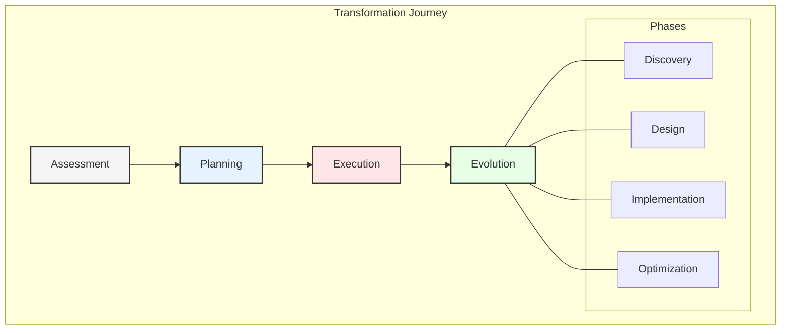
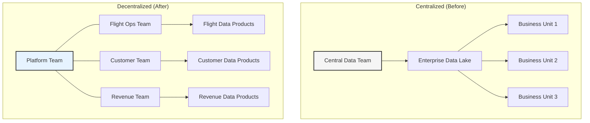
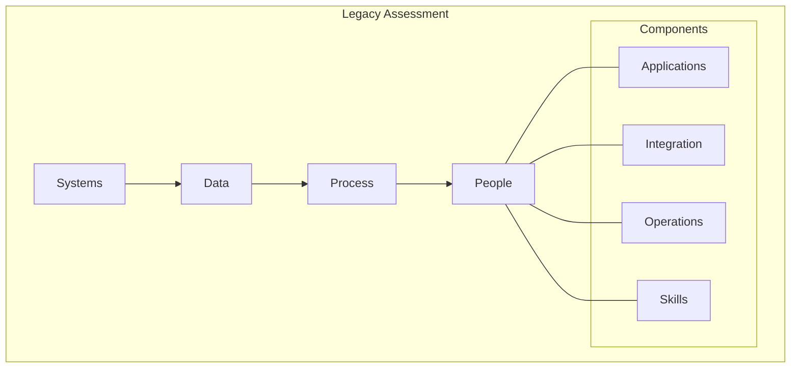
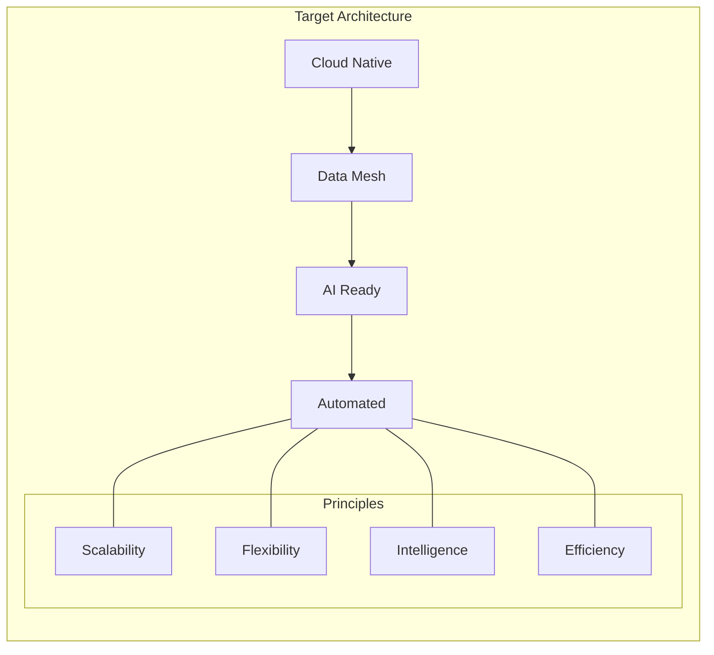
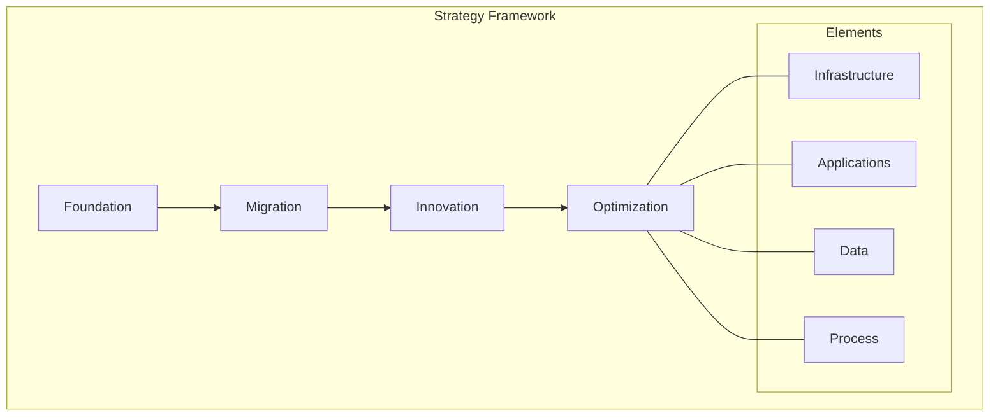
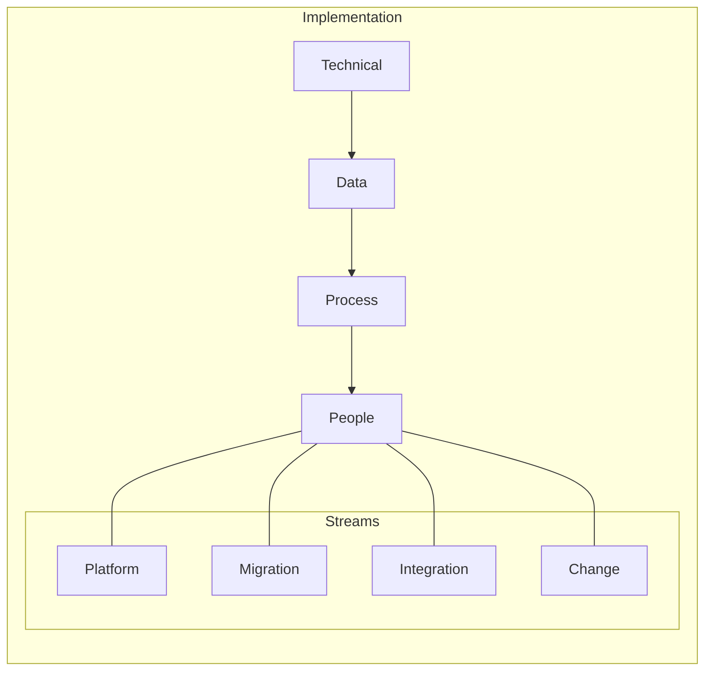
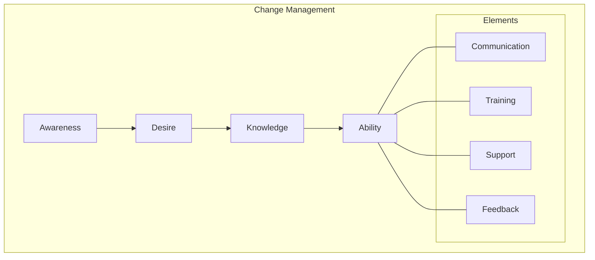
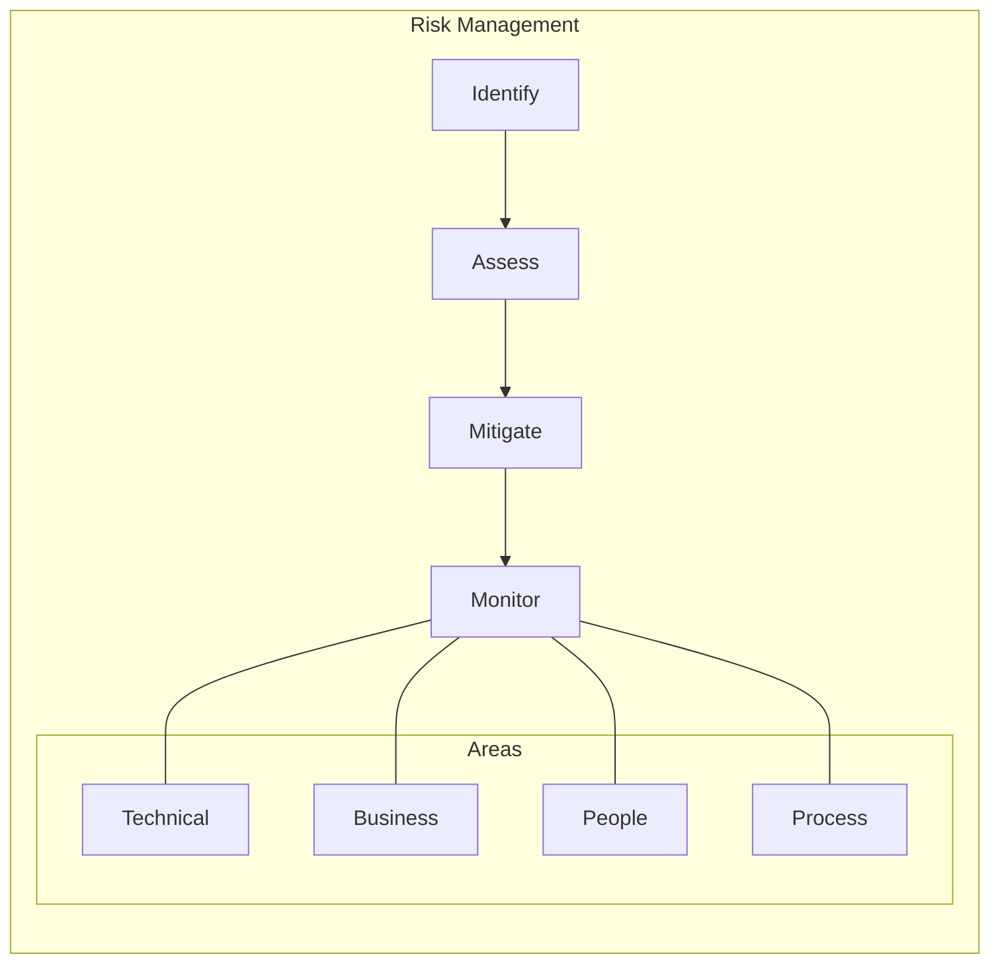
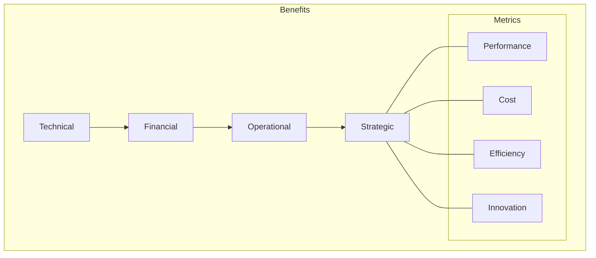

# Chapter 7: Data Transformation Architecture

## Introduction to Modern Data Transformation
Data transformation is a critical component in enterprise data architecture, enabling organizations to convert raw data into actionable insights. This chapter explores advanced patterns and technologies for efficient, scalable data transformation.


# Chapter 7: Digital Transformation Journey

## From Legacy to Modern Architecture

This chapter examines GlobalAir's transformation journey from legacy systems to a modern multi-cloud data architecture, providing a practical roadmap for airlines undertaking similar initiatives. By addressing technical, organizational, and operational challenges, GlobalAir has successfully transitioned to a scalable and resilient architecture that supports innovation and growth.



## The Shift From Centralized to Decentralized Data Management

One of the most significant aspects of GlobalAir's transformation was the deliberate shift from a centralized data management approach to a decentralized model. This evolution represents a fundamental rethinking of how data is owned, managed, and utilized across the enterprise.

### Centralized vs. Decentralized Approaches



#### Key Aspects of the Transition:

1. **Ownership Shift**: Moving from central IT ownership of data to domain teams who are closest to the business context.

2. **Governance Evolution**: Transitioning from top-down enforcement to federated governance with shared principles and standards.

3. **Architectural Change**: Shifting from monolithic data platforms to distributed, domain-specific data products.

4. **Operational Model**: Moving from centralized data service requests to self-service capabilities for each business domain.

5. **Team Structure**: Evolving from specialized data teams (ETL developers, DBAs) to cross-functional product teams with embedded data expertise.

### Transformation Challenges and Solutions

| Challenge | Description | Solution |
|-----------|-------------|----------|
| **Cultural Resistance** | Teams accustomed to central data services resisted taking ownership | Gradual transition with education, success stories, and executive sponsorship |
| **Skills Gap** | Domain teams lacked data engineering expertise | Training programs, embedding specialists, and comprehensive documentation |
| **Technical Complexity** | Moving from monolithic to distributed architecture increased complexity | Self-service platform with templates, standards, and automation |
| **Consistency Concerns** | Fear of inconsistent practices across domains | Federated governance model with global standards and automated enforcement |
| **Investment Justification** | Higher initial costs for distributed ownership | Clear ROI framework highlighting long-term benefits and agility gains |

### Benefits Realized

- **Increased Business Agility**: Domain teams can evolve their data products independently at their own pace
- **Improved Data Quality**: Greater ownership led to higher quality standards within domains
- **Accelerated Innovation**: Reduced dependencies between teams enabled faster experimentation
- **Higher User Satisfaction**: Self-service capabilities and domain-specific products better met business needs
- **Enhanced Scalability**: Distributing ownership allowed the organization to scale data capabilities more effectively

## Phase 1: Current State Assessment

### 1. Legacy System Analysis
- **Systems:**
  - Legacy mainframe applications often lack the flexibility to adapt to modern business needs, creating bottlenecks in operations.
  - Integration points between disparate systems are prone to failures, leading to inefficiencies and data silos.
  - Technical debt accumulates over time, increasing maintenance costs and hindering innovation.

- **Data:**
  - Data quality issues, such as inconsistencies and inaccuracies, undermine decision-making processes.
  - Lack of robust data governance frameworks results in poor data management and compliance risks.
  - Security vulnerabilities in legacy systems expose sensitive information to potential breaches.

- **Process:**
  - Outdated business processes fail to leverage modern technologies, limiting operational efficiency.
  - Dependencies on manual workflows increase the risk of errors and delays.

- **People:**
  - Skills gaps in the workforce hinder the adoption of new technologies and practices.
  - Resistance to change creates challenges in driving organizational transformation.



### 2. Assessment Framework
```yaml
Analysis Areas:
  Technical:
    Systems:
      - Mainframe applications
      - Legacy databases
      - Integration points
      - Technical debt
      
    Data:
      - Data quality
      - Data governance
      - Data security
      - Data lifecycle
      
  Organizational:
    Process:
      - Business processes
      - Operations
      - Dependencies
      - Constraints
      
    People:
      - Skills inventory
      - Training needs
      - Change readiness
      - Cultural factors
```

## Phase 2: Future State Design

### 1. Architecture Vision
- **Cloud Native:**
  - Embracing cloud-native principles enables scalability, flexibility, and cost efficiency.
  - Microservices architecture decouples applications, allowing independent development and deployment.

- **Data Mesh:**
  - Domain-oriented data ownership ensures that teams have control over their data, fostering accountability.
  - Self-service data platforms empower users to access and analyze data without relying on IT teams.

- **AI Ready:**
  - Integrating AI capabilities into the architecture enables predictive analytics, automation, and personalization.
  - Real-time data processing supports dynamic decision-making and operational agility.



### 2. Design Principles
```yaml
Architecture Principles:
  Technical:
    - Cloud native design
    - Microservices based
    - Event driven
    - API first
    
  Data:
    - Domain oriented
    - Self-service
    - Automated governance
    - Real-time capable
    
  Integration:
    - Loose coupling
    - Standard interfaces
    - Async processing
    - Event streaming
```

## Phase 3: Transformation Strategy

### 1. Strategic Framework
- **Foundation:**
  - Establishing a robust cloud infrastructure provides the foundation for scalable and secure operations.
  - Implementing a security framework ensures data protection and compliance with regulations.

- **Migration:**
  - Modernizing applications and migrating data to the cloud reduces reliance on legacy systems.
  - Transforming business processes aligns operations with modern technologies and practices.

- **Innovation:**
  - Developing new capabilities, such as advanced analytics and AI, drives competitive advantage.
  - Automating repetitive tasks improves efficiency and frees up resources for strategic initiatives.



### 2. Implementation Approach
```yaml
Strategy Components:
  Foundation:
    - Cloud infrastructure
    - Security framework
    - Integration platform
    - DevOps practices
    
  Migration:
    - Application modernization
    - Data migration
    - Process transformation
    - Skills development
    
  Innovation:
    - New capabilities
    - Advanced analytics
    - AI/ML integration
    - Process automation
```

## Phase 4: Implementation Plan

### 1. Workstream Organization
- **Technical:**
  - Setting up cloud platforms, networks, and security measures ensures a stable and secure environment.
  - Selecting tools and technologies that align with business goals accelerates implementation.

- **Data:**
  - Designing data models and migration plans ensures a smooth transition to the new architecture.
  - Establishing data quality and governance frameworks enhances trust and usability.

- **Process:**
  - Redesigning workflows and automating processes improves efficiency and reduces errors.
  - Integrating systems and optimizing operations enable seamless collaboration across teams.

- **People:**
  - Providing training and support helps employees adapt to new tools and practices.
  - Engaging stakeholders and addressing concerns fosters buy-in and commitment.



### 2. Execution Framework
```yaml
Implementation Framework:
  Technical Track:
    - Platform setup
    - Network design
    - Security implementation
    - Tool selection
    
  Data Track:
    - Data modeling
    - Migration planning
    - Quality framework
    - Governance setup
    
  Process Track:
    - Process redesign
    - Automation
    - Integration
    - Optimization
```

## Phase 5: Change Management

### 1. Change Framework
- **Awareness:**
  - Communicating the vision and benefits of the transformation builds understanding and support.
  - Sharing success stories and addressing concerns helps overcome resistance.

- **Desire:**
  - Involving employees in the transformation process fosters a sense of ownership and commitment.
  - Offering incentives and recognition motivates teams to embrace change.

- **Knowledge:**
  - Providing training and resources equips employees with the skills needed to succeed.
  - Creating documentation and best practices ensures consistency and continuity.

- **Ability:**
  - Supporting employees through mentoring and coaching builds confidence and competence.
  - Establishing feedback mechanisms enables continuous improvement and adaptation.



### 2. Implementation Plan
```yaml
Change Components:
  Communication:
    - Stakeholder engagement
    - Regular updates
    - Success stories
    - Issue management
    
  Training:
    - Technical skills
    - Process knowledge
    - Tool proficiency
    - Best practices
    
  Support:
    - Help desk
    - Documentation
    - Mentoring
    - Communities
```

## Phase 6: Risk Management

### 1. Risk Framework
- **Technical Risks:**
  - System stability issues can disrupt operations and impact customer experience.
  - Data integrity challenges may lead to inaccurate insights and decisions.

- **Business Risks:**
  - Operational disruptions during the transition can affect revenue and reputation.
  - Cost overruns and timeline delays may strain resources and stakeholder confidence.

- **Mitigation:**
  - Developing contingency plans and rollback procedures ensures readiness for unexpected challenges.
  - Conducting regular risk assessments and reviews helps identify and address potential issues.



### 2. Risk Plan
```yaml
Risk Management:
  Technical Risks:
    - System stability
    - Data integrity
    - Performance issues
    - Security breaches
    
  Business Risks:
    - Operation disruption
    - Cost overruns
    - Timeline delays
    - Scope creep
    
  Mitigation:
    - Contingency plans
    - Rollback procedures
    - Alternative approaches
    - Risk transfers
```

## Phase 7: Benefits Realization

### 1. Measurement Framework
- **Technical Benefits:**
  - Improved system performance and data quality enhance operational efficiency.
  - Streamlined integration and innovation capabilities enable faster time-to-market.

- **Business Benefits:**
  - Cost reductions and revenue growth contribute to financial sustainability.
  - Enhanced customer satisfaction and market position drive competitive advantage.



### 2. Tracking Plan
```yaml
Benefits Framework:
  Technical Benefits:
    - System performance
    - Data quality
    - Integration efficiency
    - Innovation capability
    
  Business Benefits:
    - Cost reduction
    - Revenue growth
    - Customer satisfaction
    - Market position
    
  Measurement:
    - KPI tracking
    - ROI analysis
    - Value assessment
    - Impact evaluation
```

## Key Success Factors

1. Strong executive sponsorship ensures alignment and support at all levels of the organization.
2. A clear vision and strategy provide direction and focus for the transformation journey.
3. Effective change management addresses resistance and fosters a culture of innovation.
4. Robust risk management minimizes disruptions and ensures a smooth transition.
5. Continuous communication keeps stakeholders informed and engaged.
6. Skills development initiatives equip employees with the tools and knowledge needed to succeed.
7. Measurable outcomes demonstrate the value and impact of the transformation.

## Lessons Learned

### 1. Critical Insights
- Starting with a strong foundation sets the stage for success.
- Focusing on quick wins builds momentum and confidence.
- Maintaining flexibility allows for adjustments and improvements.
- Monitoring progress continuously ensures alignment with goals.

### 2. Best Practices
- **Technical:**
  - Adopting a modular approach enables scalability and adaptability.
  - Following standard patterns and practices ensures consistency and quality.

- **Organizational:**
  - Establishing clear ownership and accountability drives responsibility and results.
  - Encouraging regular feedback and collaboration fosters innovation and improvement.

- **Management:**
  - Implementing active governance and risk management ensures oversight and control.
  - Tracking value and impact demonstrates the success and sustainability of the transformation.

## Next Steps

The next chapter will provide detailed implementation guidelines and technical specifics for establishing the modern data architecture.