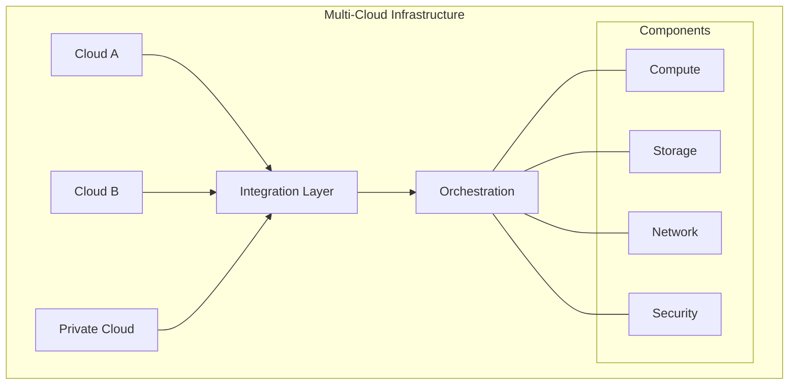
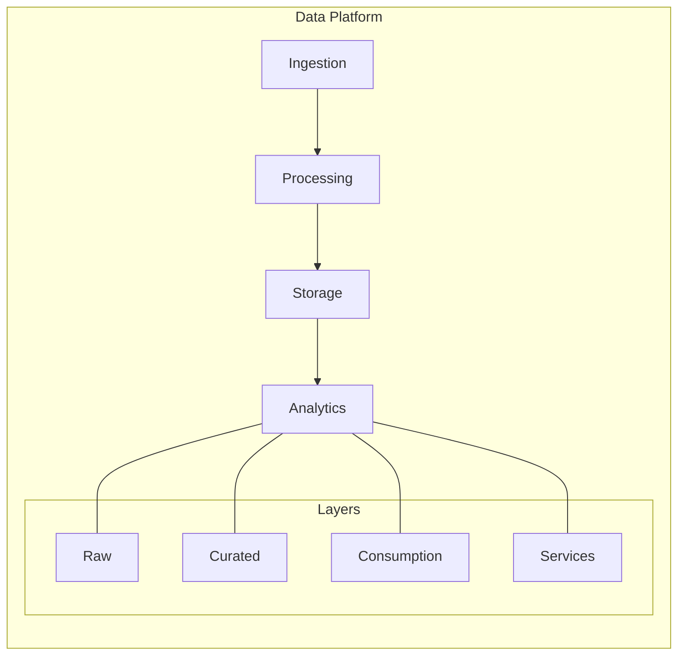
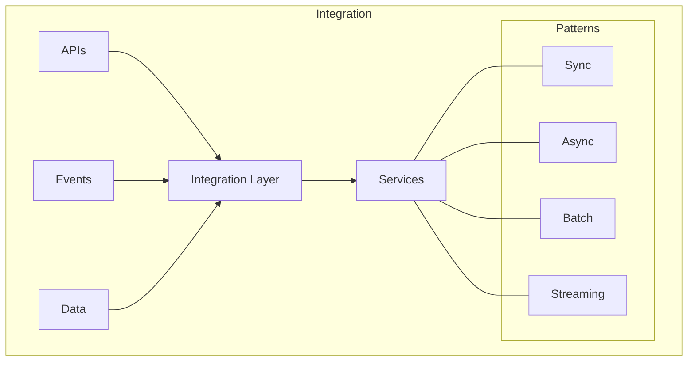
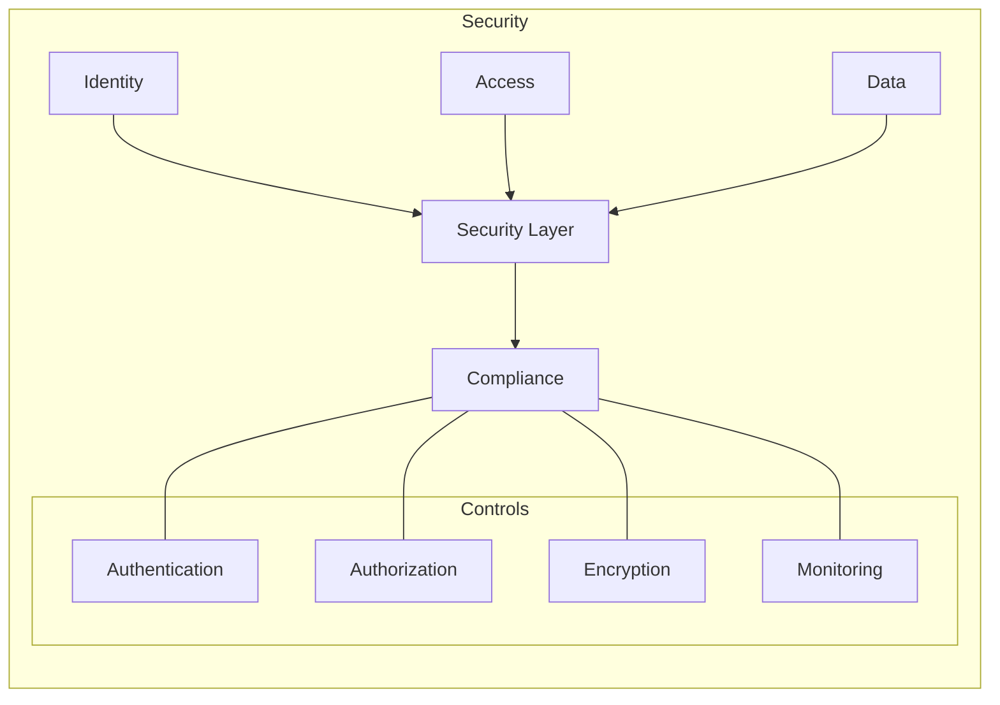
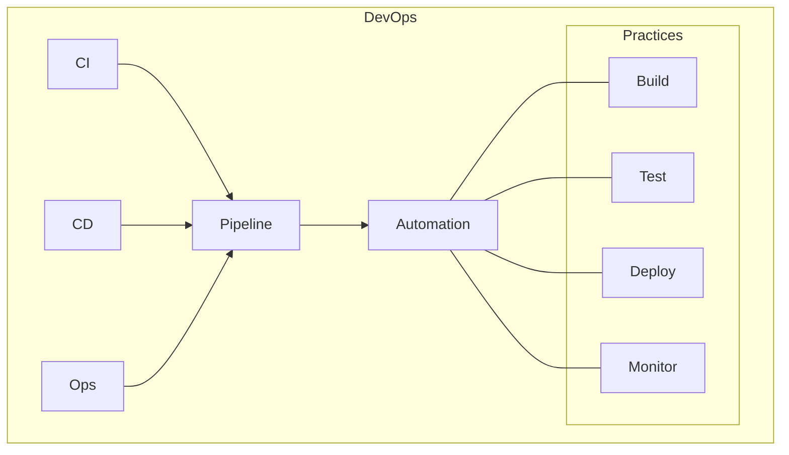
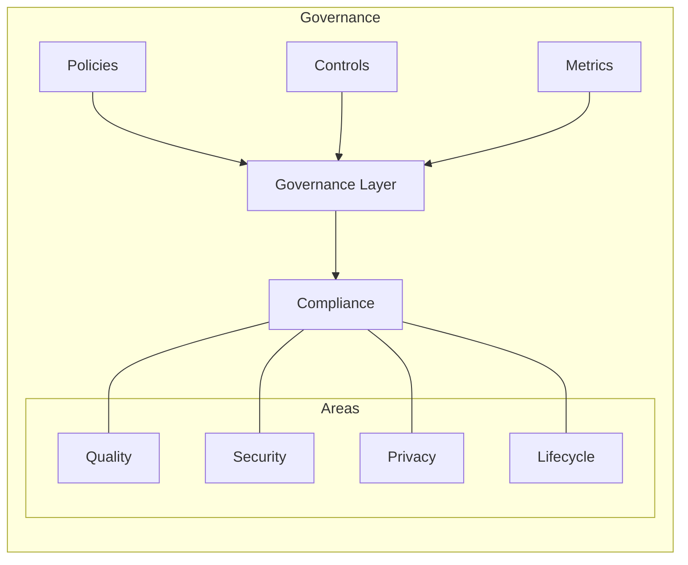
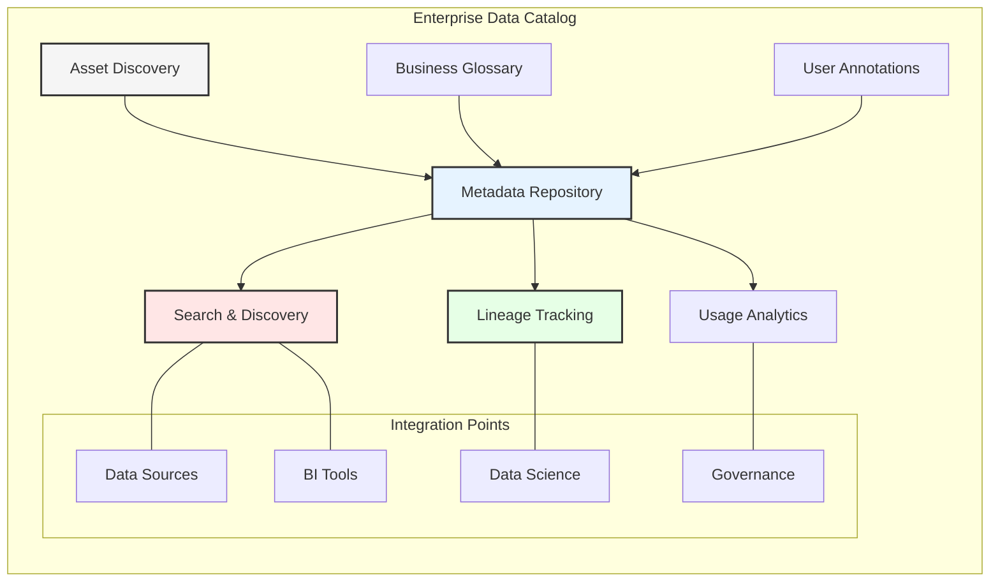
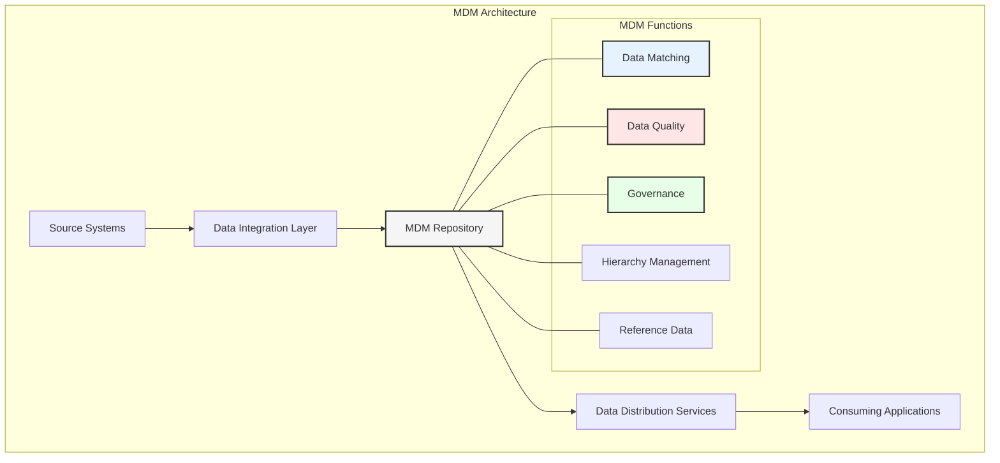
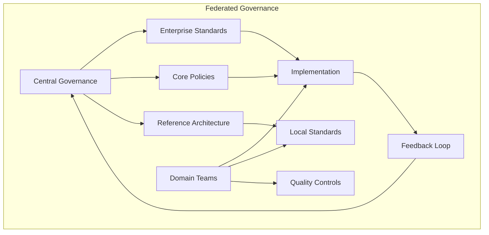
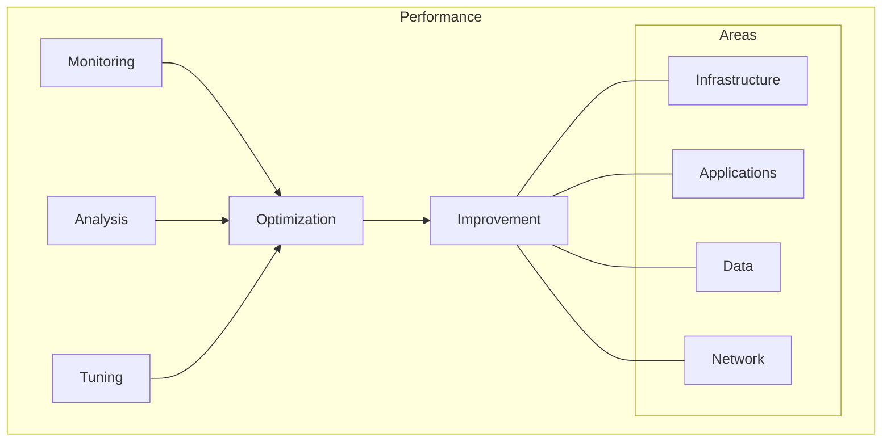

# Chapter 8: Implementation Strategy and Roadmap

## Introduction to Implementation Planning
Implementing an enterprise data architecture requires careful planning, stakeholder alignment, and a structured approach. This chapter provides a comprehensive roadmap for organizations embarking on data architecture transformation initiatives.


# Chapter 8: Implementation Guidelines

## Architecture Implementation

This chapter provides detailed technical guidelines for implementing a modern multi-cloud data architecture, building on the transformation framework outlined in Chapter 7. By following these guidelines, organizations can ensure a seamless transition to a scalable, secure, and efficient architecture that supports innovation and growth.

## Infrastructure Foundation

### 1. Cloud Platform Setup
- **Multi-Cloud Infrastructure:**
  - Leveraging multiple cloud providers, such as AWS, Azure, and private clouds, ensures resilience and flexibility.
  - Integration layers enable seamless communication between clouds, supporting hybrid and multi-cloud strategies.
  - Orchestration tools, such as Kubernetes, automate the deployment and management of applications across environments.

- **Core Components:**
  - Compute resources, including Kubernetes clusters and serverless functions, provide scalable and cost-effective processing power.
  - Storage solutions, such as object storage and data lakes, support diverse data types and workloads.
  - Networking components, including VPCs and service meshes, ensure secure and efficient data flow.



### 2. Infrastructure Components
```yaml
Core Components:
  Compute:
    - Kubernetes clusters
    - Serverless functions
    - Container services
    - Virtual machines
    
  Storage:
    - Object storage
    - Block storage
    - File systems
    - Data lakes
    
  Network:
    - VPCs/VNets
    - Load balancers
    - API gateways
    - Service mesh
```

## Data Architecture

### 1. Data Platform Design
- **Ingestion:**
  - Streaming pipelines capture real-time data from sources such as IoT devices and APIs, enabling low-latency processing.
  - Batch processes handle large volumes of data, supporting analytics and reporting use cases.
  - Change data capture (CDC) mechanisms ensure that updates in source systems are reflected in downstream systems.

- **Processing:**
  - Stream processing frameworks, such as Apache Kafka and AWS Kinesis, enable real-time analytics and event-driven workflows.
  - Batch processing tools, such as Apache Spark, handle large-scale data transformations and aggregations.

- **Storage:**
  - Data lakes provide a centralized repository for raw and processed data, supporting diverse analytics workloads.
  - Data warehouses enable fast and efficient querying of structured data, supporting business intelligence use cases.



### 2. Implementation Components
```yaml
Data Components:
  Ingestion:
    - Streaming pipelines
    - Batch processes
    - Change data capture
    - API integrations
    
  Processing:
    - Stream processing
    - Batch processing
    - Real-time analytics
    - Machine learning
    
  Storage:
    - Data lake
    - Data warehouse
    - Time series DB
    - Document stores
```

## Integration Framework

### 1. Integration Architecture
- **APIs:**
  - REST APIs and GraphQL provide standardized interfaces for accessing and manipulating data.
  - gRPC and web services enable high-performance communication between systems.

- **Events:**
  - Message queues and event streams decouple producers and consumers, improving scalability and resilience.
  - Pub/sub mechanisms enable real-time event-driven architectures, supporting dynamic workflows.

- **Data:**
  - ETL/ELT processes transform and load data into target systems, ensuring consistency and quality.
  - Data replication and federation enable seamless access to distributed data sources.



### 2. Integration Patterns
```yaml
Integration Patterns:
  Synchronous:
    - REST APIs
    - GraphQL
    - gRPC
    - Web services
    
  Asynchronous:
    - Message queues
    - Event streams
    - Pub/sub
    - Webhooks
    
  Data:
    - ETL/ELT
    - CDC
    - Replication
    - Federation
```

## Security Implementation

### 1. Security Architecture
- **Identity and Access Management:**
  - IAM and SSO solutions provide centralized control over user access, ensuring security and compliance.
  - Role-based and attribute-based access controls enforce fine-grained permissions.

- **Data Protection:**
  - Encryption mechanisms secure data at rest and in transit, protecting sensitive information.
  - Monitoring tools detect and respond to security incidents, ensuring system integrity.



### 2. Security Components
```yaml
Security Components:
  Identity:
    - IAM
    - SSO
    - MFA
    - Directory services
    
  Access:
    - RBAC
    - ABAC
    - Network security
    - API security
    
  Data:
    - Encryption
    - Masking
    - Classification
    - Governance
```

## DevOps Implementation

### 1. DevOps Architecture
- **CI/CD Pipelines:**
  - Automated pipelines streamline the build, test, and deployment processes, reducing time-to-market.
  - Source control systems, such as Git, enable versioning and collaboration.

- **Operations:**
  - Monitoring and logging tools provide visibility into system performance and health.
  - Auto-scaling mechanisms ensure that resources are allocated dynamically based on demand.



### 2. DevOps Components
```yaml
DevOps Components:
  CI/CD:
    - Source control
    - Build automation
    - Test automation
    - Deployment automation
    
  Operations:
    - Monitoring
    - Logging
    - Alerting
    - Auto-scaling
    
  Tools:
    - Git
    - Jenkins
    - Terraform
    - Prometheus
```

## Data Governance Implementation

### 1. Governance Framework
- **Policies:**
  - Data quality policies ensure that data is accurate, complete, and consistent.
  - Data privacy policies protect sensitive information, ensuring compliance with regulations.

- **Controls:**
  - Quality checks and access controls enforce governance policies, ensuring data integrity and security.
  - Audit trails and compliance checks provide transparency and accountability.



### 2. Governance Components
```yaml
Governance Components:
  Policies:
    - Data quality
    - Data privacy
    - Data retention
    - Data access
    
  Controls:
    - Quality checks
    - Access controls
    - Audit trails
    - Compliance checks
    
  Tools:
    - Metadata management
    - Data catalogs
    - Quality monitoring
    - Policy enforcement
```

### 3. Data Catalog Implementation

- **Business Drivers:**
  - Data discovery challenges in large, complex environments often result in duplicated efforts and incomplete analysis.
  - Regulatory requirements demand clear documentation of data assets, lineage, and usage.
  - Cross-domain analytics require understanding of available data assets across the organization.

- **Core Features:**
  - **Asset Discovery:** Automated scanning and profiling of data sources across the organization, including cloud storage, databases, and applications.
  - **Metadata Management:** Collection, organization, and enrichment of technical, business, and operational metadata.
  - **Search and Browse:** Intuitive interfaces for finding relevant data assets based on keywords, tags, and classifications.
  - **Data Lineage:** End-to-end visualization of data flows from source to consumption, supporting impact analysis and compliance.
  - **Business Glossary:** Standardized definitions of business terms, creating a common language across the organization.
  - **Collaboration:** Tools for sharing knowledge, adding context, and providing feedback on data assets.
  - **Active Usage Tracking:** Analytics on data consumption patterns to identify valuable assets and optimization opportunities.



- **Implementation Process:**
  1. **Assessment Phase:**
     - Inventory existing data assets and documentation
     - Define metadata requirements and standards
     - Evaluate catalog integration points with existing systems
     - Select key business domains for initial implementation

  2. **Deployment Phase:**
     - Install and configure the catalog solution
     - Connect to priority data sources for automated discovery
     - Import existing metadata from legacy systems
     - Develop custom connectors for proprietary systems

  3. **Adoption Phase:**
     - Train data stewards and business users
     - Populate business glossary and annotations
     - Integrate with analytics and governance workflows
     - Establish feedback mechanisms and continuous improvement processes

- **Technology Recommendations:**
  - **Collibra Data Intelligence Cloud:** Comprehensive data catalog with strong governance capabilities and business-friendly interface.
  - **Alation Data Catalog:** Collaborative platform with machine learning capabilities for automated metadata discovery.
  - **Informatica Enterprise Data Catalog:** Extensive connectivity options with AI-powered metadata discovery.
  - **AWS Glue Data Catalog:** Native AWS solution for cataloging data in S3, RDS, and other AWS services.
  - **Azure Purview:** Microsoft's unified data governance service for multi-cloud and on-premises environments.
  - **Google Data Catalog:** Fully managed, scalable metadata management service for Google Cloud.
  - **Open-source options:** Apache Atlas and Amundsen provide cost-effective catalog capabilities for organizations with technical expertise.

- **Key Metrics:**
  - Percentage of data assets cataloged
  - User adoption and active usage rates
  - Time saved in data discovery processes
  - Data quality improvements resulting from better visibility
  - Reduction in redundant data acquisitions and transformations

### 4. Master Data Management Implementation

- **Business Value:**
  - Enables 360-degree view of critical business entities (customers, products, suppliers)
  - Eliminates data inconsistencies and redundancies across systems
  - Supports regulatory compliance through standardized reference data
  - Improves operational efficiency and decision-making accuracy
  - Enables reliable reporting and analytics with trusted master data

- **Core MDM Functions:**
  - **Data Integration:** Consolidating master data from multiple sources with configurable matching rules.
  - **Data Quality:** Cleansing, standardizing, and enriching master data to ensure accuracy and completeness.
  - **Data Governance:** Establishing stewardship processes and workflows for maintaining master data.
  - **Data Distribution:** Synchronizing master data across consuming systems and applications.
  - **Hierarchy Management:** Managing complex relationships between master data entities.
  - **Reference Data Management:** Maintaining standardized code sets and taxonomies.



- **Implementation Styles:**
  - **Registry Style:** Maintains references to source system records without storing actual master data.
  - **Consolidation Style:** Aggregates master data from source systems for reporting and analytics.
  - **Coexistence Style:** Maintains a master copy while allowing source systems to retain local copies.
  - **Centralization Style:** Creates a single version of truth that source systems must use.
  - **Hybrid Style:** Combines multiple approaches based on data domains and business needs.

- **Implementation Process for Airline Industry:**
  1. **Discovery and Planning:**
     - Identify key master data domains (passengers, flights, aircraft, crew)
     - Document current state of data quality and integration
     - Define target data model and governance processes
     - Select implementation style for each domain

  2. **Data Model and Standards:**
     - Design canonical data models for master entities
     - Define data quality rules and standards
     - Establish unique identifier strategy
     - Document relationship models between domains

  3. **Technology Implementation:**
     - Deploy MDM platform with required connectors
     - Configure matching and merge rules
     - Implement data quality processes
     - Set up distribution mechanisms

  4. **Governance Operationalization:**
     - Train data stewards and business owners
     - Implement workflow for data changes and exceptions
     - Establish ongoing monitoring and quality metrics
     - Document policies and procedures

- **Technology Recommendations:**
  - **Informatica MDM:** Comprehensive MDM solution with strong data quality capabilities and industry-specific accelerators.
  - **IBM InfoSphere Master Data Management:** Enterprise-grade MDM with multiple implementation styles and robust governance features.
  - **TIBCO EBX:** Versatile multi-domain MDM platform with advanced data modeling capabilities.
  - **Reltio Cloud:** Cloud-native MDM platform with AI capabilities and a focus on customer data.
  - **Profisee Platform:** Flexible, Microsoft-centric MDM solution with strong SQL Server integration.
  - **Semarchy xDM:** Agile, multi-vector MDM platform supporting iterative implementation approaches.
  - **SAP Master Data Governance:** Deep integration with SAP ERP and business applications.

- **Key Success Metrics:**
  - Data accuracy and completeness rates
  - Reduction in duplicate records
  - System integration efficiency
  - Time to onboard new data sources
  - Business process improvements (e.g., faster customer onboarding)
  - Analytics reliability and consistency

- **Aviation Industry Use Cases:**
  - **Customer MDM:** Creating unified passenger profiles across reservation systems, loyalty programs, and service interactions.
  - **Flight Operations MDM:** Standardizing aircraft, airport, and route information across planning and operations systems.
  - **Product MDM:** Managing service offerings, fare classes, and ancillary products consistently across sales channels.
  - **Supplier MDM:** Maintaining accurate vendor information for procurement, maintenance, and financial systems.

### 5. Balancing Centralized Governance and Decentralized Implementation

- **The Governance Paradox:**
  - Organizations need both standardization for consistency and autonomy for innovation.
  - Centralized governance ensures enterprise-wide compliance while decentralized implementation enables domain-specific optimization.
  - This balanced approach empowers domain teams while maintaining organizational cohesion.

- **Federated Governance Model:**
  - **Central Governance Body:**
    - Establishes enterprise-wide policies, standards, and reference data
    - Defines minimum quality thresholds and compliance requirements
    - Provides governance tools, frameworks, and methodologies
    - Measures and reports on cross-domain governance metrics
  
  - **Domain-Specific Implementation:**
    - Applies central standards within domain-specific contexts
    - Implements quality controls tailored to domain data characteristics
    - Contributes domain expertise to enterprise standards evolution
    - Manages day-to-day governance operations within the domain



- **Operational vs. Analytical Data Governance:**

  - **Operational Data Governance:**
    - **Focus Areas:**
      - Transaction integrity and data consistency
      - Real-time quality validation
      - System-of-record determination
      - Data synchronization across operational systems
    
    - **Key Metrics:**
      - Transaction error rates
      - System availability and response times
      - Data synchronization latency
      - Business process completion rates
    
    - **Implementation Approach:**
      - Embed quality controls within business processes
      - Implement real-time validation rules
      - Establish clear data ownership per transaction type
      - Define automated remediation workflows for exceptions

  - **Analytical Data Governance:**
    - **Focus Areas:**
      - Data trustworthiness and fitness-for-purpose
      - Historical accuracy and consistency
      - Metadata completeness and documentation
      - Analytical model governance and versioning
    
    - **Key Metrics:**
      - Data quality dimensions (completeness, accuracy, consistency)
      - Data catalog coverage and usage
      - Business glossary adoption rates
      - Self-service analytics compliance scores
    
    - **Implementation Approach:**
      - Develop comprehensive data quality frameworks
      - Implement fitness-for-purpose quality metrics
      - Create domain-specific data quality rules
      - Establish analytical model governance processes

- **Implementation Best Practices:**

  - **Organizational Structure:**
    - Establish a central Data Governance Office (DGO) for enterprise standards
    - Designate domain data owners with clear accountability
    - Create cross-functional governance councils with both central and domain representatives
    - Implement a tiered decision-making framework (enterprise, domain, team)

  - **Technology Enablers:**
    - Automated policy enforcement through data quality tools
    - Self-service governance dashboards for domain teams
    - Centralized metadata repository with federated contribution model
    - Integrated workflow for governance processes across domains

  - **Process Integration:**
    - Embed governance checks into CI/CD pipelines for data products
    - Integrate quality gates into data engineering workflows
    - Implement automated compliance reporting with domain-specific views
    - Create governance feedback loops between central and domain teams

- **Managing the Transition:**
  - Start with high-value, high-risk domains to demonstrate impact
  - Incrementally expand governance coverage across domains
  - Balance prescriptive controls for critical data with guidance for non-critical data
  - Regularly review and adjust the central-local balance based on outcomes

- **Aviation Industry Example:**
  - **Central Governance:**
    - Enterprise-wide passenger data privacy standards
    - Flight safety reporting requirements
    - Regulatory compliance frameworks
    - Corporate data security policies

  - **Domain Implementation:**
    - Customer Experience domain: Passenger profile quality rules tailored to loyalty program needs
    - Flight Operations domain: Flight data quality standards optimized for operational efficiency
    - Maintenance domain: Equipment data governance adapted to specific aircraft types
    - Finance domain: Revenue data quality controls aligned with accounting standards

- **Measuring Success:**
  - Balance scorecard measuring both governance compliance and domain innovation
  - Regular assessment of governance overhead vs. business value
  - Feedback mechanisms to identify areas of over/under governance
  - Executive-level reporting on governance effectiveness across domains

## Performance Optimization

### 1. Performance Framework
- **Infrastructure:**
  - Resource scaling and load balancing optimize the utilization of compute and storage resources.
  - Caching strategies reduce latency and improve response times.

- **Applications:**
  - Code optimization and query tuning enhance the performance of applications and databases.
  - Async processing and connection pooling improve throughput and scalability.



### 2. Optimization Areas
```yaml
Optimization Areas:
  Infrastructure:
    - Resource scaling
    - Load balancing
    - Caching
    - Distribution
    
  Applications:
    - Code optimization
    - Query tuning
    - Connection pooling
    - Async processing
    
  Data:
    - Indexing
    - Partitioning
    - Compression
    - Archiving
```

## Implementation Checklist

### 1. Technical Requirements
- Infrastructure setup
- Security implementation
- Integration framework
- Data platform
- DevOps pipeline
- Governance controls

### 2. Operational Requirements
- Monitoring setup
- Backup procedures
- Disaster recovery
- SLA management
- Support model
- Documentation

## Best Practices

### 1. Implementation Guidelines
- Follow cloud-native principles
- Implement security by design
- Automate everything possible
- Monitor continuously
- Document thoroughly
- Test extensively

### 2. Technical Standards
- **Architecture:**
  - Cloud-native design
  - Microservices patterns
  - API-first approach
  - Event-driven design

- **Development:**
  - Coding standards
  - Testing practices
  - Security guidelines
  - Documentation requirements

- **Operations:**
  - SLA definitions
  - Monitoring standards
  - Support procedures
  - Incident management

## Next Steps

The next chapter will present real-world case studies demonstrating successful implementations of these patterns and practices.