# Chapter 9: Case Studies in Enterprise Data Architecture

## Introduction to Real-World Applications
Case studies provide valuable insights into how theoretical concepts are applied in practical scenarios. This chapter examines several real-world implementations of enterprise data architecture across different industries.


## Introduction to GlobalAir's Experience

This chapter presents detailed case studies from GlobalAir's implementation of a modern data architecture, focusing on specific challenges, solutions, and outcomes across different operational domains. These real-world examples illustrate the transformative impact of adopting advanced data strategies and technologies.


## Case Study 1: Flight Operations Optimization

### Challenge
GlobalAir needed to optimize flight operations across 200+ aircraft operating in 50+ countries, handling real-time data from multiple sources while ensuring regulatory compliance. The complexity of managing such a vast network required innovative solutions to enhance efficiency and safety.

### Solution Architecture
- **Data Collection:**
  - Aircraft telemetry data was ingested in real-time using AWS IoT Core, enabling continuous monitoring of flight parameters.
  - Weather data from multiple services was integrated to provide accurate and timely updates for route planning.
  - Flight plans were dynamically updated via APIs, ensuring alignment with operational requirements.

- **Processing Pipeline:**
  - AWS Kinesis was used for streaming data processing, enabling real-time analytics and decision-making.
  - AWS Lambda functions transformed raw data into actionable insights, supporting predictive maintenance and fuel optimization.
  - SageMaker models predicted potential disruptions, allowing proactive measures to be taken.

### Results
- 15% fuel efficiency improvement, reducing operational costs and environmental impact.
- 23% reduction in delays, enhancing customer satisfaction and operational reliability.
- 30% better disruption handling, minimizing the impact of unforeseen events.
- $50M annual cost savings, demonstrating the financial benefits of data-driven operations.

```mermaid
graph TB
    subgraph "Flight Ops Solution"
        A[Data Collection] --> B[Real-time Processing]
        B --> C[Decision Engine]
        C --> D[Operations Control]
        
        subgraph "AWS Services"
            E[IoT Core]
            F[Kinesis]
            G[SageMaker]
            H[Lambda]
        end
        
        D --- E
        D --- F
        D --- G
        D --- H
    end
    
    style A fill:#ff9900
    style B fill:#ff9900
    style C fill:#ff9900
    style D fill:#ff9900
```



### Implementation Details
```yaml
Data Sources:
  - Aircraft Telemetry:
      Format: ARINC 429
      Frequency: Real-time
      Volume: 500GB/day/aircraft
      
  - Weather Data:
      Format: BUFR/GRIB
      Frequency: 15-minute intervals
      Sources: Multiple weather services
      
  - Flight Plans:
      Format: JSON
      Updates: Dynamic
      Integration: Direct via API

Processing Pipeline:
  Ingestion:
    - AWS IoT Core for telemetry
    - Event Bridge for weather
    - API Gateway for flight plans
    
  Processing:
    - Kinesis for streaming
    - Lambda for transformations
    - SageMaker for predictions
    
  Storage:
    - S3 for raw data
    - DynamoDB for real-time
    - Redshift for analytics
```

### Results
- 15% fuel efficiency improvement
- 23% reduction in delays
- 30% better disruption handling
- $50M annual cost savings

## Case Study 2: Revenue Management Transformation

### Challenge
Modernize the legacy revenue management system to enable dynamic pricing and real-time market response while maintaining system stability during the transition. The goal was to maximize revenue and improve load factors through data-driven strategies.

### Solution Architecture
- **Data Collection:**
  - Competitor pricing data was collected to inform dynamic pricing strategies.
  - Historical booking data was analyzed to identify trends and patterns.
  - Market demand and customer behavior data were integrated to enhance forecasting accuracy.

- **Analytics Engine:**
  - Azure Synapse was used for advanced analytics, enabling demand forecasting and price elasticity modeling.
  - Machine learning models segmented customers and optimized pricing strategies based on real-time market conditions.

### Results
- 12% revenue increase, driven by optimized pricing and inventory management.
- 25% better load factors, improving operational efficiency and profitability.
- 18% ancillary revenue growth, highlighting the value of personalized offers and services.
- 40% faster market response, enabling agility in a competitive environment.


### Implementation Details
```yaml
System Components:
  Data Collection:
    - Competitor pricing
    - Historical bookings
    - Market demand
    - Customer behavior
    
  Analytics:
    Engine: Azure Synapse
    Models:
      - Demand forecasting
      - Price elasticity
      - Customer segmentation
      
  Pricing Engine:
    - Real-time pricing
    - Dynamic inventory
    - Route optimization
    - Ancillary services
```

### Results
- 12% revenue increase
- 25% better load factors
- 18% ancillary revenue growth
- 40% faster market response

## Case Study 3: Customer Experience Platform

### Challenge
Create a unified customer experience platform integrating booking, loyalty, and service data across multiple channels while enabling personalization. The objective was to enhance customer satisfaction and loyalty through data-driven insights.

### Solution Architecture
- **Customer Data Platform:**
  - Data from booking systems, loyalty programs, and service records was integrated to create a comprehensive customer profile.
  - Real-time events and batch processing ensured that the platform remained up-to-date and responsive.

- **Analytics:**
  - Customer segmentation models identified key demographics and preferences.
  - Journey analytics provided insights into customer interactions and pain points.
  - Preference modeling enabled personalized recommendations and offers.

### Results
- 35% increase in satisfaction, reflecting the impact of personalized and seamless experiences.
- 28% higher loyalty engagement, driven by targeted rewards and offers.
- 45% faster issue resolution, improving customer trust and retention.
- 20% reduction in churn, highlighting the effectiveness of proactive engagement strategies.


### Implementation Details
```yaml
Platform Components:
  Customer Data Platform:
    Source Systems:
      - Booking system
      - Loyalty program
      - Service records
      - Social media
      
    Integration:
      - Real-time events
      - Batch processing
      - API integration
      - Data quality
      
    Analytics:
      - Customer segmentation
      - Journey analytics
      - Preference modeling
      - Churn prediction
```

### Results
- 35% increase in satisfaction
- 28% higher loyalty engagement
- 45% faster issue resolution
- 20% reduction in churn

## Case Study 4: Predictive Maintenance

### Challenge
Implement a predictive maintenance system for the aircraft fleet, integrating IoT data with maintenance records to prevent disruptions. The aim was to enhance safety and reduce maintenance costs through proactive measures.

### Solution Architecture
- **Data Collection:**
  - Engine sensors and flight data provided real-time insights into aircraft performance.
  - Maintenance logs and part inventory data were integrated to support predictive analytics.

- **Processing:**
  - Stream processing frameworks analyzed sensor data to detect anomalies and predict failures.
  - Machine learning models identified patterns and trends, enabling timely maintenance actions.

### Results
- 45% reduction in disruptions, ensuring smoother operations and improved safety.
- 30% maintenance cost savings, demonstrating the financial benefits of predictive strategies.
- 25% better parts management, optimizing inventory and reducing waste.
- 60% faster issue detection, minimizing downtime and operational impact.


### Implementation Details
```yaml
System Architecture:
  Data Collection:
    - Engine sensors
    - Flight data
    - Maintenance logs
    - Part inventory
    
  Processing:
    - Stream processing
    - Feature engineering
    - Model training
    - Alert generation
    
  Integration:
    - MRO systems
    - Supply chain
    - Crew scheduling
    - Documentation
```

### Results
- 45% reduction in disruptions
- 30% maintenance cost savings
- 25% better parts management
- 60% faster issue detection

## Case Study 5: Multi-Cloud Data Mesh

### Challenge
Implement a data mesh architecture across AWS and Azure to enable domain-oriented data products while maintaining governance. The goal was to empower teams with self-service capabilities and improve data accessibility.

### Solution Architecture
- **Domain Structure:**
  - Flight operations data products were hosted on AWS, supporting use cases such as flight tracking and crew management.
  - Customer experience data products were hosted on Azure, enabling insights into loyalty analytics and service performance.

- **Integration:**
  - Data integration layers ensured seamless communication between domains, supporting cross-functional analytics.
  - Governance frameworks enforced policies and standards, ensuring data quality and compliance.

### Results
- 40% faster data access, enabling timely decision-making and innovation.
- 50% reduced development time, accelerating the delivery of data products.
- 35% cost optimization, reflecting the efficiency of the data mesh approach.
- 60% better data quality, enhancing trust and usability.


### Implementation Details
```yaml
Domain Structure:
  Flight Operations:
    Platform: AWS
    Products:
      - Flight tracking
      - Crew management
      - Weather integration
      
  Customer Experience:
    Platform: Azure
    Products:
      - Customer 360
      - Loyalty analytics
      - Service insights
```

### Results
- 40% faster data access
- 50% reduced development time
- 35% cost optimization
- 60% better data quality

## Key Learnings

### 1. Technical Insights
- Start with a strong foundation, ensuring that infrastructure and governance are in place.
- Implement incrementally, focusing on quick wins to build momentum and confidence.
- Maintain flexibility, allowing for adjustments and improvements as needs evolve.
- Focus on integration, ensuring seamless communication between systems and domains.
- Ensure scalability, designing solutions that can grow with the organization.

### 2. Organizational Learnings
- Change management is crucial, addressing resistance and fostering a culture of innovation.
- Skills development is essential, equipping teams with the knowledge and tools needed to succeed.
- Clear communication is needed, keeping stakeholders informed and engaged throughout the process.
- Stakeholder alignment is vital, ensuring that all parties are working towards common goals.
- Cultural adaptation is required, embracing new ways of working and thinking.

## Success Factors

### 1. Critical Elements


### 2. Best Practices
- Strong governance ensures that data and systems are managed effectively.
- Clear ownership assigns responsibility and accountability for outcomes.
- Regular feedback enables continuous improvement and adaptation.
- Continuous improvement fosters innovation and growth.
- Measured outcomes demonstrate the value and impact of initiatives.

## Next Steps

The final chapter will explore future trends and emerging technologies that will shape the next evolution of airline data architecture.