# Chapter 10: Future Trends in Enterprise Data Architecture

## Introduction to Emerging Trends
The field of enterprise data architecture continues to evolve rapidly with new technologies and paradigms. This chapter explores the emerging trends that will shape the future of data architecture in the coming years.


## Evolution of Data Architecture

Drawing from GlobalAir's transformation journey and industry trends, this chapter explores emerging technologies and approaches that will shape the future of airline data architecture.

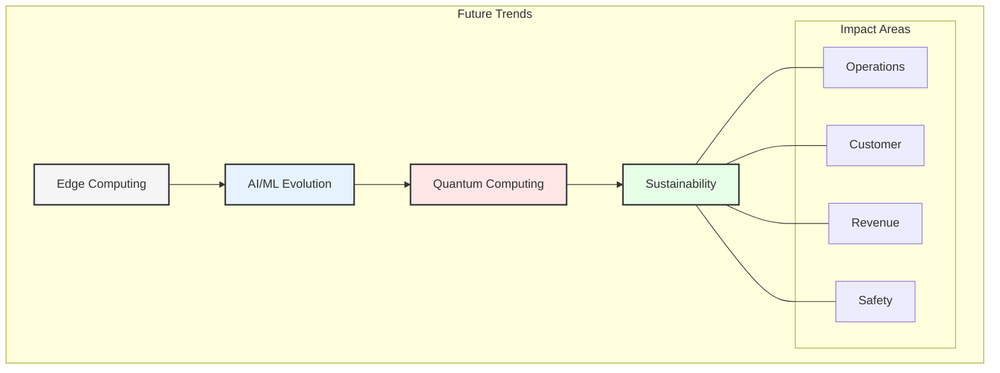

## Edge Computing and IoT

### 1. Aircraft Edge Computing
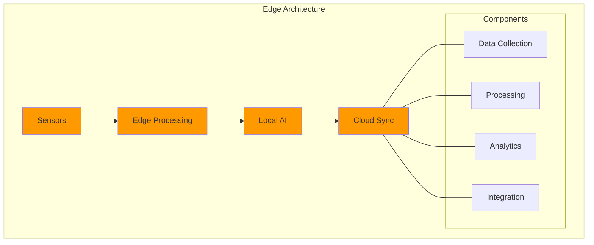

### 2. Implementation Roadmap
```yaml
Edge Capabilities:
  Real-time Processing:
    - Engine performance
    - Flight parameters
    - Weather conditions
    - System health
    
  Local Intelligence:
    - Predictive maintenance
    - Flight optimization
    - Safety monitoring
    - Resource management
    
  Cloud Integration:
    - Delta syncs
    - Model updates
    - Configuration changes
    - Analytics feedback
```

## Advanced AI/ML Applications

### 1. Autonomous Operations
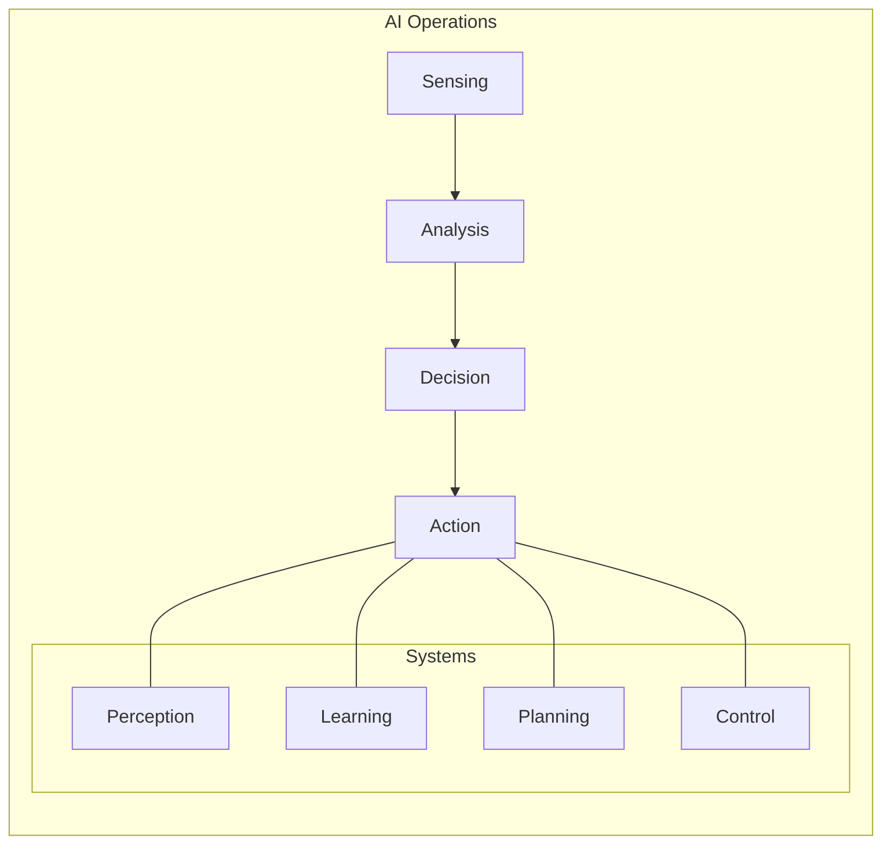

### 2. Customer Experience
```yaml
AI Applications:
  Personalization:
    - Dynamic pricing
    - Service customization
    - Journey optimization
    - Communication
    
  Predictive Analytics:
    - Demand forecasting
    - Behavior modeling
    - Risk assessment
    - Resource planning
    
  Automation:
    - Customer service
    - Booking process
    - Disruption management
    - Loyalty programs
```

## Quantum Computing Applications

### 1. Optimization Problems
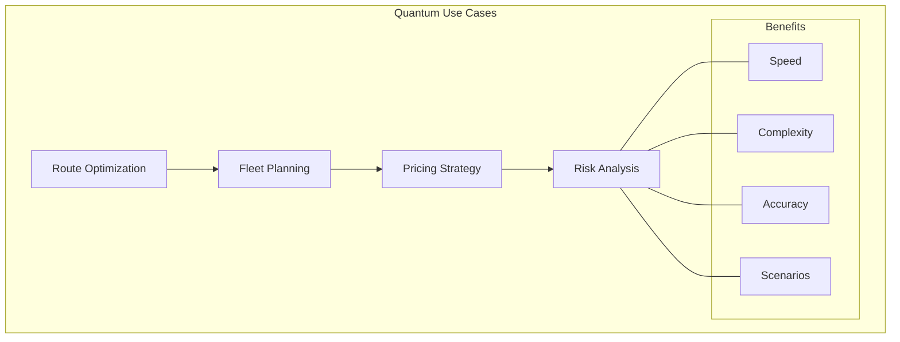

### 2. Implementation Strategy
```yaml
Quantum Roadmap:
  Phase 1 - Research:
    - Use case identification
    - Partner selection
    - Technology assessment
    - Pilot planning
    
  Phase 2 - Experimentation:
    - Algorithm development
    - Small-scale testing
    - Performance evaluation
    - Integration planning
    
  Phase 3 - Implementation:
    - Infrastructure setup
    - System integration
    - Process adaptation
    - Skills development
```

## Sustainability and Green Computing

### 1. Environmental Impact
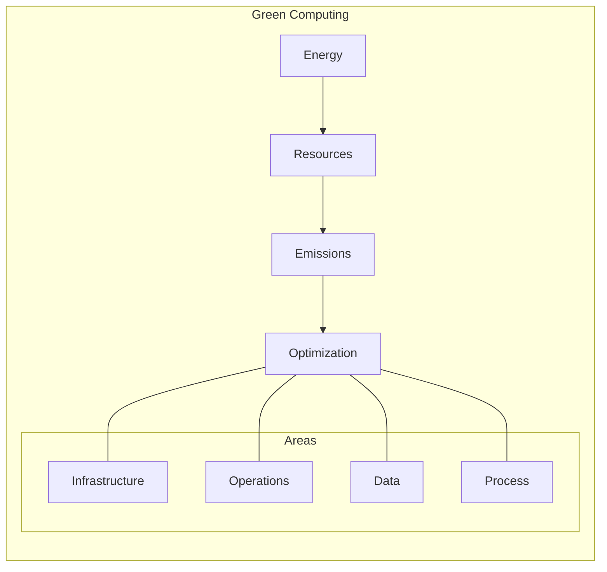

### 2. Implementation Framework
```yaml
Green Initiatives:
  Infrastructure:
    - Energy-efficient hardware
    - Renewable power sources
    - Cooling optimization
    - Resource sharing
    
  Operations:
    - Workload optimization
    - Automated scaling
    - Efficient algorithms
    - Data lifecycle management
    
  Monitoring:
    - Energy consumption
    - Carbon footprint
    - Resource utilization
    - Environmental impact
```

## Data Security Evolution

### 1. Zero Trust Architecture
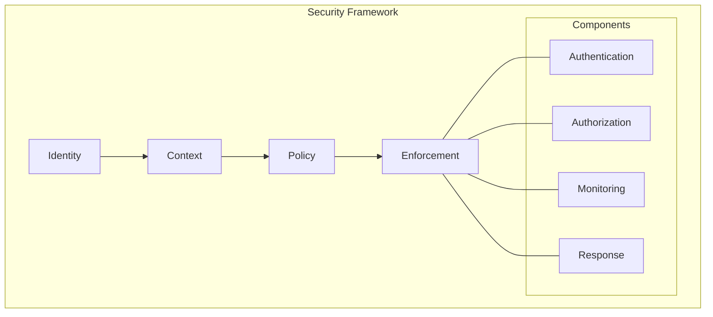

### 2. Implementation Plan
```yaml
Security Evolution:
  Zero Trust:
    - Identity verification
    - Context awareness
    - Policy enforcement
    - Continuous monitoring
    
  Data Protection:
    - Encryption advances
    - Privacy enhancement
    - Access control
    - Audit capabilities
    
  Threat Management:
    - AI-driven detection
    - Automated response
    - Risk prediction
    - Incident handling
```

## Multi-Cloud Evolution

### 1. Advanced Integration
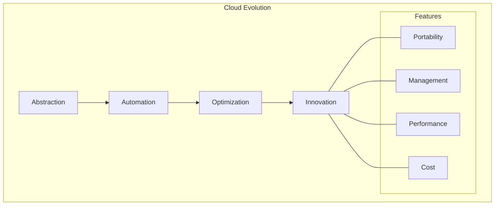

### 2. Future Architecture
```yaml
Cloud Strategy:
  Infrastructure:
    - Cloud-agnostic design
    - Automated deployment
    - Dynamic optimization
    - Cost management
    
  Services:
    - Unified management
    - Cross-cloud services
    - Hybrid operations
    - Edge integration
    
  Innovation:
    - New service models
    - Advanced analytics
    - AI integration
    - Edge computing
```

## Data Mesh Evolution

### 1. Advanced Capabilities
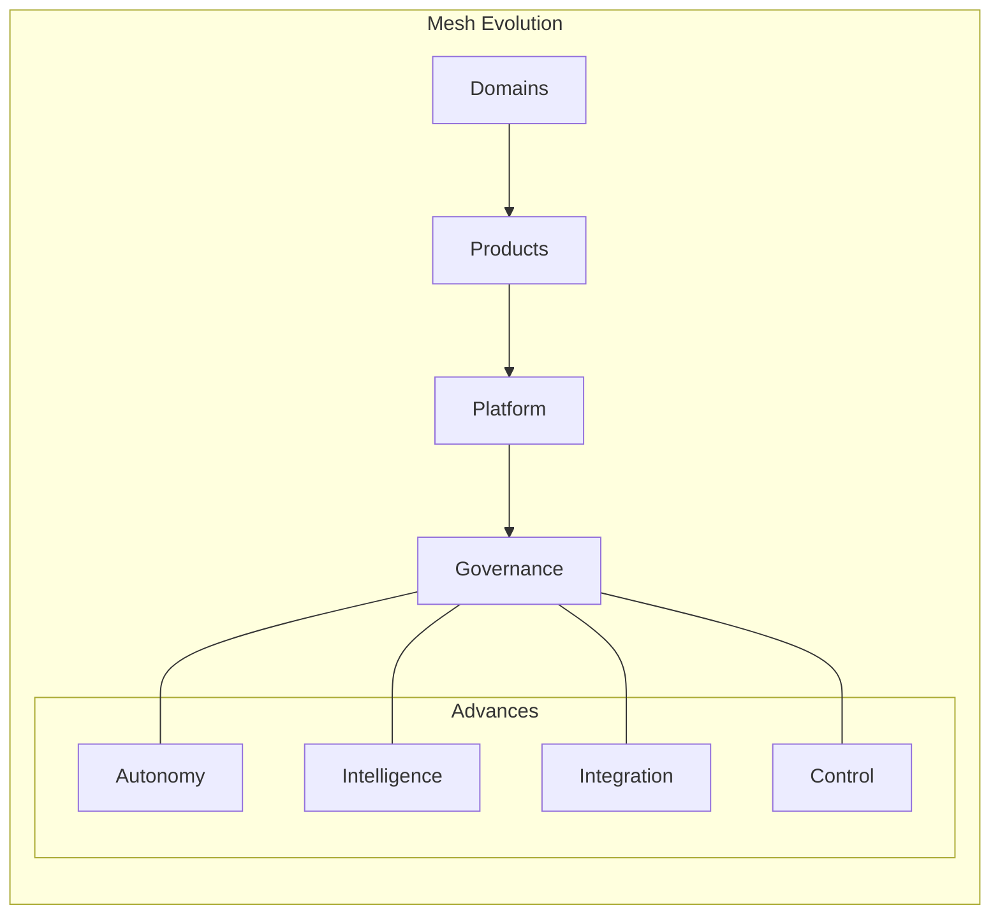

### 2. Implementation Vision
```yaml
Future Mesh:
  Domain Evolution:
    - Greater autonomy
    - Enhanced capabilities
    - Advanced analytics
    - AI integration
    
  Platform Features:
    - Self-service expansion
    - Automated governance
    - Intelligent optimization
    - Advanced security
    
  Integration:
    - Seamless connectivity
    - Real-time sync
    - Automated discovery
    - Enhanced monitoring
```

## Future of Data Management Technologies

### 1. Data Lakehouse Evolution
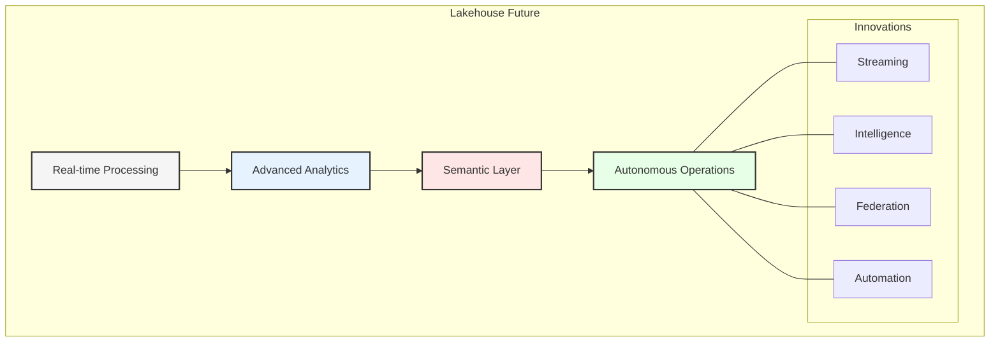

- **Emerging Capabilities:**
  - **Real-time Analytics Convergence:** Elimination of the boundary between batch and streaming data processing, enabling unified analytics across all data velocities.
  - **Intelligent Data Optimization:** AI-driven storage tiering, data placement, and query optimization that continuously learns from workload patterns.
  - **Semantic Layer Enhancement:** Evolution of metadata management into a true knowledge layer that understands business meaning beyond technical definitions.
  - **Unified Compute Framework:** Seamless processing across disparate storage formats without data movement or transformation.
  - **Universal ACID Transactions:** Extended transaction support across all data types and sources within the lakehouse.

- **Technology Forecasts:**
  - **Open Table Format Standardization:** Convergence of Delta Lake, Iceberg, and Hudi toward a universal standard for open data tables.
  - **Cloud-Native Optimization:** Specialized lakehouse services from major cloud providers that leverage proprietary hardware accelerators.
  - **Edge-to-Lakehouse Pipelines:** Seamless integration of IoT and edge computing data directly into lakehouse architectures.
  - **Quantum-Ready Storage Formats:** New storage paradigms designed to take advantage of quantum computing capabilities for advanced analytics.
  - **Multi-Modal Data Processing:** Native support for diverse data types including vector embeddings, graphs, spatial data, and time-series within unified lakehouse environments.

- **Airline Industry Applications:**
  - **Predictive Maintenance Revolution:** Real-time analysis of aircraft sensor data against historical maintenance records for just-in-time interventions.
  - **Dynamic Pricing Optimization:** Microsecond-level fare adjustments based on comprehensive market, inventory, and customer insight data.
  - **Operational Twin Integration:** Digital twins of airport operations embedded directly within the lakehouse for simulation and optimization.

### 2. Data Catalog Innovation

```yaml
Catalog Evolution:
  Active Metadata:
    - Self-updating metadata
    - Automated data quality
    - Usage-driven recommendations
    - Context-aware policies
    
  Intelligence:
    - Natural language interfaces
    - Automated knowledge graph
    - AI-generated documentation
    - Predictive data discovery
    
  Integration:
    - Code-to-data linkage
    - Cross-cloud federation
    - Data product encapsulation
    - Mesh domain alignment
```

- **Transformative Capabilities:**
  - **Active Metadata Management:** Evolution from passive metadata repositories to active systems that drive automated governance, quality, and discovery.
  - **AI-Powered Data Storytelling:** Automated generation of data narratives that explain data assets, their relationships, and potential value to users.
  - **Knowledge Graph Integration:** Moving from linear metadata to graph-based representations that capture complex relationships across the data ecosystem.
  - **Natural Language Interfaces:** Conversational access to data catalogs that understand business terminology and user intent.
  - **Predictive Data Discovery:** Recommendation systems that anticipate user needs and proactively surface relevant data assets.

- **Implementation Outlook:**
  - **Federated Discovery:** Cross-catalog search and discovery capabilities that span organizational boundaries, enabling secure collaboration.
  - **Self-Healing Documentation:** Automated detection and correction of outdated or inaccurate metadata and documentation.
  - **Collaborative Intelligence:** Learning systems that improve catalog effectiveness based on collective user interactions and feedback.
  - **DataOps Integration:** Tight coupling between catalogs and the CI/CD pipeline for data, enabling automated testing and validation.
  - **Just-in-Time Governance:** Context-aware policies that adapt to usage patterns, data sensitivity, and compliance requirements.

- **Aviation Use Cases:**
  - **Cross-Partner Data Exchange:** Federated catalogs that enable airlines, airports, and service providers to discover and access shared data assets.
  - **Regulatory Intelligence:** Automated identification and documentation of data assets subject to changing aviation regulations.
  - **Operational Knowledge Base:** Unified view of data assets that bridges operational silos between flight operations, maintenance, and customer service.

### 3. Master Data Management Advancement

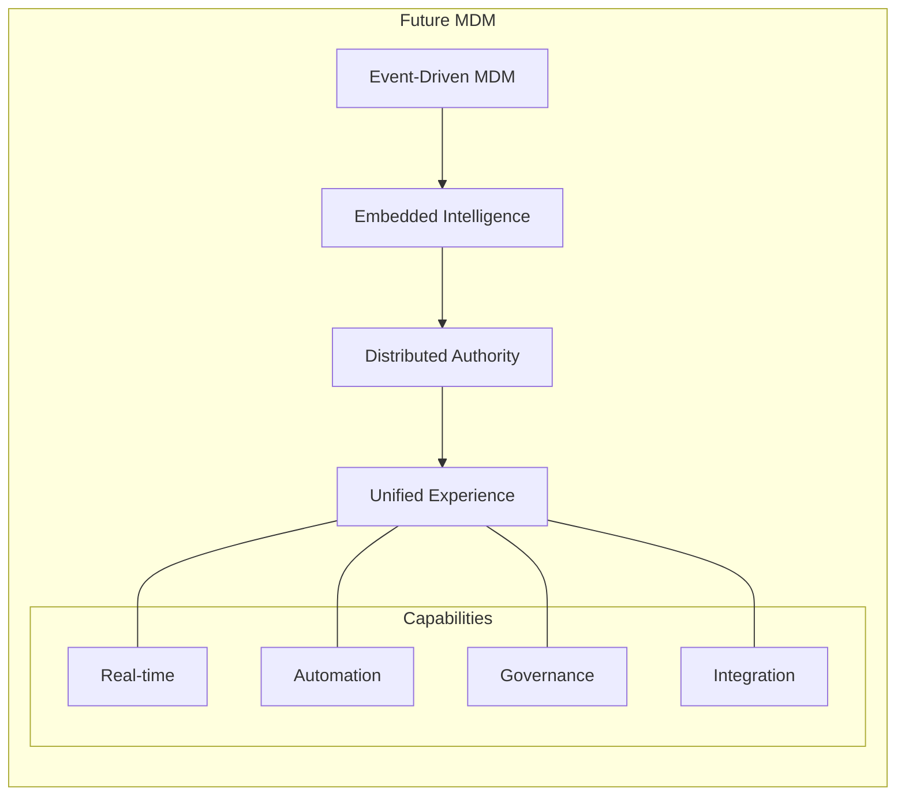

- **Next-Generation Capabilities:**
  - **Event-Driven Master Data:** Evolution from batch-oriented to real-time, event-driven MDM that instantly propagates changes.
  - **Distributed Governance Models:** Hybrid approaches that balance central control with domain-specific authority aligned with data mesh principles.
  - **AI-Powered Data Stewardship:** Machine learning assistance for matching, merging, and maintaining master data with minimal human intervention.
  - **Context-Aware Entity Resolution:** Advanced matching algorithms that consider transactional and behavioral data for entity resolution.
  - **Zero-Touch Onboarding:** Automated discovery and integration of new master data sources with minimal configuration.

- **Technical Innovations:**
  - **Graph-Based Master Data:** Transition from relational to graph-based master data models that better capture complex entity relationships.
  - **API-First MDM:** Composable MDM services accessible through standardized APIs rather than monolithic MDM platforms.
  - **DevOps for MDM:** Applying CI/CD principles to master data models, enabling versioning and automated testing of data models.
  - **Embedded MDM Services:** Master data capabilities integrated directly into business applications rather than standalone systems.
  - **Blockchain for Shared MDM:** Distributed ledger approaches for cross-organization master data that requires decentralized trust.

- **Airline Industry Applications:**
  - **Global Customer Identity:** Cross-airline customer identity resolution supporting alliance-wide customer experience initiatives.
  - **Dynamic Product Catalog:** Real-time mastering of evolving product and service offerings across all distribution channels.
  - **Partner Network Management:** Graph-based supplier and partner data modeling to capture complex ecosystem relationships.
  - **Regulatory Entity Management:** Automated maintenance of aircraft, crew, and route regulatory data across jurisdictions.

## Preparing for the Future

### 1. Strategic Planning
- Technology assessment
- Capability development
- Infrastructure readiness
- Skills preparation
- Cultural adaptation

### 2. Implementation Approach
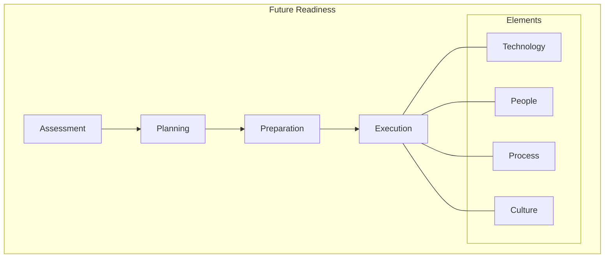

## Key Takeaways

1. Edge computing will transform operations
2. AI/ML will drive automation
3. Quantum computing will enable new capabilities
4. Sustainability will become critical
5. Security will evolve continuously

## Conclusion

The future of airline data architecture will be characterized by:
- Increased intelligence at the edge
- Advanced automation and AI
- Quantum-enabled optimization
- Sustainable operations
- Enhanced security and privacy
- Seamless multi-cloud integration
- Evolution of data mesh principles