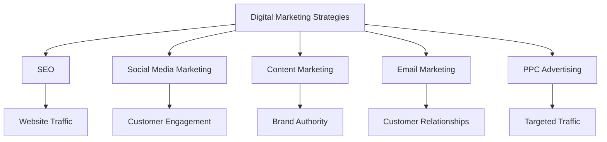

# Digital Marketing Strategies

## Introduction

Digital marketing refers to the use of digital channels and technologies to promote products or services. In the context of the airline industry, digital marketing is used to enhance customer experiences, drive sales, and achieve greater market penetration. This chapter provides an overview of the key components of digital marketing and its applications in the airline industry.

## Key Components of Digital Marketing

### 1. Search Engine Optimization (SEO)

SEO involves optimizing a website to improve its visibility on search engines. By using relevant keywords, meta tags, and quality content, airlines can attract more organic traffic and increase their online presence.

### 2. Social Media Marketing

Social media platforms like Facebook, Twitter, and Instagram are powerful tools for engaging with customers and promoting airline services. Airlines can use social media to share updates, offers, and customer testimonials, enhancing brand awareness and customer loyalty.

### 3. Content Marketing

Content marketing involves creating and sharing valuable content to attract and engage customers. Airlines can use blog posts, videos, and infographics to provide travel tips, destination information, and company updates, establishing themselves as thought leaders in the industry.

### 4. Email Marketing

Email marketing is a direct communication channel that allows airlines to send personalized offers, promotions, and newsletters to customers. By segmenting their email lists and using targeted campaigns, airlines can increase engagement and drive sales.

### 5. Pay-Per-Click (PPC) Advertising

PPC advertising involves paying for ad placements on search engines and social media platforms. Airlines can use PPC campaigns to target specific audiences and drive traffic to their websites, increasing the likelihood of conversions.

## Integration of Digital Marketing Strategies

Digital marketing strategies integrate various channels and technologies to create a cohesive and effective marketing plan. For example, SEO can drive organic traffic to a website, while social media marketing can engage customers and promote offers. Content marketing can establish brand authority, while email marketing can nurture customer relationships and drive sales.

## Conclusion

Digital marketing strategies provide the building blocks for transforming the airline industry. By leveraging SEO, social media marketing, content marketing, email marketing, and PPC advertising, airlines can achieve greater customer engagement, improved brand awareness, and enhanced sales performance.

