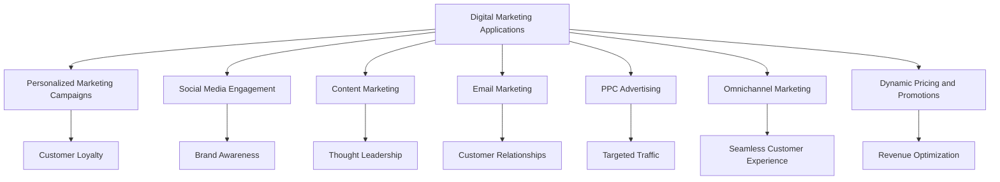

# Applications of Digital Marketing in Aviation

## Introduction

Digital marketing has a wide range of applications in the aviation industry, transforming various aspects of airline operations. From customer engagement to sales and marketing strategies, digital marketing solutions are enhancing efficiency, customer satisfaction, and brand awareness. This chapter explores the key applications of digital marketing in aviation.

## Customer Engagement and Experience

### 1. Personalized Marketing Campaigns

Digital marketing allows airlines to create personalized marketing campaigns tailored to individual customer preferences. By analyzing customer data, airlines can send targeted offers, promotions, and recommendations, enhancing customer loyalty and satisfaction.

### 2. Social Media Engagement

Social media platforms are powerful tools for engaging with customers and promoting airline services. Airlines can use social media to share updates, offers, and customer testimonials, enhancing brand awareness and customer loyalty.

### 3. Content Marketing

Content marketing involves creating and sharing valuable content to attract and engage customers. Airlines can use blog posts, videos, and infographics to provide travel tips, destination information, and company updates, establishing themselves as thought leaders in the industry.

### 4. Email Marketing

Email marketing is a direct communication channel that allows airlines to send personalized offers, promotions, and newsletters to customers. By segmenting their email lists and using targeted campaigns, airlines can increase engagement and drive sales.

### 5. Pay-Per-Click (PPC) Advertising

PPC advertising involves paying for ad placements on search engines and social media platforms. Airlines can use PPC campaigns to target specific audiences and drive traffic to their websites, increasing the likelihood of conversions.

## Sales and Marketing Strategies

### 1. Omnichannel Marketing

Omnichannel marketing integrates various digital channels to create a seamless and consistent customer experience. Airlines can use omnichannel strategies to engage customers across websites, mobile apps, social media, and physical stores, enhancing brand awareness and driving sales.

### 2. Dynamic Pricing and Promotions

Digital marketing enables airlines to implement dynamic pricing and promotional strategies that respond to real-time market conditions and customer behavior. This allows airlines to optimize revenue and enhance competitiveness in a rapidly changing market.

## Conclusion

Digital marketing has numerous applications in the aviation industry, transforming customer engagement, sales, and marketing strategies. By leveraging personalized marketing campaigns, social media engagement, content marketing, email marketing, and PPC advertising, airlines can achieve greater customer satisfaction, improved brand awareness, and enhanced sales performance.

## Conclusion

Agentic AI has numerous applications in the aviation industry, transforming customer service, operations, logistics, and safety. By leveraging AI-driven solutions, airlines can achieve greater efficiency, improved customer satisfaction, and enhanced operational capabilities.
