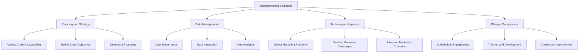

# Implementation Strategies for Digital Marketing and Digital Sales

## Introduction

Implementing digital marketing and digital sales strategies in the airline industry requires a strategic approach. This chapter outlines best practices and implementation strategies to successfully integrate these strategies and drive business growth.

## Planning and Strategy

### 1. Assess Current Capabilities

Before implementing new digital marketing and sales strategies, it's crucial to assess the current capabilities and infrastructure of the airline. This includes evaluating existing marketing channels, data management practices, and organizational readiness for digital transformation.

### 2. Define Clear Objectives

Set clear, measurable objectives for the digital marketing and sales transformation. These objectives should align with the airline's overall business strategy and address key areas such as customer engagement, brand awareness, and revenue growth.

### 3. Develop a Roadmap

Create a detailed roadmap outlining the steps for implementation. This should include timelines, milestones, and key performance indicators (KPIs) to track progress and measure success.

## Data Management

### 1. Data Governance

Establish robust data governance frameworks to ensure data quality, security, and compliance. This includes defining data ownership, access controls, and data management policies.

### 2. Data Integration

Integrate data from various sources, such as customer databases, marketing platforms, and external data providers. This requires a comprehensive data integration strategy that leverages technologies like ETL (Extract, Transform, Load) processes and data lakes.

### 3. Data Analytics

Implement advanced data analytics capabilities to derive insights from customer data. This includes using data analytics tools to analyze customer behavior, segment audiences, and optimize marketing campaigns.

## Technology Integration

### 1. Select Marketing Platforms

Choose marketing platforms and tools that align with the airline's objectives and technical capabilities. This may include CRM systems, email marketing platforms, social media management tools, and analytics platforms.

### 2. Develop Marketing Campaigns

Develop and execute marketing campaigns tailored to the airline's specific needs. This includes creating content marketing strategies, social media campaigns, email marketing campaigns, and PPC advertising campaigns.

### 3. Integrate Marketing Channels

Integrate marketing channels with existing IT infrastructure and business processes. This requires collaboration between marketing, IT, and business units to ensure seamless integration and adoption.

## Change Management

### 1. Stakeholder Engagement

Engage stakeholders at all levels of the organization to build support for the digital marketing and sales transformation. This includes communicating the benefits, addressing concerns, and involving stakeholders in the planning and implementation process.

### 2. Training and Development

Provide training and development opportunities for employees to build digital marketing and sales skills. This includes offering workshops, certifications, and on-the-job training to enhance employee capabilities.

### 3. Continuous Improvement

Establish a culture of continuous improvement by regularly reviewing and updating marketing campaigns and digital sales strategies. This includes gathering feedback, monitoring performance, and making data-driven decisions to optimize operations.

## Conclusion

Implementing digital marketing and digital sales strategies in the airline industry requires a strategic, data-driven approach. By following best practices and implementation strategies, airlines can successfully integrate these strategies and achieve greater customer engagement, improved brand awareness, and sustained competitive advantage.

