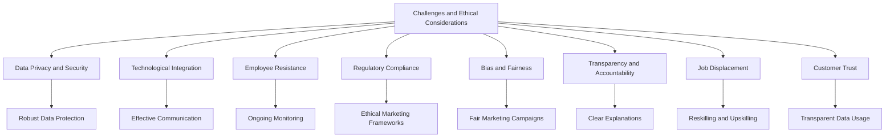

# Challenges and Ethical Considerations in Digital Marketing and Digital Sales

## Introduction

While digital marketing and digital sales strategies offer significant benefits to the airline industry, they also present various challenges and ethical considerations. This chapter explores the key obstacles and ethical dilemmas that airlines must address as they implement these strategies.

## Challenges

### 1. Data Privacy and Security

One of the primary challenges is ensuring the privacy and security of customer data. Airlines must implement robust data protection measures to safeguard sensitive information from breaches and unauthorized access.

### 2. Technological Integration

Integrating digital marketing platforms with existing IT infrastructure can be complex and time-consuming. Airlines must overcome technical challenges related to data compatibility, system interoperability, and scalability.

### 3. Employee Resistance

Employees may resist the adoption of new digital marketing strategies due to concerns about job displacement, skill gaps, and changes in workflows. Airlines must address these concerns through effective communication and training programs.

### 4. Regulatory Compliance

Airlines must comply with various regulations related to data protection, privacy, and security. Navigating these regulatory landscapes can be challenging and requires ongoing monitoring and adaptation.

## Ethical Considerations

### 1. Bias and Fairness

Digital marketing strategies can inadvertently perpetuate biases present in customer data. Airlines must ensure that their marketing campaigns are fair and unbiased, avoiding discriminatory outcomes in areas such as pricing, promotions, and customer service.

### 2. Transparency and Accountability

Transparency in digital marketing decision-making processes is crucial for building trust with customers and stakeholders. Airlines must be accountable for the actions and outcomes of their marketing campaigns, providing clear explanations and recourse mechanisms.

### 3. Job Displacement

The automation of certain tasks through digital marketing strategies may lead to job displacement. Airlines must address the potential impact on employees and develop strategies for reskilling and upskilling to support a transition to new roles.

### 4. Customer Trust

Maintaining customer trust is essential for the success of digital marketing transformations. Airlines must be transparent about how customer data is used and ensure that marketing strategies enhance, rather than compromise, the customer experience.

## Best Practices

### 1. Ethical Marketing Frameworks

Develop and implement ethical marketing frameworks that guide the design, deployment, and use of digital marketing strategies. These frameworks should address issues such as bias, fairness, transparency, and accountability.

### 2. Regular Audits

Conduct regular audits of marketing campaigns to identify and mitigate potential biases, ensure compliance with regulations, and maintain data security and privacy.

### 3. Stakeholder Engagement

Engage stakeholders, including employees, customers, and regulators, in the development and implementation of digital marketing strategies. This collaborative approach helps build support and address concerns.

### 4. Continuous Monitoring

Implement continuous monitoring and evaluation of marketing campaigns to ensure their effectiveness, fairness, and alignment with ethical standards.

## Conclusion

Addressing the challenges and ethical considerations associated with digital marketing transformations is crucial for the successful integration of digital marketing and digital sales strategies in the airline industry. By adopting best practices and ethical frameworks, airlines can mitigate risks, build trust, and achieve sustainable competitive advantage.

