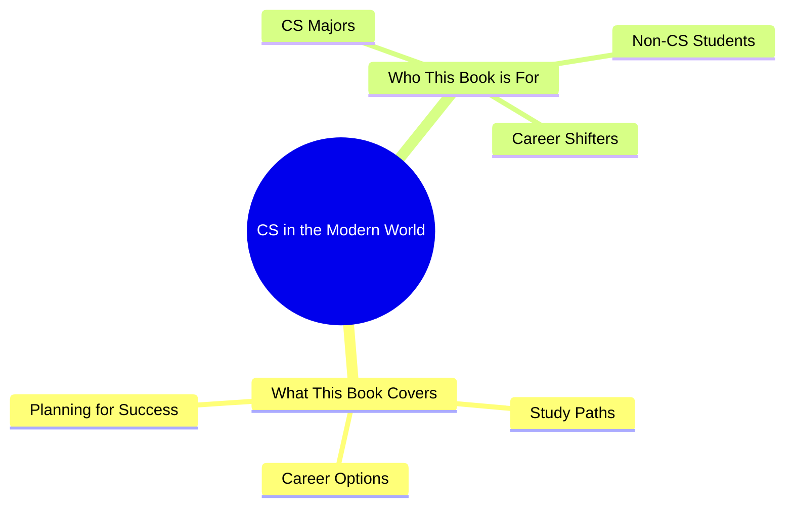

# Chapter 1: Introduction to CS in the Modern World

## 1.1 What This Book Covers
This book is designed to guide students through the world of Computer Science (CS) in the AI era, focusing on study paths, career options, and planning for a successful journey.

## 1.2 Who This Book is For
Whether you’re a CS major, a non-CS student curious about tech, or someone exploring career shifts, this book offers tailored insights for your goals.

## Mindmap: CS in the Modern World

