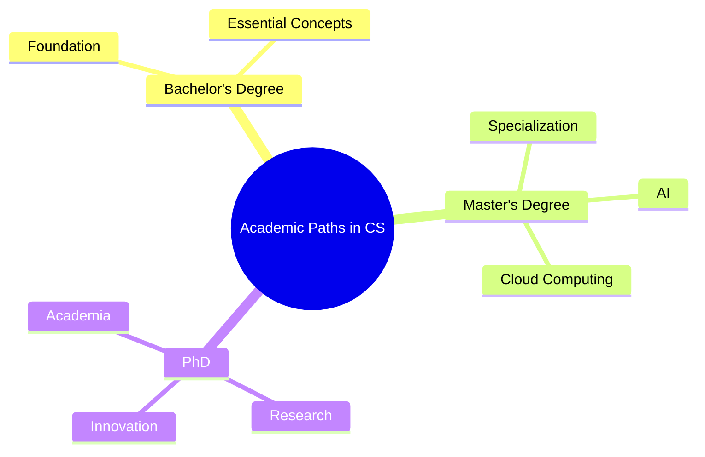

# Chapter 3: Academic Paths in CS

## 3.1 Bachelor’s Degree
The foundational step, covering essential CS concepts and skills.

## 3.2 Master’s Degree
Advanced specialization in areas like AI or cloud computing.

## 3.3 PhD
Focus on research and innovation, ideal for academic or high-level industry roles.

## Mindmap: Academic Paths

