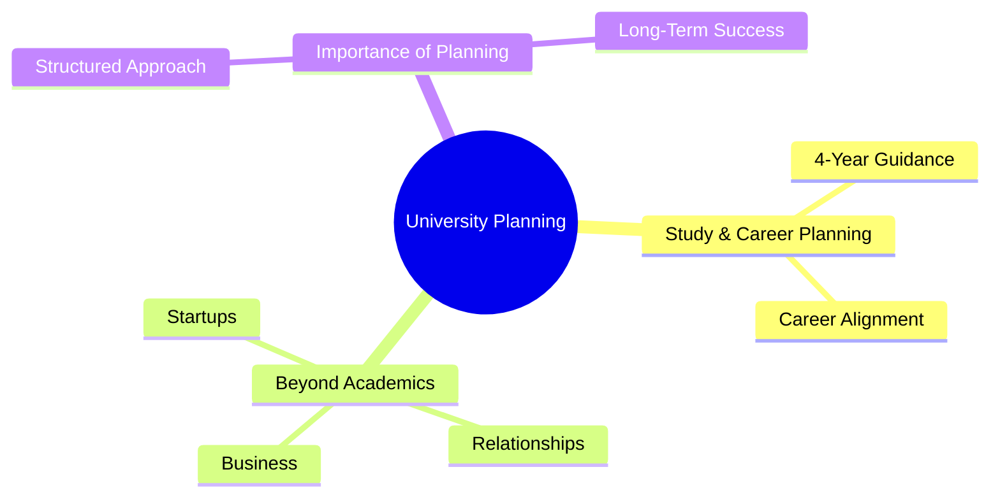

# Chapter 5: Planning Your University Years

## 5.1 Study & Career Planning
Clear guidance for 4 years to align studies with career goals.

## 5.2 Beyond Academics
Exploring relationships, business, and startup ideas as part of your life journey.

## 5.3 The Importance of Planning
Structured planning ensures you maximize your university experience for long-term success.

## Mindmap: University Planning

## SVG: University Planning Framework
<svg width="400" height="220" xmlns="http://www.w3.org/2000/svg">
  <rect x="10" y="10" width="380" height="200" rx="20" fill="#f5f5f5" stroke="#2c3e50" stroke-width="2"/>
  <text x="200" y="40" text-anchor="middle" font-size="18" fill="#2c3e50">University Planning</text>
  <rect x="40" y="70" width="90" height="40" rx="8" fill="#e0e7ff" stroke="#6366f1"/>
  <text x="85" y="95" text-anchor="middle" font-size="14" fill="#2c3e50">Study & Career</text>
  <rect x="155" y="70" width="90" height="40" rx="8" fill="#e0f7fa" stroke="#06b6d4"/>
  <text x="200" y="95" text-anchor="middle" font-size="14" fill="#2c3e50">Beyond Academics</text>
  <rect x="270" y="70" width="90" height="40" rx="8" fill="#fef9c3" stroke="#f59e42"/>
  <text x="315" y="95" text-anchor="middle" font-size="14" fill="#2c3e50">Planning</text>
  <line x1="85" y1="110" x2="200" y2="110" stroke="#2c3e50" stroke-width="2" marker-end="url(#arrow)"/>
  <line x1="200" y1="110" x2="315" y2="110" stroke="#2c3e50" stroke-width="2" marker-end="url(#arrow)"/>
  <defs>
    <marker id="arrow" markerWidth="10" markerHeight="10" refX="5" refY="5" orient="auto" markerUnits="strokeWidth">
      <path d="M0,0 L10,5 L0,10 L2,5 Z" fill="#2c3e50" />
    </marker>
  </defs>
</svg>
