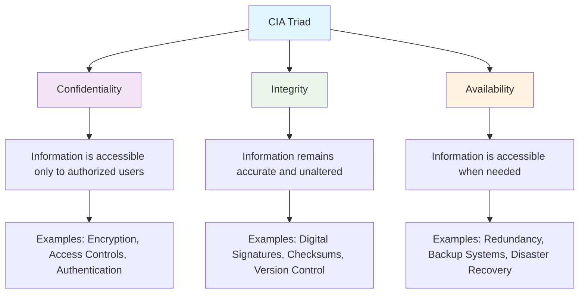
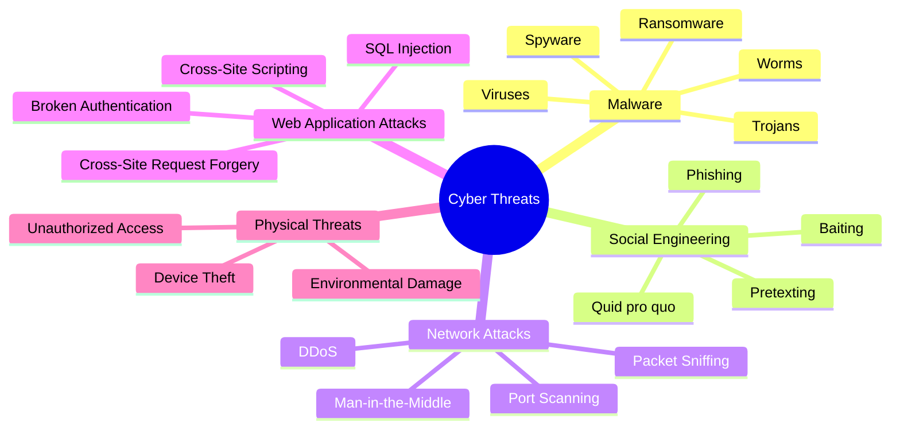
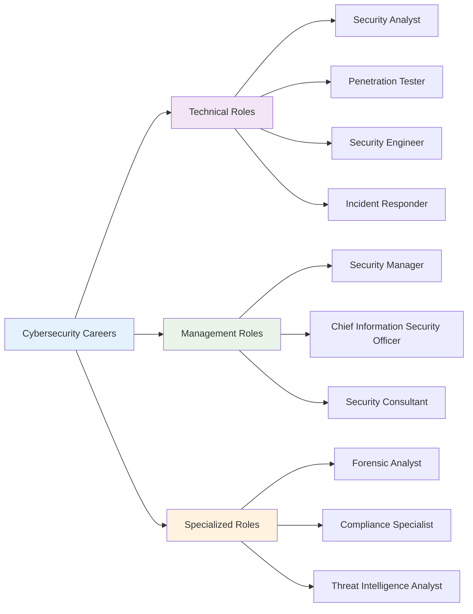

# Chapter 1: Introduction to Cybersecurity

## 🎯 Learning Objectives

By the end of this chapter, you will be able to:
- Define cybersecurity and explain its importance in today's digital world
- Identify the three core principles of cybersecurity (CIA triad)
- Understand the basic threat landscape and common attack vectors
- Recognize the role of cybersecurity in protecting individuals, organizations, and society
- Explore career opportunities in the cybersecurity field

## 🔐 What is Cybersecurity?

Cybersecurity is the practice of protecting systems, networks, and programs from digital attacks, damage, or unauthorized access. Think of it as the digital equivalent of home security - just as you lock your doors and install security cameras to protect your physical home, cybersecurity measures protect your digital assets.

### The Digital Transformation

In today's interconnected world, almost everything we do involves technology:
- **Personal**: Social media, online banking, smart home devices
- **Business**: Cloud computing, remote work, digital payments
- **Government**: Critical infrastructure, public services, national security
- **Healthcare**: Electronic health records, medical devices, telemedicine

This digital transformation has created unprecedented opportunities but also new vulnerabilities that cybercriminals can exploit.

## 🛡️ The CIA Triad: Foundation of Cybersecurity

The CIA triad represents the three fundamental principles of cybersecurity:

### 1. Confidentiality
**Definition**: Ensuring that information is accessible only to those who are authorized to access it.

**Real-world Example**: When you log into your bank account, the system ensures that only you can see your financial information, not other customers or unauthorized individuals.

**How it's achieved**:
- **Encryption**: Scrambling data so only authorized parties can read it
- **Access Controls**: Limiting who can access specific information
- **Authentication**: Verifying the identity of users before granting access

### 2. Integrity
**Definition**: Maintaining the accuracy and completeness of data throughout its lifecycle.

**Real-world Example**: When you send an email, integrity ensures that the message arrives exactly as you wrote it, without any changes or corruption.

**How it's achieved**:
- **Digital Signatures**: Mathematical proof that data hasn't been altered
- **Checksums**: Mathematical values that detect data corruption
- **Version Control**: Tracking changes to maintain data accuracy

### 3. Availability
**Definition**: Ensuring that authorized users have access to information and systems when needed.

**Real-world Example**: When you need to access your email or online services, availability ensures these services are up and running 24/7.

**How it's achieved**:
- **Redundancy**: Having backup systems in case of failure
- **Backup Systems**: Regular copies of data for recovery
- **Disaster Recovery**: Plans to restore services after major incidents

## 🌍 The Threat Landscape

Cybersecurity threats are constantly evolving, becoming more sophisticated and widespread. Understanding the threat landscape helps us prepare appropriate defenses.

### Types of Cyber Threats

### 1. Malware (Malicious Software)
**Definition**: Software designed to harm systems, steal data, or gain unauthorized access.

**Common Types**:
- **Viruses**: Self-replicating programs that attach to legitimate files
- **Worms**: Self-replicating programs that spread through networks
- **Trojans**: Malicious programs disguised as legitimate software
- **Ransomware**: Malware that encrypts files and demands payment for decryption
- **Spyware**: Software that secretly monitors user activity

**Real-world Example**: The WannaCry ransomware attack in 2017 affected over 300,000 computers across 150 countries, encrypting files and demanding Bitcoin payments.

### 2. Social Engineering
**Definition**: Psychological manipulation of people to perform actions or divulge confidential information.

**Common Techniques**:
- **Phishing**: Fraudulent emails or websites that mimic legitimate organizations
- **Pretexting**: Creating false scenarios to obtain information
- **Baiting**: Leaving infected devices or media in public places
- **Quid pro quo**: Offering services in exchange for information

**Real-world Example**: A cybercriminal might call an employee pretending to be from IT support, asking for their password to "fix a system issue."

### 3. Network Attacks
**Definition**: Attacks that target network infrastructure and communications.

**Common Types**:
- **DDoS (Distributed Denial of Service)**: Overwhelming systems with traffic to make them unavailable
- **Man-in-the-Middle**: Intercepting communications between two parties
- **Packet Sniffing**: Capturing and analyzing network traffic
- **Port Scanning**: Probing systems for open network ports

### 4. Web Application Attacks
**Definition**: Attacks that target vulnerabilities in web applications and websites.

**Common Types**:
- **SQL Injection**: Inserting malicious code into database queries
- **Cross-Site Scripting (XSS)**: Injecting malicious scripts into web pages
- **Cross-Site Request Forgery (CSRF)**: Forcing users to perform unwanted actions
- **Broken Authentication**: Exploiting flaws in login systems

## 🏢 Why Cybersecurity Matters

### For Individuals
- **Identity Protection**: Preventing theft of personal information
- **Financial Security**: Protecting bank accounts and credit cards
- **Privacy**: Maintaining control over personal data
- **Device Security**: Keeping computers and mobile devices safe

### For Organizations
- **Business Continuity**: Ensuring operations continue during cyber incidents
- **Customer Trust**: Maintaining reputation and customer confidence
- **Regulatory Compliance**: Meeting legal and industry requirements
- **Intellectual Property**: Protecting valuable business information

### For Society
- **National Security**: Protecting critical infrastructure and government systems
- **Economic Stability**: Preventing large-scale financial disruptions
- **Public Safety**: Ensuring essential services remain operational
- **Democracy**: Protecting electoral systems and public discourse

## 💼 Career Opportunities in Cybersecurity

The cybersecurity field offers diverse career paths with strong job prospects and competitive salaries.

### Career Pathways

### Entry-Level Positions
1. **Security Analyst**: Monitor systems for security threats and respond to incidents
2. **Security Administrator**: Implement and maintain security controls
3. **Network Security Specialist**: Focus on protecting network infrastructure
4. **Security Operations Center (SOC) Analyst**: Monitor security tools and respond to alerts

### Mid-Level Positions
1. **Security Engineer**: Design and implement security solutions
2. **Penetration Tester**: Conduct authorized security assessments
3. **Incident Responder**: Lead response to security incidents
4. **Security Architect**: Design overall security frameworks

### Senior-Level Positions
1. **Security Manager**: Lead security teams and programs
2. **Chief Information Security Officer (CISO)**: Executive-level security leadership
3. **Security Consultant**: Provide expert advice to organizations
4. **Security Researcher**: Discover new vulnerabilities and develop defenses

### Required Skills
- **Technical Skills**: Networking, programming, operating systems
- **Analytical Skills**: Problem-solving, critical thinking, attention to detail
- **Communication Skills**: Explaining technical concepts to non-technical audiences
- **Continuous Learning**: Staying updated with evolving threats and technologies

## 🧪 Hands-on Activity: Your First Security Assessment

### Activity: Personal Digital Security Audit

**Objective**: Conduct a basic security assessment of your personal digital environment.

**Materials Needed**: 
- Computer or mobile device
- Internet access
- Pen and paper for notes

**Steps**:

1. **Password Assessment**
   - List all your online accounts
   - Identify which ones use the same password
   - Note which ones have two-factor authentication enabled

2. **Device Security Check**
   - Verify your device has updated antivirus software
   - Check if automatic updates are enabled
   - Review installed applications for any suspicious ones

3. **Network Security Review**
   - Check your Wi-Fi network security settings
   - Verify your router's default password has been changed
   - Review connected devices on your network

4. **Privacy Settings Audit**
   - Review social media privacy settings
   - Check browser privacy and security settings
   - Review app permissions on mobile devices

**Discussion Questions**:
- What security vulnerabilities did you discover?
- Which areas need immediate attention?
- How might these vulnerabilities be exploited by attackers?

## 📋 Key Takeaways

1. **Cybersecurity is essential** in our increasingly digital world, protecting individuals, organizations, and society from various threats.

2. **The CIA triad** (Confidentiality, Integrity, Availability) forms the foundation of all cybersecurity practices.

3. **Cyber threats are diverse** and constantly evolving, requiring comprehensive defense strategies.

4. **Cybersecurity careers** offer excellent opportunities with various technical and management pathways.

5. **Everyone has a role** in cybersecurity, from individual users to organizational leaders.

## ❓ Review Questions

1. **Define cybersecurity** and explain why it's important in today's world.

2. **Explain the CIA triad** and provide real-world examples of each principle.

3. **Describe three types of cyber threats** and how they might affect individuals or organizations.

4. **What are the main career pathways** in cybersecurity, and what skills are required?

5. **How might a personal security audit** help improve your cybersecurity posture?

## 📚 Further Reading

### Books
- "Cybersecurity Essentials" by Charles J. Brooks
- "The Art of Deception" by Kevin Mitnick
- "Security Engineering" by Ross Anderson

### Online Resources
- [Cybersecurity & Infrastructure Security Agency (CISA)](https://www.cisa.gov/)
- [National Institute of Standards and Technology (NIST)](https://www.nist.gov/cyberframework)
- [SANS Institute](https://www.sans.org/)

### Professional Organizations
- (ISC)² - International Information System Security Certification Consortium
- ISACA - Information Systems Audit and Control Association
- CompTIA - Computing Technology Industry Association

---

**Next Chapter**: [Chapter 2: Linux for Information Security](chapter02-linux-security.md) - Learn how Linux serves as the foundation for cybersecurity tools and operations.
