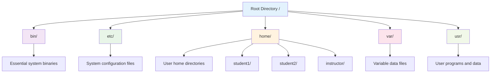
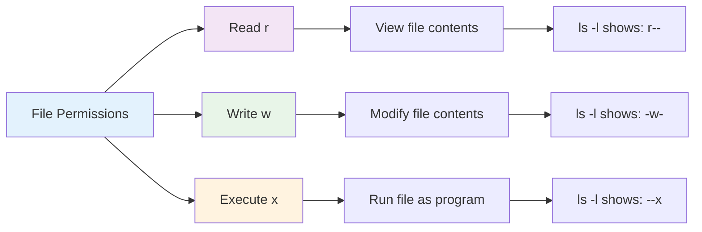
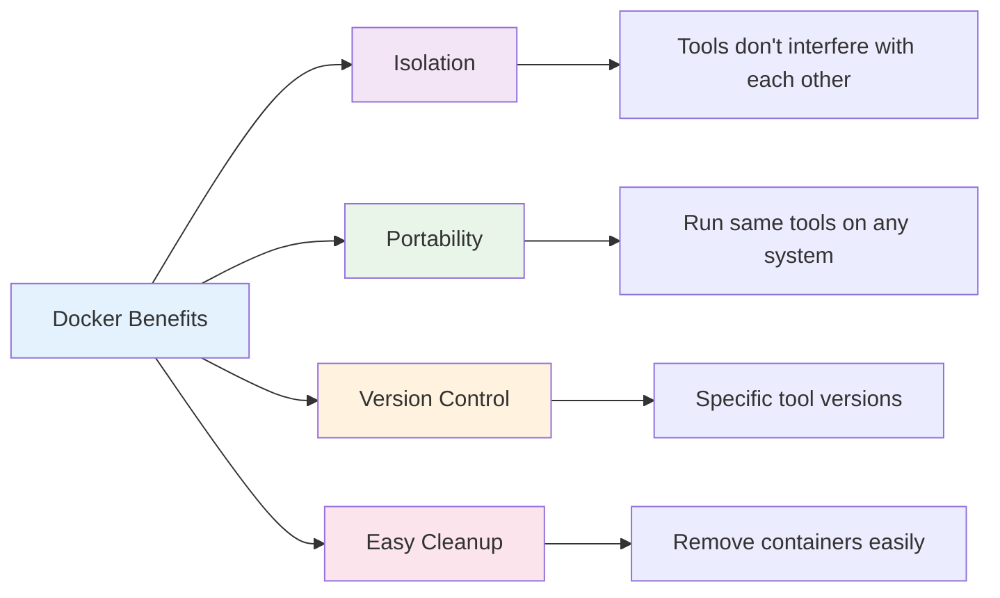

# Chapter 2: Linux for Information Security

## 🎯 Learning Objectives

By the end of this chapter, you will be able to:
- Understand why Linux is essential for cybersecurity professionals
- Navigate the Linux command line interface (CLI) with confidence
- Set up and configure Kali Linux for security testing
- Use essential Linux commands for security operations
- Understand file permissions and user management in Linux
- Deploy security tools using Docker containers
- Automate security tasks using Bash scripting

## 🐧 Why Linux for Cybersecurity?

Linux has become the operating system of choice for cybersecurity professionals for several compelling reasons:

### 1. **Open Source and Transparent**
- Source code is freely available for inspection
- Security vulnerabilities can be identified and fixed quickly
- No hidden backdoors or proprietary limitations

### 2. **Extensive Security Tools**
- Most cybersecurity tools are developed for Linux first
- Built-in security features and hardening capabilities
- Large community of security researchers and developers

### 3. **Flexibility and Customization**
- Can be stripped down to minimal components
- Easy to create specialized security distributions
- Supports various architectures and hardware platforms

### 4. **Cost-Effective**
- Free to use and distribute
- Runs efficiently on older hardware
- No licensing fees for enterprise deployment

## 🖥️ Linux Command Line Interface (CLI) Basics

The command line interface is the primary way cybersecurity professionals interact with Linux systems. Unlike graphical interfaces, the CLI provides precise control and automation capabilities.

### Understanding the Terminal

```mermaid
graph TD
    A[Terminal Window] --> B[Command Prompt]
    B --> C[User Input]
    C --> D[Command Execution]
    D --> E[Output Display]
    
    B --> B1[username@hostname:directory$]
    C --> C1[ls -la]
    D --> D1[System processes command]
    E --> E1[File listing displayed]
    
    style A fill:#e3f2fd
    style B fill:#f3e5f5
    style C fill:#e8f5e8
    style D fill:#fff3e0
    style E fill:#fce4ec
```

### Basic Command Structure
```bash
command [options] [arguments]
```

**Example**: `ls -la /home/user`
- `ls` = command (list files)
- `-la` = options (all files, long format)
- `/home/user` = argument (directory path)

### Essential Navigation Commands

| Command | Purpose | Example | Description |
|---------|---------|---------|-------------|
| `pwd` | Print working directory | `pwd` | Shows current directory path |
| `ls` | List files | `ls -la` | Lists all files with details |
| `cd` | Change directory | `cd /etc` | Moves to specified directory |
| `mkdir` | Make directory | `mkdir security` | Creates new directory |
| `rmdir` | Remove directory | `rmdir empty_folder` | Removes empty directory |
| `cp` | Copy files | `cp file1 file2` | Copies file1 to file2 |
| `mv` | Move/rename | `mv old.txt new.txt` | Renames or moves files |
| `rm` | Remove files | `rm file.txt` | Deletes specified file |

### File System Navigation



## 🔒 File Permissions and Security

Understanding file permissions is crucial for cybersecurity as it controls who can access, modify, or execute files on the system.

### Permission Types



### Permission Categories
- **Owner**: The user who created the file
- **Group**: Members of the file's group
- **Others**: Everyone else on the system

### Understanding Permission Notation

```bash
-rw-r--r-- 1 user group 1024 Jan 15 10:30 file.txt
```

Breaking this down:
- **File Type**: `-` (regular file), `d` (directory), `l` (symbolic link)
- **Owner Permissions**: `rw-` (read, write, no execute)
- **Group Permissions**: `r--` (read only)
- **Others Permissions**: `r--` (read only)
- **Number of Links**: `1`
- **Owner**: `user`
- **Group**: `group`
- **Size**: `1024` bytes
- **Date**: `Jan 15 10:30`
- **Filename**: `file.txt`

### Changing Permissions with chmod

```bash
# Numeric method (octal)
chmod 755 file.txt    # Owner: rwx, Group: r-x, Others: r-x
chmod 644 file.txt    # Owner: rw-, Group: r--, Others: r--

# Symbolic method
chmod u+x file.txt    # Add execute for owner
chmod g-w file.txt    # Remove write for group
chmod o=r file.txt    # Set others to read-only
```

### Security Best Practices
- **Principle of Least Privilege**: Only grant necessary permissions
- **Regular Audits**: Periodically review file permissions
- **Secure Defaults**: Set restrictive permissions by default
- **Monitor Changes**: Track permission modifications

## 🎯 Kali Linux: The Security Professional's Toolkit

Kali Linux is a specialized Linux distribution designed specifically for penetration testing and security research.

### What is Kali Linux?

Kali Linux is a Debian-based Linux distribution that comes pre-installed with hundreds of security tools. It's designed for:
- **Penetration Testing**: Testing system vulnerabilities
- **Security Research**: Analyzing malware and threats
- **Digital Forensics**: Investigating security incidents
- **Security Auditing**: Assessing system security

### Kali Linux Architecture

```mermaid
graph TD
    A[Kali Linux] --> B[Base System]
    A --> C[Security Tools]
    A --> D[Customization]
    
    B --> B1[Debian Linux Kernel]
    B --> B2[Package Management]
    B --> B3[System Services]
    
    C --> C1[Information Gathering]
    C --> C2[Vulnerability Analysis]
    C --> C3[Web Application Testing]
    C --> C4[Database Assessment]
    C --> C5[Password Attacks]
    C --> C6[Wireless Attacks]
    C --> C7[Exploitation Tools]
    C --> C8[Sniffing & Spoofing]
    C --> C9[Post Exploitation]
    C --> C10[Reporting Tools]
    
    D --> D1[Custom Scripts]
    D --> D2[Tool Configurations]
    D --> D3[Personal Workflows]
    
    style A fill:#e3f2fd
    style B fill:#f3e5f5
    style C fill:#e8f5e8
    style D fill:#fff3e0
```



### Installing Kali Linux

#### Option 1: Virtual Machine (Recommended for Beginners)
1. **Download VirtualBox** or VMware Player
2. **Download Kali Linux** ISO from kali.org
3. **Create new VM** with at least 4GB RAM and 50GB storage
4. **Install Kali Linux** following the installation wizard

#### Option 2: Live USB
1. **Download Kali Linux** ISO
2. **Use tools like Rufus** (Windows) or dd (Linux/Mac)
3. **Boot from USB** without installing

#### Option 3: WSL2 (Windows 10/11)
1. **Enable WSL2** in Windows features
2. **Install Kali Linux** from Microsoft Store
3. **Access via Windows Terminal**

### Essential Kali Linux Tools

| Category | Tool | Purpose | Example Usage |
|----------|------|---------|---------------|
| **Information Gathering** | `nmap` | Network scanning | `nmap -sS 192.168.1.0/24` |
| **Web Testing** | `nikto` | Web vulnerability scanner | `nikto -h example.com` |
| **Password Attacks** | `hydra` | Brute force attacks | `hydra -l user -P pass.txt ssh://target` |
| **Wireless** | `aircrack-ng` | Wireless network testing | `airmon-ng start wlan0` |
| **Exploitation** | `metasploit` | Exploit framework | `msfconsole` |

## 🐳 Docker for Security Tools

Docker provides a way to run security tools in isolated containers, making it easier to manage dependencies and maintain consistent environments.

### What is Docker?

Docker is a platform for developing, shipping, and running applications in containers. Containers are lightweight, isolated environments that package everything needed to run an application.

### Docker Benefits for Security



### Basic Docker Commands

```bash
# Search for security tool images
docker search nmap

# Pull an image
docker pull uzyexe/nmap

# Run a container
docker run -it uzyexe/nmap nmap -sS 192.168.1.1

# List running containers
docker ps

# List all containers
docker ps -a

# Stop a container
docker stop container_id

# Remove a container
docker rm container_id

# Remove an image
docker rmi image_name
```

### Running Security Tools with Docker

#### Example 1: Nmap Network Scanner
```bash
# Run nmap scan from Docker container
docker run -it --rm uzyexe/nmap nmap -sS -p 80,443,22 192.168.1.1
```

#### Example 2: Nikto Web Scanner
```bash
# Run nikto web vulnerability scan
docker run -it --rm uzyexe/nikto -h http://example.com
```

#### Example 3: Custom Security Tool Container
```bash
# Create Dockerfile for custom security environment
FROM kalilinux/kali-rolling
RUN apt-get update && apt-get install -y nmap nikto hydra
WORKDIR /tools
CMD ["/bin/bash"]
```

## 📜 Bash Scripting for Security Automation

Bash scripting allows cybersecurity professionals to automate repetitive tasks, making security operations more efficient and consistent.

### Why Learn Bash Scripting?

- **Automation**: Reduce manual, repetitive tasks
- **Consistency**: Ensure security procedures are followed exactly
- **Efficiency**: Speed up security operations
- **Documentation**: Scripts serve as procedural documentation

### Basic Bash Script Structure

```bash
#!/bin/bash
# Script Name: security_scan.sh
# Description: Automated security scan script
# Author: Your Name
# Date: 2024

# Variables
TARGET_IP="192.168.1.1"
SCAN_RESULTS="/tmp/scan_results.txt"
LOG_FILE="/var/log/security_scan.log"

# Functions
log_message() {
    echo "$(date): $1" >> "$LOG_FILE"
}

# Main script
log_message "Starting security scan of $TARGET_IP"

# Run nmap scan
nmap -sS -p 1-1000 "$TARGET_IP" > "$SCAN_RESULTS"

# Check for open ports
if grep -q "open" "$SCAN_RESULTS"; then
    log_message "Open ports found on $TARGET_IP"
    cat "$SCAN_RESULTS"
else
    log_message "No open ports found on $TARGET_IP"
fi

log_message "Security scan completed"
```

### Essential Bash Concepts for Security

#### 1. **Variables and Environment**
```bash
# Set variables
TARGET="192.168.1.1"
PORTS="22,80,443,8080"

# Use variables
nmap -sS -p "$PORTS" "$TARGET"
```

#### 2. **Conditional Statements**
```bash
if [ -f "$SCAN_FILE" ]; then
    echo "Scan file exists"
    cat "$SCAN_FILE"
else
    echo "Scan file not found"
fi
```

#### 3. **Loops**
```bash
# Loop through IP addresses
for ip in 192.168.1.{1..10}; do
    echo "Scanning $ip..."
    nmap -sS "$ip" >> "scan_results.txt"
done
```

#### 4. **Functions**
```bash
scan_port() {
    local ip=$1
    local port=$2
    nc -zv "$ip" "$port" 2>&1 | grep -q "open" && echo "Port $port is open"
}

# Use function
scan_port "192.168.1.1" "22"
```

### Practical Security Script Examples

#### Example 1: Port Scanner
```bash
#!/bin/bash
# Simple port scanner

TARGET=${1:-"127.0.0.1"}
PORTS=${2:-"22,80,443,8080"}

echo "Scanning $TARGET on ports $PORTS"

IFS=',' read -ra PORT_ARRAY <<< "$PORTS"
for port in "${PORT_ARRAY[@]}"; do
    (echo >/dev/tcp/$TARGET/$port) >/dev/null 2>&1 && echo "Port $port is open" || echo "Port $port is closed"
done
```

#### Example 2: Log Monitor
```bash
#!/bin/bash
# Monitor security logs for suspicious activity

LOG_FILE="/var/log/auth.log"
ALERT_FILE="/tmp/security_alerts.txt"

echo "Monitoring $LOG_FILE for suspicious activity..."

tail -f "$LOG_FILE" | while read line; do
    if echo "$line" | grep -q "Failed password\|Invalid user\|authentication failure"; then
        echo "$(date): SUSPICIOUS ACTIVITY DETECTED - $line" >> "$ALERT_FILE"
        echo "ALERT: $line"
    fi
done
```

## 🧪 Hands-on Activities

### Activity 1: Linux Command Line Exploration

**Objective**: Familiarize yourself with basic Linux commands and navigation.

**Steps**:
1. **Open terminal** in your Linux system or VM
2. **Navigate the file system** using `cd`, `ls`, and `pwd`
3. **Create and manage files** using `touch`, `mkdir`, `cp`, and `mv`
4. **View file contents** using `cat`, `less`, and `head`
5. **Search for files** using `find` and `grep`

**Commands to Practice**:
```bash
# Navigate to home directory
cd ~

# List files with details
ls -la

# Create a directory
mkdir security_lab

# Change to the directory
cd security_lab

# Create a file
touch notes.txt

# Add content to file
echo "Security lab notes" > notes.txt

# View file contents
cat notes.txt
```

### Activity 2: File Permission Management

**Objective**: Understand and modify file permissions for security.

**Steps**:
1. **Create test files** with different permission levels
2. **Modify permissions** using `chmod`
3. **Test access** with different user accounts
4. **Restore secure permissions**

**Commands to Practice**:
```bash
# Create test file
touch test_file.txt

# Check current permissions
ls -l test_file.txt

# Change to read-only for others
chmod o=r test_file.txt

# Verify change
ls -l test_file.txt

# Try to write to file as different user
# (This should fail)
```

### Activity 3: Docker Security Tools

**Objective**: Deploy and use security tools in Docker containers.

**Steps**:
1. **Install Docker** on your system
2. **Pull security tool images**
3. **Run tools in containers**
4. **Clean up containers**

**Commands to Practice**:
```bash
# Install Docker (Ubuntu/Debian)
sudo apt-get update
sudo apt-get install docker.io

# Start Docker service
sudo systemctl start docker

# Pull nmap image
sudo docker pull uzyexe/nmap

# Run nmap scan
sudo docker run -it --rm uzyexe/nmap nmap -sS localhost

# List containers
sudo docker ps -a
```

### Activity 4: Basic Bash Scripting

**Objective**: Create a simple security automation script.

**Steps**:
1. **Create a script file** using a text editor
2. **Write basic bash commands**
3. **Add variables and logic**
4. **Make the script executable**
5. **Test the script**

**Script Example**:
```bash
#!/bin/bash
# Security check script

echo "=== Security System Check ==="
echo "Date: $(date)"
echo "User: $(whoami)"
echo "Hostname: $(hostname)"

# Check if important services are running
echo -e "\n=== Service Status ==="
services=("ssh" "ufw" "fail2ban")
for service in "${services[@]}"; do
    if systemctl is-active --quiet "$service"; then
        echo "$service: RUNNING"
    else
        echo "$service: STOPPED"
    fi
done

echo -e "\n=== Check Complete ==="
```

## 📋 Key Takeaways

1. **Linux is essential** for cybersecurity professionals due to its open-source nature, extensive security tools, and flexibility.

2. **Command line proficiency** is crucial for efficient security operations and automation.

3. **File permissions** control system security and must be managed carefully following the principle of least privilege.

4. **Kali Linux** provides a comprehensive toolkit for penetration testing and security research.

5. **Docker containers** offer isolated, portable environments for running security tools consistently.

6. **Bash scripting** enables automation of security tasks, improving efficiency and consistency.

## ❓ Review Questions

1. **Why is Linux preferred** over other operating systems for cybersecurity work?

2. **Explain the three types** of file permissions in Linux and how they're represented.

3. **What are the benefits** of using Docker for security tools?

4. **How can bash scripting** improve security operations?

5. **What security considerations** should be taken when managing file permissions?

## 📚 Further Reading

### Books
- "The Linux Command Line" by William Shotts
- "Kali Linux Revealed" by Offensive Security
- "Bash Scripting Tutorial" by Mendel Cooper

### Online Resources
- [Kali Linux Documentation](https://www.kali.org/docs/)
- [Docker Security Best Practices](https://docs.docker.com/engine/security/)
- [Bash Reference Manual](https://www.gnu.org/software/bash/manual/)

### Practice Environments
- [OverTheWire Bandit](https://overthewire.org/wargames/bandit/) - Linux command line practice
- [TryHackMe](https://tryhackme.com/) - Hands-on cybersecurity labs
- [VulnHub](https://www.vulnhub.com/) - Vulnerable virtual machines

---

**Next Chapter**: [Chapter 3: Risk Management Fundamentals](chapter03-risk-management.md) - Learn how to identify, assess, and manage cybersecurity risks using industry-standard frameworks.
