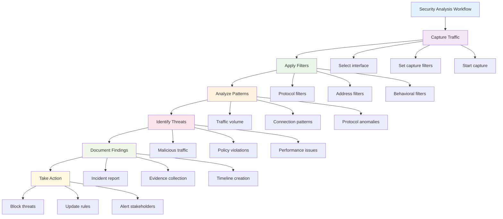
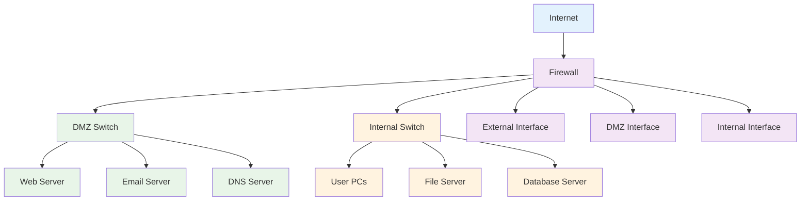
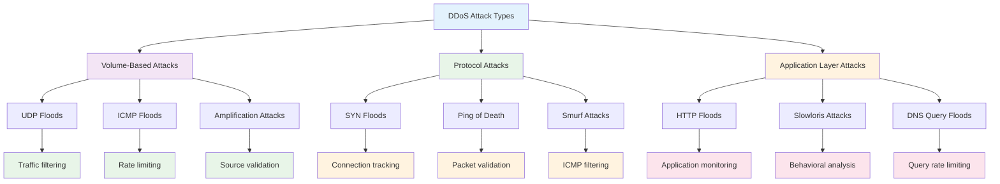
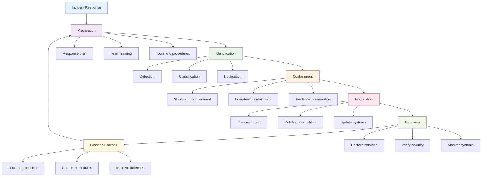

# Chapter 4: Network Security Essentials

## 🎯 Learning Objectives

By the end of this chapter, you will be able to:
- Understand fundamental network protocols and their security implications
- Identify common network vulnerabilities and attack vectors
- Use Wireshark to analyze network traffic and detect security threats
- Build and secure network topologies using Cisco Packet Tracer
- Implement and configure firewalls, IDS/IPS, and VPNs
- Apply network segmentation and access control strategies
- Develop incident response procedures for network security incidents
- Understand DoS/DDoS attacks and mitigation techniques

## 🌐 Network Fundamentals and Security

Networks are the backbone of modern computing, enabling communication between devices, systems, and users. Understanding how networks work is essential for protecting them from security threats.

### What is a Network?

A network is a collection of interconnected devices that can communicate with each other to share resources and information. Networks can be as small as two computers connected by a cable or as large as the global internet.

### Network Types and Security Considerations

```mermaid
graph TD
    A[Network Types] --> B[Local Area Network LAN]
    A --> C[Wide Area Network WAN]
    A --> D[Wireless Networks]
    A --> E[Cloud Networks]
    
    B --> B1[Office networks]
    B --> B2[Home networks]
    B --> B3[Data center networks]
    
    C --> C1[Internet connections]
    C --> C2[Branch office links]
    C --> C3[Partner connections]
    
    D --> D1[Wi-Fi networks]
    D --> D2[Bluetooth networks]
    D --> D3[Cellular networks]
    
    E --> E1[Public cloud]
    E --> E2[Private cloud]
    E --> E3[Hybrid cloud]
    
    B1 --> F1[Access control]
    B2 --> F2[Network segmentation]
    B3 --> F3[Traffic monitoring]
    
    C1 --> F4[Encryption]
    C2 --> F5[VPN tunnels]
    C3 --> F6[Firewall rules]
    
    D1 --> F7[Authentication]
    D2 --> F8[Encryption]
    D3 --> F9[Signal security]
    
    E1 --> F10[Identity management]
    E2 --> F11[Data protection]
    E3 --> F12[Compliance controls]
    
    style A fill:#e3f2fd
    style B fill:#f3e5f5
    style C fill:#e8f5e8
    style D fill:#fff3e0
    style E fill:#fce4ec
    style F1 fill:#e8f5e8
    style F2 fill:#e8f5e8
    style F3 fill:#e8f5e8
    style F4 fill:#fff3e0
    style F5 fill:#fff3e0
    style F6 fill:#fff3e0
    style F7 fill:#fce4ec
    style F8 fill:#fce4ec
    style F9 fill:#fce4ec
    style F10 fill:#f1f8e9
    style F11 fill:#f1f8e9
    style F12 fill:#f1f8e9
```



### Network Security Principles

Network security is built on three fundamental principles:

1. **Defense in Depth**: Multiple layers of security controls
2. **Principle of Least Privilege**: Only necessary access granted
3. **Fail-Safe Defaults**: Secure by default configuration

## 🔍 Network Protocols and Security

Understanding network protocols is crucial for identifying security vulnerabilities and implementing appropriate controls.

### OSI Model and Security

```mermaid
graph TD
    A[OSI Model Layers] --> B[Application Layer 7]
    A --> C[Presentation Layer 6]
    A --> D[Session Layer 5]
    A --> E[Transport Layer 4]
    A --> F[Network Layer 3]
    A --> G[Data Link Layer 2]
    A --> H[Physical Layer 1]
    
    B --> B1[HTTP, FTP, SMTP]
    B --> B2[Web application attacks]
    B --> B3[API security]
    
    C --> C1[SSL/TLS, encryption]
    C --> C2[Cryptographic attacks]
    C --> C3[Certificate management]
    
    D --> D1[Session management]
    D --> D2[Session hijacking]
    D --> D3[Authentication]
    
    E --> E1[TCP, UDP]
    E --> E2[Port scanning]
    E --> E3[SYN floods]
    
    F --> F1[IP, routing]
    F --> F2[IP spoofing]
    F --> F3[Routing attacks]
    
    G --> G1[Ethernet, MAC]
    G --> G2[ARP spoofing]
    G --> G3[Switch attacks]
    
    H --> H1[Cables, signals]
    H --> H2[Physical access]
    H --> H3[Signal interception]
    
    style A fill:#e3f2fd
    style B fill:#f3e5f5
    style C fill:#e8f5e8
    style D fill:#fff3e0
    style E fill:#fce4ec
    style F fill:#f1f8e9
    style G fill:#fff8e1
    style H fill:#f3e5f5
```



### Key Protocols and Security Issues

#### 1. **TCP/IP Protocol Suite**
- **TCP (Transmission Control Protocol)**: Connection-oriented, reliable
- **UDP (User Datagram Protocol)**: Connectionless, fast
- **IP (Internet Protocol)**: Addressing and routing

**Security Issues**:
- **IP Spoofing**: Forging source IP addresses
- **TCP Hijacking**: Taking over established connections
- **Port Scanning**: Discovering open network ports

#### 2. **HTTP/HTTPS (Web Protocols)**
- **HTTP**: Unencrypted web traffic
- **HTTPS**: Encrypted web traffic using SSL/TLS

**Security Issues**:
- **Man-in-the-Middle Attacks**: Intercepting unencrypted traffic
- **Session Hijacking**: Stealing user sessions
- **Cross-Site Scripting (XSS)**: Injecting malicious code

#### 3. **DNS (Domain Name System)**
- Translates domain names to IP addresses
- Critical for internet functionality

**Security Issues**:
- **DNS Poisoning**: Redirecting traffic to malicious sites
- **DNS Amplification**: Using DNS for DDoS attacks
- **DNS Tunneling**: Bypassing security controls

## 🚨 Common Network Vulnerabilities

Network vulnerabilities are weaknesses that attackers can exploit to gain unauthorized access or disrupt services.

### Vulnerability Categories

```mermaid
graph TD
    A[Network Vulnerabilities] --> B[Configuration Vulnerabilities]
    A --> C[Protocol Vulnerabilities]
    A --> D[Physical Vulnerabilities]
    A --> E[Human Vulnerabilities]
    
    B --> B1[Default passwords]
    B --> B2[Open ports]
    B --> B3[Weak encryption]
    B --> B4[Unpatched systems]
    
    C --> C1[Protocol flaws]
    C --> C2[Authentication weaknesses]
    C --> C3[Session management issues]
    C --> C4[Buffer overflows]
    
    D --> D1[Physical access]
    D --> D2[Signal interception]
    D --> D3[Hardware tampering]
    D --> D4[Environmental threats]
    
    E --> E1[Social engineering]
    E --> E2[Insider threats]
    E --> E3[Human error]
    E --> E4[Lack of training]
    
    style A fill:#e3f2fd
    style B fill:#f3e5f5
    style C fill:#e8f5e8
    style D fill:#fff3e0
    style E fill:#fce4ec
```



### Top Network Security Threats

#### 1. **Denial of Service (DoS) Attacks**
- **Purpose**: Overwhelm systems to make them unavailable
- **Methods**: Flooding with traffic, exploiting vulnerabilities
- **Impact**: Service disruption, financial losses

#### 2. **Man-in-the-Middle (MitM) Attacks**
- **Purpose**: Intercept and modify communications
- **Methods**: ARP spoofing, DNS poisoning, SSL stripping
- **Impact**: Data theft, credential compromise

#### 3. **Network Reconnaissance**
- **Purpose**: Gather information about network structure
- **Methods**: Port scanning, network mapping, service enumeration
- **Impact**: Attack planning, vulnerability identification

#### 4. **Wireless Network Attacks**
- **Purpose**: Gain unauthorized network access
- **Methods**: WEP cracking, WPA attacks, evil twin attacks
- **Impact**: Network compromise, data theft

## 🕵️ Wireshark: Network Traffic Analysis

Wireshark is a powerful network protocol analyzer that allows security professionals to examine network traffic in real-time and identify security threats.

### What is Wireshark?

Wireshark is an open-source packet analyzer that captures and displays network packets in human-readable format. It's essential for:
- **Network Troubleshooting**: Identifying connectivity issues
- **Security Analysis**: Detecting malicious traffic
- **Protocol Analysis**: Understanding network behavior
- **Performance Monitoring**: Analyzing network performance

### Wireshark Interface Overview

```mermaid
graph TD
    A[Wireshark Interface] --> B[Menu Bar]
    A --> C[Toolbar]
    A --> D[Filter Bar]
    A --> E[Packet List]
    A --> F[Packet Details]
    A --> G[Packet Bytes]
    
    B --> B1[File operations]
    B --> B2[Capture options]
    B --> B3[Analysis tools]
    
    C --> C1[Start/stop capture]
    C --> C2[Capture interfaces]
    C --> C3[Display filters]
    
    D --> D1[Protocol filters]
    D --> D2[IP address filters]
    D --> D3[Port filters]
    
    E --> E1[Packet summary]
    E --> E2[Source/destination]
    E --> E3[Protocol information]
    
    F --> F1[Protocol details]
    F --> F2[Header information]
    F --> F3[Payload data]
    
    G --> G1[Hex dump]
    G --> G2[ASCII representation]
    G --> G3[Binary analysis]
    
    style A fill:#e3f2fd
    style B fill:#f3e5f5
    style C fill:#e8f5e8
    style D fill:#fff3e0
    style E fill:#fce4ec
    style F fill:#f1f8e9
    style G fill:#fff8e1
```



### Essential Wireshark Filters

Wireshark filters help focus on specific traffic patterns and security events.

#### Protocol Filters
```bash
# HTTP traffic only
http

# HTTPS traffic only
ssl or tls

# DNS queries
dns

# TCP traffic on specific port
tcp.port == 80
```

#### Security-Related Filters
```bash
# Failed authentication attempts
http.response.code == 401

# Suspicious file downloads
http.content_type contains "application/"

# Large data transfers
frame.len > 1000

# Unusual port usage
tcp.port != 80 and tcp.port != 443 and tcp.port != 22
```

### Analyzing Security Threats with Wireshark

#### 1. **Detecting Port Scanning**
```bash
# SYN scans (connection attempts without completion)
tcp.flags.syn == 1 and tcp.flags.ack == 0

# Multiple connection attempts to different ports
tcp.flags.syn == 1 and tcp.flags.ack == 0
```

#### 2. **Identifying DDoS Attacks**
```bash
# High volume of traffic from single source
ip.src == [suspicious_ip]

# SYN flood attacks
tcp.flags.syn == 1 and tcp.flags.ack == 0
```

#### 3. **Detecting Data Exfiltration**
```bash
# Large outbound transfers
frame.len > 5000 and ip.dst != [internal_network]

# Unusual protocols
tcp.port != 80 and tcp.port != 443 and tcp.port != 22
```

### Wireshark Security Analysis Workflow



## 🏗️ Cisco Packet Tracer: Network Design and Security

Cisco Packet Tracer is a network simulation tool that allows students to design, configure, and test network topologies with security controls.

### What is Cisco Packet Tracer?

Packet Tracer is a comprehensive network simulation platform that provides:
- **Network Design**: Visual network topology creation
- **Device Configuration**: Router, switch, and firewall setup
- **Protocol Testing**: Verify network functionality
- **Security Implementation**: Configure security controls
- **Troubleshooting**: Identify and resolve network issues

### Basic Network Topology



### Network Segmentation Strategy

Network segmentation divides networks into smaller, more manageable sections to improve security and performance.

#### 1. **DMZ (Demilitarized Zone)**
- **Purpose**: Isolate public-facing services
- **Services**: Web servers, email servers, DNS
- **Security**: Strict firewall rules, limited access

#### 2. **Internal Network**
- **Purpose**: Protect sensitive business systems
- **Services**: User workstations, file servers, databases
- **Security**: Strong access controls, monitoring

#### 3. **Management Network**
- **Purpose**: Secure network administration
- **Services**: Network devices, management tools
- **Security**: Restricted access, encrypted communications

### Security Device Configuration

#### Firewall Configuration
```bash
# Basic firewall rules
access-list 100 permit tcp any any eq 80
access-list 100 permit tcp any any eq 443
access-list 100 permit tcp any any eq 22
access-list 100 deny ip any any

# Apply to interface
interface FastEthernet0/0
ip access-group 100 in
```

#### Switch Security
```bash
# Enable port security
interface FastEthernet0/1
switchport mode access
switchport port-security
switchport port-security maximum 1
switchport port-security violation shutdown
```

## 🛡️ Network Security Controls

Network security controls are measures implemented to protect networks from threats and vulnerabilities.

### Defense in Depth Strategy

```mermaid
graph TD
    A[Defense in Depth] --> B[Perimeter Security]
    A --> C[Network Security]
    A --> D[Host Security]
    A --> E[Application Security]
    A --> F[Data Security]
    
    B --> B1[Firewalls]
    B --> B2[Intrusion Detection]
    B --> B3[Access Control]
    
    C --> C1[Network Segmentation]
    C --> C2[Traffic Monitoring]
    C --> C3[Encryption]
    
    D --> D1[Endpoint Protection]
    D --> D2[Patch Management]
    D --> D3[Configuration Control]
    
    E --> E1[Secure Development]
    E --> E2[Input Validation]
    E --> E3[Session Management]
    
    F --> F1[Data Classification]
    F --> F2[Encryption]
    F --> F3[Backup & Recovery]
    
    style A fill:#e3f2fd
    style B fill:#f3e5f5
    style C fill:#e8f5e8
    style D fill:#fff3e0
    style E fill:#fce4ec
    style F fill:#f1f8e9
```



### 1. **Firewalls**

Firewalls are network security devices that monitor and control incoming and outgoing network traffic.

#### Types of Firewalls
- **Packet Filtering**: Examines packet headers
- **Stateful Inspection**: Tracks connection state
- **Application Layer**: Analyzes application data
- **Next-Generation**: Advanced threat detection

#### Firewall Rules Example
```bash
# Allow HTTP traffic
permit tcp any any eq 80

# Allow HTTPS traffic
permit tcp any any eq 443

# Allow SSH from management network
permit tcp 192.168.1.0/24 any eq 22

# Deny all other traffic
deny ip any any
```

### 2. **Intrusion Detection/Prevention Systems (IDS/IPS)**

IDS/IPS systems monitor network traffic for suspicious activity and can automatically respond to threats.

#### IDS vs IPS
- **IDS (Detection)**: Monitors and alerts on threats
- **IPS (Prevention)**: Monitors and blocks threats

#### Common Detection Methods
- **Signature-Based**: Matches known attack patterns
- **Anomaly-Based**: Detects unusual behavior
- **Behavior-Based**: Learns normal patterns

### 3. **Virtual Private Networks (VPNs)**

VPNs create secure, encrypted connections over public networks.

#### VPN Types
- **Site-to-Site**: Connects multiple office locations
- **Remote Access**: Connects individual users
- **Client-to-Site**: Connects clients to corporate network

#### VPN Security Features
- **Encryption**: Protects data in transit
- **Authentication**: Verifies user identity
- **Tunneling**: Creates secure communication channels

## 🚫 DoS/DDoS Attack Mitigation

Denial of Service (DoS) and Distributed Denial of Service (DDoS) attacks attempt to make network services unavailable.

### Attack Types and Mitigation



### Mitigation Strategies

#### 1. **Traffic Filtering**
- **Blacklisting**: Block known malicious sources
- **Whitelisting**: Allow only trusted sources
- **Rate Limiting**: Restrict traffic volume

#### 2. **Traffic Scrubbing**
- **DDoS Protection Services**: Cloud-based mitigation
- **Traffic Analysis**: Identify and filter attack traffic
- **Load Balancing**: Distribute traffic across multiple servers

#### 3. **Network Hardening**
- **Bandwidth Management**: Reserve capacity for legitimate traffic
- **Redundancy**: Multiple network paths and servers
- **Monitoring**: Real-time threat detection

## 🚨 Incident Response for Network Security

Network security incidents require immediate and coordinated response to minimize damage and restore services.

### Incident Response Lifecycle



### Response Procedures

#### 1. **Immediate Response**
- **Isolate affected systems**: Prevent threat spread
- **Document everything**: Maintain incident timeline
- **Notify stakeholders**: Alert management and users

#### 2. **Containment Actions**
- **Network segmentation**: Isolate compromised areas
- **Access restrictions**: Limit user and system access
- **Traffic monitoring**: Watch for additional threats

#### 3. **Recovery Steps**
- **System restoration**: Restore from clean backups
- **Security updates**: Patch vulnerabilities
- **Configuration review**: Ensure secure settings

## 🧪 Hands-on Activities

### Activity 1: Wireshark Traffic Analysis

**Objective**: Analyze network traffic to identify security threats.

**Materials**: Wireshark, sample capture files, network access

**Steps**:
1. **Install Wireshark** on your system
2. **Capture network traffic** or use sample files
3. **Apply security filters** to identify threats
4. **Analyze suspicious traffic** patterns
5. **Document findings** in a security report

**Filters to Practice**:
```bash
# HTTP traffic analysis
http

# Failed authentication
http.response.code == 401

# Large file transfers
frame.len > 1000

# Unusual ports
tcp.port != 80 and tcp.port != 443
```

### Activity 2: Network Topology Design

**Objective**: Design a secure network topology using Cisco Packet Tracer.

**Scenario**: Small business with web presence and internal operations

**Requirements**:
- Public web server
- Internal file server
- User workstations
- Secure remote access
- Network monitoring

**Steps**:
1. **Design network topology** with security zones
2. **Configure network devices** with security settings
3. **Implement access controls** and firewall rules
4. **Test network connectivity** and security
5. **Document configuration** and security measures

### Activity 3: Security Incident Simulation

**Objective**: Practice responding to network security incidents.

**Scenario**: Detected unusual network activity and potential data exfiltration

**Response Tasks**:
1. **Assess the situation** using network tools
2. **Contain the threat** by isolating affected systems
3. **Investigate the incident** using logs and traffic analysis
4. **Document the response** actions and findings
5. **Develop recovery plan** for affected systems

## 📋 Key Takeaways

1. **Network security requires** understanding of protocols, vulnerabilities, and attack vectors to implement effective defenses.

2. **Wireshark is essential** for network traffic analysis and security threat detection in real-time.

3. **Network segmentation** improves security by isolating systems and limiting attack surface.

4. **Defense in depth** provides multiple layers of security controls to protect against various threats.

5. **Incident response** requires preparation, coordination, and systematic approach to minimize damage.

6. **Continuous monitoring** and analysis are essential for detecting and responding to network security threats.

## ❓ Review Questions

1. **What are the key differences** between IDS and IPS systems, and when would you use each?

2. **How does network segmentation** improve security, and what are the main security zones?

3. **What Wireshark filters** would you use to detect a port scanning attack?

4. **How can you mitigate** DDoS attacks using network security controls?

5. **What are the essential steps** in responding to a network security incident?

## 📚 Further Reading

### Books
- "Network Security: Private Communication in a Public World" by Charlie Kaufman
- "The Practice of Network Security Monitoring" by Richard Bejtlich
- "Wireshark Network Analysis" by Laura Chappell

### Online Resources
- [Wireshark Documentation](https://www.wireshark.org/docs/)
- [Cisco Packet Tracer Learning](https://www.netacad.com/courses/packet-tracer)
- [SANS Network Security Resources](https://www.sans.org/network-security/)

### Practice Labs
- [TryHackMe Network Security](https://tryhackme.com/)
- [Cybrary Network Security](https://www.cybrary.it/)
- [Cisco Networking Academy](https://www.netacad.com/)

---

**Next Chapter**: [Chapter 5: Identity and Access Management](chapter05-iam.md) - Learn how to implement secure identity and access control systems for enterprise environments.
