# Chapter 13: Security Assurance and Validation

## 🎯 Learning Objectives

By the end of this chapter, you will be able to:
- Understand security assurance methodologies and frameworks
- Implement security testing and validation processes
- Apply compliance frameworks and regulatory requirements
- Conduct security assessments and audits effectively
- Use security metrics and measurement techniques
- Implement continuous security improvement processes
- Understand third-party security validation and certification

## 🛡️ What is Security Assurance?

Security assurance is the confidence that security measures are working as intended and providing adequate protection against identified threats.

### Security Assurance Framework

```mermaid
graph TD
    A[Security Assurance] --> B[Security Testing]
    A --> C[Compliance Validation]
    A --> D[Risk Assessment]
    A --> E[Performance Measurement]
    A --> F[Continuous Improvement]
    
    B --> B1[Penetration testing]
    B --> B2[Vulnerability assessment]
    B --> B3[Security code review]
    
    C --> C1[Regulatory compliance]
    C --> C2[Industry standards]
    C --> C3[Internal policies]
    
    D --> D1[Threat modeling]
    D --> D2[Risk analysis]
    D --> D3[Control effectiveness]
    
    E --> E1[Security metrics]
    E --> E2[KPI measurement]
    E --> E3[Trend analysis]
    
    F --> F1[Process improvement]
    F --> F2[Tool enhancement]
    F --> F3[Training updates]
    
    style A fill:#e3f2fd
    style B fill:#f3e5f5
    style C fill:#e8f5e8
    style D fill:#fff3e0
    style E fill:#fce4ec
    style F fill:#f1f8e9
```

### Security Assurance Lifecycle

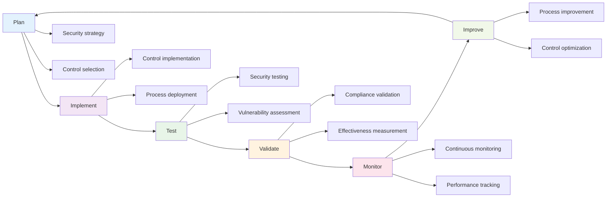

## 🔍 Security Testing Methodologies

### Types of Security Testing

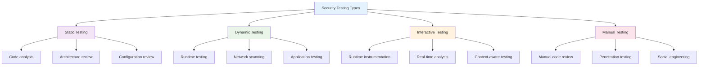

### 1. **Penetration Testing**

#### Penetration Testing Phases
```mermaid
graph TD
    A[Penetration Testing] --> B[Planning & Reconnaissance]
    A --> C[Scanning]
    A --> D[Gaining Access]
    A --> E[Maintaining Access]
    A --> F[Analysis & Reporting]
    
    B --> B1[Scope definition]
    B --> B2[Target identification]
    B --> B3[Information gathering]
    
    C --> C1[Port scanning]
    C --> C2[Service enumeration]
    C --> C3[Vulnerability scanning]
    
    D --> D1[Exploitation]
    D --> D2[Privilege escalation]
    D --> D3[Data access]
    
    E --> E1[Persistence mechanisms]
    E --> E2[Covering tracks]
    E --> E3[Backdoor creation]
    
    F --> F1[Vulnerability analysis]
    F --> F2[Risk assessment]
    F --> F3[Remediation planning]
    
    style A fill:#e3f2fd
    style B fill:#f3e5f5
    style C fill:#e8f5e8
    style D fill:#fff3e0
    style E fill:#fce4ec
    style F fill:#f1f8e9
```

#### Penetration Testing Tools
```python
# Penetration testing toolkit
class PenTestToolkit:
    def __init__(self):
        self.reconnaissance_tools = {
            "nmap": "Network discovery and port scanning",
            "whois": "Domain information lookup",
            "theHarvester": "Email and subdomain enumeration",
            "Shodan": "Internet device search engine"
        }
        
        self.vulnerability_scanners = {
            "Nessus": "Comprehensive vulnerability scanner",
            "OpenVAS": "Open-source vulnerability scanner",
            "Qualys": "Cloud-based security platform",
            "Nexpose": "Vulnerability management platform"
        }
        
        self.exploitation_tools = {
            "Metasploit": "Penetration testing framework",
            "Core Impact": "Commercial penetration testing",
            "Canvas": "Automated penetration testing",
            "Immunity Canvas": "Vulnerability exploitation"
        }
        
        self.web_application_tools = {
            "Burp Suite": "Web application security testing",
            "OWASP ZAP": "Open-source web scanner",
            "Acunetix": "Automated web vulnerability scanner",
            "AppScan": "IBM security testing platform"
        }
    
    def get_tool_recommendations(self, testing_phase):
        """Get recommended tools for specific testing phase."""
        recommendations = {
            "reconnaissance": list(self.reconnaissance_tools.keys()),
            "scanning": list(self.vulnerability_scanners.keys()),
            "exploitation": list(self.exploitation_tools.keys()),
            "web_testing": list(self.web_application_tools.keys())
        }
        return recommendations.get(testing_phase, [])
```

### 2. **Vulnerability Assessment**

#### Vulnerability Assessment Process
```mermaid
graph TD
    A[Vulnerability Assessment] --> B[Asset Discovery]
    A --> C[Vulnerability Scanning]
    A --> D[Risk Assessment]
    A --> E[Remediation Planning]
    A --> F[Validation Testing]
    
    B --> B1[Network mapping]
    B --> B2[Service identification]
    B --> B3[Asset classification]
    
    C --> C1[Automated scanning]
    C --> C2[Manual verification]
    C --> C3[False positive analysis]
    
    D --> D1[Severity classification]
    D --> D2[Business impact analysis]
    D --> D3[Exploitability assessment]
    
    E --> E1[Patch prioritization]
    E --> E2[Workaround identification]
    E --> E3[Resource allocation]
    
    F --> F1[Retesting]
    F --> F2[Verification]
    F --> F3[Documentation]
    
    style A fill:#e3f2fd
    style B fill:#f3e5f5
    style C fill:#e8f5e8
    style D fill:#fff3e0
    style E fill:#fce4ec
    style F fill:#f1f8e9
```

#### Vulnerability Scoring
```python
# CVSS vulnerability scoring
class CVSSCalculator:
    def __init__(self):
        self.base_metrics = {
            "attack_vector": {"network": 0.85, "adjacent": 0.62, "local": 0.55, "physical": 0.2},
            "attack_complexity": {"low": 0.77, "high": 0.44},
            "privileges_required": {"none": 0.85, "low": 0.62, "high": 0.27},
            "user_interaction": {"none": 0.85, "required": 0.62},
            "scope": {"unchanged": 6.42, "changed": 7.52},
            "confidentiality": {"none": 0, "low": 0.22, "high": 0.56},
            "integrity": {"none": 0, "low": 0.22, "high": 0.56},
            "availability": {"none": 0, "low": 0.22, "high": 0.56}
        }
    
    def calculate_base_score(self, metrics):
        """Calculate CVSS Base Score."""
        # Simplified CVSS calculation
        impact = 1.176 * (1 - (1 - metrics.get("confidentiality", 0)) * 
                         (1 - metrics.get("integrity", 0)) * 
                         (1 - metrics.get("availability", 0)))
        
        exploitability = 8.22 * metrics.get("attack_vector", 0.85) * \
                        metrics.get("attack_complexity", 0.77) * \
                        metrics.get("privileges_required", 0.85) * \
                        metrics.get("user_interaction", 0.85)
        
        if impact <= 0:
            base_score = 0
        elif impact < 3.9:
            base_score = 0
        elif impact < 6.9:
            base_score = 4
        else:
            base_score = 7
        
        if base_score > 0:
            if exploitability < 0.91:
                base_score += 0.1
            elif exploitability < 3.89:
                base_score += 0.2
            else:
                base_score += 0.3
        
        return min(round(base_score, 1), 10.0)
    
    def get_severity_level(self, base_score):
        """Get severity level based on base score."""
        if base_score >= 9.0:
            return "Critical"
        elif base_score >= 7.0:
            return "High"
        elif base_score >= 4.0:
            return "Medium"
        elif base_score >= 0.1:
            return "Low"
        else:
            return "None"
```

### 3. **Security Code Review**

#### Code Review Process
```mermaid
graph TD
    A[Security Code Review] --> B[Preparation]
    A --> C[Review Execution]
    A --> D[Issue Documentation]
    A --> E[Remediation Planning]
    A --> F[Follow-up]
    
    B --> B1[Code preparation]
    B --> B2[Reviewer assignment]
    B --> B3[Tool configuration]
    
    C --> C1[Automated scanning]
    C --> C2[Manual review]
    C --> C3[Peer review]
    
    D --> D1[Vulnerability identification]
    D --> D2[Risk assessment]
    D --> D3[Documentation]
    
    E --> E1[Priority assignment]
    E --> E2[Remediation planning]
    E --> E3[Resource allocation]
    
    F --> F1[Retesting]
    F --> F2[Verification]
    F --> F3[Process improvement]
    
    style A fill:#e3f2fd
    style B fill:#f3e5f5
    style C fill:#e8f5e8
    style D fill:#fff3e0
    style E fill:#fce4ec
    style F fill:#f1f8e9
```

## 📋 Compliance Frameworks

### Major Compliance Standards

```mermaid
graph TD
    A[Compliance Frameworks] --> B[ISO 27001]
    A --> C[PCI DSS]
    A --> D[SOX]
    A --> E[GDPR]
    A --> F[NIST]
    A --> G[COBIT]
    
    B --> B1[Information Security Management]
    B --> B2[Risk management]
    B --> B3[Control implementation]
    
    C --> C1[Payment card security]
    C --> C2[Data protection]
    C --> C3[Access control]
    
    D --> D1[Financial reporting]
    D --> D2[Internal controls]
    D --> D3[Audit requirements]
    
    E --> E1[Data privacy]
    E --> E2[Individual rights]
    E --> E3[Breach notification]
    
    F --> F1[Cybersecurity framework]
    F --> F2[Risk management]
    F --> F3[Incident response]
    
    G --> G1[IT governance]
    G --> G2[Control objectives]
    G --> G3[Process management]
    
    style A fill:#e3f2fd
    style B fill:#f3e5f5
    style C fill:#e8f5e8
    style D fill:#fff3e0
    style E fill:#fce4ec
    style F fill:#f1f8e9
    style G fill:#fff8e1
```

### 1. **ISO 27001 Information Security Management**

#### ISO 27001 Structure
```mermaid
graph TD
    A[ISO 27001] --> B[Context Establishment]
    A --> C[Leadership]
    A --> D[Planning]
    A --> E[Support]
    A --> F[Operation]
    A --> G[Performance Evaluation]
    A --> H[Improvement]
    
    B --> B1[Organization context]
    B --> B2[Stakeholder needs]
    B --> B3[Scope definition]
    
    C --> C1[Management commitment]
    C --> C2[Policy establishment]
    C --> C3[Role assignment]
    
    D --> D1[Risk assessment]
    D --> D2[Risk treatment]
    D --> D3[Objectives setting]
    
    E --> E1[Resource provision]
    E --> E2[Competence development]
    E --> E3[Awareness training]
    
    F --> F1[Control implementation]
    F --> F2[Risk treatment]
    F --> F3[Change management]
    
    G --> G1[Monitoring measurement]
    G --> G2[Internal audit]
    G --> G3[Management review]
    
    H --> H1[Nonconformity handling]
    H --> H2[Corrective action]
    H --> H3[Continuous improvement]
    
    style A fill:#e3f2fd
    style B fill:#f3e5f5
    style C fill:#e8f5e8
    style D fill:#fff3e0
    style E fill:#fce4ec
    style F fill:#f1f8e9
    style G fill:#fff8e1
    style H fill:#f3e5f5
```

#### ISO 27001 Controls
```python
# ISO 27001 control categories
class ISO27001Controls:
    def __init__(self):
        self.control_categories = {
            "A.5": "Information Security Policies",
            "A.6": "Organization of Information Security",
            "A.7": "Human Resource Security",
            "A.8": "Asset Management",
            "A.9": "Access Control",
            "A.10": "Cryptography",
            "A.11": "Physical and Environmental Security",
            "A.12": "Operations Security",
            "A.13": "Communications Security",
            "A.14": "System Acquisition, Development and Maintenance",
            "A.15": "Supplier Relationships",
            "A.16": "Information Security Incident Management",
            "A.17": "Information Security Aspects of Business Continuity Management",
            "A.18": "Compliance"
        }
        
        self.sample_controls = {
            "A.9.1": "Business requirements of access control",
            "A.9.2": "User access management",
            "A.9.3": "User responsibilities",
            "A.9.4": "System and application access control",
            "A.12.1": "Operational procedures and responsibilities",
            "A.12.2": "Protection from malware",
            "A.12.3": "Backup",
            "A.12.4": "Logging and monitoring"
        }
    
    def get_control_requirements(self, control_id):
        """Get specific control requirements."""
        return self.sample_controls.get(control_id, "Control not found")
    
    def get_category_controls(self, category):
        """Get all controls in a specific category."""
        return {k: v for k, v in self.sample_controls.items() if k.startswith(category)}
```

### 2. **PCI DSS (Payment Card Industry Data Security Standard)**

#### PCI DSS Requirements
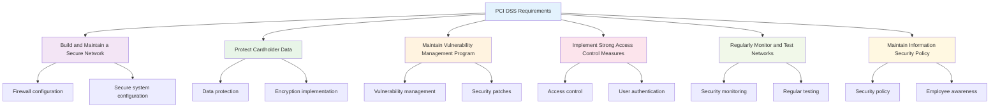

### 3. **NIST Cybersecurity Framework**

#### NIST CSF Functions
```mermaid
graph TD
    A[NIST Cybersecurity Framework] --> B[Identify]
    A --> C[Protect]
    A --> D[Detect]
    A --> E[Respond]
    A --> F[Recover]
    
    B --> B1[Asset management]
    B --> B2[Business environment]
    B --> B3[Governance]
    B --> B4[Risk assessment]
    B --> B5[Risk management strategy]
    
    C --> C1[Access control]
    C --> C2[Awareness and training]
    C --> C3[Data security]
    C --> C4[Information protection]
    C --> C5[Maintenance]
    C --> C6[Protective technology]
    
    D --> D1[Anomalies and events]
    D --> D2[Security continuous monitoring]
    D --> D3[Detection processes]
    
    E --> E1[Response planning]
    E --> E2[Communications]
    E --> E3[Analysis]
    E --> E4[Mitigation]
    E --> E5[Improvements]
    
    F --> F1[Recovery planning]
    F --> F2[Improvements]
    F --> F3[Communications]
    
    style A fill:#e3f2fd
    style B fill:#f3e5f5
    style C fill:#e8f5e8
    style D fill:#fff3e0
    style E fill:#fce4ec
    style F fill:#f1f8e9
```

## 📊 Security Metrics and Measurement

### Security Metrics Framework

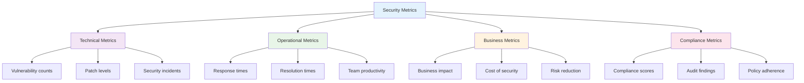

### Key Security Metrics

#### 1. **Vulnerability Metrics**
```python
# Vulnerability metrics calculator
class VulnerabilityMetrics:
    def __init__(self):
        self.metrics = {}
    
    def calculate_vulnerability_density(self, total_vulns, lines_of_code):
        """Calculate vulnerabilities per line of code."""
        if lines_of_code > 0:
            return total_vulns / lines_of_code
        return 0
    
    def calculate_patch_compliance(self, patched_systems, total_systems):
        """Calculate patch compliance percentage."""
        if total_systems > 0:
            return (patched_systems / total_systems) * 100
        return 0
    
    def calculate_mean_time_to_patch(self, patch_times):
        """Calculate average time to patch vulnerabilities."""
        if not patch_times:
            return 0
        return sum(patch_times) / len(patch_times)
    
    def calculate_risk_score(self, vulnerability_data):
        """Calculate overall risk score based on vulnerabilities."""
        risk_score = 0
        for vuln in vulnerability_data:
            severity = vuln.get('severity', 0)
            exploitability = vuln.get('exploitability', 0)
            business_impact = vuln.get('business_impact', 0)
            
            # Weighted risk calculation
            risk_score += (severity * 0.4 + exploitability * 0.3 + business_impact * 0.3)
        
        return risk_score
```

#### 2. **Incident Response Metrics**
```python
# Incident response metrics
class IncidentResponseMetrics:
    def __init__(self):
        self.metrics = {}
    
    def calculate_mttd(self, detection_times):
        """Calculate Mean Time to Detection."""
        if not detection_times:
            return 0
        return sum(detection_times) / len(detection_times)
    
    def calculate_mttr(self, response_times):
        """Calculate Mean Time to Response."""
        if not response_times:
            return 0
        return sum(response_times) / len(response_times)
    
    def calculate_mttc(self, containment_times):
        """Calculate Mean Time to Contain."""
        if not containment_times:
            return 0
        return sum(containment_times) / len(containment_times)
    
    def calculate_incident_volume(self, incidents_by_period):
        """Calculate incident volume over time periods."""
        return {
            'daily': incidents_by_period.get('daily', 0),
            'weekly': incidents_by_period.get('weekly', 0),
            'monthly': incidents_by_period.get('monthly', 0)
        }
    
    def calculate_severity_distribution(self, incidents_by_severity):
        """Calculate distribution of incidents by severity."""
        total = sum(incidents_by_severity.values())
        if total == 0:
            return {}
        
        return {
            severity: (count / total) * 100 
            for severity, count in incidents_by_severity.items()
        }
```

## 🔍 Security Assessment and Audit

### Assessment Types

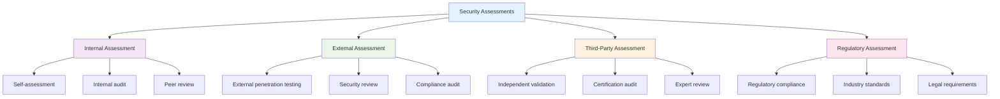

### Assessment Process

```mermaid
graph TD
    A[Assessment Process] --> B[Planning]
    A --> C[Execution]
    A --> D[Analysis]
    A --> E[Reporting]
    A --> F[Follow-up]
    
    B --> B1[Scope definition]
    B --> B2[Methodology selection]
    B --> B3[Resource planning]
    
    C --> C1[Data collection]
    C --> C2[Testing execution]
    C --> C3[Evidence gathering]
    
    D --> D1[Data analysis]
    D --> D2[Finding identification]
    D --> D3[Risk assessment]
    
    E --> E1[Report preparation]
    E --> E2[Stakeholder presentation]
    E --> E3[Recommendation development]
    
    F --> F1[Remediation tracking]
    F --> F2[Validation testing]
    F --> F3[Process improvement]
    
    style A fill:#e3f2fd
    style B fill:#f3e5f5
    style C fill:#e8f5e8
    style D fill:#fff3e0
    style E fill:#fce4ec
    style F fill:#f1f8e9
```

## 🔄 Continuous Security Improvement

### Improvement Cycle

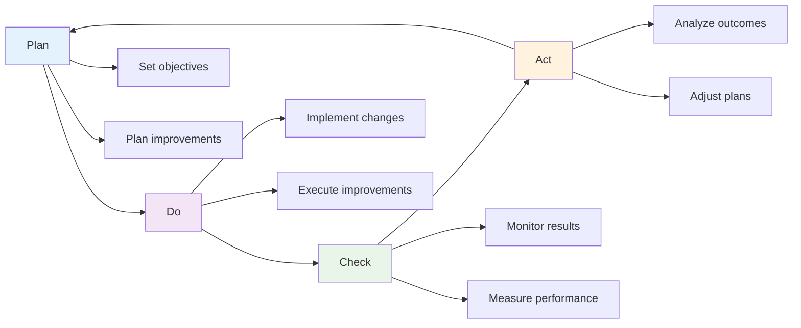

### Improvement Areas

#### 1. **Process Improvement**
- **Automation**: Reduce manual tasks and human error
- **Standardization**: Consistent procedures and documentation
- **Integration**: Seamless tool and process integration
- **Training**: Continuous skill development and awareness

#### 2. **Technology Enhancement**
- **Tool Selection**: Choose appropriate security tools
- **Integration**: Connect tools for better visibility
- **Automation**: Implement automated security controls
- **Monitoring**: Enhanced real-time security monitoring

#### 3. **People Development**
- **Skills Training**: Technical and soft skills development
- **Certification**: Professional security certifications
- **Knowledge Sharing**: Best practices and lessons learned
- **Team Building**: Effective collaboration and communication

## 🧪 Hands-on Activities

### Activity 1: Security Assessment Planning

**Objective**: Plan and execute a comprehensive security assessment.

**Scenario**: Security assessment of a company's web application.

**Steps**:
1. **Scope Definition**: Define assessment boundaries and objectives
2. **Methodology Selection**: Choose appropriate testing methods
3. **Resource Planning**: Identify required tools and personnel
4. **Execution**: Conduct the security assessment
5. **Reporting**: Document findings and recommendations

### Activity 2: Compliance Framework Implementation

**Objective**: Implement a compliance framework for an organization.

**Materials**: ISO 27001 or NIST CSF documentation

**Steps**:
1. **Gap Analysis**: Assess current state vs. requirements
2. **Control Implementation**: Implement required security controls
3. **Process Development**: Create security processes and procedures
4. **Training**: Conduct employee awareness training
5. **Monitoring**: Implement continuous monitoring and improvement

### Activity 3: Security Metrics Dashboard

**Objective**: Create a security metrics dashboard for management reporting.

**Materials**: Security data sources, visualization tools

**Steps**:
1. **Metric Selection**: Choose relevant security metrics
2. **Data Collection**: Gather data from various sources
3. **Dashboard Design**: Design visual dashboard layout
4. **Implementation**: Build and deploy the dashboard
5. **Validation**: Test and validate dashboard accuracy

### Activity 4: Security Improvement Workshop

**Objective**: Identify and plan security improvements for an organization.

**Scenario**: Annual security improvement planning session.

**Steps**:
1. **Current State Assessment**: Evaluate current security posture
2. **Gap Identification**: Identify areas for improvement
3. **Priority Setting**: Prioritize improvement initiatives
4. **Action Planning**: Develop detailed action plans
5. **Resource Allocation**: Allocate resources and timelines

## 📋 Key Takeaways

1. **Security assurance** provides confidence that security measures are working effectively.

2. **Security testing methodologies** include penetration testing, vulnerability assessment, and code review.

3. **Compliance frameworks** like ISO 27001, PCI DSS, and NIST CSF provide structured security requirements.

4. **Security metrics** help measure security performance and identify improvement areas.

5. **Security assessments and audits** validate security controls and compliance status.

6. **Continuous improvement** ensures security programs evolve with changing threats and requirements.

7. **Third-party validation** provides independent verification of security controls.

8. **Security assurance** is an ongoing process requiring regular review and updates.

## ❓ Review Questions

1. **What are the key components** of a security assurance framework?

2. **How do different security testing methodologies** complement each other?

3. **What are the main compliance frameworks** and their key requirements?

4. **How should security metrics** be selected and measured?

5. **What is the importance** of continuous security improvement?

## 📚 Further Reading

### Books
- "Security Metrics: Replacing Fear, Uncertainty, and Doubt" by Andrew Jaquith
- "The Complete Guide to Security Testing" by John D. Howard
- "ISO 27001: A Complete Guide to Compliance" by Alan Calder

### Online Resources
- [ISO 27001 Information](https://www.iso.org/isoiec-27001-information-security.html)
- [PCI Security Standards Council](https://www.pcisecuritystandards.org/)
- [NIST Cybersecurity Framework](https://www.nist.gov/cyberframework)

### Tools and Platforms
- [Nessus](https://www.tenable.com/products/nessus) - Vulnerability scanner
- [Metasploit](https://www.metasploit.com/) - Penetration testing framework
- [OpenVAS](https://www.openvas.org/) - Open-source vulnerability scanner

---

**Congratulations!** You have completed the comprehensive Cybersecurity Fundamentals textbook. This book provides a solid foundation for understanding and implementing cybersecurity principles, practices, and technologies in modern organizations.
