# Chapter 3: Risk Management Fundamentals

## 🎯 Learning Objectives

By the end of this chapter, you will be able to:
- Define risk management and explain its importance in cybersecurity
- Understand the risk management lifecycle and its key components
- Apply ISO 27005 and NIST 800-37 frameworks for risk assessment
- Identify and categorize different types of cybersecurity risks
- Develop risk treatment strategies and mitigation plans
- Create executive risk reports and communicate risk to stakeholders
- Implement continuous risk monitoring and review processes

## 🎲 What is Risk Management?

Risk management is the systematic process of identifying, analyzing, evaluating, and treating risks to minimize their potential impact on an organization's objectives. In cybersecurity, this means protecting information assets while enabling business operations.

### Why Risk Management Matters


### The Risk Management Paradox

Organizations face a fundamental challenge: **too much security can hinder business operations, while too little security creates unacceptable risks**. Risk management provides the framework to find the right balance.

**Example**: A bank needs to allow customers to access their accounts online (business requirement) while protecting against fraud and data theft (security requirement). Risk management helps determine the appropriate security controls.

## 🔄 The Risk Management Lifecycle

Risk management is not a one-time activity but a continuous process that adapts to changing threats and business conditions.

### Continuous Risk Management Process


## 🏗️ ISO 27005: Information Security Risk Management

ISO 27005 is the international standard that provides guidelines for information security risk management. It's part of the ISO 27000 family of standards and provides a structured approach to managing information security risks.

### ISO 27005 Framework Overview


### 1. Context Establishment

**Purpose**: Define the scope, boundaries, and criteria for risk management activities.

**Key Components**:
- **Risk Management Policy**: High-level statement of commitment and approach
- **Scope Definition**: What's included and excluded from risk management
- **Risk Criteria**: How risks will be evaluated and prioritized
- **Stakeholder Identification**: Who has an interest in risk management outcomes

**Example Policy Statement**:
> "Our organization is committed to managing information security risks to protect our assets, enable business operations, and maintain stakeholder trust. We will identify, assess, and treat risks in accordance with ISO 27005 guidelines."

### 2. Risk Assessment

The core of risk management involves three interconnected activities:

#### A. Risk Identification
**Purpose**: Find all potential risks that could affect information security.

**Techniques**:
- **Asset Inventory**: List all information assets (data, systems, people, processes)
- **Threat Modeling**: Identify potential threat sources and attack vectors
- **Vulnerability Assessment**: Find weaknesses that threats could exploit
- **Scenario Analysis**: Consider "what if" situations

**Asset Classification Example**:


#### B. Risk Analysis
**Purpose**: Understand the likelihood and impact of identified risks.

**Risk Calculation Formula**:
```
Risk = Likelihood × Impact
```

**Likelihood Assessment Scale**:
| Level | Description | Probability Range |
|-------|-------------|-------------------|
| 1 | Very Low | < 5% |
| 2 | Low | 5-20% |
| 3 | Medium | 21-50% |
| 4 | High | 51-80% |
| 5 | Very High | > 80% |

**Impact Assessment Scale**:
| Level | Description | Business Impact |
|-------|-------------|-----------------|
| 1 | Very Low | Minimal disruption, < $10K |
| 2 | Low | Minor disruption, $10K-$100K |
| 3 | Medium | Moderate disruption, $100K-$1M |
| 4 | High | Significant disruption, $1M-$10M |
| 5 | Very High | Critical disruption, > $10M |

**Risk Matrix Example**:


**Risk Levels**:
- **Green (1-4)**: Low risk, accept or monitor
- **Yellow (6-12)**: Medium risk, treat or transfer
- **Red (15-25)**: High risk, treat immediately

#### C. Risk Evaluation
**Purpose**: Compare calculated risks against risk criteria to determine treatment priorities.

**Evaluation Criteria**:
- **Risk Appetite**: Organization's willingness to accept risk
- **Risk Tolerance**: Maximum acceptable risk level
- **Legal/Regulatory Requirements**: Mandatory risk levels
- **Business Impact**: Effect on business objectives

### 3. Risk Treatment

**Purpose**: Select and implement appropriate responses to unacceptable risks.

**Treatment Options**:


## 🏛️ NIST 800-37: Risk Management Framework

The NIST Risk Management Framework (RMF) provides a structured approach to managing information security and privacy risks for federal systems. It's widely adopted by government agencies and private organizations.

### NIST RMF Lifecycle


### Key RMF Steps

#### 1. Prepare
- Establish risk management strategy
- Identify organizational inputs
- Create system inventory

#### 2. Categorize
- Determine system security categorization
- Identify information types and sensitivity
- Assign security impact levels

#### 3. Select
- Choose appropriate security controls
- Apply control baselines
- Customize controls for organization

#### 4. Implement
- Deploy selected controls
- Document control implementation
- Provide user training

#### 5. Assess
- Evaluate control effectiveness
- Determine residual risk
- Generate assessment report

#### 6. Authorize
- Make risk acceptance decision
- Grant system authorization
- Document authorization

#### 7. Monitor
- Continuously monitor controls
- Track system changes
- Update risk assessments

## 🎯 CIS Top Controls

The Center for Internet Security (CIS) Critical Security Controls provide a prioritized set of actions to protect organizations from cyber threats.

### CIS Controls Overview


### Top 5 CIS Controls

#### 1. **Inventory and Control of Enterprise Assets**
- Maintain inventory of all devices and systems
- Use automated discovery tools
- Establish asset management policies

#### 2. **Data Protection**
- Identify and classify sensitive data
- Implement data loss prevention
- Encrypt data in transit and at rest

#### 3. **Secure Configurations**
- Establish secure baseline configurations
- Use configuration management tools
- Regularly review and update configurations

#### 4. **Access Control**
- Implement least privilege access
- Use multi-factor authentication
- Monitor and log access attempts

#### 5. **Vulnerability Management**
- Regular vulnerability scanning
- Prompt patch management
- Risk-based prioritization

## 📊 Risk Scoring and Prioritization

Effective risk management requires consistent and objective risk scoring methods.

### Risk Scoring Matrix

```mermaid
graph TD
    A[Risk Score = Likelihood × Impact] --> B[Risk Level]
    
    B --> B1[1-4: Low Risk]
    B --> B2[6-12: Medium Risk]
    B --> B3[15-25: High Risk]
    
    B1 --> C1[Accept or Monitor]
    B2 --> C2[Treat or Transfer]
    B3 --> C3[Treat Immediately]
    
    C1 --> D1[Document decision]
    C1 --> D2[Regular review]
    
    C2 --> D3[Implement controls]
    C2 --> D4[Risk transfer options]
    
    C3 --> D5[Immediate action]
    C3 --> D6[Senior management approval]
    
    style A fill:#e3f2fd
    style B fill:#f3e5f5
    style C1 fill:#e8f5e8
    style C2 fill:#fff3e0
    style C3 fill:#fce4ec
```



### Risk Prioritization Factors

1. **Risk Score**: Higher scores get higher priority
2. **Business Impact**: Critical business functions get priority
3. **Regulatory Requirements**: Mandatory compliance gets priority
4. **Resource Availability**: Consider implementation costs and effort
5. **Time Sensitivity**: Urgent threats get immediate attention

## 📋 Risk Treatment Planning

A comprehensive risk treatment plan addresses how each risk will be managed.

### Risk Treatment Plan Template

| Risk ID | Risk Description | Risk Score | Treatment Option | Controls | Owner | Timeline | Cost | Status |
|---------|------------------|------------|------------------|----------|-------|----------|------|--------|
| R001 | Unpatched systems vulnerable to ransomware | 20 | Reduce | Patch management, vulnerability scanning | IT Manager | 30 days | $50K | In Progress |
| R002 | Weak password policies | 15 | Reduce | MFA, password complexity, training | Security Team | 60 days | $25K | Planned |
| R003 | Unencrypted data transmission | 12 | Reduce | TLS implementation, VPN | Network Team | 90 days | $75K | Planned |

### Control Selection Criteria

When selecting controls, consider:

1. **Effectiveness**: How well does it reduce risk?
2. **Cost**: What's the implementation and maintenance cost?
3. **Complexity**: How difficult is it to implement?
4. **Maintenance**: What ongoing effort is required?
5. **Integration**: How well does it work with existing systems?

## 📈 Executive Risk Reporting

Effective risk communication to executives requires clear, concise, and actionable information.

### Executive Risk Dashboard


### Risk Report Components

1. **Executive Summary**: High-level risk overview
2. **Risk Metrics**: Key performance indicators
3. **Top Risks**: Most critical risks requiring attention
4. **Risk Trends**: Changes over time
5. **Action Items**: Required decisions and actions
6. **Resource Requirements**: Budget and personnel needs

## 🔄 Continuous Risk Monitoring

Risk management is not static; it requires ongoing monitoring and updates.

### Monitoring Activities


### Key Performance Indicators (KPIs)

1. **Risk Reduction**: Percentage decrease in risk scores
2. **Control Effectiveness**: Percentage of controls working as intended
3. **Response Time**: Time to identify and respond to new risks
4. **Compliance**: Percentage of regulatory requirements met
5. **Incident Reduction**: Decrease in security incidents

## 🧪 Hands-on Activities

### Activity 1: Risk Assessment Workshop

**Objective**: Conduct a basic risk assessment for a fictional organization.

**Scenario**: A small e-commerce company with 50 employees, handling customer credit card data.

**Steps**:
1. **Identify Assets**: List key information assets
2. **Identify Threats**: Consider common cyber threats
3. **Assess Vulnerabilities**: Identify potential weaknesses
4. **Calculate Risk Scores**: Use the risk matrix
5. **Prioritize Risks**: Rank risks by score and business impact
6. **Develop Treatment Plans**: Suggest control measures

**Assets to Consider**:
- Customer database
- Payment processing system
- Website and e-commerce platform
- Employee workstations
- Network infrastructure

### Activity 2: Risk Treatment Planning

**Objective**: Create a comprehensive risk treatment plan.

**Steps**:
1. **Select a High-Risk Scenario** from your assessment
2. **Identify Treatment Options** (avoid, reduce, transfer, accept)
3. **Select Specific Controls** for risk reduction
4. **Estimate Costs and Timeline** for implementation
5. **Assign Responsibilities** for each control
6. **Define Success Metrics** for control effectiveness

### Activity 3: Executive Risk Report

**Objective**: Create an executive-level risk report.

**Steps**:
1. **Summarize Risk Assessment** in 2-3 sentences
2. **Create Risk Dashboard** with key metrics
3. **Highlight Top 3 Risks** with business impact
4. **Provide Actionable Recommendations** for executives
5. **Include Resource Requirements** (budget, personnel, time)
6. **Set Review Timeline** for follow-up

## 📋 Key Takeaways

1. **Risk management is systematic** and requires a structured approach following established frameworks like ISO 27005 and NIST RMF.

2. **Risk assessment involves** identifying assets, threats, and vulnerabilities to calculate risk scores objectively.

3. **Risk treatment options** include avoidance, reduction, transfer, and acceptance, with controls selected based on effectiveness and cost.

4. **Continuous monitoring** ensures risk management remains effective as threats and business conditions change.

5. **Executive communication** requires clear, concise reporting focused on business impact and actionable recommendations.

6. **Frameworks provide guidance** but must be adapted to each organization's specific context and risk appetite.

## ❓ Review Questions

1. **What are the key components** of the ISO 27005 risk management framework?

2. **How does the NIST RMF** differ from ISO 27005, and when would you use each?

3. **Explain the risk calculation formula** and how it's used in risk assessment.

4. **What are the four risk treatment options**, and how do you choose between them?

5. **How can you effectively communicate** risk information to executive stakeholders?

## 📚 Further Reading

### Standards and Frameworks
- [ISO 27005:2018 Information Security Risk Management](https://www.iso.org/standard/75281.html)
- [NIST SP 800-37 Risk Management Framework](https://csrc.nist.gov/publications/detail/sp/800-37/rev-2/final)
- [CIS Critical Security Controls](https://www.cisecurity.org/controls/)

### Books
- "Risk Management for Computer Security" by Andy Jones
- "Information Security Risk Management for ISO 27001/ISO 27002" by Alan Calder
- "The Risk Management Handbook" by David Hillson

### Online Resources
- [NIST Cybersecurity Framework](https://www.nist.gov/cyberframework)
- [ISO 27000 Family Standards](https://www.iso.org/isoiec-27001-information-security.html)
- [CIS Controls Implementation Guide](https://www.cisecurity.org/controls/)

---

**Next Chapter**: [Chapter 4: Network Security Essentials](chapter04-network-security.md) - Learn how to protect networks from attacks and analyze network traffic for security threats.
