# Chapter 5: Identity and Access Management

## 🎯 Learning Objectives

By the end of this chapter, you will be able to:
- Understand the fundamental concepts of identity and access management (IAM)
- Explain the difference between authentication, authorization, and accounting (AAA)
- Deploy and configure Active Directory and OpenLDAP systems
- Implement Single Sign-On (SSO) solutions using OpenAM and federation standards
- Design and implement Role-Based Access Control (RBAC) and Attribute-Based Access Control (ABAC)
- Understand SAML, OAuth, and OpenID Connect protocols
- Implement access governance and attestation processes
- Monitor and audit access activities for security compliance

## 🔐 What is Identity and Access Management?

Identity and Access Management (IAM) is a framework of policies, processes, and technologies that ensures the right individuals have access to the right resources at the right times for the right reasons. IAM is fundamental to cybersecurity as it controls who can access what within an organization.

### The IAM Challenge

Organizations face a complex challenge: **providing seamless access to legitimate users while preventing unauthorized access from attackers**. This becomes increasingly difficult as organizations grow, adopt cloud services, and face sophisticated threats.

### Why IAM Matters

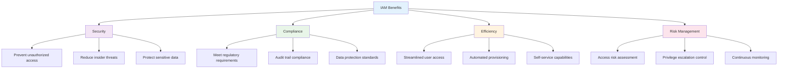

## 🔑 The AAA Framework: Authentication, Authorization, and Accounting

The AAA framework provides the foundation for secure access control systems.

### AAA Components

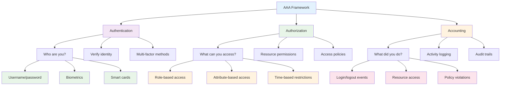

### 1. **Authentication (Who are you?)**

Authentication verifies the identity of users attempting to access systems or resources.

#### Authentication Factors

**Something You Know**:
- Passwords, PINs, security questions
- **Strengths**: Easy to implement, familiar to users
- **Weaknesses**: Can be guessed, shared, or stolen

**Something You Have**:
- Smart cards, security tokens, mobile devices
- **Strengths**: Hard to duplicate, can be revoked
- **Weaknesses**: Can be lost, stolen, or damaged

**Something You Are**:
- Fingerprints, facial recognition, voice patterns
- **Strengths**: Unique to individual, cannot be lost
- **Weaknesses**: Can be spoofed, affected by injury/illness

#### Multi-Factor Authentication (MFA)

MFA requires users to provide multiple authentication factors, significantly improving security.

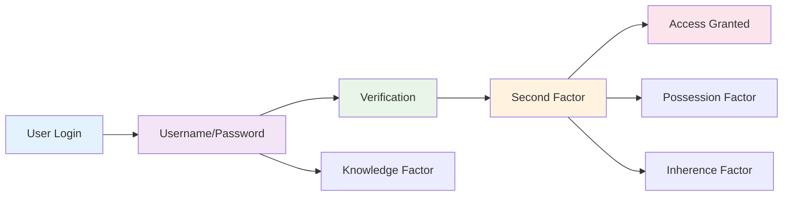

**MFA Examples**:
- **Password + SMS Code**: Common but vulnerable to SIM swapping
- **Password + Authenticator App**: More secure, offline capability
- **Password + Hardware Token**: Highest security, physical device required

### 2. **Authorization (What can you access?)**

Authorization determines what resources and actions a user can access after successful authentication.

#### Access Control Models

**Discretionary Access Control (DAC)**:
- Resource owners control access permissions
- Flexible but can lead to permission proliferation
- Example: File sharing in operating systems

**Mandatory Access Control (MAC)**:
- System-enforced access policies
- Rigid but highly secure
- Example: Military and government systems

**Role-Based Access Control (RBAC)**:
- Access based on user roles
- Scalable and manageable
- Example: Employee roles in organizations

**Attribute-Based Access Control (ABAC)**:
- Access based on user, resource, and environmental attributes
- Highly flexible and context-aware
- Example: Time-based access, location-based restrictions

### 3. **Accounting (What did you do?)**

Accounting tracks and logs all user activities for audit and security purposes.

#### Logging Requirements

- **Authentication Events**: Login attempts, successes, failures
- **Authorization Events**: Resource access, permission changes
- **User Activities**: Commands executed, data accessed, changes made
- **System Events**: Configuration changes, security events

## 🏢 Active Directory: Microsoft's Directory Service

Active Directory (AD) is Microsoft's directory service that provides centralized authentication and authorization for Windows networks.

### What is Active Directory?

Active Directory is a hierarchical directory service that stores information about network resources, including users, computers, groups, and organizational units (OUs).

### Active Directory Structure

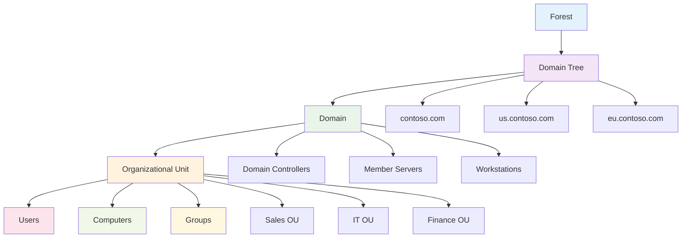

### Active Directory Components

#### 1. **Forest**
- Top-level container for AD objects
- Contains one or more domains
- Establishes trust relationships

#### 2. **Domain**
- Logical grouping of AD objects
- Has its own security policies
- Can contain multiple OUs

#### 3. **Organizational Unit (OU)**
- Container for organizing AD objects
- Can have Group Policy applied
- Enables delegation of administration

#### 4. **Domain Controllers**
- Servers that authenticate users
- Store AD database
- Replicate changes to other DCs

### Active Directory Security Features

#### Group Policy
Group Policy allows administrators to centrally manage user and computer settings.

```bash
# Example Group Policy Settings
Computer Configuration:
- Password policies
- Account lockout policies
- Security settings
- Software installation

User Configuration:
- Desktop settings
- Application restrictions
- Folder redirection
- Scripts
```

#### Trust Relationships
Trusts enable users in one domain to access resources in another domain.

**Trust Types**:
- **One-Way Trust**: Domain A trusts Domain B, but not vice versa
- **Two-Way Trust**: Both domains trust each other
- **Transitive Trust**: Trust extends through multiple domains

### Active Directory Deployment

#### Installation Steps
1. **Prepare the Environment**
   - Ensure DNS is properly configured
   - Verify network connectivity
   - Plan domain structure

2. **Install Active Directory Domain Services**
   ```bash
   # Install AD DS role
   Install-WindowsFeature -Name AD-Domain-Services
   
   # Promote to Domain Controller
   Install-ADDSForest -DomainName "contoso.com"
   ```

3. **Configure Domain Settings**
   - Set password policies
   - Configure account lockout policies
   - Establish security baselines

#### Security Best Practices
- **Regular Backups**: Backup AD database and system state
- **Monitoring**: Monitor for suspicious activities
- **Patching**: Keep domain controllers updated
- **Access Control**: Limit administrative access

## 🐧 OpenLDAP: Open Source Directory Service

OpenLDAP is an open-source implementation of the Lightweight Directory Access Protocol (LDAP), providing directory services for various platforms.

### What is LDAP?

LDAP is a protocol for accessing and managing directory information. It's platform-independent and widely used for authentication and directory services.

### LDAP vs Active Directory

| Feature | OpenLDAP | Active Directory |
|---------|----------|------------------|
| **Platform** | Cross-platform | Windows-centric |
| **Cost** | Free, open-source | Licensing required |
| **Integration** | Standards-based | Microsoft ecosystem |
| **Management** | Command-line, web tools | GUI management tools |
| **Scalability** | Highly scalable | Enterprise-scale |

### OpenLDAP Structure

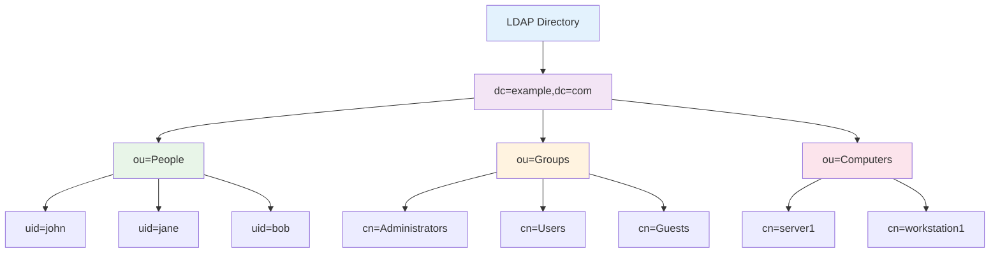

### OpenLDAP Installation and Configuration

#### Installation (Ubuntu/Debian)
```bash
# Install OpenLDAP server
sudo apt-get update
sudo apt-get install slapd ldap-utils

# Configure basic settings
sudo dpkg-reconfigure slapd
```

#### Basic Configuration
```bash
# LDAP configuration file
/etc/ldap/slapd.conf

# Database configuration
/etc/ldap/slapd.d/

# Access control
access to *
    by dn="cn=admin,dc=example,dc=com" write
    by * read
```

#### Adding Users and Groups
```bash
# Add user entry
ldapadd -x -D "cn=admin,dc=example,dc=com" -W
dn: uid=john,ou=People,dc=example,dc=com
objectClass: inetOrgPerson
uid: john
cn: John Doe
sn: Doe
mail: john@example.com

# Add group entry
ldapadd -x -D "cn=admin,dc=example,dc=com" -W
dn: cn=Users,ou=Groups,dc=example,dc=com
objectClass: groupOfNames
cn: Users
member: uid=john,ou=People,dc=example,dc=com
```

## 🔗 Single Sign-On (SSO) Implementation

Single Sign-On allows users to authenticate once and access multiple applications without re-entering credentials.

### SSO Benefits

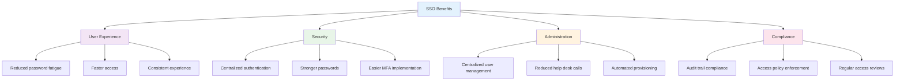

### SSO Architecture

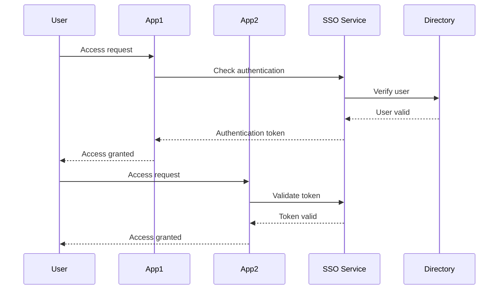

### OpenAM: Open Source SSO Solution

OpenAM is a comprehensive access management solution that provides SSO, federation, and access control capabilities.

#### OpenAM Features
- **Single Sign-On**: Access multiple applications with one login
- **Federation**: Share authentication across organizations
- **Access Control**: Fine-grained permission management
- **Session Management**: Secure session handling
- **Audit Logging**: Comprehensive activity tracking

#### OpenAM Deployment
```bash
# Download OpenAM
wget https://downloads.forgerock.org/openam/openam/14.0.0/openam-14.0.0.war

# Deploy to application server
cp openam-14.0.0.war /path/to/tomcat/webapps/

# Configure OpenAM
# Access configuration wizard at http://server:port/openam
```

## 🔐 Federation Standards: SAML, OAuth, and OpenID Connect

Federation enables secure authentication and authorization across different organizations and systems.

### SAML (Security Assertion Markup Language)

SAML is an XML-based standard for exchanging authentication and authorization data between parties.

#### SAML Components

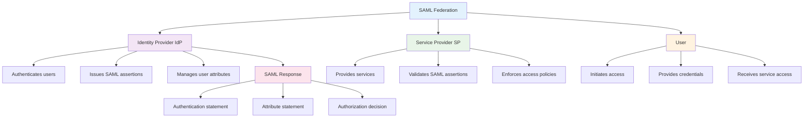

#### SAML Flow
1. **User** requests access to Service Provider
2. **Service Provider** redirects to Identity Provider
3. **Identity Provider** authenticates user
4. **Identity Provider** sends SAML assertion to Service Provider
5. **Service Provider** validates assertion and grants access

### OAuth 2.0

OAuth 2.0 is an authorization framework that allows third-party applications to access resources on behalf of users.

#### OAuth 2.0 Roles

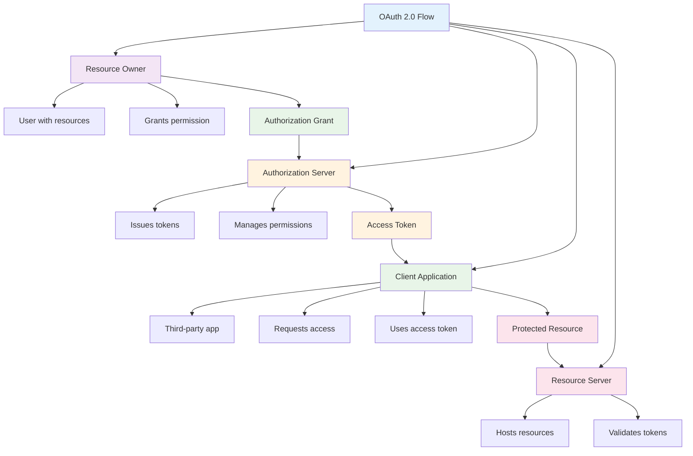

#### OAuth 2.0 Grant Types
- **Authorization Code**: Most secure, for web applications
- **Implicit**: Less secure, for mobile/JavaScript apps
- **Client Credentials**: For machine-to-machine communication
- **Resource Owner Password**: For trusted applications

### OpenID Connect

OpenID Connect extends OAuth 2.0 to provide authentication information, not just authorization.

#### OpenID Connect Benefits
- **Standardized**: Industry-standard authentication protocol
- **Secure**: Built on OAuth 2.0 security model
- **Flexible**: Supports various authentication methods
- **Interoperable**: Works across different platforms

## 🎭 Access Control Models: RBAC and ABAC

### Role-Based Access Control (RBAC)

RBAC assigns permissions to roles rather than directly to users, simplifying access management.

#### RBAC Components

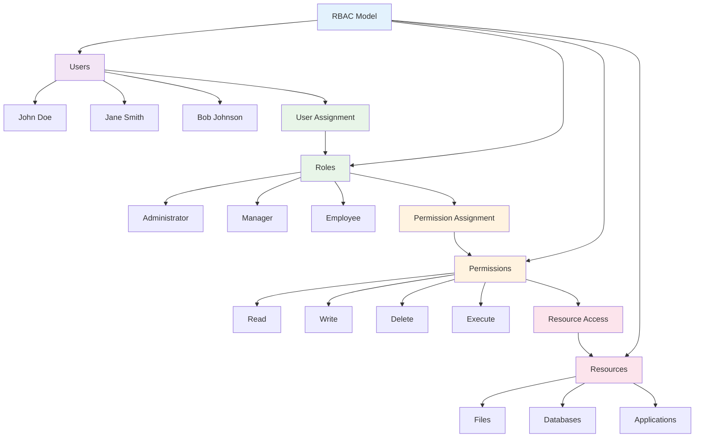

#### RBAC Implementation Example
```bash
# Define roles
role Administrator {
    permissions: ["read", "write", "delete", "execute"]
    resources: ["*"]
}

role Manager {
    permissions: ["read", "write"]
    resources: ["/data/sales/*", "/reports/*"]
}

role Employee {
    permissions: ["read"]
    resources: ["/data/sales/own/*"]
}

# Assign users to roles
assign john.doe to Administrator
assign jane.smith to Manager
assign bob.johnson to Employee
```

### Attribute-Based Access Control (ABAC)

ABAC makes access decisions based on attributes of users, resources, actions, and environment.

#### ABAC Attributes

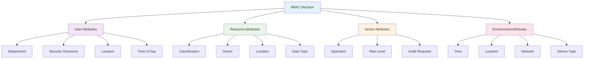

#### ABAC Policy Example
```bash
# Policy: Allow managers to read sales data during business hours
policy "Sales Data Access" {
    effect: "allow"
    condition: {
        user.department == "Sales" AND
        user.role == "Manager" AND
        resource.type == "Sales Data" AND
        action == "read" AND
        time.hour >= 8 AND time.hour <= 18
    }
}
```

## 📊 Access Governance and Attestation

Access governance ensures that user access remains appropriate over time through regular reviews and attestations.

### Access Governance Process

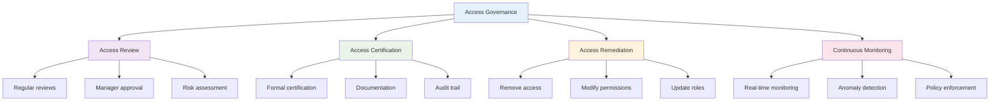

### Access Review Workflow

1. **Identify Review Scope**
   - High-privilege accounts
   - Critical system access
   - Dormant accounts
   - Role changes

2. **Conduct Reviews**
   - Manager reviews direct reports
   - System owners review access
   - Security team reviews privileged access

3. **Document Decisions**
   - Approve access
   - Revoke unnecessary access
   - Modify permissions
   - Escalate exceptions

4. **Implement Changes**
   - Automated provisioning
   - Manual updates
   - Verification of changes

### Access Attestation Tools

#### Manual Attestation
- Spreadsheet-based reviews
- Email notifications
- Manual approval workflows

#### Automated Attestation
- Identity governance platforms
- Workflow automation
- Integration with HR systems
- Automated provisioning

## 🔍 Monitoring and Auditing Access

Continuous monitoring and auditing of access activities is essential for security and compliance.

### Access Monitoring Components

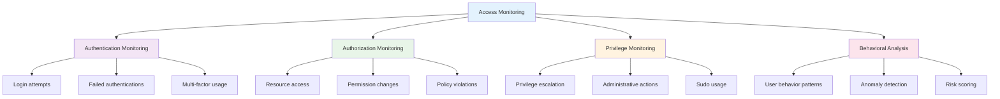

### Key Monitoring Metrics

#### Authentication Metrics
- **Failed login attempts**: Detect brute force attacks
- **Successful logins**: Track user activity patterns
- **Multi-factor usage**: Ensure MFA compliance
- **Account lockouts**: Identify attack patterns

#### Authorization Metrics
- **Resource access patterns**: Understand usage
- **Permission changes**: Track administrative actions
- **Policy violations**: Identify security issues
- **Access denials**: Detect unauthorized attempts

#### Privilege Metrics
- **Privilege escalation**: Monitor administrative access
- **Sudo usage**: Track elevated privileges
- **Role changes**: Monitor permission modifications
- **Emergency access**: Track break-glass procedures

### Audit Logging Requirements

#### What to Log
- **User identification**: Who performed the action
- **Action performed**: What was done
- **Resource accessed**: What was affected
- **Timestamp**: When it occurred
- **Source location**: Where it came from
- **Result**: Success or failure

#### Log Retention
- **Authentication logs**: 1-2 years minimum
- **Access logs**: 3-7 years for compliance
- **Administrative logs**: 7+ years for audit
- **Security events**: Permanent retention

## 🧪 Hands-on Activities

### Activity 1: Active Directory Setup

**Objective**: Deploy and configure Active Directory in a lab environment.

**Materials**: Windows Server VM, client workstations

**Steps**:
1. **Install Windows Server** and configure networking
2. **Install Active Directory Domain Services**
3. **Promote server to Domain Controller**
4. **Create organizational units** for different departments
5. **Add users and groups** with appropriate permissions
6. **Configure Group Policy** for security settings
7. **Join client workstations** to the domain

### Activity 2: OpenLDAP Configuration

**Objective**: Set up OpenLDAP directory service with user management.

**Materials**: Linux VM, LDAP client tools

**Steps**:
1. **Install OpenLDAP** server and utilities
2. **Configure basic LDAP settings** and database
3. **Create organizational structure** (OUs, users, groups)
4. **Configure access control** policies
5. **Test authentication** with LDAP clients
6. **Implement password policies** and security

### Activity 3: SSO Implementation

**Objective**: Implement Single Sign-On using OpenAM or similar solution.

**Materials**: Application server, OpenAM, sample applications

**Steps**:
1. **Deploy OpenAM** to application server
2. **Configure identity provider** settings
3. **Set up service providers** for applications
4. **Configure federation** between systems
5. **Test SSO functionality** across applications
6. **Implement access control** policies

### Activity 4: Access Control Design

**Objective**: Design and implement RBAC and ABAC models.

**Scenario**: University with different user types and access requirements

**Requirements**:
- **Students**: Access to course materials, limited library resources
- **Faculty**: Access to course management, research databases
- **Staff**: Access to administrative systems, student records
- **Administrators**: Full system access with monitoring

**Steps**:
1. **Define user roles** and responsibilities
2. **Identify resources** and access requirements
3. **Design permission matrix** for each role
4. **Implement access controls** in directory service
5. **Test access patterns** and verify security
6. **Document access policies** and procedures

## 📋 Key Takeaways

1. **IAM is fundamental** to cybersecurity, controlling who can access what resources and when.

2. **The AAA framework** provides the foundation for secure access control systems.

3. **Directory services** like Active Directory and OpenLDAP centralize user management and authentication.

4. **Single Sign-On** improves user experience while maintaining security through centralized authentication.

5. **Federation standards** enable secure authentication across organizational boundaries.

6. **Access governance** ensures that user access remains appropriate through regular reviews and monitoring.

7. **Continuous monitoring** and auditing are essential for detecting security threats and maintaining compliance.

## ❓ Review Questions

1. **What are the three components** of the AAA framework, and how do they work together?

2. **How does Active Directory** differ from OpenLDAP, and when would you choose each?

3. **What are the benefits** of implementing Single Sign-On, and what are the security considerations?

4. **How do RBAC and ABAC** differ, and what are the advantages of each approach?

5. **What is access governance**, and why is it important for security and compliance?

## 📚 Further Reading

### Books
- "Identity Management: A Business Perspective" by Graham Williamson
- "Active Directory: Designing, Deploying, and Running Active Directory" by Brian Desmond
- "LDAP System Administration" by Gerald Carter

### Online Resources
- [Microsoft Active Directory Documentation](https://docs.microsoft.com/en-us/windows-server/identity/ad-ds/)
- [OpenLDAP Documentation](https://www.openldap.org/doc/)
- [SAML 2.0 Specification](http://docs.oasis-open.org/security/saml/Post2.0/sstc-saml-tech-overview-2.0.html)
- [OAuth 2.0 Framework](https://tools.ietf.org/html/rfc6749)

### Tools and Platforms
- [OpenAM](https://www.forgerock.com/platform/access-management/)
- [Keycloak](https://www.keycloak.org/) - Open source identity and access management
- [FreeIPA](https://www.freeipa.org/) - Identity, policy, and audit solution

---

**Next Chapter**: [Chapter 6: Security Architecture and Threat Modeling](chapter06-security-architecture.md) - Learn how to design secure systems using proven frameworks and methodologies.
