# Chapter 7: Ethics, Security, and Privacy

## 🎯 Learning Objectives

By the end of this chapter, you will be able to:
- Understand the ethical principles that guide cybersecurity professionals
- Explain the relationship between security, privacy, and individual rights
- Interpret and apply GDPR requirements for data protection
- Understand Law 25 (Quebec's privacy law) and its implications
- Implement privacy-by-design principles in system development
- Conduct Privacy Impact Assessments (PIAs) for new projects
- Develop effective breach notification procedures
- Apply ethical decision-making frameworks to security scenarios
- Balance security requirements with privacy rights and business needs

## ⚖️ The Intersection of Ethics, Security, and Privacy

Cybersecurity professionals operate at the intersection of technology, law, and human rights. Understanding the ethical dimensions of security work is essential for making responsible decisions that protect both systems and people.

### Why Ethics Matter in Cybersecurity

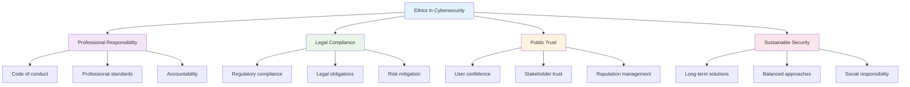

### The Ethical Dilemma

Cybersecurity professionals often face complex ethical challenges:

- **Security vs. Privacy**: Balancing protection with individual rights
- **Transparency vs. Security**: How much to reveal about security measures
- **Access vs. Control**: Managing legitimate access while preventing abuse
- **Innovation vs. Safety**: Advancing technology while maintaining security

## 🏛️ Ethical Principles in Cybersecurity

Several ethical frameworks guide cybersecurity professionals in making responsible decisions.

### Core Ethical Principles

```mermaid
graph TD
    A[Cybersecurity Ethics] --> B[Beneficence]
    A --> C[Non-maleficence]
    A --> D[Autonomy]
    A --> E[Justice]
    A --> F[Transparency]
    A --> G[Accountability]
    
    B --> B1[Do good]
    B --> B2[Protect users]
    B --> B3[Enhance security]
    
    C --> C1[Do no harm]
    C --> C2[Minimize risks]
    C --> C3[Prevent damage]
    
    D --> D1[Respect choices]
    D --> D2[User consent]
    D --> D3[Privacy rights]
    
    E --> E1[Fair treatment]
    E --> E2[Equal protection]
    E --> E3[Non-discrimination]
    
    F --> F1[Open communication]
    F --> F2[Clear policies]
    F --> F3[Honest disclosure]
    
    G --> G1[Take responsibility]
    G --> G2[Accept consequences]
    G --> G3[Learn from mistakes]
    
    style A fill:#e3f2fd
    style B fill:#f3e5f5
    style C fill:#e8f5e8
    style D fill:#fff3e0
    style E fill:#fce4ec
    style F fill:#f1f8e9
    style G fill:#fff8e1
```

### 1. **Beneficence (Do Good)**
- **Principle**: Act in ways that benefit others and improve security
- **Application**: Implement effective security measures, share threat intelligence
- **Example**: Contributing to open-source security tools, helping organizations improve their security posture

### 2. **Non-maleficence (Do No Harm)**
- **Principle**: Avoid causing harm to individuals or systems
- **Application**: Test security measures safely, avoid unnecessary data collection
- **Example**: Using penetration testing environments that don't affect production systems

### 3. **Autonomy (Respect Choices)**
- **Principle**: Respect individuals' right to make informed decisions
- **Application**: Obtain informed consent, provide clear privacy choices
- **Example**: Allowing users to opt out of data collection, providing clear privacy settings

### 4. **Justice (Fair Treatment)**
- **Principle**: Treat all individuals and groups fairly and equally
- **Application**: Apply security measures consistently, avoid discriminatory practices
- **Example**: Ensuring security policies don't unfairly target specific groups or individuals

### 5. **Transparency (Open Communication)**
- **Principle**: Be open and honest about security practices and policies
- **Application**: Clear privacy policies, honest security communications
- **Example**: Explaining data collection practices in plain language

### 6. **Accountability (Take Responsibility)**
- **Principle**: Accept responsibility for actions and their consequences
- **Application**: Acknowledge mistakes, learn from incidents, improve practices
- **Example**: Conducting post-incident reviews and implementing lessons learned

## 🔐 Privacy Fundamentals

Privacy is the right of individuals to control their personal information and how it's collected, used, and shared.

### What is Privacy?

Privacy encompasses several dimensions:

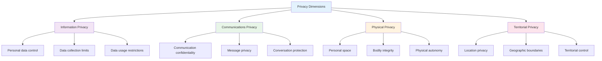

### Privacy vs. Security: Finding the Balance

Privacy and security are often viewed as competing interests, but they can and should work together:

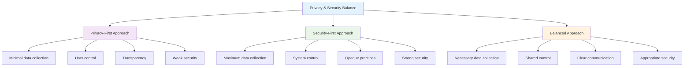

**The Balanced Approach**:
- **Collect only necessary data** for legitimate security purposes
- **Implement strong security measures** that respect privacy
- **Provide transparency** about data practices
- **Give users control** over their information
- **Use privacy-enhancing technologies** (PETs)

## 🌍 GDPR: General Data Protection Regulation

The GDPR is a comprehensive data protection regulation that applies to organizations processing personal data of EU residents.

### What is GDPR?

GDPR is a regulation that:
- **Protects personal data** of EU residents
- **Applies globally** to any organization processing EU data
- **Enforces strict requirements** for data handling
- **Provides individual rights** over personal data
- **Imposes significant penalties** for violations

### GDPR Scope and Application

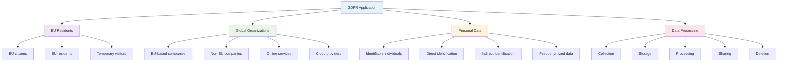

### Key GDPR Principles

#### 1. **Lawfulness, Fairness, and Transparency**
- **Lawfulness**: Processing must have a legal basis
- **Fairness**: Treat individuals fairly and not misleadingly
- **Transparency**: Be clear about data processing activities

#### 2. **Purpose Limitation**
- **Specific Purpose**: Collect data for specific, legitimate purposes
- **No Further Processing**: Don't use data for incompatible purposes
- **Documentation**: Clearly document processing purposes

#### 3. **Data Minimization**
- **Adequate**: Collect sufficient data for the purpose
- **Relevant**: Only collect data relevant to the purpose
- **Limited**: Don't collect excessive or unnecessary data

#### 4. **Accuracy**
- **Keep Accurate**: Maintain accurate and up-to-date data
- **Correct Errors**: Promptly correct inaccurate data
- **Verify Sources**: Ensure data comes from reliable sources

#### 5. **Storage Limitation**
- **Time Limits**: Don't keep data longer than necessary
- **Review Periodically**: Regularly review data retention
- **Delete Promptly**: Remove data when no longer needed

#### 6. **Integrity and Confidentiality**
- **Security Measures**: Implement appropriate security controls
- **Access Controls**: Limit access to authorized personnel
- **Encryption**: Use encryption for sensitive data

#### 7. **Accountability**
- **Demonstrate Compliance**: Show how you comply with GDPR
- **Documentation**: Maintain records of processing activities
- **Training**: Train staff on data protection requirements

### Individual Rights Under GDPR

```mermaid
graph TD
    A[GDPR Individual Rights] --> B[Right to Information]
    A --> C[Right of Access]
    A --> D[Right to Rectification]
    A --> E[Right to Erasure]
    A --> F[Right to Restriction]
    A --> G[Right to Portability]
    A --> H[Right to Object]
    A --> I[Rights on Automated Decisions]
    
    B --> B1[Clear information]
    B --> B2[Processing details]
    B --> B3[Legal basis]
    
    C --> C1[Access personal data]
    C --> C2[Processing information]
    C --> C3[Recipient details]
    
    D --> D1[Correct errors]
    D --> D2[Update information]
    D --> D3[Complete records]
    
    E --> E1[Delete data]
    E --> E2[Stop processing]
    E --> E3[Remove consent]
    
    F --> F1[Limit processing]
    F --> F2[Preserve data]
    F --> F3[Verify accuracy]
    
    G --> G1[Data portability]
    G --> G2[Structured format]
    G --> G3[Direct transfer]
    
    H --> H1[Object to processing]
    H --> H2[Marketing opt-out]
    H --> H3[Legitimate interests]
    
    I --> I1[Human review]
    I --> I2[Explanation]
    I --> I3[Appeal rights]
    
    style A fill:#e3f2fd
    style B fill:#f3e5f5
    style C fill:#e8f5e8
    style D fill:#fff3e0
    style E fill:#fce4ec
    style F fill:#f1f8e9
    style G fill:#fff8e1
    style H fill:#f3e5f5
    style I fill:#e8f5e8
```

### GDPR Compliance Requirements

#### 1. **Legal Basis for Processing**
Organizations must have a legal basis for processing personal data:

- **Consent**: Clear, informed, and freely given consent
- **Contract**: Processing necessary for contract performance
- **Legal Obligation**: Required by law or regulation
- **Vital Interests**: Protecting life or health
- **Public Task**: Official authority or public interest
- **Legitimate Interests**: Business interests that don't override individual rights

#### 2. **Data Protection Impact Assessment (DPIA)**
Required for high-risk processing activities:

- **Systematic Monitoring**: Large-scale monitoring of individuals
- **Special Categories**: Processing sensitive personal data
- **Vulnerable Groups**: Processing data of vulnerable individuals
- **Innovative Technology**: Using new or untested technology
- **Data Matching**: Combining datasets from different sources

#### 3. **Data Breach Notification**
Organizations must report data breaches within 72 hours:

- **Supervisory Authority**: Report to relevant data protection authority
- **Individuals**: Notify affected individuals if high risk
- **Documentation**: Maintain records of all breaches
- **Investigation**: Investigate and document breach details

## 🍁 Law 25: Quebec's Privacy Legislation

Law 25 (formerly Bill 64) is Quebec's comprehensive privacy law that significantly strengthens data protection requirements.

### What is Law 25?

Law 25 is Quebec's privacy legislation that:
- **Strengthens privacy rights** for Quebec residents
- **Imposes strict requirements** for data handling
- **Provides individual rights** over personal data
- **Enforces significant penalties** for violations
- **Applies to organizations** operating in Quebec

### Key Provisions of Law 25

```mermaid
graph TD
    A[Law 25 Key Provisions] --> B[Enhanced Consent]
    A --> C[Data Portability]
    A --> D[Right to Deletion]
    A --> E[Privacy by Design]
    A --> F[Breach Notification]
    A --> G[Penalties]
    
    B --> B1[Clear language]
    B --> B2[Specific purposes]
    B --> B3[Easy withdrawal]
    
    C --> C1[Data export]
    C --> C2[Structured format]
    C --> C3[Direct transfer]
    
    D --> D1[Complete deletion]
    D --> D2[Third-party removal]
    D --> D3[Verification]
    
    E --> E1[Default privacy]
    E --> E2[Minimal collection]
    E --> E3[User control]
    
    F --> F1[72-hour notification]
    F --> F2[Individual notice]
    F --> F3[Documentation]
    
    G --> G1[Administrative penalties]
    G --> G2[Criminal penalties]
    G --> G3[Class action suits]
    
    style A fill:#e3f2fd
    style B fill:#f3e5f5
    style C fill:#e8f5e8
    style D fill:#fff3e0
    style E fill:#fce4ec
    style F fill:#f1f8e9
    style G fill:#fff8e1
```

### Law 25 vs. GDPR Comparison

| Aspect | Law 25 | GDPR |
|--------|--------|------|
| **Scope** | Quebec residents | EU residents |
| **Consent** | Clear, specific language | Freely given, informed |
| **Data Portability** | Right to data export | Right to data portability |
| **Right to Deletion** | Complete removal | Right to erasure |
| **Breach Notification** | 72 hours | 72 hours |
| **Penalties** | Up to $25M or 4% revenue | Up to €20M or 4% revenue |

### Compliance Requirements

#### 1. **Enhanced Consent Requirements**
- **Clear Language**: Use plain, simple language
- **Specific Purposes**: Clearly state each processing purpose
- **Easy Withdrawal**: Provide simple withdrawal mechanisms
- **Granular Control**: Allow consent for specific purposes

#### 2. **Privacy by Design Implementation**
- **Default Privacy**: Privacy as the default setting
- **Minimal Collection**: Collect only necessary data
- **User Control**: Give users control over their data
- **Transparency**: Clear communication about practices

#### 3. **Data Subject Rights**
- **Access Rights**: Right to access personal data
- **Correction Rights**: Right to correct inaccurate data
- **Deletion Rights**: Right to complete data deletion
- **Portability Rights**: Right to data export

## 🏗️ Privacy by Design Principles

Privacy by Design is a proactive approach that embeds privacy into the design and architecture of systems and business practices.

### What is Privacy by Design?

Privacy by Design is a framework that:
- **Integrates privacy** into system design from the start
- **Proactively addresses** privacy concerns
- **Ensures privacy** as the default setting
- **Provides full functionality** while protecting privacy
- **Maintains visibility** and transparency

### Privacy by Design Framework

```mermaid
graph TD
    A[Privacy by Design] --> B[Proactive Approach]
    A --> C[Privacy as Default]
    A --> D[Privacy Embedded]
    A --> E[Full Functionality]
    A --> F[End-to-End Security]
    A --> G[Visibility & Transparency]
    A --> H[Respect for User Privacy]
    
    B --> B1[Anticipate privacy issues]
    B --> B2[Prevent privacy problems]
    B --> B3[Plan for privacy]
    
    C --> C1[Privacy by default]
    C --> C2[No action required]
    C --> C3[Maximum privacy]
    
    D --> D1[Built into design]
    D --> D2[Not added later]
    D --> D3[Core functionality]
    
    E --> E1[All legitimate interests]
    E --> E2[Privacy protection]
    E --> E3[User experience]
    
    F --> F1[Data lifecycle]
    F --> F2[Secure processing]
    F --> F3[Data protection]
    
    G --> G1[Clear policies]
    G --> G2[Open practices]
    G --> G3[User control]
    
    H --> H1[User choice]
    H --> H2[Individual control]
    H --> H3[Respect for preferences]
    
    style A fill:#e3f2fd
    style B fill:#f3e5f5
    style C fill:#e8f5e8
    style D fill:#fff3e0
    style E fill:#fce4ec
    style F fill:#f1f8e9
    style G fill:#fff8e1
    style H fill:#f3e5f5
```

### Implementing Privacy by Design

#### 1. **System Architecture**
- **Data Minimization**: Collect only necessary data
- **Purpose Limitation**: Use data only for intended purposes
- **Access Controls**: Limit access to authorized personnel
- **Encryption**: Encrypt data at rest and in transit

#### 2. **User Interface Design**
- **Clear Choices**: Provide clear privacy options
- **Default Settings**: Set privacy-friendly defaults
- **Easy Access**: Make privacy settings easily accessible
- **Plain Language**: Use simple, understandable language

#### 3. **Data Processing**
- **Anonymization**: Remove identifying information when possible
- **Pseudonymization**: Replace identifiers with pseudonyms
- **Aggregation**: Process data in aggregate form
- **Retention Limits**: Automatically delete data when no longer needed

#### 4. **User Control**
- **Consent Management**: Easy consent and withdrawal
- **Data Access**: User access to their data
- **Data Correction**: Ability to correct inaccurate data
- **Data Deletion**: Complete data removal

## 📊 Privacy Impact Assessment (PIA)

A Privacy Impact Assessment is a systematic process for evaluating the privacy implications of new projects, systems, or processes.

### What is a PIA?

A PIA is a tool that:
- **Identifies privacy risks** in new initiatives
- **Evaluates compliance** with privacy requirements
- **Recommends mitigation** strategies
- **Documents decisions** and rationale
- **Ensures accountability** for privacy protection

### PIA Process

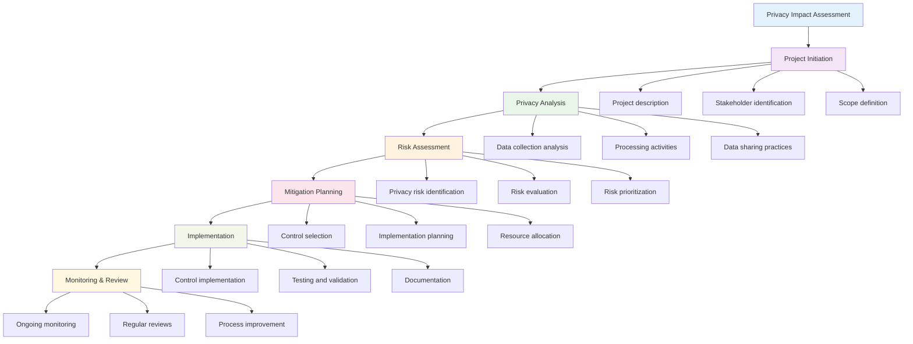

### PIA Components

#### 1. **Project Description**
- **Purpose**: Clear statement of project objectives
- **Scope**: What the project covers and doesn't cover
- **Timeline**: Project schedule and milestones
- **Stakeholders**: Who is involved and affected

#### 2. **Data Analysis**
- **Data Collection**: What data is collected and why
- **Data Sources**: Where data comes from
- **Data Types**: Categories of personal information
- **Data Volume**: Amount of data processed

#### 3. **Processing Activities**
- **Data Uses**: How data is used
- **Data Sharing**: Who data is shared with
- **Data Storage**: Where and how data is stored
- **Data Retention**: How long data is kept

#### 4. **Risk Assessment**
- **Privacy Risks**: Potential privacy violations
- **Risk Likelihood**: Probability of risks occurring
- **Risk Impact**: Severity of potential consequences
- **Risk Prioritization**: Ranking of risks by importance

#### 5. **Mitigation Strategies**
- **Control Selection**: Privacy controls to implement
- **Implementation Plan**: How controls will be implemented
- **Resource Requirements**: People, time, and budget needed
- **Success Metrics**: How to measure effectiveness

## 🚨 Data Breach Notification

Data breach notification is a critical requirement under privacy laws that ensures individuals and authorities are informed when personal data is compromised.

### What is a Data Breach?

A data breach occurs when:
- **Unauthorized access** to personal data
- **Accidental disclosure** of personal information
- **Data loss** or destruction
- **Data alteration** without authorization
- **Data unavailability** due to security incidents

### Breach Notification Requirements

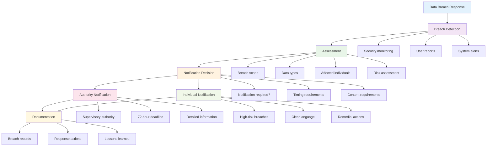

### Notification Requirements

#### 1. **Timing Requirements**
- **GDPR**: 72 hours from breach discovery
- **Law 25**: 72 hours from breach discovery
- **Other Laws**: Varies by jurisdiction (30-90 days common)

#### 2. **Authority Notification**
- **Who**: Relevant data protection authority
- **What**: Detailed breach information
- **When**: Within required timeframe
- **How**: Through official notification channels

#### 3. **Individual Notification**
- **When Required**: High risk to individuals
- **Content**: Clear, understandable language
- **Timing**: Without undue delay
- **Method**: Direct communication when possible

### Breach Response Process

#### 1. **Immediate Response**
- **Contain the Breach**: Stop unauthorized access
- **Assess the Scope**: Determine what data was affected
- **Document Everything**: Record all actions and findings
- **Preserve Evidence**: Maintain evidence for investigation

#### 2. **Risk Assessment**
- **Data Sensitivity**: Evaluate sensitivity of compromised data
- **Number Affected**: Count affected individuals
- **Potential Harm**: Assess potential consequences
- **Notification Decision**: Determine if notification is required

#### 3. **Notification Process**
- **Prepare Notifications**: Draft clear, informative messages
- **Meet Deadlines**: Submit within required timeframes
- **Provide Details**: Include relevant information
- **Offer Support**: Provide assistance to affected individuals

## 🤔 Ethical Decision-Making Frameworks

Cybersecurity professionals need structured approaches to make ethical decisions in complex situations.

### Ethical Decision-Making Process

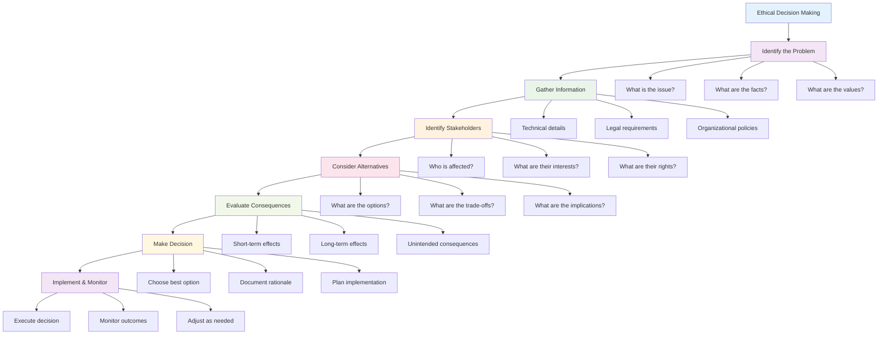

### Ethical Decision-Making Tools

#### 1. **The Golden Rule**
- **Principle**: Treat others as you would want to be treated
- **Application**: Consider how your actions affect others
- **Example**: Would you want your personal data handled this way?

#### 2. **The Publicity Test**
- **Principle**: Would you be comfortable if your decision was public?
- **Application**: Consider public reaction to your decision
- **Example**: How would this look in the news or on social media?

#### 3. **The Reversibility Test**
- **Principle**: Would you accept this decision if you were affected?
- **Application**: Put yourself in others' shoes
- **Example**: How would you feel if this happened to you?

#### 4. **The Harm Test**
- **Principle**: Does this action cause unnecessary harm?
- **Application**: Evaluate potential negative consequences
- **Example**: What harm could result from this decision?

### Common Ethical Dilemmas

#### 1. **Security vs. Privacy**
**Scenario**: Implementing monitoring systems that collect user data for security purposes.

**Ethical Considerations**:
- **Security Benefits**: Protection against threats
- **Privacy Costs**: Intrusion into personal information
- **Balance**: Minimize data collection while maintaining security

**Resolution**: Implement privacy-preserving monitoring that collects only necessary data.

#### 2. **Transparency vs. Security**
**Scenario**: Disclosing security vulnerabilities that could help attackers.

**Ethical Considerations**:
- **Transparency Benefits**: User awareness and trust
- **Security Risks**: Potential exploitation by attackers
- **Balance**: Responsible disclosure with appropriate timing

**Resolution**: Coordinate disclosure with affected parties and provide patches.

#### 3. **Access vs. Control**
**Scenario**: Balancing legitimate access needs with security controls.

**Ethical Considerations**:
- **Access Benefits**: Business functionality and user productivity
- **Control Benefits**: Security and data protection
- **Balance**: Appropriate access with necessary controls

**Resolution**: Implement role-based access with least privilege principles.

## 🧪 Hands-on Activities

### Activity 1: Privacy Impact Assessment

**Objective**: Conduct a PIA for a new customer relationship management system.

**Scenario**: Company implementing CRM system to manage customer interactions and sales data.

**Steps**:
1. **Project Description**: Define scope, purpose, and stakeholders
2. **Data Analysis**: Identify data types, sources, and uses
3. **Risk Assessment**: Evaluate privacy risks and impacts
4. **Mitigation Planning**: Design privacy controls and safeguards
5. **Documentation**: Complete PIA report with recommendations

### Activity 2: GDPR Compliance Review

**Objective**: Assess an organization's GDPR compliance status.

**Scenario**: Review existing data processing activities and privacy practices.

**Steps**:
1. **Data Inventory**: Map all personal data processing activities
2. **Legal Basis Review**: Verify legal basis for each processing activity
3. **Individual Rights**: Assess implementation of data subject rights
4. **Security Measures**: Review data protection and security controls
5. **Documentation**: Create compliance report with action items

### Activity 3: Ethical Decision Making

**Objective**: Apply ethical frameworks to cybersecurity scenarios.

**Scenarios**:
- **Scenario 1**: Discovering a security vulnerability in a competitor's system
- **Scenario 2**: Implementing employee monitoring for security purposes
- **Scenario 3**: Responding to a data breach with incomplete information

**Steps**:
1. **Identify the Problem**: Clearly state the ethical issue
2. **Gather Information**: Collect relevant facts and context
3. **Apply Ethical Frameworks**: Use decision-making tools
4. **Evaluate Alternatives**: Consider different approaches
5. **Make Decision**: Choose best ethical option
6. **Document Rationale**: Explain reasoning and justification

### Activity 4: Privacy by Design Implementation

**Objective**: Design a privacy-friendly mobile application.

**Requirements**:
- User authentication and profile management
- Location-based services
- Social media integration
- Data analytics and reporting

**Steps**:
1. **Privacy Requirements**: Define privacy objectives and constraints
2. **System Architecture**: Design with privacy principles
3. **User Interface**: Create privacy-friendly user experience
4. **Data Processing**: Implement privacy-preserving data handling
5. **User Controls**: Provide comprehensive privacy settings
6. **Testing**: Validate privacy features and user experience

## 📋 Key Takeaways

1. **Ethics are fundamental** to cybersecurity, guiding professionals in making responsible decisions that protect both systems and people.

2. **Privacy and security** can work together when properly balanced, using privacy-by-design principles and appropriate controls.

3. **GDPR and Law 25** provide comprehensive frameworks for data protection, requiring organizations to respect individual rights and implement appropriate safeguards.

4. **Privacy Impact Assessments** help organizations identify and address privacy risks in new projects and systems.

5. **Data breach notification** is a critical requirement that ensures transparency and enables individuals to protect themselves.

6. **Ethical decision-making frameworks** provide structured approaches for resolving complex ethical dilemmas in cybersecurity.

7. **Privacy by Design** embeds privacy protection into system design, ensuring privacy is maintained throughout the data lifecycle.

## ❓ Review Questions

1. **What are the core ethical principles** in cybersecurity, and how do they guide professional behavior?

2. **How do GDPR and Law 25 differ**, and what are the key compliance requirements for each?

3. **What is Privacy by Design**, and how can it be implemented in system development?

4. **What is a Privacy Impact Assessment**, and when should it be conducted?

5. **How can ethical decision-making frameworks** help resolve complex cybersecurity dilemmas?

## 📚 Further Reading

### Books
- "Privacy Engineering: A Dataflow and Ontological Approach" by Ian Oliver
- "The Right to Privacy" by Samuel Warren and Louis Brandeis
- "Privacy in Context: Technology, Policy, and the Integrity of Social Life" by Helen Nissenbaum

### Online Resources
- [GDPR Official Text](https://gdpr-info.eu/)
- [Quebec Law 25](https://www.quebec.ca/en/government/departments-and-agencies/ministry-of-justice/access-to-information-and-privacy/)
- [Privacy by Design](https://www.ipc.on.ca/privacy/privacy-by-design/)

### Organizations and Standards
- [International Association of Privacy Professionals (IAPP)](https://iapp.org/)
- [ISO 27701 Privacy Information Management](https://www.iso.org/standard/71618.html)
- [NIST Privacy Framework](https://www.nist.gov/privacy-framework)

---

**Next Chapter**: [Chapter 8: Cryptography Fundamentals](chapter08-cryptography.md) - Learn about encryption algorithms, cryptographic protocols, and Public Key Infrastructure (PKI).
