# Chapter 8: Cryptography Fundamentals

## 🎯 Learning Objectives

By the end of this chapter, you will be able to:
- Understand the fundamental principles of cryptography and its role in cybersecurity
- Explain the difference between symmetric and asymmetric encryption
- Implement AES, RSA, and ECC encryption algorithms using OpenSSL
- Understand Public Key Infrastructure (PKI) and digital certificates
- Analyze and secure TLS/SSL communications
- Implement PGP for secure email and file encryption
- Understand cryptographic attacks and countermeasures
- Apply cryptographic principles to secure data storage and transmission

## 🔐 What is Cryptography?

Cryptography is the science and practice of securing information through mathematical techniques that transform data into unreadable formats, ensuring confidentiality, integrity, and authenticity.

### The Foundation of Digital Trust

Cryptography provides the mathematical foundation for:
- **Secure Communications**: Protecting data in transit
- **Data Protection**: Securing information at rest
- **Authentication**: Verifying identity and integrity
- **Digital Signatures**: Ensuring non-repudiation

### Why Cryptography Matters

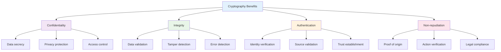

## 🔑 Cryptographic Principles

Understanding the fundamental principles of cryptography is essential for implementing secure systems.

### Core Cryptographic Concepts

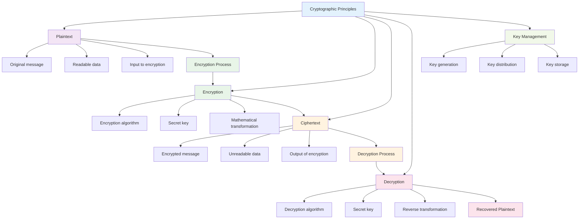

### 1. **Plaintext**
- **Definition**: Original, readable message or data
- **Characteristics**: Human-readable, meaningful content
- **Examples**: Email messages, documents, passwords

### 2. **Encryption**
- **Definition**: Process of converting plaintext to ciphertext
- **Components**: Algorithm + Key + Plaintext
- **Output**: Unreadable ciphertext

### 3. **Ciphertext**
- **Definition**: Encrypted, unreadable message
- **Characteristics**: Appears random, meaningless
- **Purpose**: Protects data confidentiality

### 4. **Decryption**
- **Definition**: Process of converting ciphertext back to plaintext
- **Components**: Algorithm + Key + Ciphertext
- **Output**: Recovered plaintext

### 5. **Key Management**
- **Definition**: Processes for handling cryptographic keys
- **Components**: Generation, distribution, storage, rotation
- **Critical**: Security depends on key secrecy

## 🔄 Types of Cryptography

Cryptography can be classified into different types based on the number of keys used and their purpose.

### Symmetric vs. Asymmetric Cryptography

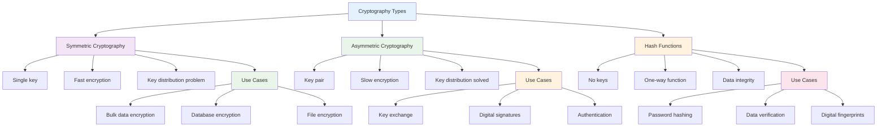

## 🔐 Symmetric Cryptography

Symmetric cryptography uses the same key for both encryption and decryption.

### How Symmetric Encryption Works

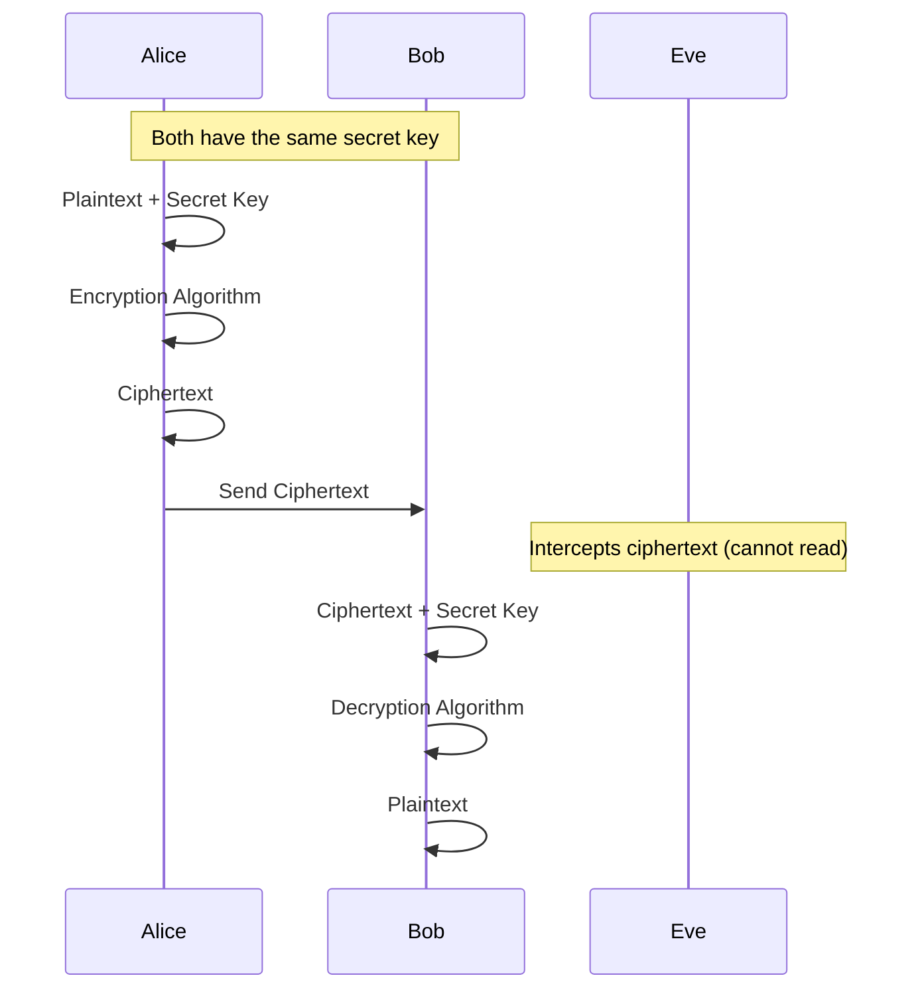

### Advantages of Symmetric Cryptography
- **Speed**: Fast encryption and decryption
- **Efficiency**: Low computational overhead
- **Simplicity**: Single key management

### Disadvantages of Symmetric Cryptography
- **Key Distribution**: How to securely share the secret key
- **Key Management**: Number of keys grows with users
- **Scalability**: Difficult to manage in large systems

### Common Symmetric Algorithms

#### 1. **AES (Advanced Encryption Standard)**
- **Key Sizes**: 128, 192, or 256 bits
- **Block Size**: 128 bits
- **Security**: Considered cryptographically secure
- **Performance**: Fast and efficient

#### 2. **ChaCha20**
- **Key Size**: 256 bits
- **Nonce Size**: 96 bits
- **Security**: High security margin
- **Performance**: Excellent on mobile devices

#### 3. **Twofish**
- **Key Size**: Up to 256 bits
- **Block Size**: 128 bits
- **Security**: Strong security analysis
- **Performance**: Good performance characteristics

## 🔑 Asymmetric Cryptography

Asymmetric cryptography uses a pair of mathematically related keys: public and private.

### How Asymmetric Encryption Works

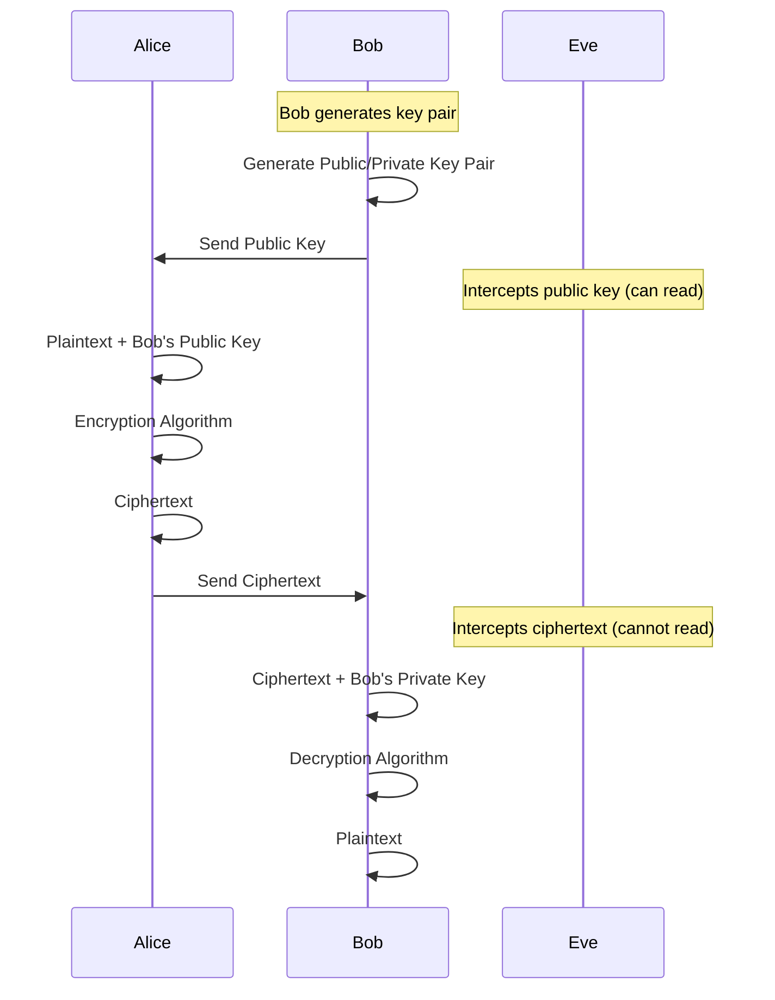

### Key Pair Characteristics

#### Public Key
- **Purpose**: Can be shared publicly
- **Usage**: Encryption, signature verification
- **Distribution**: Freely distributed
- **Security**: Safe to expose

#### Private Key
- **Purpose**: Must be kept secret
- **Usage**: Decryption, signature creation
- **Distribution**: Never shared
- **Security**: Critical to protect

### Advantages of Asymmetric Cryptography
- **Key Distribution**: Public keys can be freely shared
- **Digital Signatures**: Provides authentication and non-repudiation
- **Scalability**: Easy to manage in large systems

### Disadvantages of Asymmetric Cryptography
- **Speed**: Slower than symmetric encryption
- **Key Size**: Requires larger keys for equivalent security
- **Computational Cost**: Higher resource requirements

### Common Asymmetric Algorithms

#### 1. **RSA (Rivest-Shamir-Adleman)**
- **Key Sizes**: 2048+ bits recommended
- **Security**: Based on integer factorization
- **Performance**: Slower than newer algorithms
- **Compatibility**: Widely supported

#### 2. **ECC (Elliptic Curve Cryptography)**
- **Key Sizes**: 256+ bits recommended
- **Security**: Based on elliptic curve discrete logarithm
- **Performance**: Faster than RSA
- **Efficiency**: Smaller keys for equivalent security

#### 3. **Ed25519**
- **Key Size**: 256 bits
- **Security**: High security margin
- **Performance**: Excellent performance
- **Modern**: Designed for current security needs

## 🔒 Hash Functions

Hash functions are one-way mathematical functions that convert input data into fixed-size output.

### What are Hash Functions?

Hash functions:
- **Transform data**: Convert any input to fixed-size output
- **One-way**: Cannot reverse to get original input
- **Deterministic**: Same input always produces same output
- **Collision resistant**: Hard to find different inputs with same output

### Hash Function Properties

```mermaid
graph TD
    A[Hash Function Properties] --> B[Fixed Output Size]
    A --> C[One-Way Function]
    A --> D[Deterministic]
    A --> E[Collision Resistant]
    A --> F[Avalanche Effect]
    
    B --> B1[Consistent length]
    B --> B2[Input size independent]
    B --> B3[Standardized output]
    
    C --> C1[Cannot reverse]
    C --> C2[Preimage resistance]
    C --> C3[Second preimage resistance]
    
    D --> D1[Same input = same output]
    D --> D2[Reproducible results]
    D --> D3[Predictable behavior]
    
    E --> E1[Hard to find collisions]
    E --> E2[Different inputs = different outputs]
    E --> E3[Strong collision resistance]
    
    F --> F1[Small input change]
    F --> F2[Large output change]
    F --> F3[Unpredictable changes]
    
    style A fill:#e3f2fd
    style B fill:#f3e5f5
    style C fill:#e8f5e8
    style D fill:#fff3e0
    style E fill:#fce4ec
    style F fill:#f1f8e9
```

### Common Hash Functions

#### 1. **SHA-256 (Secure Hash Algorithm)**
- **Output Size**: 256 bits (32 bytes)
- **Security**: Cryptographically secure
- **Performance**: Good performance
- **Usage**: Digital signatures, blockchain, file integrity

#### 2. **SHA-3 (Keccak)**
- **Output Size**: Variable (224, 256, 384, 512 bits)
- **Security**: Based on different mathematical principles
- **Performance**: Good performance
- **Usage**: Alternative to SHA-2

#### 3. **BLAKE3**
- **Output Size**: Variable (up to 64 bytes)
- **Security**: High security margin
- **Performance**: Excellent performance
- **Usage**: Modern applications requiring speed

## 🏗️ Public Key Infrastructure (PKI)

PKI is a framework that manages digital certificates and public key encryption.

### What is PKI?

PKI provides:
- **Digital Certificates**: Bind public keys to identities
- **Certificate Authorities**: Trusted entities that issue certificates
- **Certificate Management**: Lifecycle management of certificates
- **Trust Establishment**: Foundation for secure communications

### PKI Components

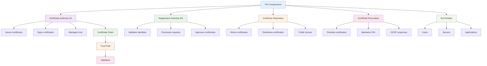

### Digital Certificates

#### Certificate Structure
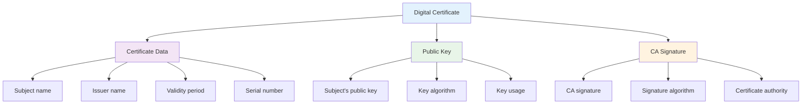

#### Certificate Fields
- **Subject**: Entity the certificate identifies
- **Issuer**: CA that issued the certificate
- **Public Key**: Subject's public key
- **Validity**: Certificate expiration dates
- **Serial Number**: Unique identifier
- **Signature**: CA's digital signature

### Certificate Lifecycle

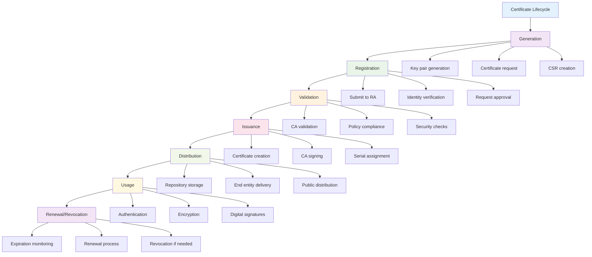

## 🔐 Implementing Cryptography with OpenSSL

OpenSSL is a comprehensive toolkit for implementing cryptographic functions.

### OpenSSL Basics

#### Installation
```bash
# Ubuntu/Debian
sudo apt-get install openssl

# CentOS/RHEL
sudo yum install openssl

# macOS
brew install openssl
```

#### Basic Commands
```bash
# Generate random data
openssl rand -hex 32

# Generate hash
echo "Hello World" | openssl sha256

# Base64 encoding/decoding
echo "Hello World" | openssl base64
openssl base64 -d <<< "SGVsbG8gV29ybGQK"
```

### Symmetric Encryption with AES

#### Encrypting Files
```bash
# Encrypt file with AES-256
openssl enc -aes-256-cbc -salt -in plaintext.txt -out encrypted.enc

# Decrypt file
openssl enc -aes-256-cbc -d -in encrypted.enc -out decrypted.txt
```

#### Encrypting with Password
```bash
# Encrypt with password
openssl enc -aes-256-cbc -salt -in file.txt -out file.enc -pass pass:mypassword

# Decrypt with password
openssl enc -aes-256-cbc -d -in file.enc -out file.txt -pass pass:mypassword
```

### Asymmetric Encryption with RSA

#### Key Generation
```bash
# Generate private key
openssl genrsa -out private.pem 2048

# Extract public key
openssl rsa -in private.pem -pubout -out public.pem

# View key details
openssl rsa -in private.pem -text -noout
```

#### Encryption and Decryption
```bash
# Encrypt with public key
openssl rsautl -encrypt -inkey public.pem -pubin -in message.txt -out encrypted.bin

# Decrypt with private key
openssl rsautl -decrypt -inkey private.pem -in encrypted.bin -out decrypted.txt
```

### Digital Signatures

#### Creating Signatures
```bash
# Create signature
openssl dgst -sha256 -sign private.pem -out signature.sig message.txt

# Verify signature
openssl dgst -sha256 -verify public.pem -signature signature.sig message.txt
```

## 🌐 TLS/SSL Security

Transport Layer Security (TLS) provides secure communications over networks.

### What is TLS?

TLS is a protocol that:
- **Encrypts communications** between client and server
- **Authenticates parties** using digital certificates
- **Ensures data integrity** through cryptographic checksums
- **Provides forward secrecy** for session keys

### TLS Handshake Process

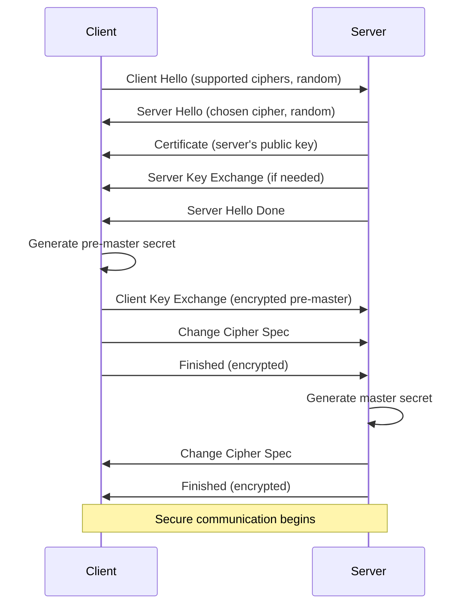

### TLS Security Features

#### 1. **Cipher Suites**
- **Key Exchange**: RSA, DHE, ECDHE
- **Authentication**: RSA, DSA, ECDSA
- **Encryption**: AES, ChaCha20
- **Integrity**: SHA-256, SHA-384

#### 2. **Perfect Forward Secrecy**
- **Session Keys**: Unique for each session
- **Key Compromise**: Previous sessions remain secure
- **Implementation**: DHE, ECDHE key exchange

#### 3. **Certificate Validation**
- **Chain Verification**: Validate certificate chain
- **Revocation Checking**: Check certificate status
- **Hostname Verification**: Verify server identity

### TLS Analysis with OpenSSL

#### Test TLS Connection
```bash
# Test TLS connection
openssl s_client -connect google.com:443 -servername google.com

# Check certificate details
openssl s_client -connect google.com:443 -servername google.com | openssl x509 -text -noout
```

#### Analyze Cipher Suites
```bash
# List supported ciphers
openssl ciphers -v

# Test specific cipher
openssl s_client -cipher 'ECDHE-RSA-AES256-GCM-SHA384' -connect example.com:443
```

## 📧 PGP (Pretty Good Privacy)

PGP provides end-to-end encryption for email and file security.

### What is PGP?

PGP is a system that:
- **Encrypts messages** end-to-end
- **Provides digital signatures** for authentication
- **Ensures message integrity** and authenticity
- **Works independently** of email providers

### PGP Key Management

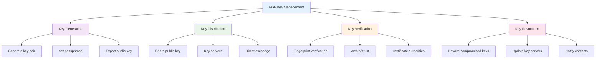

### PGP Operations

#### 1. **Encryption**
- **Symmetric Encryption**: Fast encryption of message content
- **Asymmetric Encryption**: Secure key exchange
- **Hybrid Approach**: Combines both methods

#### 2. **Digital Signatures**
- **Message Signing**: Prove message authenticity
- **Identity Verification**: Verify sender identity
- **Non-repudiation**: Prevent sender denial

#### 3. **Key Management**
- **Key Generation**: Create new key pairs
- **Key Distribution**: Share public keys
- **Key Verification**: Validate key authenticity

### PGP Implementation

#### Using GnuPG
```bash
# Generate key pair
gpg --gen-key

# List keys
gpg --list-keys

# Export public key
gpg --export --armor user@example.com > public.key

# Import public key
gpg --import public.key

# Encrypt file
gpg --encrypt --recipient user@example.com file.txt

# Decrypt file
gpg --decrypt file.txt.gpg

# Sign file
gpg --sign file.txt

# Verify signature
gpg --verify file.txt.gpg
```

## 🚨 Cryptographic Attacks and Countermeasures

Understanding potential attacks helps implement proper security measures.

### Common Cryptographic Attacks

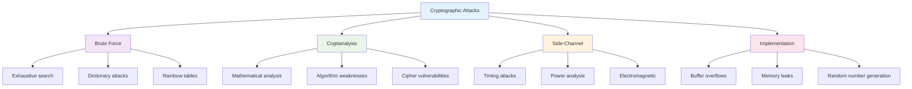

### Attack Types and Countermeasures

#### 1. **Brute Force Attacks**
**Description**: Trying all possible keys until the correct one is found

**Countermeasures**:
- **Strong Keys**: Use sufficient key length
- **Key Derivation**: Use slow hash functions (PBKDF2, Argon2)
- **Rate Limiting**: Limit authentication attempts
- **Account Lockout**: Temporarily block accounts after failures

#### 2. **Cryptanalysis Attacks**
**Description**: Mathematical analysis to find weaknesses in algorithms

**Countermeasures**:
- **Proven Algorithms**: Use well-analyzed cryptographic algorithms
- **Regular Updates**: Keep algorithms and implementations current
- **Security Reviews**: Conduct regular security assessments
- **Multiple Layers**: Implement defense in depth

#### 3. **Side-Channel Attacks**
**Description**: Exploiting information leaked during cryptographic operations

**Countermeasures**:
- **Constant-Time**: Implement constant-time algorithms
- **Power Analysis**: Use power analysis resistant implementations
- **Timing Protection**: Protect against timing attacks
- **Physical Security**: Secure hardware and environments

#### 4. **Implementation Attacks**
**Description**: Exploiting weaknesses in cryptographic implementations

**Countermeasures**:
- **Secure Coding**: Follow secure coding practices
- **Code Reviews**: Conduct thorough code reviews
- **Testing**: Comprehensive security testing
- **Vulnerability Management**: Regular vulnerability assessments

## 🧪 Hands-on Activities

### Activity 1: OpenSSL Encryption

**Objective**: Implement symmetric and asymmetric encryption using OpenSSL.

**Materials**: OpenSSL, text files, terminal

**Steps**:
1. **Install OpenSSL** on your system
2. **Generate test data** (text files)
3. **Implement AES encryption** with different key sizes
4. **Generate RSA key pairs** and encrypt/decrypt data
5. **Create and verify** digital signatures
6. **Document results** and security considerations

### Activity 2: PKI Certificate Management

**Objective**: Set up and manage a basic PKI infrastructure.

**Materials**: OpenSSL, test environment

**Steps**:
1. **Create root CA** with self-signed certificate
2. **Generate intermediate CA** certificate
3. **Issue end-entity certificates** for servers/users
4. **Build certificate chains** and validate
5. **Implement certificate revocation** procedures
6. **Test certificate validation** and trust

### Activity 3: TLS Security Analysis

**Objective**: Analyze and secure TLS communications.

**Materials**: OpenSSL, web servers, network access

**Steps**:
1. **Test TLS connections** to various websites
2. **Analyze certificate chains** and validation
3. **Check cipher suite** support and security
4. **Identify security vulnerabilities** and misconfigurations
5. **Recommend security improvements** for TLS deployment
6. **Document findings** and remediation steps

### Activity 4: PGP Implementation

**Objective**: Implement PGP for secure communications.

**Materials**: GnuPG, email client, test environment

**Steps**:
1. **Install and configure** GnuPG
2. **Generate PGP key pairs** with appropriate settings
3. **Exchange public keys** with other users
4. **Encrypt and decrypt** messages and files
5. **Create and verify** digital signatures
6. **Implement key management** best practices

## 📋 Key Takeaways

1. **Cryptography is fundamental** to cybersecurity, providing confidentiality, integrity, and authentication.

2. **Symmetric cryptography** is fast and efficient but requires secure key distribution.

3. **Asymmetric cryptography** solves key distribution problems but is slower and requires larger keys.

4. **Hash functions** provide data integrity and are essential for digital signatures and password security.

5. **PKI manages digital certificates** and establishes trust in public key systems.

6. **TLS secures network communications** and is essential for web security and privacy.

7. **PGP provides end-to-end encryption** for email and file security.

8. **Understanding cryptographic attacks** helps implement proper security measures and countermeasures.

## ❓ Review Questions

1. **What are the main differences** between symmetric and asymmetric cryptography, and when would you use each?

2. **How does PKI work**, and what are the key components of a PKI infrastructure?

3. **What is the TLS handshake process**, and how does it establish secure communications?

4. **How can OpenSSL be used** to implement various cryptographic functions?

5. **What are the main types** of cryptographic attacks, and how can they be mitigated?

## 📚 Further Reading

### Books
- "Applied Cryptography" by Bruce Schneier
- "Cryptography Engineering" by Niels Ferguson, Bruce Schneier, and Tadayoshi Kohno
- "Understanding Cryptography" by Christof Paar and Jan Pelzl

### Online Resources
- [OpenSSL Documentation](https://www.openssl.org/docs/)
- [NIST Cryptographic Standards](https://www.nist.gov/cryptography)
- [RFC 5246 - TLS 1.2](https://tools.ietf.org/html/rfc5246)

### Tools and Software
- [OpenSSL](https://www.openssl.org/) - Cryptographic toolkit
- [GnuPG](https://gnupg.org/) - PGP implementation
- [Wireshark](https://www.wireshark.org/) - TLS analysis

---

**Next Chapter**: [Chapter 9: Penetration Testing and Ethical Hacking](chapter09-penetration-testing.md) - Learn about penetration testing methodology, security assessment tools, and ethical hacking principles.
