# Chapter 11: IT Project Management

## 🎯 Learning Objectives

By the end of this chapter, you will be able to:
- Understand project management frameworks and methodologies
- Apply Agile and Scrum practices in IT projects
- Implement risk management and quality assurance processes
- Manage project scope, time, and resources effectively
- Use project management tools and techniques
- Lead and coordinate cross-functional IT teams
- Monitor project progress and handle change management

## 🚀 What is IT Project Management?

IT Project Management is the discipline of planning, organizing, and managing resources to successfully complete specific IT project goals and objectives within defined constraints.

### Project Management Triangle

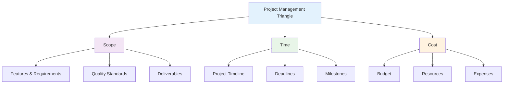

### Key Project Management Principles

1. **Clear Objectives**: Well-defined project goals and success criteria
2. **Stakeholder Engagement**: Active involvement of all project stakeholders
3. **Risk Management**: Proactive identification and mitigation of risks
4. **Quality Focus**: Continuous attention to quality throughout the project
5. **Communication**: Regular and transparent communication with all parties

## 📋 Project Management Frameworks

### Traditional vs. Agile Approaches

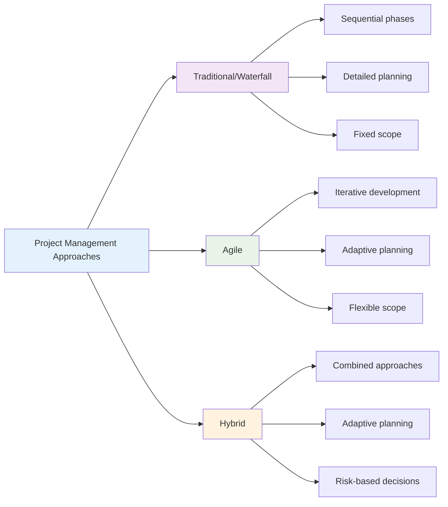

### 1. **Waterfall Methodology**

**Characteristics**:
- Sequential project phases
- Detailed upfront planning
- Fixed scope and requirements
- Minimal changes during execution

**Phases**:
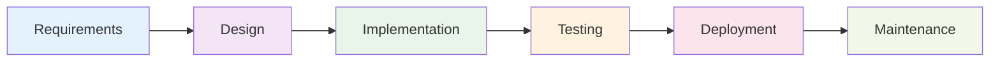

**Best For**:
- Projects with stable requirements
- Regulatory compliance projects
- Small to medium-sized projects
- Clear deliverables and timelines

### 2. **Agile Methodology**

**Core Values**:
- Individuals and interactions over processes and tools
- Working software over comprehensive documentation
- Customer collaboration over contract negotiation
- Responding to change over following a plan

**Agile Principles**:
```mermaid
graph TD
    A[Agile Principles] --> B[Customer Satisfaction]
    A --> C[Welcome Change]
    A --> D[Frequent Delivery]
    A --> E[Business Collaboration]
    A --> F[Motivated Teams]
    A --> G[Face-to-Face Communication]
    A --> H[Working Software]
    A --> I[Sustainable Pace]
    A --> J[Technical Excellence]
    A --> K[Simplicity]
    A --> L[Self-Organizing Teams]
    A --> M[Continuous Improvement]
    
    style A fill:#e3f2fd
    style B fill:#f3e5f5
    style C fill:#e8f5e8
    style D fill:#fff3e0
    style E fill:#fce4ec
    style F fill:#f1f8e9
    style G fill:#fff8e1
    style H fill:#f3e5f5
    style I fill:#e8f5e8
    style J fill:#fff3e0
    style K fill:#fce4ec
    style L fill:#f1f8e9
    style M fill:#fff8e1
```

## 🔄 Scrum Framework

Scrum is the most popular Agile framework for managing complex work.

### Scrum Roles

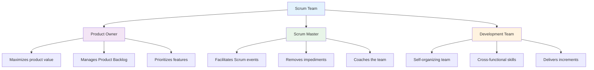

### Scrum Events

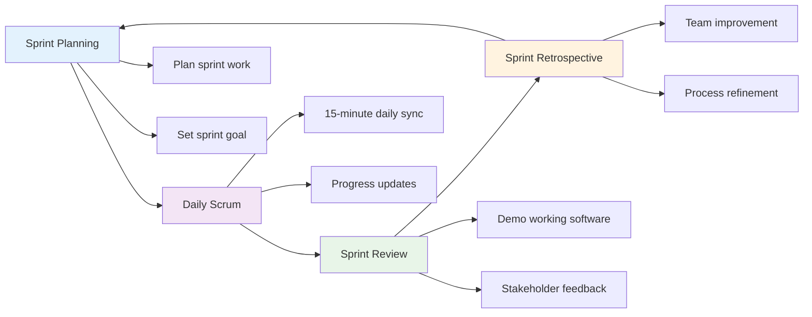

### Scrum Artifacts

#### 1. **Product Backlog**
- Ordered list of product features
- Continuously refined and prioritized
- Owned by Product Owner

#### 2. **Sprint Backlog**
- Selected items for current sprint
- Team's plan for the sprint
- Updated during Daily Scrum

#### 3. **Increment**
- Working software delivered each sprint
- Potentially releasable
- Meets Definition of Done

## 📊 Project Planning and Estimation

### Work Breakdown Structure (WBS)

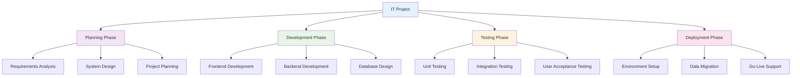

### Estimation Techniques

#### 1. **Story Points**
- Relative size estimation
- Fibonacci sequence (1, 2, 3, 5, 8, 13, 21)
- Team consensus-based

#### 2. **Planning Poker**
- Team members estimate independently
- Reveal estimates simultaneously
- Discuss differences and re-estimate

#### 3. **T-Shirt Sizing**
- XS, S, M, L, XL, XXL
- Quick high-level estimation
- Good for initial planning

### Project Timeline Management

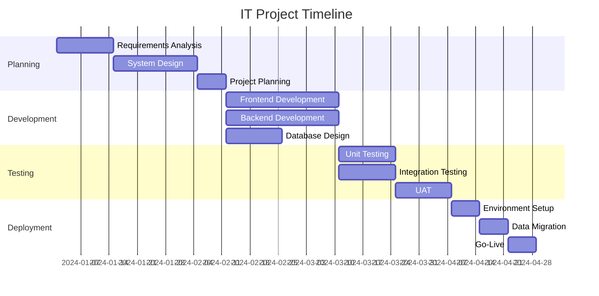

## ⚠️ Risk Management

### Risk Management Process

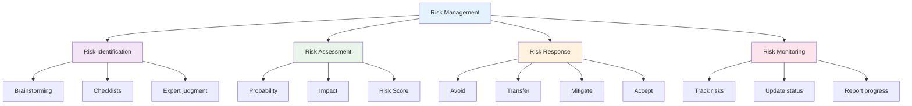

### Common IT Project Risks

#### 1. **Technical Risks**
- **Scope Creep**: Uncontrolled changes to project scope
- **Technology Changes**: Rapid evolution of technology
- **Integration Issues**: Complex system integrations
- **Performance Problems**: System performance bottlenecks

#### 2. **Resource Risks**
- **Team Availability**: Key team members unavailable
- **Skill Gaps**: Missing required technical skills
- **Budget Constraints**: Insufficient project funding
- **Time Pressure**: Unrealistic deadlines

#### 3. **External Risks**
- **Vendor Issues**: Third-party vendor problems
- **Regulatory Changes**: Compliance requirement updates
- **Market Changes**: Business environment shifts
- **Stakeholder Changes**: Key stakeholder turnover

### Risk Response Strategies

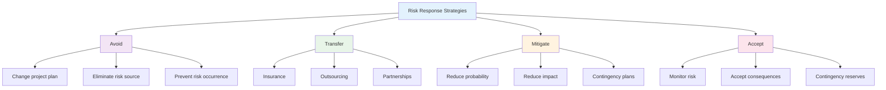

## 🎯 Project Scope Management

### Scope Management Process

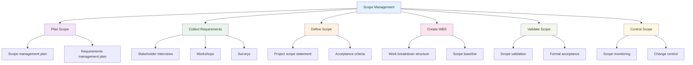

### Change Management

#### 1. **Change Control Process**
- **Change Request**: Document proposed change
- **Impact Analysis**: Assess change impact
- **Approval**: Stakeholder approval required
- **Implementation**: Execute approved changes
- **Documentation**: Update project documentation

#### 2. **Change Request Template**
```markdown
**Change Request Form**

**Change Description**: [Brief description of the change]

**Business Justification**: [Why this change is needed]

**Impact Analysis**:
- Scope: [How scope will be affected]
- Time: [Schedule impact]
- Cost: [Budget impact]
- Resources: [Resource requirements]

**Risk Assessment**: [Potential risks and mitigation]

**Approval**: [Stakeholder approval required]
```

## 📈 Project Monitoring and Control

### Key Performance Indicators (KPIs)

#### 1. **Schedule Performance**
- **Schedule Variance (SV)**: SV = EV - PV
- **Schedule Performance Index (SPI)**: SPI = EV / PV
- **Critical Path Analysis**: Longest path to completion

#### 2. **Cost Performance**
- **Cost Variance (CV)**: CV = EV - AC
- **Cost Performance Index (CPI)**: CPI = EV / AC
- **Budget at Completion (BAC)**: Total project budget

#### 3. **Quality Metrics**
- **Defect Density**: Defects per unit of work
- **Test Coverage**: Percentage of code tested
- **Customer Satisfaction**: Stakeholder feedback scores

### Earned Value Management (EVM)

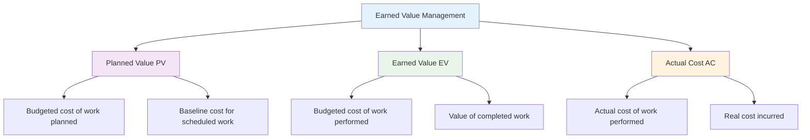

## 🛠️ Project Management Tools

### Popular Project Management Tools

#### 1. **Traditional Tools**
- **Microsoft Project**: Comprehensive project planning
- **Primavera**: Enterprise project management
- **GanttProject**: Open-source alternative

#### 2. **Agile Tools**
- **Jira**: Issue and project tracking
- **Azure DevOps**: Microsoft's project management platform
- **Trello**: Simple task management
- **Asana**: Team collaboration platform

#### 3. **Communication Tools**
- **Slack**: Team messaging and collaboration
- **Microsoft Teams**: Integrated communication platform
- **Zoom**: Video conferencing and meetings

### Tool Selection Criteria

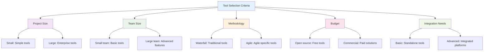

## 👥 Team Management

### Team Development Stages

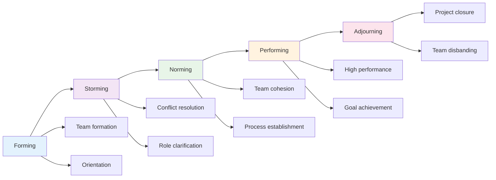

### Leadership Styles

#### 1. **Autocratic Leadership**
- **Characteristics**: Centralized decision-making
- **Best For**: Crisis situations, clear direction needed
- **Drawbacks**: Limited team input, reduced creativity

#### 2. **Democratic Leadership**
- **Characteristics**: Team participation in decisions
- **Best For**: Creative projects, team development
- **Drawbacks**: Slower decision-making, potential conflicts

#### 3. **Servant Leadership**
- **Characteristics**: Focus on team growth and well-being
- **Best For**: Long-term projects, team development
- **Benefits**: High team satisfaction, strong relationships

## 📊 Quality Management

### Quality Management Process

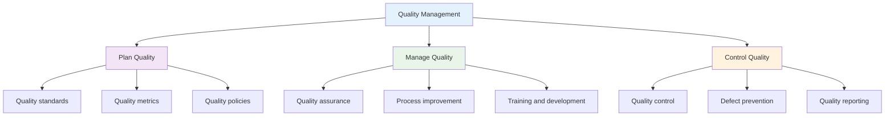

### Quality Assurance Activities

#### 1. **Code Reviews**
- **Peer Reviews**: Team member code review
- **Automated Tools**: Static analysis and linting
- **Best Practices**: Coding standards enforcement

#### 2. **Testing Strategies**
- **Unit Testing**: Individual component testing
- **Integration Testing**: Component interaction testing
- **System Testing**: End-to-end system testing
- **User Acceptance Testing**: Stakeholder validation

#### 3. **Continuous Integration**
- **Automated Builds**: Regular code compilation
- **Automated Testing**: Automated test execution
- **Quality Gates**: Automated quality checks

## 🧪 Hands-on Activities

### Activity 1: Project Planning Exercise

**Objective**: Create a project plan for a simple IT project.

**Scenario**: Develop a company website with basic functionality.

**Steps**:
1. **Project Charter**: Define project objectives and scope
2. **Work Breakdown Structure**: Break down project into manageable tasks
3. **Timeline Creation**: Develop project schedule with milestones
4. **Resource Planning**: Identify required team members and skills
5. **Risk Assessment**: Identify potential risks and mitigation strategies

### Activity 2: Agile Sprint Planning

**Objective**: Practice Agile sprint planning and estimation.

**Materials**: User stories, planning poker cards, whiteboard

**Steps**:
1. **Story Review**: Review and clarify user stories
2. **Story Point Estimation**: Use planning poker for estimation
3. **Sprint Planning**: Select stories for the sprint
4. **Task Breakdown**: Break stories into specific tasks
5. **Sprint Commitment**: Team commits to sprint goals

### Activity 3: Risk Management Workshop

**Objective**: Identify and analyze project risks.

**Scenario**: IT infrastructure upgrade project.

**Steps**:
1. **Risk Identification**: Brainstorm potential project risks
2. **Risk Assessment**: Evaluate probability and impact
3. **Risk Prioritization**: Rank risks by severity
4. **Response Planning**: Develop mitigation strategies
5. **Risk Register**: Document all risks and responses

### Activity 4: Project Management Tool Evaluation

**Objective**: Evaluate and select appropriate project management tools.

**Materials**: Tool evaluation criteria, vendor information

**Steps**:
1. **Requirements Analysis**: Define tool requirements
2. **Tool Research**: Research available options
3. **Evaluation Matrix**: Create evaluation criteria
4. **Tool Comparison**: Compare tools against criteria
5. **Recommendation**: Select best tool for the project

## 📋 Key Takeaways

1. **Project management frameworks** provide structured approaches to managing IT projects effectively.

2. **Agile methodologies** emphasize flexibility, collaboration, and continuous improvement.

3. **Risk management** is essential for identifying and mitigating project threats and opportunities.

4. **Quality management** ensures project deliverables meet stakeholder expectations.

5. **Team management** focuses on building effective, motivated project teams.

6. **Project monitoring and control** provides visibility into project progress and performance.

7. **Change management** helps control project scope and manage stakeholder expectations.

8. **Project management tools** support planning, execution, and monitoring activities.

## ❓ Review Questions

1. **What are the key differences** between traditional and Agile project management approaches?

2. **How does Scrum framework** support Agile project delivery?

3. **What techniques** can be used for project estimation and planning?

4. **How should project risks** be identified, assessed, and managed?

5. **What are the essential elements** of effective project monitoring and control?

## 📚 Further Reading

### Books
- "A Guide to the Project Management Body of Knowledge (PMBOK Guide)" by PMI
- "Scrum: The Art of Doing Twice the Work in Half the Time" by Jeff Sutherland
- "The Phoenix Project" by Gene Kim, Kevin Behr, and George Spafford

### Online Resources
- [Project Management Institute (PMI)](https://www.pmi.org/)
- [Scrum Alliance](https://www.scrumalliance.org/)
- [Agile Alliance](https://www.agilealliance.org/)

### Certifications
- **PMP**: Project Management Professional
- **CSM**: Certified Scrum Master
- **PRINCE2**: Projects IN Controlled Environments

---

**Next Chapter**: [Chapter 12: Security Operations and Incident Response](chapter12-security-operations.md) - Learn about security operations centers, incident response procedures, and security monitoring.
