# Chapter 12: Security Operations and Incident Response

## 🎯 Learning Objectives

By the end of this chapter, you will be able to:
- Understand Security Operations Center (SOC) functions and structure
- Implement incident response procedures and frameworks
- Use security monitoring and detection tools effectively
- Conduct threat hunting and intelligence analysis
- Manage security incidents from detection to resolution
- Implement continuous monitoring and improvement processes
- Understand SOC metrics and performance indicators

## 🏢 Security Operations Center (SOC)

A Security Operations Center (SOC) is a centralized unit that deals with security issues on an organizational and technical level.

### SOC Functions

```mermaid
graph TD
    A[Security Operations Center] --> B[Threat Detection]
    A --> C[Incident Response]
    A --> D[Threat Intelligence]
    A --> E[Vulnerability Management]
    A --> F[Security Monitoring]
    A --> G[Forensic Analysis]
    
    B --> B1[Real-time monitoring]
    B --> B2[Alert analysis]
    B --> B3[Threat hunting]
    
    C --> C1[Incident triage]
    C --> C2[Response coordination]
    C --> C3[Recovery planning]
    
    D --> D1[Threat feeds]
    D --> D2[IOC analysis]
    D --> D3[Trend analysis]
    
    E --> E1[Vulnerability scanning]
    E --> E2[Patch management]
    E --> E3[Risk assessment]
    
    F --> F1[Log analysis]
    F --> F2[SIEM monitoring]
    F --> F3[Performance tracking]
    
    G --> G1[Digital forensics]
    G --> G2[Evidence collection]
    G --> G3[Root cause analysis]
    
    style A fill:#e3f2fd
    style B fill:#f3e5f5
    style C fill:#e8f5e8
    style D fill:#fff3e0
    style E fill:#fce4ec
    style F fill:#f1f8e9
    style G fill:#fff8e1
```

### SOC Team Structure

```mermaid
graph TD
    A[SOC Team Structure] --> B[SOC Manager]
    A --> C[Security Analysts]
    A --> D[Incident Responders]
    A --> E[Threat Hunters]
    A --> F[Forensic Analysts]
    A --> G[Threat Intelligence Analysts]
    
    B --> B1[Team leadership]
    B --> B2[Process management]
    B --> B3[Stakeholder communication]
    
    C --> C1[Tier 1: Initial triage]
    C --> C2[Tier 2: Deep analysis]
    C --> C3[Tier 3: Expert investigation]
    
    D --> D1[Incident coordination]
    D --> D2[Response execution]
    D --> D3[Recovery management]
    
    E --> E1[Proactive threat hunting]
    E --> E2[Pattern analysis]
    E --> E3[Threat discovery]
    
    F --> F1[Digital evidence analysis]
    F --> F2[Root cause investigation]
    F --> F3[Legal support]
    
    G --> G1[Threat feed management]
    G --> G2[IOC analysis]
    G --> G3[Intelligence reporting]
    
    style A fill:#e3f2fd
    style B fill:#f3e5f5
    style C fill:#e8f5e8
    style D fill:#fff3e0
    style E fill:#fce4ec
    style F fill:#f1f8e9
    style G fill:#fff8e1
```

### SOC Operating Models

#### 1. **Internal SOC**
- **Characteristics**: Organization-owned and operated
- **Benefits**: Full control, specialized knowledge, confidentiality
- **Challenges**: High cost, resource intensive, 24/7 coverage

#### 2. **MSSP (Managed Security Service Provider)**
- **Characteristics**: Third-party security services
- **Benefits**: Cost-effective, expertise, scalability
- **Challenges**: Less control, potential conflicts of interest

#### 3. **Hybrid SOC**
- **Characteristics**: Combination of internal and external resources
- **Benefits**: Balanced approach, flexibility, cost optimization
- **Challenges**: Coordination complexity, integration issues

## 🚨 Incident Response Framework

### NIST Incident Response Lifecycle

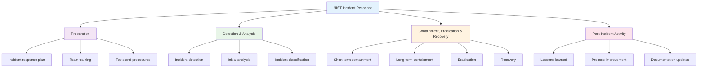

### SANS Incident Response Process

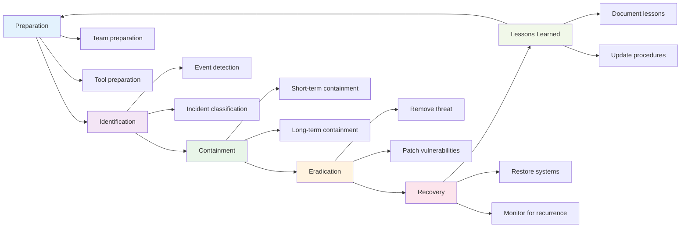

## 🔍 Incident Detection and Analysis

### Detection Methods

#### 1. **Automated Detection**
- **SIEM Systems**: Security Information and Event Management
- **IDS/IPS**: Intrusion Detection/Prevention Systems
- **Endpoint Detection**: EDR (Endpoint Detection and Response)
- **Network Monitoring**: NetFlow analysis, packet inspection

#### 2. **Manual Detection**
- **User Reports**: End user incident reports
- **Administrator Reports**: System administrator findings
- **Threat Hunting**: Proactive threat discovery
- **Vulnerability Scans**: Regular security assessments

### Incident Classification

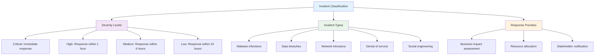

### Incident Triage Process

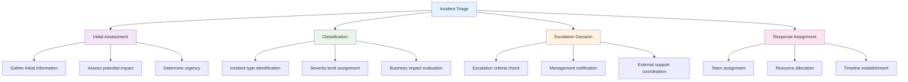

## 🛡️ Incident Response Procedures

### Critical Incident Response

#### 1. **Data Breach Response**
```python
# Data breach response checklist
def data_breach_response():
    steps = [
        "1. Immediate containment",
        "2. Evidence preservation",
        "3. Legal notification",
        "4. Regulatory compliance",
        "5. Customer notification",
        "6. Forensic investigation",
        "7. Remediation planning",
        "8. Post-incident review"
    ]
    return steps
```

#### 2. **Malware Incident Response**
```python
# Malware response procedures
def malware_response():
    procedures = {
        "containment": [
            "Isolate affected systems",
            "Disconnect from network",
            "Preserve evidence"
        ],
        "eradication": [
            "Remove malware",
            "Patch vulnerabilities",
            "Update security controls"
        ],
        "recovery": [
            "Restore from clean backup",
            "Verify system integrity",
            "Monitor for recurrence"
        ]
    }
    return procedures
```

### Communication Plan

#### 1. **Stakeholder Notification Matrix**
```mermaid
graph TD
    A[Stakeholder Notification] --> B[Executive Management]
    A --> C[Legal Department]
    A --> D[IT Management]
    A --> E[Business Units]
    A --> F[External Parties]
    
    B --> B1[Critical incidents: Immediate]
    B --> B2[High incidents: Within 1 hour]
    B --> B3[Medium incidents: Within 4 hours]
    
    C --> C1[Regulatory compliance]
    C --> C2[Legal implications]
    C --> C3[Contract requirements]
    
    D --> D1[Technical response]
    D --> D2[Resource coordination]
    D --> D3[System recovery]
    
    E --> E1[Business impact]
    E --> E2[Operational changes]
    E --> E3[Customer communication]
    
    F --> F1[Law enforcement]
    F --> F2[Regulatory bodies]
    F --> F3[Vendors and partners]
    
    style A fill:#e3f2fd
    style B fill:#f3e5f5
    style C fill:#e8f5e8
    style D fill:#fff3e0
    style E fill:#fce4ec
    style F fill:#f1f8e9
```

#### 2. **Communication Templates**
```markdown
**Incident Notification Template**

**Subject**: Security Incident Alert - [Incident ID]

**Incident Summary**:
- Type: [Incident Type]
- Severity: [Severity Level]
- Discovery Time: [Timestamp]
- Affected Systems: [System List]

**Current Status**: [Status Description]

**Actions Taken**: [List of completed actions]

**Next Steps**: [Planned actions and timeline]

**Contact**: [Incident Response Team contact information]

**Escalation**: [Escalation procedures if needed]
```

## 🔍 Security Monitoring and Detection

### SIEM (Security Information and Event Management)

#### 1. **SIEM Components**
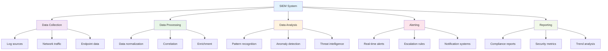

#### 2. **SIEM Implementation**
```yaml
# SIEM configuration example
siem_config:
  data_sources:
    - firewalls
    - intrusion_detection_systems
    - endpoint_protection
    - network_devices
    - servers
    - applications
  
  correlation_rules:
    - multiple_failed_logins
    - unusual_data_access
    - network_scanning_activity
    - malware_detection
  
  alert_thresholds:
    failed_logins: 5
    data_access_volume: 100MB
    network_connections: 1000
```

### Threat Hunting

#### 1. **Threat Hunting Methodology**
```mermaid
graph TD
    A[Threat Hunting] --> B[Hypothesis Development]
    A --> C[Data Collection]
    A --> D[Analysis]
    A --> E[Investigation]
    A --> F[Documentation]
    
    B --> B1[Threat intelligence]
    B --> B2[Attack patterns]
    B --> B3[Anomaly indicators]
    
    C --> C1[Log analysis]
    C --> C2[Network traffic]
    C --> C3[Endpoint data]
    
    D --> D1[Pattern matching]
    D --> D2[Statistical analysis]
    D --> D3[Behavioral analysis]
    
    E --> E1[Deep dive analysis]
    E --> E2[Evidence collection]
    E --> E3[Threat validation]
    
    F --> F1[Findings documentation]
    F --> F2[Process improvement]
    F --> F3[Knowledge sharing]
    
    style A fill:#e3f2fd
    style B fill:#f3e5f5
    style C fill:#e8f5e8
    style D fill:#fff3e0
    style E fill:#fce4ec
    style F fill:#f1f8e9
```

#### 2. **Threat Hunting Tools**
- **SIEM Platforms**: Splunk, QRadar, ELK Stack
- **Network Analysis**: Wireshark, tcpdump, NetFlow
- **Endpoint Analysis**: Volatility, Memoryze, WinDbg
- **Threat Intelligence**: MISP, ThreatConnect, Anomali

## 📊 Security Metrics and KPIs

### SOC Performance Metrics

#### 1. **Operational Metrics**
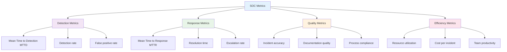

#### 2. **Key Performance Indicators**
- **MTTD (Mean Time to Detection)**: Average time to detect security incidents
- **MTTR (Mean Time to Response)**: Average time to respond to incidents
- **MTTC (Mean Time to Contain)**: Average time to contain incidents
- **MTTE (Mean Time to Eradicate)**: Average time to remove threats
- **MTTR (Mean Time to Recover)**: Average time to restore normal operations

### Metrics Dashboard Example

```python
# SOC metrics dashboard
class SOCMetrics:
    def __init__(self):
        self.metrics = {
            "incidents_today": 0,
            "incidents_week": 0,
            "mttd_hours": 0,
            "mttr_hours": 0,
            "false_positive_rate": 0,
            "team_productivity": 0
        }
    
    def calculate_mttd(self, detection_times):
        """Calculate Mean Time to Detection."""
        if not detection_times:
            return 0
        total_time = sum(detection_times)
        return total_time / len(detection_times)
    
    def calculate_mttr(self, response_times):
        """Calculate Mean Time to Response."""
        if not response_times:
            return 0
        total_time = sum(response_times)
        return total_time / len(response_times)
    
    def update_metrics(self, new_data):
        """Update SOC metrics with new data."""
        self.metrics.update(new_data)
        return self.metrics
```

## 🔧 Incident Response Tools

### Essential Tools

#### 1. **Forensic Tools**
- **Memory Analysis**: Volatility, Memoryze, WinDbg
- **Disk Imaging**: FTK Imager, dd, EnCase
- **Network Forensics**: Wireshark, tcpdump, NetFlow
- **Mobile Forensics**: Cellebrite, Oxygen Forensics

#### 2. **Analysis Tools**
- **Malware Analysis**: IDA Pro, Ghidra, Cuckoo Sandbox
- **Log Analysis**: ELK Stack, Splunk, LogRhythm
- **Threat Intelligence**: MISP, ThreatConnect, Anomali
- **Vulnerability Scanners**: Nessus, OpenVAS, Qualys

#### 3. **Response Tools**
- **Endpoint Response**: Carbon Black, CrowdStrike, SentinelOne
- **Network Security**: Snort, Suricata, Zeek
- **SIEM Platforms**: Splunk, QRadar, ELK Stack
- **Case Management**: ServiceNow, Jira, TheHive

### Tool Integration

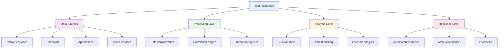

## 📋 Incident Response Playbooks

### Standard Playbooks

#### 1. **Malware Incident Playbook**
```markdown
**Malware Incident Response Playbook**

**Phase 1: Detection and Classification**
- Identify malware type and characteristics
- Assess scope and impact
- Classify incident severity

**Phase 2: Containment**
- Isolate affected systems
- Block malicious network traffic
- Disable compromised accounts

**Phase 3: Eradication**
- Remove malware from systems
- Patch vulnerabilities
- Update security controls

**Phase 4: Recovery**
- Restore systems from clean backups
- Verify system integrity
- Monitor for recurrence

**Phase 5: Post-Incident**
- Document lessons learned
- Update procedures
- Conduct team training
```

#### 2. **Data Breach Playbook**
```markdown
**Data Breach Response Playbook**

**Immediate Actions (0-2 hours)**
- Activate incident response team
- Preserve evidence
- Contain breach
- Notify key stakeholders

**Short-term Actions (2-24 hours)**
- Assess scope and impact
- Notify legal and compliance
- Begin forensic investigation
- Plan customer notification

**Medium-term Actions (1-7 days)**
- Complete investigation
- Implement remediation
- Customer notification
- Regulatory reporting

**Long-term Actions (1-4 weeks)**
- Post-incident review
- Process improvement
- Security enhancement
- Team training
```

## 🧪 Hands-on Activities

### Activity 1: Incident Response Simulation

**Objective**: Practice incident response procedures in a simulated environment.

**Scenario**: Simulated malware infection in a corporate network.

**Steps**:
1. **Incident Detection**: Identify and classify the incident
2. **Initial Response**: Implement immediate containment measures
3. **Investigation**: Conduct forensic analysis and evidence collection
4. **Remediation**: Remove malware and patch vulnerabilities
5. **Recovery**: Restore affected systems and verify integrity
6. **Documentation**: Complete incident report and lessons learned

### Activity 2: SIEM Configuration

**Objective**: Configure and optimize SIEM system for effective threat detection.

**Materials**: SIEM platform, sample log data, correlation rules

**Steps**:
1. **Data Source Configuration**: Configure log sources and parsers
2. **Correlation Rules**: Create and test correlation rules
3. **Alert Tuning**: Optimize alert thresholds and rules
4. **Dashboard Creation**: Build operational dashboards
5. **Testing and Validation**: Test system effectiveness

### Activity 3: Threat Hunting Exercise

**Objective**: Conduct proactive threat hunting using various techniques.

**Materials**: Security tools, sample data, threat intelligence

**Steps**:
1. **Hypothesis Development**: Develop hunting hypotheses
2. **Data Collection**: Gather relevant security data
3. **Analysis**: Apply hunting techniques and tools
4. **Investigation**: Deep dive into suspicious findings
5. **Documentation**: Document findings and recommendations

### Activity 4: Incident Response Plan Development

**Objective**: Create a comprehensive incident response plan.

**Scenario**: Develop incident response plan for a medium-sized organization.

**Steps**:
1. **Plan Structure**: Define plan components and organization
2. **Response Procedures**: Develop detailed response procedures
3. **Communication Plan**: Create stakeholder notification matrix
4. **Resource Requirements**: Identify required tools and resources
5. **Testing and Validation**: Plan tabletop exercises and drills

## 📋 Key Takeaways

1. **Security Operations Centers** provide centralized security monitoring and incident response capabilities.

2. **Incident response frameworks** like NIST and SANS provide structured approaches to handling security incidents.

3. **Security monitoring tools** including SIEM systems enable real-time threat detection and response.

4. **Threat hunting** is a proactive approach to discovering security threats before they cause damage.

5. **Incident response playbooks** provide standardized procedures for handling common security incidents.

6. **Security metrics and KPIs** help measure SOC performance and identify areas for improvement.

7. **Tool integration** is essential for effective security operations and incident response.

8. **Continuous improvement** through lessons learned and process refinement enhances incident response capabilities.

## ❓ Review Questions

1. **What are the key functions** of a Security Operations Center (SOC)?

2. **How does the NIST incident response lifecycle** guide incident handling?

3. **What tools and techniques** are used for security monitoring and threat detection?

4. **How should security incidents** be classified and prioritized?

5. **What metrics and KPIs** are important for measuring SOC performance?

## 📚 Further Reading

### Books
- "The Practice of Network Security Monitoring" by Richard Bejtlich
- "Incident Response & Computer Forensics" by Kevin Mandia and Jason Proven
- "Digital Forensics and Incident Response" by Gerard Johansen

### Online Resources
- [NIST Computer Security Incident Handling Guide](https://csrc.nist.gov/publications/detail/sp/800-61/rev-2/final)
- [SANS Incident Response](https://www.sans.org/white-papers/incident-response/)
- [FIRST Incident Response](https://www.first.org/)

### Tools and Platforms
- [ELK Stack](https://www.elastic.co/elk-stack) - Log analysis platform
- [MISP](https://www.misp-project.org/) - Threat intelligence platform
- [TheHive](https://thehive-project.org/) - Incident response platform

---

**Next Chapter**: [Chapter 13: Security Assurance and Validation](chapter13-security-assurance.md) - Learn about security testing, compliance frameworks, and security validation methodologies.
