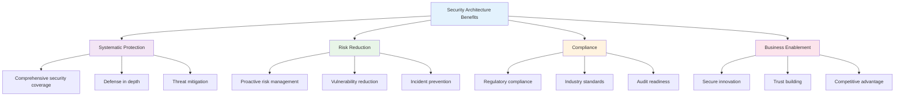
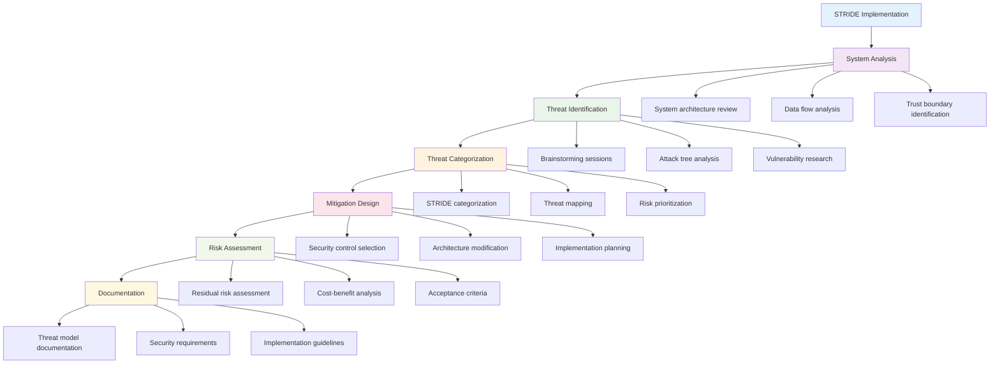
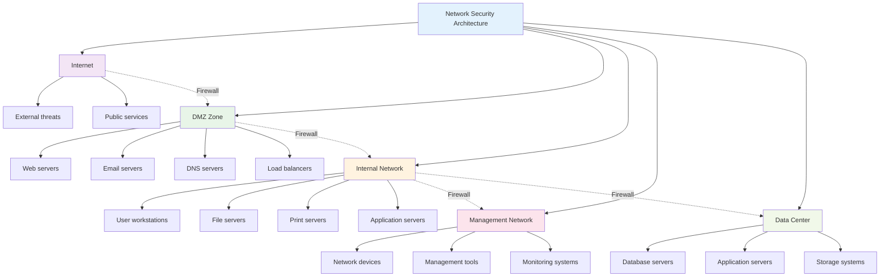
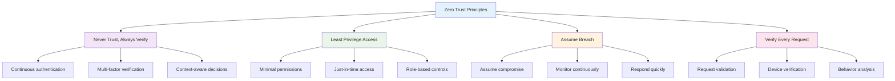

# Chapter 6: Security Architecture and Threat Modeling

## 🎯 Learning Objectives

By the end of this chapter, you will be able to:
- Understand the principles of secure system design and architecture
- Apply defense-in-depth and layered security approaches
- Use STRIDE methodology for threat identification and analysis
- Implement DREAD framework for risk assessment and prioritization
- Understand and apply the MITRE ATT&CK framework
- Design secure network architectures with proper segmentation
- Implement micro-segmentation and zero-trust principles
- Create comprehensive security architecture documentation
- Apply resilience planning and recovery strategies

## 🏗️ What is Security Architecture?

Security architecture is the structured approach to designing, implementing, and maintaining secure systems. It provides a comprehensive framework for protecting information assets while enabling business operations.

### The Security Architecture Challenge

Organizations must balance **security requirements with business needs**, ensuring systems are both secure and functional. Security architecture provides the framework to achieve this balance systematically.

### Why Security Architecture Matters



## 🛡️ Security Design Principles

Effective security architecture is built on fundamental principles that guide design decisions and implementation strategies.

### Core Security Principles

```mermaid
graph TD
    A[Security Design Principles] --> B[Defense in Depth]
    A --> C[Principle of Least Privilege]
    A --> D[Fail-Safe Defaults]
    A --> E[Separation of Concerns]
    A --> F[Economy of Mechanism]
    A --> G[Open Design]
    A --> H[Complete Mediation]
    
    B --> B1[Multiple security layers]
    B --> B2[Redundant protections]
    B --> B3[Attack surface reduction]
    
    C --> C1[Minimal access rights]
    C --> C2[Role-based permissions]
    C --> C3[Just-in-time access]
    
    D --> D1[Secure by default]
    D --> D2[Explicit permissions]
    D --> D3[Safe failure modes]
    
    E --> E1[Modular design]
    E --> E2[Independent components]
    E --> E3[Clear boundaries]
    
    F --> F1[Simple solutions]
    F --> F2[Minimal complexity]
    F --> F3[Easier verification]
    
    G --> G1[Transparent security]
    G --> G2[Public review]
    G --> G3[Community validation]
    
    H --> H1[Consistent enforcement]
    H --> H2[No bypass paths]
    H --> H3[Comprehensive coverage]
    
    style A fill:#e3f2fd
    style B fill:#f3e5f5
    style C fill:#e8f5e8
    style D fill:#fff3e0
    style E fill:#fce4ec
    style F fill:#f1f8e9
    style G fill:#fff8e1
    style H fill:#f3e5f5
```



### 1. **Defense in Depth**

Defense in depth implements multiple layers of security controls, ensuring that if one layer fails, others continue to provide protection.

**Example**: A web application might have:
- **Network layer**: Firewalls and IDS/IPS
- **Application layer**: Input validation and authentication
- **Data layer**: Encryption and access controls
- **Physical layer**: Data center security and environmental controls

### 2. **Principle of Least Privilege**

Users and systems should have only the minimum access necessary to perform their functions.

**Implementation**:
- **Role-based access control**: Assign permissions based on job functions
- **Just-in-time access**: Grant temporary elevated privileges when needed
- **Regular access reviews**: Periodically review and adjust permissions

### 3. **Fail-Safe Defaults**

Systems should fail securely, denying access by default rather than granting it.

**Examples**:
- **Firewall rules**: Deny all traffic by default, allow specific exceptions
- **User permissions**: No access by default, grant specific permissions
- **Network segmentation**: Isolated by default, controlled connectivity

## 🏛️ Layered Security Architecture

Layered security implements multiple defensive measures at different levels to create comprehensive protection.

### Security Layers Overview

```mermaid
graph TD
    A[Layered Security Architecture] --> B[Physical Security]
    A --> C[Network Security]
    A --> D[Host Security]
    A --> E[Application Security]
    A --> F[Data Security]
    A --> G[User Security]
    
    B --> B1[Data center access]
    B --> B2[Environmental controls]
    B --> B3[Hardware security]
    
    C --> C1[Firewalls and IDS/IPS]
    C --> C2[Network segmentation]
    C --> C3[Traffic monitoring]
    
    D --> D1[Endpoint protection]
    D --> D2[System hardening]
    D --> D3[Patch management]
    
    E --> E1[Secure development]
    E --> E2[Input validation]
    E --> E3[Authentication/authorization]
    
    F --> F1[Encryption at rest]
    F --> F2[Encryption in transit]
    F --> F3[Access controls]
    
    G --> G1[User training]
    G --> G2[Access management]
    G --> G3[Behavioral monitoring]
    
    style A fill:#e3f2fd
    style B fill:#f3e5f5
    style C fill:#e8f5e8
    style D fill:#fff3e0
    style E fill:#fce4ec
    style F fill:#f1f8e9
    style G fill:#fff8e1
```



### Layer Implementation Examples

#### Physical Security Layer
- **Access Control**: Biometric scanners, key cards, security guards
- **Environmental Controls**: Fire suppression, climate control, power backup
- **Hardware Security**: Tamper-evident seals, secure boot, hardware security modules

#### Network Security Layer
- **Perimeter Defense**: Firewalls, intrusion detection/prevention systems
- **Traffic Control**: Network segmentation, VLANs, access control lists
- **Monitoring**: Network traffic analysis, anomaly detection, logging

#### Host Security Layer
- **System Hardening**: Security baselines, configuration management
- **Endpoint Protection**: Antivirus, host-based firewalls, intrusion detection
- **Maintenance**: Regular patching, vulnerability management, system updates

## 🎯 Threat Modeling with STRIDE

STRIDE is a methodology for identifying and categorizing security threats during system design and development.

### What is STRIDE?

STRIDE is an acronym representing six categories of security threats:
- **S**poofing
- **T**ampering
- **R**epudiation
- **I**nformation Disclosure
- **D**enial of Service
- **E**levation of Privilege

### STRIDE Threat Categories

```mermaid
graph TD
    A[STRIDE Threat Model] --> B[Spoofing]
    A --> C[Tampering]
    A --> D[Repudiation]
    A --> E[Information Disclosure]
    A --> F[Denial of Service]
    A --> G[Elevation of Privilege]
    
    B --> B1[Identity spoofing]
    B --> B2[IP address spoofing]
    B --> B3[Email spoofing]
    
    C --> C1[Data modification]
    C --> C2[Code injection]
    C --> C3[Configuration changes]
    
    D --> D1[Action denial]
    D --> D2[Log tampering]
    D --> D3[Audit bypass]
    
    E --> E1[Data exposure]
    E --> E2[Information leakage]
    E --> E3[Side-channel attacks]
    
    F --> F1[Resource exhaustion]
    F --> F2[Service disruption]
    F --> F3[Performance degradation]
    
    G --> G1[Privilege escalation]
    G --> G2[Role manipulation]
    G --> G3[Access bypass]
    
    style A fill:#e3f2fd
    style B fill:#f3e5f5
    style C fill:#e8f5e8
    style D fill:#fff3e0
    style E fill:#fce4ec
    style F fill:#f1f8e9
    style G fill:#fff8e1
```



### STRIDE Threat Analysis Process

#### 1. **Spoofing Threats**
**Definition**: Impersonating another user or system to gain unauthorized access.

**Examples**:
- **Identity Spoofing**: Using stolen credentials or fake identities
- **IP Spoofing**: Forging source IP addresses in network packets
- **Email Spoofing**: Sending emails that appear to come from legitimate sources

**Mitigation Strategies**:
- Strong authentication (MFA, certificates)
- Network ingress/egress filtering
- Email authentication (SPF, DKIM, DMARC)

#### 2. **Tampering Threats**
**Definition**: Unauthorized modification of data or code to compromise system integrity.

**Examples**:
- **Data Tampering**: Modifying stored or transmitted data
- **Code Injection**: Inserting malicious code into applications
- **Configuration Tampering**: Changing system settings

**Mitigation Strategies**:
- Data integrity checks (checksums, digital signatures)
- Input validation and sanitization
- Configuration management and monitoring

#### 3. **Repudiation Threats**
**Definition**: Users denying that they performed certain actions, making it difficult to hold them accountable.

**Examples**:
- **Action Repudiation**: Denying access to systems or data
- **Transaction Repudiation**: Denying financial transactions
- **Communication Repudiation**: Denying sent messages

**Mitigation Strategies**:
- Comprehensive logging and audit trails
- Digital signatures and non-repudiation
- Secure timestamping and evidence preservation

#### 4. **Information Disclosure Threats**
**Definition**: Unauthorized exposure of sensitive information to unauthorized parties.

**Examples**:
- **Data Exposure**: Unauthorized access to confidential data
- **Information Leakage**: Accidental disclosure through error messages
- **Side-Channel Attacks**: Information extraction through system behavior

**Mitigation Strategies**:
- Data classification and access controls
- Secure error handling and logging
- Side-channel attack prevention

#### 5. **Denial of Service Threats**
**Definition**: Attacks that prevent legitimate users from accessing systems or services.

**Examples**:
- **Resource Exhaustion**: Consuming system resources (CPU, memory, bandwidth)
- **Service Disruption**: Causing system crashes or failures
- **Performance Degradation**: Slowing system response times

**Mitigation Strategies**:
- Resource monitoring and limits
- Load balancing and redundancy
- DDoS protection and traffic filtering

#### 6. **Elevation of Privilege Threats**
**Definition**: Gaining higher levels of access than authorized, potentially compromising the entire system.

**Examples**:
- **Privilege Escalation**: Exploiting vulnerabilities to gain admin access
- **Role Manipulation**: Changing user roles or permissions
- **Access Bypass**: Circumventing access controls

**Mitigation Strategies**:
- Principle of least privilege
- Regular access reviews and audits
- Secure privilege management

### STRIDE Implementation Workflow



## 📊 Risk Assessment with DREAD

DREAD is a framework for assessing and prioritizing security risks based on five key factors.

### What is DREAD?

DREAD provides a structured approach to risk assessment by evaluating:
- **D**amage potential
- **R**eproducibility
- **E**xploitability
- **A**ffected users
- **D**iscoverability

### DREAD Risk Assessment Matrix

```mermaid
graph TD
    A[DREAD Risk Assessment] --> B[Damage Potential]
    A --> C[Reproducibility]
    A --> D[Exploitability]
    A --> E[Affected Users]
    A --> F[Discoverability]
    
    B --> B1[0: No damage]
    B --> B2[1: Individual user data]
    B --> B3[2: Individual user data + system]
    B --> B4[3: Multiple users' data]
    B --> B5[4: Multiple users' data + system]
    B --> B6[5: Multiple users' data + system + infrastructure]
    
    C --> C1[0: Very hard]
    C --> C2[1: Hard]
    C --> C3[2: Moderate]
    C --> C4[3: Easy]
    C --> C5[4: Very easy]
    C --> C6[5: Automated tools available]
    
    D --> D1[0: Very hard]
    D --> D2[1: Hard]
    D --> D3[2[Moderate]
    D --> D4[3: Easy]
    D --> D5[4: Very easy]
    D --> D6[5: Automated tools available]
    
    E --> E1[0: No users]
    E --> E2[1: Very few users]
    E --> E3[2: Some users]
    E --> E4[3: Many users]
    E --> E5[4: Most users]
    E --> E6[5: All users]
    
    F --> F1[0: Very hard]
    F --> F2[1: Hard]
    F --> F3[2: Moderate]
    F --> F4[3: Easy]
    F --> F5[4: Very easy]
    F --> F6[5: Publicly available]
    
    style A fill:#e3f2fd
    style B fill:#f3e5f5
    style C fill:#e8f5e8
    style D fill:#fff3e0
    style E fill:#fce4ec
    style F fill:#f1f8e9
```

### DREAD Scoring System

#### Risk Score Calculation
```
Risk Score = (Damage + Reproducibility + Exploitability + Affected Users + Discoverability) / 5
```

#### Risk Levels
- **0-1**: **Low Risk** - Minimal impact, difficult to exploit
- **2-3**: **Medium Risk** - Moderate impact, some effort required
- **4-5**: **High Risk** - Significant impact, easy to exploit

### DREAD Assessment Example

**Threat**: SQL Injection in web application login form

| DREAD Factor | Score | Justification |
|--------------|-------|---------------|
| **Damage** | 4 | Could compromise user database and system access |
| **Reproducibility** | 4 | Easy to reproduce with common tools |
| **Exploitability** | 4 | Well-documented attack technique |
| **Affected Users** | 4 | All users of the application |
| **Discoverability** | 3 | Requires some knowledge but tools available |
| **Total Score** | **3.8** | **High Risk** |

**Mitigation Priority**: High - Immediate attention required

## 🎭 MITRE ATT&CK Framework

MITRE ATT&CK is a comprehensive knowledge base of adversary tactics and techniques used in cyber attacks.

### What is MITRE ATT&CK?

ATT&CK (Adversarial Tactics, Techniques, and Common Knowledge) provides a structured way to understand and analyze cyber threats, enabling better defense strategies.

### ATT&CK Framework Structure

```mermaid
graph TD
    A[MITRE ATT&CK] --> B[Tactics]
    A --> C[Techniques]
    A --> D[Sub-techniques]
    A --> E[Procedures]
    
    B --> B1[Initial Access]
    B --> B2[Execution]
    B --> B3[Persistence]
    B --> B4[Privilege Escalation]
    B --> B5[Defense Evasion]
    B --> B6[Credential Access]
    B --> B7[Discovery]
    B --> B8[Lateral Movement]
    B --> B9[Collection]
    B --> B10[Command & Control]
    B --> B11[Exfiltration]
    B --> B12[Impact]
    
    C --> C1[Phishing]
    C --> C2[Malware Execution]
    C --> C3[Registry Modification]
    C --> C4[Process Injection]
    C --> C5[File Deletion]
    C --> C6[Credential Dumping]
    C --> C7[Network Scanning]
    C --> C8[Remote Services]
    C --> C9[Data Staging]
    C --> C10[Web Services]
    C --> C11[Data Transfer]
    C --> C12[Data Destruction]
    
    style A fill:#e3f2fd
    style B fill:#f3e5f5
    style C fill:#e8f5e8
    style D fill:#fff3e0
    style E fill:#fce4ec
```



### Key ATT&CK Tactics

#### 1. **Initial Access**
Techniques used to gain initial foothold in target networks.

**Common Techniques**:
- **Phishing**: Social engineering via email
- **Drive-by Compromise**: Malicious websites
- **External Remote Services**: VPN, RDP exploitation
- **Supply Chain Compromise**: Compromised software/hardware

#### 2. **Execution**
Techniques for running malicious code on target systems.

**Common Techniques**:
- **User Execution**: Tricking users to run code
- **Scheduled Task/Job**: Using system automation
- **Windows Management Instrumentation**: System management tools
- **Command and Scripting Interpreter**: PowerShell, bash, etc.

#### 3. **Persistence**
Techniques to maintain access across system restarts and credential changes.

**Common Techniques**:
- **Registry Run Keys**: Windows startup programs
- **Scheduled Tasks**: Automated execution
- **Service Installation**: System services
- **Browser Extensions**: Browser-based persistence

#### 4. **Privilege Escalation**
Techniques to gain higher-level permissions.

**Common Techniques**:
- **Process Injection**: Injecting code into legitimate processes
- **Access Token Manipulation**: Modifying security tokens
- **Bypass User Account Control**: Circumventing UAC
- **Exploitation for Privilege Escalation**: Using vulnerabilities

### Using ATT&CK for Defense

#### Threat Intelligence
- **Identify attack patterns**: Map observed behaviors to ATT&CK techniques
- **Assess capabilities**: Understand adversary skill levels
- **Prioritize defenses**: Focus on most likely attack vectors

#### Detection Engineering
- **Create detection rules**: Build alerts for specific techniques
- **Validate coverage**: Ensure detection across all tactics
- **Improve response**: Better understanding of attack progression

#### Red Team Exercises
- **Simulate attacks**: Use ATT&CK techniques in testing
- **Validate defenses**: Test detection and response capabilities
- **Improve skills**: Practice against realistic scenarios

## 🌐 Network Security Architecture

Network security architecture provides the foundation for protecting network infrastructure and communications.

### Network Security Zones



### Network Segmentation Strategies

#### 1. **VLAN Segmentation**
- **Purpose**: Logical separation of network traffic
- **Benefits**: Improved security, performance, and management
- **Implementation**: Switch configuration, routing policies

#### 2. **Firewall Segmentation**
- **Purpose**: Control traffic between network segments
- **Benefits**: Granular access control, threat isolation
- **Implementation**: Firewall rules, access control lists

#### 3. **Micro-segmentation**
- **Purpose**: Fine-grained network isolation at workload level
- **Benefits**: Lateral movement prevention, application-level security
- **Implementation**: Software-defined networking, container security

### Zero Trust Architecture

Zero Trust assumes that no user or system should be trusted by default, regardless of location or network.

#### Zero Trust Principles


#### Zero Trust Implementation
- **Identity Verification**: Strong authentication and authorization
- **Device Trust**: Device health and compliance validation
- **Network Security**: Encrypted communications and segmentation
- **Application Security**: Secure application access and monitoring
- **Data Protection**: Data classification and encryption

## 🔄 Resilience Planning and Recovery

Security architecture must include resilience strategies to maintain operations during and after security incidents.

### Resilience Framework

```mermaid
graph TD
    A[Resilience Framework] --> B[Prevention]
    A --> C[Detection]
    A --> D[Response]
    A --> E[Recovery]
    A --> F[Learning]
    
    B --> B1[Security controls]
    B --> B2[Risk management]
    B --> B3[Training and awareness]
    
    C --> C1[Monitoring systems]
    C --> C2[Alert mechanisms]
    C --> C3[Incident identification]
    
    D --> D1[Incident response]
    D --> D2[Containment actions]
    D --> D3[Communication plans]
    
    E --> E1[System restoration]
    E --> E2[Service recovery]
    E --> E3[Business continuity]
    
    F --> F1[Post-incident review]
    F --> F2[Process improvement]
    F --> F3[Lessons learned]
    
    style A fill:#e3f2fd
    style B fill:#f3e5f5
    style C fill:#e8f5e8
    style D fill:#fff3e0
    style E fill:#fce4ec
    style F fill:#f1f8e9
```



### Recovery Strategies

#### 1. **Backup and Recovery**
- **Regular Backups**: Automated backup schedules
- **Offsite Storage**: Geographic separation of backups
- **Testing**: Regular recovery testing and validation
- **Documentation**: Clear recovery procedures and contacts

#### 2. **Redundancy and Failover**
- **System Redundancy**: Duplicate critical systems
- **Network Redundancy**: Multiple network paths
- **Data Redundancy**: Replicated data storage
- **Geographic Redundancy**: Multiple data center locations

#### 3. **Business Continuity**
- **Recovery Time Objectives (RTO)**: Maximum acceptable downtime
- **Recovery Point Objectives (RPO)**: Maximum acceptable data loss
- **Alternative Work Locations**: Remote work capabilities
- **Communication Plans**: Stakeholder notification procedures

## 📋 Security Architecture Documentation

Comprehensive documentation is essential for implementing and maintaining security architecture.

### Documentation Components

#### 1. **Architecture Overview**
- System boundaries and trust relationships
- Security zones and segmentation
- Data flow and protection requirements

#### 2. **Threat Models**
- STRIDE analysis results
- DREAD risk assessments
- Mitigation strategies and controls

#### 3. **Security Requirements**
- Functional security requirements
- Non-functional security requirements
- Compliance and regulatory requirements

#### 4. **Implementation Guidelines**
- Security control specifications
- Configuration standards
- Testing and validation procedures

#### 5. **Operational Procedures**
- Monitoring and alerting
- Incident response procedures
- Maintenance and updates

## 🧪 Hands-on Activities

### Activity 1: STRIDE Threat Modeling

**Objective**: Apply STRIDE methodology to analyze a web application.

**Scenario**: E-commerce website with user accounts, payment processing, and order management.

**Steps**:
1. **Analyze system architecture** and identify components
2. **Map data flows** and trust boundaries
3. **Identify threats** for each component using STRIDE
4. **Categorize threats** by STRIDE category
5. **Design mitigation strategies** for high-priority threats
6. **Document threat model** with findings and recommendations

### Activity 2: DREAD Risk Assessment

**Objective**: Conduct DREAD risk assessment for identified threats.

**Steps**:
1. **Select high-priority threats** from STRIDE analysis
2. **Apply DREAD scoring** to each threat
3. **Calculate risk scores** and prioritize threats
4. **Design mitigation strategies** based on risk levels
5. **Create risk treatment plan** with timelines and resources

### Activity 3: Network Architecture Design

**Objective**: Design secure network architecture for a small business.

**Requirements**:
- Public web presence
- Internal office network
- Remote worker access
- Payment processing
- Customer data storage

**Steps**:
1. **Design network topology** with security zones
2. **Implement network segmentation** strategies
3. **Configure security controls** for each zone
4. **Document architecture** and security measures
5. **Test security controls** and validate design

### Activity 4: MITRE ATT&CK Mapping

**Objective**: Map security controls to MITRE ATT&CK framework.

**Steps**:
1. **Select ATT&CK techniques** relevant to your organization
2. **Identify existing controls** that address each technique
3. **Assess coverage gaps** and prioritize improvements
4. **Design additional controls** for uncovered techniques
5. **Create detection rules** for key attack patterns

## 📋 Key Takeaways

1. **Security architecture** provides a systematic approach to protecting systems while enabling business operations.

2. **STRIDE methodology** helps identify and categorize security threats during system design.

3. **DREAD framework** enables structured risk assessment and prioritization of security threats.

4. **MITRE ATT&CK** provides comprehensive understanding of adversary tactics and techniques.

5. **Network segmentation** and zero-trust principles improve security through isolation and verification.

6. **Resilience planning** ensures systems can recover from security incidents and maintain operations.

7. **Comprehensive documentation** is essential for implementing and maintaining security architecture.

## ❓ Review Questions

1. **What are the core security design principles**, and how do they guide architecture decisions?

2. **How does STRIDE methodology** help identify security threats, and what are the six threat categories?

3. **Explain the DREAD framework** and how it's used for risk assessment and prioritization.

4. **What is the MITRE ATT&CK framework**, and how can it be used to improve security defenses?

5. **How do network segmentation** and zero-trust principles improve security architecture?

## 📚 Further Reading

### Books
- "Security Engineering" by Ross Anderson
- "Threat Modeling: Designing for Security" by Adam Shostack
- "Network Security: Private Communication in a Public World" by Charlie Kaufman

### Online Resources
- [MITRE ATT&CK Framework](https://attack.mitre.org/)
- [Microsoft STRIDE Threat Modeling](https://docs.microsoft.com/en-us/azure/security/develop/threat-modeling-tool-threats)
- [OWASP Threat Modeling](https://owasp.org/www-community/Threat_Modeling)

### Tools and Frameworks
- [Microsoft Threat Modeling Tool](https://docs.microsoft.com/en-us/azure/security/develop/threat-modeling-tool)
- [IriusRisk](https://iriusrisk.com/) - Threat modeling platform
- [Threat Dragon](https://threatdragon.org/) - Open source threat modeling

---

**Next Chapter**: [Chapter 7: Ethics, Security, and Privacy](chapter07-ethics-privacy.md) - Learn about legal and ethical considerations in cybersecurity, including GDPR and privacy regulations.
