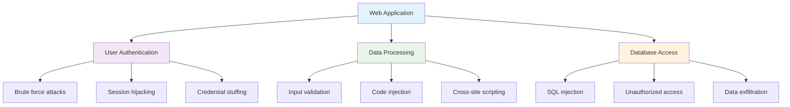
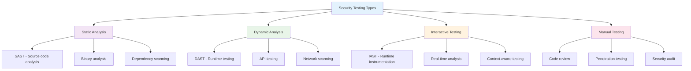
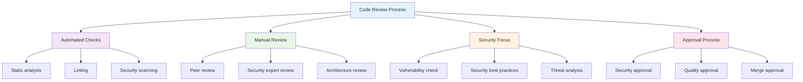

# Chapter 10: Application Security

## 🎯 Learning Objectives

By the end of this chapter, you will be able to:
- Understand the principles of secure software development
- Identify and mitigate OWASP Top 10 web application vulnerabilities
- Implement SAST and DAST tools in CI/CD pipelines
- Apply secure coding practices and input validation
- Understand API security and authentication mechanisms
- Implement secure session management and access controls
- Conduct application security testing and code reviews
- Apply the Secure Software Development Lifecycle (SSDLC)

## 🛡️ What is Application Security?

Application security encompasses the measures and practices used to protect software applications from security threats and vulnerabilities throughout their lifecycle.

### The Application Security Challenge

Modern applications face numerous security challenges:
- **Complex Architectures**: Microservices, APIs, and distributed systems
- **Rapid Development**: Agile methodologies and continuous deployment
- **Diverse Technologies**: Multiple programming languages and frameworks
- **External Dependencies**: Third-party libraries and components
- **User Input**: Uncontrolled data from various sources

### Why Application Security Matters

```mermaid
graph TD
    A[Application Security Benefits] --> B[Data Protection]
    A --> C[Business Continuity]
    A --> D[Compliance]
    A --> E[Customer Trust]
    A --> F[Cost Reduction]
    
    B --> B1[Prevent data breaches]
    B --> B2[Protect user privacy]
    B --> B3[Secure transactions]
    
    C --> C1[Maintain operations]
    C --> C2[Prevent downtime]
    C --> C3[Protect revenue]
    
    D --> D1[Meet regulations]
    D --> D2[Industry standards]
    D --> D3[Audit compliance]
    
    E --> E1[Build confidence]
    E --> E2[Protect reputation]
    E --> E3[Competitive advantage]
    
    F --> F1[Reduce incident costs]
    F --> F2[Lower remediation]
    F --> F3[Prevent legal issues]
    
    style A fill:#e3f2fd
    style B fill:#f3e5f5
    style C fill:#e8f5e8
    style D fill:#fff3e0
    style E fill:#fce4ec
    style F fill:#f1f8e9
```



## 🔒 Secure Software Development Lifecycle (SSDLC)

The Secure Software Development Lifecycle integrates security practices into every phase of software development.

### SSDLC Phases

```mermaid
graph TD
    A[Secure SDLC] --> B[Requirements]
    A --> C[Design]
    A --> D[Implementation]
    A --> E[Testing]
    A --> F[Deployment]
    A --> G[Maintenance]
    
    B --> B1[Security requirements]
    B --> B2[Threat modeling]
    B --> B3[Risk assessment]
    
    C --> C1[Security architecture]
    C --> C2[Design reviews]
    C --> C3[Security patterns]
    
    D --> D1[Secure coding]
    D --> D2[Code reviews]
    D --> D3[Static analysis]
    
    E --> E1[Security testing]
    E --> E2[Penetration testing]
    E --> E3[Vulnerability assessment]
    
    F --> F1[Secure deployment]
    F --> F2[Configuration management]
    F --> F3[Environment security]
    
    G --> G1[Security monitoring]
    G --> G2[Patch management]
    G --> G3[Incident response]
    
    style A fill:#e3f2fd
    style B fill:#f3e5f5
    style C fill:#e8f5e8
    style D fill:#fff3e0
    style E fill:#fce4ec
    style F fill:#f1f8e9
    style G fill:#fff8e1
```



### Phase 1: Requirements and Planning

#### 1. **Security Requirements**
- **Functional Security**: Authentication, authorization, encryption
- **Non-Functional Security**: Performance, availability, compliance
- **Compliance Requirements**: GDPR, HIPAA, PCI DSS, SOX
- **Industry Standards**: OWASP, NIST, ISO 27001

#### 2. **Threat Modeling**
**Purpose**: Identify and analyze potential security threats.

**Methodologies**:
- **STRIDE**: Spoofing, Tampering, Repudiation, Information Disclosure, Denial of Service, Elevation of Privilege
- **PASTA**: Process for Attack Simulation and Threat Analysis
- **VAST**: Visual, Agile, and Simple Threat modeling

**Threat Model Example**:


### Phase 2: Secure Design

#### 1. **Security Architecture Principles**
- **Defense in Depth**: Multiple security layers
- **Principle of Least Privilege**: Minimal access rights
- **Fail-Safe Defaults**: Secure by default
- **Separation of Concerns**: Modular security design
- **Economy of Mechanism**: Simple security solutions

#### 2. **Security Design Patterns**
- **Authentication Patterns**: Multi-factor, single sign-on, federated
- **Authorization Patterns**: Role-based, attribute-based, policy-based
- **Data Protection Patterns**: Encryption, hashing, tokenization
- **Session Management Patterns**: Secure session handling, timeout, invalidation

### Phase 3: Secure Implementation

#### 1. **Secure Coding Practices**
- **Input Validation**: Validate and sanitize all inputs
- **Output Encoding**: Prevent injection attacks
- **Error Handling**: Secure error messages and logging
- **Memory Management**: Prevent buffer overflows and memory leaks

#### 2. **Code Review Process**
- **Automated Tools**: Static analysis and linting
- **Manual Review**: Peer code review with security focus
- **Checklists**: Security coding standards and guidelines
- **Training**: Regular security awareness and skill development

## 🚨 OWASP Top 10 Web Application Vulnerabilities

The OWASP Top 10 represents the most critical web application security risks.

### OWASP Top 10 2021

```mermaid
graph TD
    A[OWASP Top 10 2021] --> B[A01:2021 - Broken Access Control]
    A --> C[A02:2021 - Cryptographic Failures]
    A --> D[A03:2021 - Injection]
    A --> E[A04:2021 - Insecure Design]
    A --> F[A05:2021 - Security Misconfiguration]
    A --> G[A06:2021 - Vulnerable Components]
    A --> H[A07:2021 - Authentication Failures]
    A --> I[A08:2021 - Software and Data Integrity Failures]
    A --> J[A09:2021 - Security Logging Failures]
    A --> K[A10:2021 - Server-Side Request Forgery]
    
    B --> B1[Horizontal privilege escalation]
    B --> B2[Vertical privilege escalation]
    B --> B3[Unauthorized access]
    
    C --> C1[Weak encryption]
    C --> C2[Insecure key management]
    C --> C3[Cryptographic vulnerabilities]
    
    D --> D1[SQL injection]
    D --> D2[NoSQL injection]
    D --> D3[Command injection]
    
    E --> E1[Design flaws]
    E --> E2[Architecture weaknesses]
    E --> E3[Missing security controls]
    
    F --> F1[Default configurations]
    F --> F2[Unnecessary features]
    F --> F3[Insecure settings]
    
    G --> G1[Outdated components]
    G --> G2[Known vulnerabilities]
    G --> G3[Unsupported software]
    
    H --> H1[Weak authentication]
    H --> H2[Session management]
    H --> H3[Credential stuffing]
    
    I --> I1[Supply chain attacks]
    I --> I2[Code tampering]
    I --> I3[Data integrity]
    
    J --> J1[Insufficient logging]
    J --> J2[Log injection]
    J --> J3[Audit trail gaps]
    
    K --> K1[Internal service access]
    K --> K2[Cloud metadata access]
    K --> K3[Network reconnaissance]
    
    style A fill:#e3f2fd
    style B fill:#f3e5f5
    style C fill:#e8f5e8
    style D fill:#fff3e0
    style E fill:#fce4ec
    style F fill:#f1f8e9
    style G fill:#fff8e1
    style H fill:#f3e5f5
    style I fill:#e8f5e8
    style J fill:#fff3e0
    style K fill:#fce4ec
```



### Critical Vulnerabilities and Mitigations

#### 1. **A01:2021 - Broken Access Control**
**Description**: Restrictions on what authenticated users can access are not properly enforced.

**Examples**:
- **Horizontal Privilege Escalation**: Accessing other users' data
- **Vertical Privilege Escalation**: Gaining administrative privileges
- **Direct Object References**: Accessing unauthorized resources

**Mitigation**:
```python
# Secure access control example
def get_user_data(user_id, current_user):
    # Check if user can access this data
    if current_user.id != user_id and not current_user.is_admin:
        raise AccessDenied("Unauthorized access")
    
    return User.objects.get(id=user_id)
```

#### 2. **A02:2021 - Cryptographic Failures**
**Description**: Failures related to cryptography which often lead to sensitive data exposure.

**Examples**:
- **Weak Encryption**: Using outdated algorithms
- **Key Management**: Poor key storage and rotation
- **Data in Transit**: Unencrypted communications

**Mitigation**:
```python
# Secure encryption example
from cryptography.fernet import Fernet
import os

# Generate secure key
key = Fernet.generate_key()
cipher = Fernet(key)

# Encrypt sensitive data
def encrypt_data(data):
    return cipher.encrypt(data.encode())

# Decrypt data
def decrypt_data(encrypted_data):
    return cipher.decrypt(encrypted_data).decode()
```

#### 3. **A03:2021 - Injection**
**Description**: Untrusted data is sent to an interpreter as part of a command or query.

**Types**:
- **SQL Injection**: Database query manipulation
- **NoSQL Injection**: Document database attacks
- **Command Injection**: System command execution
- **LDAP Injection**: Directory service attacks

**Mitigation**:
```python
# SQL injection prevention with parameterized queries
import sqlite3

def get_user_safe(username):
    conn = sqlite3.connect('database.db')
    cursor = conn.cursor()
    
    # Use parameterized query
    cursor.execute("SELECT * FROM users WHERE username = ?", (username,))
    return cursor.fetchone()

# Instead of vulnerable string concatenation:
# cursor.execute("SELECT * FROM users WHERE username = '" + username + "'")
```

#### 4. **A04:2021 - Insecure Design**
**Description**: Flaws in design and architecture that cannot be fixed by proper implementation.

**Examples**:
- **Missing Security Controls**: No authentication or authorization
- **Weak Architecture**: Single points of failure
- **Insecure Defaults**: Permissive default configurations

**Mitigation**:
- **Security by Design**: Integrate security from the start
- **Threat Modeling**: Identify and address design risks
- **Security Patterns**: Use proven security architectures
- **Code Reviews**: Regular security-focused reviews

#### 5. **A05:2021 - Security Misconfiguration**
**Description**: Incorrectly configured security settings in applications, frameworks, and servers.

**Examples**:
- **Default Credentials**: Unchanged default passwords
- **Unnecessary Features**: Enabled debugging or admin interfaces
- **Weak Headers**: Missing security headers
- **Open Permissions**: Overly permissive file permissions

**Mitigation**:
```python
# Security headers example (Flask)
from flask import Flask
from flask_talisman import Talisman

app = Flask(__name__)

# Configure security headers
Talisman(app, 
    content_security_policy={
        'default-src': "'self'",
        'script-src': "'self' 'unsafe-inline'",
        'style-src': "'self' 'unsafe-inline'"
    },
    force_https=True
)
```

## 🔍 Security Testing Methodologies

### Types of Security Testing



### 1. **Static Application Security Testing (SAST)**

SAST analyzes source code, bytecode, or binary code without executing the application.

#### SAST Tools
- **SonarQube**: Multi-language code quality and security
- **Checkmarx**: Source code analysis platform
- **Veracode**: Static analysis and security testing
- **Semgrep**: Fast, lightweight static analysis

#### SAST Implementation
```yaml
# GitHub Actions SAST example
name: Security Scan
on: [push, pull_request]

jobs:
  security:
    runs-on: ubuntu-latest
    steps:
      - uses: actions/checkout@v2
      
      - name: Run Semgrep
        uses: returntocorp/semgrep-action@v1
        with:
          config: "p/security-audit"
          
      - name: Run Bandit (Python)
        run: |
          pip install bandit
          bandit -r . -f json -o bandit-report.json
          
      - name: Upload results
        uses: actions/upload-artifact@v2
        with:
          name: security-scan-results
          path: |
            semgrep-report.json
            bandit-report.json
```

### 2. **Dynamic Application Security Testing (DAST)**

DAST tests running applications to identify runtime vulnerabilities.

#### DAST Tools
- **OWASP ZAP**: Open-source web application scanner
- **Burp Suite**: Professional web application testing
- **Acunetix**: Automated vulnerability scanner
- **AppScan**: IBM security testing platform

#### DAST Implementation
```yaml
# DAST scanning in CI/CD
- name: OWASP ZAP Scan
  run: |
    # Start ZAP daemon
    zap.sh -daemon -port 8080 -host 0.0.0.0
    
    # Run baseline scan
    zap-baseline.py -t http://localhost:3000 -J zap-report.json
    
    # Generate HTML report
    zap-cli report -o zap-report.html -f html
```

### 3. **Interactive Application Security Testing (IAST)**

IAST combines static and dynamic analysis by instrumenting running applications.

#### IAST Benefits
- **Real-time Analysis**: Immediate vulnerability detection
- **Context Awareness**: Understanding of application flow
- **Low False Positives**: Accurate vulnerability identification
- **Integration**: Works with existing development tools

#### IAST Tools
- **Contrast Security**: Runtime application security
- **Hdiv**: Interactive security testing
- **Seeker**: IAST security testing platform

## 🔐 Secure Coding Practices

### Input Validation and Sanitization

#### 1. **Input Validation Principles**
- **Validate All Inputs**: Check type, length, format, and range
- **Whitelist Approach**: Allow only known good input
- **Server-Side Validation**: Never trust client-side validation
- **Context-Aware Validation**: Validate based on intended use

#### 2. **Input Validation Examples**
```python
# Python input validation example
import re
from typing import Optional

def validate_email(email: str) -> Optional[str]:
    """Validate email format and return sanitized version."""
    if not email:
        return None
    
    # Email regex pattern
    pattern = r'^[a-zA-Z0-9._%+-]+@[a-zA-Z0-9.-]+\.[a-zA-Z]{2,}$'
    
    if re.match(pattern, email):
        # Sanitize by removing potentially dangerous characters
        sanitized = re.sub(r'[<>"\']', '', email)
        return sanitized.lower()
    
    return None

def validate_username(username: str) -> Optional[str]:
    """Validate username format."""
    if not username:
        return None
    
    # Username requirements: 3-20 characters, alphanumeric and underscore
    if re.match(r'^[a-zA-Z0-9_]{3,20}$', username):
        return username.lower()
    
    return None
```

#### 3. **SQL Injection Prevention**
```python
# Secure database operations
import sqlite3
from typing import List, Optional

class UserRepository:
    def __init__(self, db_path: str):
        self.db_path = db_path
    
    def get_user_by_id(self, user_id: int) -> Optional[dict]:
        """Get user by ID using parameterized query."""
        try:
            with sqlite3.connect(self.db_path) as conn:
                cursor = conn.cursor()
                cursor.execute(
                    "SELECT id, username, email FROM users WHERE id = ?",
                    (user_id,)
                )
                row = cursor.fetchone()
                
                if row:
                    return {
                        'id': row[0],
                        'username': row[1],
                        'email': row[2]
                    }
                return None
                
        except sqlite3.Error as e:
            # Log error securely (no sensitive data)
            logger.error(f"Database error: {e}")
            return None
    
    def create_user(self, username: str, email: str) -> bool:
        """Create new user with validation."""
        # Validate inputs
        if not validate_username(username) or not validate_email(email):
            return False
        
        try:
            with sqlite3.connect(self.db_path) as conn:
                cursor = conn.cursor()
                cursor.execute(
                    "INSERT INTO users (username, email) VALUES (?, ?)",
                    (username, email)
                )
                conn.commit()
                return True
                
        except sqlite3.Error as e:
            logger.error(f"Database error: {e}")
            return False
```

### Output Encoding and XSS Prevention

#### 1. **XSS Prevention Strategies**
- **Output Encoding**: Encode all dynamic content
- **Content Security Policy**: Restrict script execution
- **Input Sanitization**: Remove dangerous HTML/JavaScript
- **HttpOnly Cookies**: Prevent XSS cookie theft

#### 2. **Output Encoding Examples**
```python
# HTML output encoding
import html

def safe_html_output(user_input: str) -> str:
    """Safely output user input in HTML context."""
    return html.escape(user_input)

# JavaScript output encoding
import json

def safe_js_output(user_input: str) -> str:
    """Safely output user input in JavaScript context."""
    return json.dumps(user_input)

# URL output encoding
from urllib.parse import quote

def safe_url_output(user_input: str) -> str:
    """Safely output user input in URL context."""
    return quote(user_input)
```

#### 3. **Content Security Policy**
```html
<!-- HTML CSP header -->
<meta http-equiv="Content-Security-Policy" 
      content="default-src 'self'; 
               script-src 'self' 'unsafe-inline'; 
               style-src 'self' 'unsafe-inline'; 
               img-src 'self' data: https:;">

<!-- HTTP Response Header -->
Content-Security-Policy: default-src 'self'; script-src 'self' 'unsafe-inline'
```

## 🔑 Authentication and Session Management

### Secure Authentication Implementation

#### 1. **Password Security**
```python
# Secure password hashing
import bcrypt
import secrets

def hash_password(password: str) -> str:
    """Hash password using bcrypt."""
    # Generate salt and hash
    salt = bcrypt.gensalt(rounds=12)
    hashed = bcrypt.hashpw(password.encode('utf-8'), salt)
    return hashed.decode('utf-8')

def verify_password(password: str, hashed: str) -> bool:
    """Verify password against hash."""
    return bcrypt.checkpw(password.encode('utf-8'), hashed.encode('utf-8'))

def generate_secure_token() -> str:
    """Generate cryptographically secure token."""
    return secrets.token_urlsafe(32)
```

#### 2. **Multi-Factor Authentication**
```python
# MFA implementation example
import pyotp
import qrcode

class MFAService:
    def __init__(self):
        self.secret_key = pyotp.random_base32()
    
    def generate_qr_code(self, username: str) -> str:
        """Generate QR code for TOTP setup."""
        totp = pyotp.TOTP(self.secret_key)
        provisioning_uri = totp.provisioning_uri(
            name=username,
            issuer_name="MyApp"
        )
        return provisioning_uri
    
    def verify_totp(self, token: str) -> bool:
        """Verify TOTP token."""
        totp = pyotp.TOTP(self.secret_key)
        return totp.verify(token)
    
    def get_current_totp(self) -> str:
        """Get current TOTP value."""
        totp = pyotp.TOTP(self.secret_key)
        return totp.now()
```

### Session Management Security

#### 1. **Secure Session Implementation**
```python
# Flask session management example
from flask import Flask, session, request
from flask_session import Session
import secrets

app = Flask(__name__)

# Secure session configuration
app.config.update(
    SECRET_KEY=secrets.token_hex(32),
    SESSION_TYPE='filesystem',
    SESSION_FILE_DIR='/tmp/flask_session',
    SESSION_COOKIE_SECURE=True,
    SESSION_COOKIE_HTTPONLY=True,
    SESSION_COOKIE_SAMESITE='Lax',
    PERMANENT_SESSION_LIFETIME=timedelta(hours=2)
)

Session(app)

@app.before_request
def before_request():
    """Security checks before each request."""
    # Regenerate session ID on login
    if 'user_id' in session and 'session_regenerated' not in session:
        session.regenerate()
        session['session_regenerated'] = True
    
    # Check session timeout
    if 'last_activity' in session:
        if datetime.utcnow() - session['last_activity'] > timedelta(hours=2):
            session.clear()
            return redirect(url_for('login'))
    
    session['last_activity'] = datetime.utcnow()

@app.route('/login', methods=['POST'])
def login():
    """Secure login endpoint."""
    username = request.form.get('username')
    password = request.form.get('password')
    
    if verify_credentials(username, password):
        # Clear any existing session
        session.clear()
        
        # Set new session data
        session['user_id'] = get_user_id(username)
        session['username'] = username
        session['login_time'] = datetime.utcnow().isoformat()
        
        return redirect(url_for('dashboard'))
    
    return 'Invalid credentials', 401
```

#### 2. **Session Security Best Practices**
- **Secure Cookies**: Use HttpOnly, Secure, and SameSite flags
- **Session Timeout**: Implement automatic session expiration
- **Session Regeneration**: Change session ID after login
- **Concurrent Session Control**: Limit active sessions per user
- **Session Invalidation**: Proper logout and session cleanup

## 🌐 API Security

### API Security Principles

#### 1. **Authentication and Authorization**
```python
# JWT-based API authentication
import jwt
from functools import wraps
from flask import request, jsonify

SECRET_KEY = 'your-secret-key'

def generate_token(user_id: int, username: str) -> str:
    """Generate JWT token."""
    payload = {
        'user_id': user_id,
        'username': username,
        'exp': datetime.utcnow() + timedelta(hours=24)
    }
    return jwt.encode(payload, SECRET_KEY, algorithm='HS256')

def verify_token(token: str) -> dict:
    """Verify JWT token."""
    try:
        payload = jwt.decode(token, SECRET_KEY, algorithms=['HS256'])
        return payload
    except jwt.ExpiredSignatureError:
        raise Exception('Token expired')
    except jwt.InvalidTokenError:
        raise Exception('Invalid token')

def require_auth(f):
    """Decorator to require authentication."""
    @wraps(f)
    def decorated(*args, **kwargs):
        token = request.headers.get('Authorization')
        
        if not token:
            return jsonify({'message': 'Missing token'}), 401
        
        try:
            # Remove 'Bearer ' prefix
            if token.startswith('Bearer '):
                token = token[7:]
            
            payload = verify_token(token)
            request.user = payload
            return f(*args, **kwargs)
            
        except Exception as e:
            return jsonify({'message': str(e)}), 401
    
    return decorated

@app.route('/api/protected', methods=['GET'])
@require_auth
def protected_endpoint():
    """Protected API endpoint."""
    user = request.user
    return jsonify({
        'message': 'Access granted',
        'user_id': user['user_id'],
        'username': user['username']
    })
```

#### 2. **Rate Limiting**
```python
# API rate limiting implementation
from flask_limiter import Limiter
from flask_limiter.util import get_remote_address

limiter = Limiter(
    app,
    key_func=get_remote_address,
    default_limits=["200 per day", "50 per hour"]
)

@app.route('/api/login', methods=['POST'])
@limiter.limit("5 per minute")
def api_login():
    """Rate-limited login endpoint."""
    # Login logic here
    pass

@app.route('/api/data', methods=['GET'])
@limiter.limit("100 per hour")
@require_auth
def get_data():
    """Rate-limited data endpoint."""
    # Data retrieval logic here
    pass
```

#### 3. **Input Validation for APIs**
```python
# API input validation with marshmallow
from marshmallow import Schema, fields, validate

class UserSchema(Schema):
    username = fields.Str(required=True, validate=validate.Length(min=3, max=20))
    email = fields.Email(required=True)
    age = fields.Int(validate=validate.Range(min=13, max=120))

class UserAPI:
    def __init__(self):
        self.schema = UserSchema()
    
    def create_user(self, data):
        """Create user with validation."""
        try:
            # Validate input data
            validated_data = self.schema.load(data)
            
            # Process validated data
            return self.process_user_creation(validated_data)
            
        except ValidationError as e:
            return {'errors': e.messages}, 400
```

## 🧪 Security Testing in CI/CD

### Integrating Security Testing

#### 1. **Automated Security Pipeline**
```yaml
# GitHub Actions security pipeline
name: Security Pipeline
on: [push, pull_request]

jobs:
  security-scan:
    runs-on: ubuntu-latest
    steps:
      - uses: actions/checkout@v2
      
      - name: Run SAST
        uses: github/codeql-action/init@v2
        with:
          languages: python, javascript
      
      - name: Perform CodeQL Analysis
        uses: github/codeql-action/analyze@v2
      
      - name: Run dependency scan
        run: |
          pip install safety
          safety check --json --output safety-report.json
      
      - name: Run OWASP ZAP
        run: |
          # Start application
          npm start &
          
          # Wait for app to start
          sleep 30
          
          # Run ZAP scan
          zap-baseline.py -t http://localhost:3000 -J zap-report.json
      
      - name: Upload security reports
        uses: actions/upload-artifact@v2
        with:
          name: security-reports
          path: |
            codeql-report.sarif
            safety-report.json
            zap-report.json
```

#### 2. **Security Gates**
```yaml
# Security quality gates
- name: Check security thresholds
  run: |
    # Parse security reports
    python parse_security_reports.py
    
    # Check if vulnerabilities exceed thresholds
    if [ $CRITICAL_VULNS -gt 0 ]; then
      echo "Critical vulnerabilities found. Build failed."
      exit 1
    fi
    
    if [ $HIGH_VULNS -gt 5 ]; then
      echo "Too many high vulnerabilities. Build failed."
      exit 1
    fi
    
    echo "Security checks passed."
```

### Security Testing Tools Integration

#### 1. **SAST Tools**
- **SonarQube**: Quality gates and security rules
- **CodeQL**: GitHub's semantic code analysis
- **Semgrep**: Fast, lightweight static analysis
- **Bandit**: Python security linter

#### 2. **DAST Tools**
- **OWASP ZAP**: Automated web application scanning
- **Burp Suite**: Professional security testing
- **Acunetix**: Comprehensive vulnerability scanning

#### 3. **Dependency Scanning**
- **Snyk**: Vulnerability scanning for dependencies
- **Safety**: Python dependency security checker
- **npm audit**: Node.js security auditing
- **OWASP Dependency Check**: Multi-language dependency scanner

## 📋 Security Code Review

### Code Review Checklist

#### 1. **Authentication and Authorization**
- [ ] **Input Validation**: All inputs are properly validated
- [ ] **Authentication**: Secure authentication mechanisms
- [ ] **Authorization**: Proper access control checks
- [ ] **Session Management**: Secure session handling
- [ ] **Password Security**: Strong password policies

#### 2. **Data Protection**
- [ ] **Encryption**: Sensitive data is encrypted
- [ ] **Data Handling**: Secure data processing and storage
- [ ] **Error Handling**: No sensitive information in error messages
- [ ] **Logging**: Secure logging practices
- [ ] **Data Disposal**: Proper data cleanup

#### 3. **Injection Prevention**
- [ ] **SQL Injection**: Parameterized queries used
- [ ] **XSS Prevention**: Output encoding implemented
- [ ] **Command Injection**: No shell command execution
- [ ] **LDAP Injection**: Secure directory queries
- [ ] **NoSQL Injection**: Secure document queries

#### 4. **Configuration Security**
- [ ] **Default Settings**: Secure default configurations
- [ ] **Environment Variables**: Secure configuration management
- [ ] **Secrets Management**: Secure handling of secrets
- [ ] **HTTPS**: Secure communication protocols
- [ ] **Security Headers**: Proper security headers configured

### Code Review Process



## 🧪 Hands-on Activities

### Activity 1: OWASP Top 10 Analysis

**Objective**: Analyze and understand OWASP Top 10 vulnerabilities.

**Scenario**: Review a vulnerable web application for security issues.

**Steps**:
1. **Vulnerability Identification**: Find examples of each OWASP Top 10 category
2. **Risk Assessment**: Evaluate the severity and impact of each vulnerability
3. **Mitigation Planning**: Develop remediation strategies for each finding
4. **Documentation**: Create a comprehensive security assessment report

### Activity 2: Secure Code Implementation

**Objective**: Implement secure coding practices in a sample application.

**Materials**: Development environment, sample vulnerable code

**Steps**:
1. **Code Review**: Identify security vulnerabilities in sample code
2. **Secure Implementation**: Rewrite vulnerable code with security best practices
3. **Testing**: Verify that security vulnerabilities are mitigated
4. **Documentation**: Document security improvements and lessons learned

### Activity 3: Security Testing Integration

**Objective**: Integrate security testing tools into a CI/CD pipeline.

**Materials**: CI/CD platform, security testing tools

**Steps**:
1. **Tool Selection**: Choose appropriate SAST and DAST tools
2. **Pipeline Configuration**: Configure security testing in CI/CD
3. **Quality Gates**: Implement security thresholds and gates
4. **Monitoring**: Set up security testing monitoring and reporting

### Activity 4: API Security Assessment

**Objective**: Assess and secure a REST API application.

**Scenario**: Security review of a company's public API.

**Steps**:
1. **API Mapping**: Identify all API endpoints and functionality
2. **Security Testing**: Test for common API vulnerabilities
3. **Authentication Review**: Assess authentication and authorization mechanisms
4. **Security Hardening**: Implement security improvements
5. **Documentation**: Create API security guidelines and best practices

## 📋 Key Takeaways

1. **Application security** is essential for protecting software from various threats and vulnerabilities.

2. **Secure SDLC** integrates security practices throughout the development lifecycle.

3. **OWASP Top 10** identifies the most critical web application security risks.

4. **Security testing** includes SAST, DAST, and IAST approaches for comprehensive coverage.

5. **Secure coding practices** prevent common vulnerabilities like injection and XSS attacks.

6. **Authentication and session management** are critical for maintaining application security.

7. **API security** requires special attention to authentication, authorization, and input validation.

8. **CI/CD integration** ensures security testing is automated and consistent.

## ❓ Review Questions

1. **What are the key phases** of the Secure Software Development Lifecycle?

2. **How can you prevent** SQL injection and XSS vulnerabilities in web applications?

3. **What tools and techniques** are used for SAST and DAST security testing?

4. **How should authentication** and session management be implemented securely?

5. **What are the main considerations** for securing REST APIs?

## 📚 Further Reading

### Books
- "The Web Application Hacker's Handbook" by Dafydd Stuttard and Marcus Pinto
- "Secure Coding: Principles and Practices" by Mark G. Graff and Kenneth R. van Wyk
- "Building Secure Software" by John Viega and Gary McGraw

### Online Resources
- [OWASP Top 10](https://owasp.org/Top10/)
- [OWASP Secure Coding Practices](https://owasp.org/www-project-secure-coding-practices-quick-reference-guide/)
- [OWASP Application Security Verification Standard](https://owasp.org/www-project-application-security-verification-standard/)

### Tools and Platforms
- [OWASP ZAP](https://owasp.org/www-project-zap/) - Web application security scanner
- [SonarQube](https://www.sonarqube.org/) - Code quality and security platform
- [Semgrep](https://semgrep.dev/) - Static analysis tool

---

**Next Chapter**: [Chapter 11: IT Project Management](chapter11-project-management.md) - Learn about project management frameworks, Agile methodologies, and risk management in IT projects.
